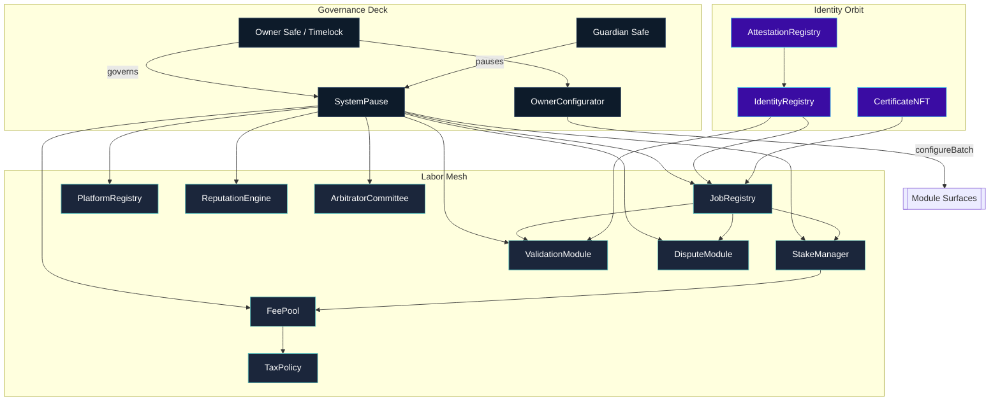
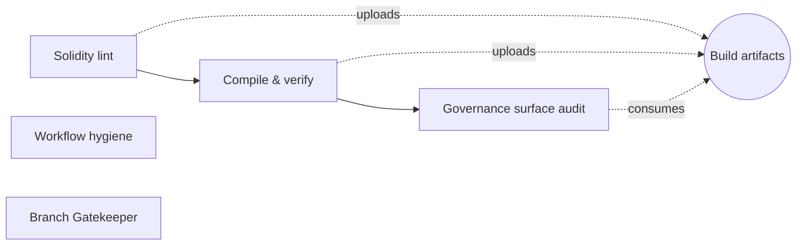
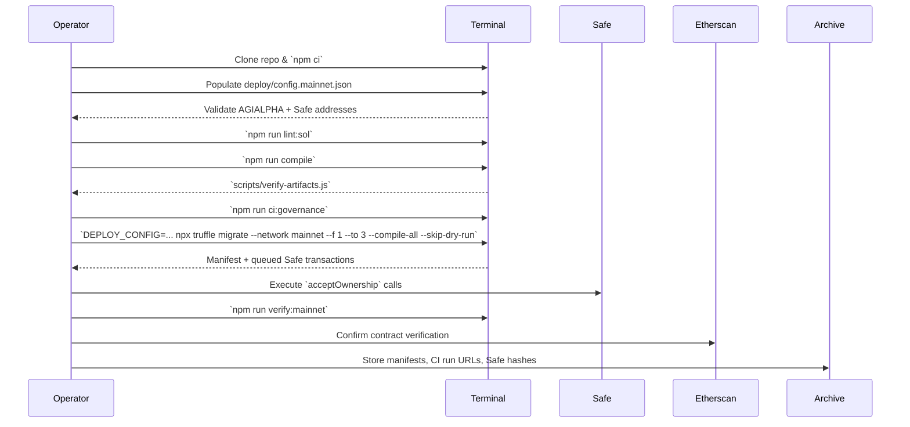

# AGIJobs Sovereign Labor v0.1

<a href="../../actions/workflows/ci.yml"></a>
<a href="../../actions/workflows/branch-checks.yml"></a>
<a href="../../actions/workflows/ci.yml"></a>
<a href="../../actions/workflows/ci.yml"></a>


> The labor intelligence lattice engineered for absolute owner command: relentlessly observable, economically deterministic, and always ready for redeployment by a calm operator.

---

## Table of Contents
- [Command Deck](#command-deck)
- [Architecture Maps](#architecture-maps)
- [Owner Control Surfaces](#owner-control-surfaces)
- [AGIALPHA Economic Spine](#agialpha-economic-spine)
- [Continuous Integration Spine](#continuous-integration-spine)
- [Branch Protection Flightplan](#branch-protection-flightplan)
- [Mainnet Launch Procedure](#mainnet-launch-procedure)
- [Operations Telemetry](#operations-telemetry)
- [Directory Atlas](#directory-atlas)

---

## Command Deck
- **Owner-first governance.** `SystemPause` concentrates every privileged setter, pauser, and upgrade hook. Ownership transfers to the Safe specified in [`deploy/config.mainnet.json`](deploy/config.mainnet.json) so the owner decides and the mesh executes without intermediaries.
- **Deterministic compile surface.** `$AGIALPHA` (0xa61a3b3a130a9c20768eebf97e21515a6046a1fa) is hard-wired through staking, rewards, and fee flows; CI refuses to ship if any module drifts off the 18-decimal discipline enforced in [`Constants.sol`](contracts/Constants.sol).
- **Runtime plasticity.** `OwnerConfigurator` batches arbitrarily complex governance updates while `SystemPause.executeGovernanceCall` forwards Safe transactions. Everything emits change logs so downstream analytics never guess.
- **Auditable automation.** The `Sovereign Compile` workflow lint → compile → artifact-verify → governance-audit → workflow-hygiene, and `Branch Gatekeeper` enforces branch taxonomy before code ever touches `main`.
- **Manifested deployments.** Migrations wire modules, transfer ownership, and emit manifests (`manifests/addresses.<network>.json`). Operators simply sign Safe transactions and archive the manifest.

## Architecture Maps



The entire mesh is routed through `SystemPause` so the owner can pause, rewire, or upgrade modules atomically. Identity-facing contracts transfer to the owner Safe for direct Safe-level confirmation.

## Owner Control Surfaces

| Module | Key Owner Controls | Pauser Hooks | Notes |
| --- | --- | --- | --- |
| `SystemPause` | `setModules`, `setGlobalPauser`, `refreshPausers`, `executeGovernanceCall`, `transferOwnership` | `pauseAll`, `unpauseAll` | Governance router; emits `ModulesUpdated` and `GovernanceCallExecuted` events. |
| `JobRegistry` | `setValidationModule`, `setIdentityRegistry`, `setDisputeModule`, `setFeePool`, `setTaxPolicy`, `setJobParameters`, `applyConfiguration` | `pause`, `unpause` | Routes staking, validation, and dispute flows. |
| `StakeManager` | `setFeePool`, `setDisputeModule`, `setTreasury`, `setTreasuryAllowlist`, `setRoleMinimums`, `applyConfiguration` | `pause`, `unpause` | Enforces `$AGIALPHA` staking discipline. |
| `ValidationModule` | `setStakeManager`, `setIdentityRegistry`, `setReputationEngine`, `setRandaoCoordinator`, `setSelectionStrategy` | `pause`, `unpause` | Failover relays remain owner-triggered. |
| `DisputeModule` | `setStakeManager`, `setCommittee`, `setTaxPolicy`, `setDisputeFee`, `setDisputeWindow` | `pause`, `unpause` | Arbitration economics wired through governance. |
| `PlatformRegistry` | `setStakeManager`, `setReputationEngine`, `setMinPlatformStake`, `setRegistrar`, `applyConfiguration` | `pause`, `unpause` | Controls onboarding thresholds for platforms. |
| `FeePool` | `applyConfiguration`, `setGovernance`, `setTreasury`, `setTaxPolicy`, `setRewardRole`, `setPauser`, `setPauserManager` | `pause`, `unpause` | Handles burns, treasury routing, and reward authorization. |
| `ReputationEngine` | `setCaller`, `setStakeManager`, `setScoringWeights`, `setBlacklist`, `setValidationRewardPercentage` | `pause`, `unpause` | Deterministic scoring adjustments. |
| `ArbitratorCommittee` | `setDisputeModule`, `setCommitRevealWindows`, `setAbsenteeSlash`, `setPauser`, `setPauserManager` | `pause`, `unpause` | Owner tunes arbitration throughput. |
| `TaxPolicy` | `setPolicyURI`, `setPolicy`, `setAcknowledgement`, `setAcknowledger`, `revokeAcknowledgement` | — | Owner governs compliance narrative. |
| `IdentityRegistry` | `setAttestationRegistry`, `setAgentMerkleRoot`, `setValidatorMerkleRoot`, `setClubMerkleRoot` | `pause`, `unpause` | Ownership accepted by the Safe so operators confirm identity updates directly. |
| `AttestationRegistry` | `setENSRegistry`, `setNameWrapper`, `setController` | `pause`, `unpause` | Safe-controlled ENS attestations. |
| `CertificateNFT` | `setJobRegistry`, `setBaseURI` | `pause`, `unpause` | Credential NFTs minted on job completion. |

CI guards this matrix via [`scripts/check-governance-matrix.mjs`](scripts/check-governance-matrix.mjs); any missing setter or pauser causes a red build.

## AGIALPHA Economic Spine
- [`Constants.sol`](contracts/Constants.sol) pins `$AGIALPHA = 0xa61a3b3a130a9c20768eebf97e21515a6046a1fa` with `AGIALPHA_DECIMALS = 18` and `TOKEN_SCALE = 1e18`.
- `StakeManager` and `FeePool` validate the token decimals at runtime and revert if a mismatched token sneaks in.
- Migrations wire the same address from [`deploy/config.mainnet.json`](deploy/config.mainnet.json) and [`migrations/3_mainnet_finalize.js`](migrations/3_mainnet_finalize.js) refuses to pass unless the FeePool token matches `$AGIALPHA`.
- Accounting flows use fixed-point math with 30-decimal headroom so stakes, slashes, and payouts stay precise.

## Continuous Integration Spine



| Check | Workflow | What it enforces | Branch status name |
| --- | --- | --- | --- |
| Solidity lint | `Sovereign Compile` | `solhint --max-warnings=0` over `contracts/**/*.sol`. | `Sovereign Compile / Solidity lint` |
| Compile & artifact verify | `Sovereign Compile` | `npm run compile` with cached solc, `scripts/verify-artifacts.js`, compile summary upload, artifact upload. | `Sovereign Compile / Compile smart contracts` |
| Governance audit | `Sovereign Compile` | [`scripts/check-governance-matrix.mjs`](scripts/check-governance-matrix.mjs) ensures every owner/pauser surface still exists. | `Sovereign Compile / Governance surface audit` |
| Workflow hygiene | `Sovereign Compile` | `actionlint` against all workflows. | `Sovereign Compile / Workflow hygiene` |
| Branch taxonomy | `Branch Gatekeeper` | [`scripts/check-branch-name.mjs`](scripts/check-branch-name.mjs) rejects branches outside `<type>/<descriptor>` + root allowlist. | `Branch Gatekeeper / Validate branch naming conventions` |

Every job writes to the GitHub Step Summary so reviewers and auditors see lint, compile, artifact, and governance snapshots directly in the PR UI.

## Branch Protection Flightplan
1. **Settings → Branches → `main`.** Enable “Require a pull request before merging”, “Require approvals”, and “Require branches to be up to date”.
2. **Status checks.** Add the following required checks (exact names):
   - `Sovereign Compile / Solidity lint`
   - `Sovereign Compile / Compile smart contracts`
  - `Sovereign Compile / Governance surface audit`
  - `Sovereign Compile / Workflow hygiene`
  - `Branch Gatekeeper / Validate branch naming conventions`
3. **Visibility.** Toggle “Allow all actions and reusable workflows to run” and “Allow anyone to view workflow run logs” for auditable transparency.
4. **Optionals.** Add signed-commit enforcement, code owner review, and “Require conversation resolution” for extra rigor.
5. **Automate exports.** Periodically run `gh api repos/:owner/:repo/branches/main/protection` and archive the JSON with CI manifests.

Repeat the same policy for `develop` if the branch is active. With these guards, a merge cannot happen without a completely green dashboard.

## Mainnet Launch Procedure



### Friendly checklist for the deployment operator
1. **Prepare the workstation.** Install Node.js 20 LTS, clone this repository, and run `npm ci --omit=optional --no-audit --no-fund`.
2. **Fill `deploy/config.mainnet.json`.** Paste checksum Safe addresses for `ownerSafe`, `guardianSafe`, and `treasury`. `$AGIALPHA` is already correct (`0xa61a3b3a130a9c20768eebf97e21515a6046a1fa`).
3. **Load secrets in the shell.**
   ```bash
   export MAINNET_RPC="https://mainnet.infura.io/v3/<project>"
   export DEPLOYER_PK="<hex-private-key-without-0x>"
   export ETHERSCAN_API_KEY="<token>"
   export DEPLOY_CONFIG="$(pwd)/deploy/config.mainnet.json"
   ```
4. **Rehearse the run.** Execute `npm run lint:sol`, `npm run compile`, `node scripts/verify-artifacts.js`, and `npm run ci:governance`. The output should mirror the CI summaries.
5. **Broadcast the migration.**
   ```bash
   DEPLOY_CONFIG=$(pwd)/deploy/config.mainnet.json \
     npx truffle migrate --network mainnet --f 1 --to 3 --compile-all --skip-dry-run
   ```
6. **Approve Safe tasks.** In the owner Safe UI, execute the queued `acceptOwnership` transactions (Identity, Attestation, Certificate NFT when delegated).
7. **Verify on Etherscan.** Run `npm run verify:mainnet` once transactions settle; expect the Truffle verify plugin to finish without warnings.
8. **Archive the evidence.** Capture `manifests/addresses.mainnet.json`, CI URLs, Safe transaction hashes, and branch-protection exports. File them with the operations log.

### Migration script excerpt (mainnet kernel)
```javascript
// migrations/1_deploy_kernel.js (excerpt)
await pause.setModules(
  job.address,
  stake.address,
  validation.address,
  dispute.address,
  platform.address,
  feePool.address,
  reputation.address,
  committee.address
);
await pause.setGlobalPauser(guardianSafe);
await pause.transferOwnership(ownerSafe);
```
The script validates `chainId`, enforces `$AGIALPHA` wiring, writes the manifest, and transfers module ownership to the Safe-powered pause lattice.

## Operations Telemetry
- `SystemPause.ModulesUpdated`, `PausersUpdated`, `GovernanceCallExecuted` – governance routing trail.
- `StakeManager.StakeDeposited`, `StakeManager.TreasuryUpdated`, `StakeManager.RewardPaid` – capital flows in `$AGIALPHA`.
- `JobRegistry.JobCreated`, `JobRegistry.JobFinalized`, `JobRegistry.JobChallenged` – labor lifecycle traceability.
- `ValidationModule.ValidatorsUpdated`, `ValidationModule.FailoverTriggered` – validator health signals.
- `ReputationEngine.ScoreUpdated`, `ReputationEngine.BlacklistUpdated` – trust analytics.
- `TaxPolicy.PolicyAcknowledged`, `TaxPolicy.AcknowledgementRevoked` – compliance confirmations.

## Directory Atlas
- [`contracts/`](contracts) – Solidity sources (core modules, identity surfaces, utilities, interfaces).
- [`deploy/`](deploy) – Mainnet configuration, operator runbook, and manifests.
- [`migrations/`](migrations) – Truffle scripts for kernel deployment, SystemPause audit, and post-flight validation.
- [`scripts/`](scripts) – CI helpers (branch rules, governance matrix, artifact verification, compile summary).
- [`truffle/`](truffle) – Tooling guide for local development and reproducible migrations.

The repository is curated so the owner operates with total situational awareness while the automation backbone keeps every critical control observable, enforceable, and instantly recoverable.
