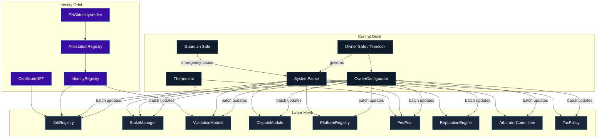
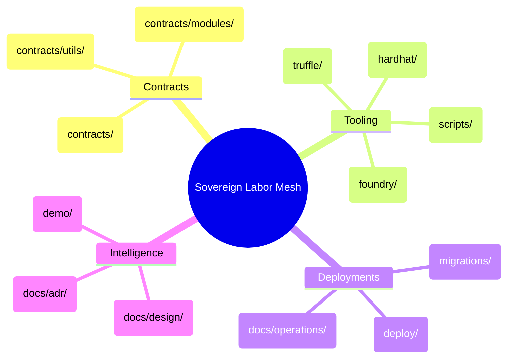
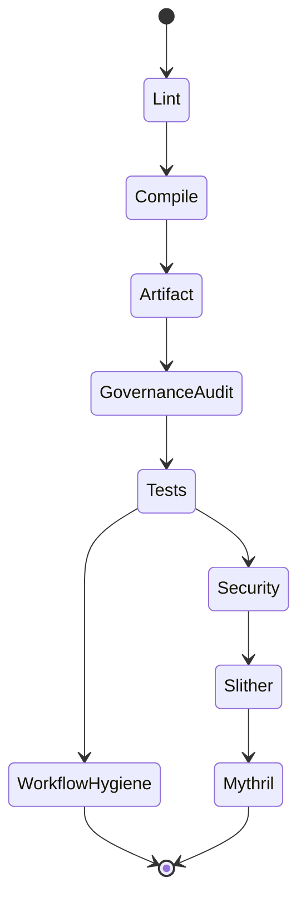
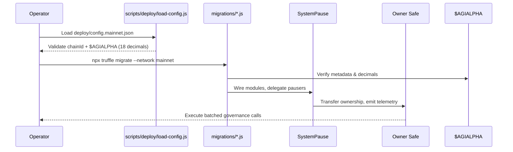

# AGIJobs Sovereign Labor v0.1

[](https://github.com/MontrealAI/agijobs-sovereign-labor-v0p1/actions/workflows/ci.yml)
[](https://github.com/MontrealAI/agijobs-sovereign-labor-v0p1/actions/workflows/ci.yml)
[](https://github.com/MontrealAI/agijobs-sovereign-labor-v0p1/actions/workflows/ci.yml)
[](https://github.com/MontrealAI/agijobs-sovereign-labor-v0p1/actions/workflows/ci.yml)
[](https://github.com/MontrealAI/agijobs-sovereign-labor-v0p1/actions/workflows/security.yml)
[](https://github.com/MontrealAI/agijobs-sovereign-labor-v0p1/actions/workflows/security.yml)
[](https://github.com/MontrealAI/agijobs-sovereign-labor-v0p1/actions/workflows/security.yml)
[](https://github.com/MontrealAI/agijobs-sovereign-labor-v0p1/actions/workflows/branch-checks.yml)


> The sovereign labor lattice running here concentrates economic gravity. Calm operators direct it; markets bend. This is the machine described by the research brief—the production superintelligence that routes labor, capital, and reputation with perfect recall.

---

## Table of Contents
- [Sovereign Overview](#sovereign-overview)
- [Repository Lattice](#repository-lattice)
- [$AGIALPHA Economic Spine](#agialpha-economic-spine)
- [Owner Command Authority](#owner-command-authority)
- [Setup & Local Flight Checks](#setup--local-flight-checks)
- [Continuous Integration Spine](#continuous-integration-spine)
- [Security & Assurance Mesh](#security--assurance-mesh)
- [Deployment Autopilot](#deployment-autopilot)
- [Branch Protection & PR Protocol](#branch-protection--pr-protocol)
- [Quick Command Deck](#quick-command-deck)
- [Knowledge Vault](#knowledge-vault)

---

## Sovereign Overview

The network coordinates job creation, staking, validation, dispute resolution, and treasury routing around the canonical `$AGIALPHA` token. Contracts, manifests, multi-runtime test harnesses, and operational runbooks let non-technical governors operate the lattice without raw calldata. The `demo/Meta-Agentic-ALPHA-AGI-Jobs-v0` environment demonstrates orchestration flows end-to-end for workshops or dry runs.



---

## Repository Lattice



| Path | Purpose |
| --- | --- |
| [`contracts/`](contracts) | Solidity source for staking, jobs, governance, identity, thermodynamic tuning, and attestations. |
| [`contracts/modules/`](contracts/modules) | Plug-in dispute and validation logic referenced by `SystemPause`. |
| [`deploy/`](deploy) | Declarative configuration, manifest validation, and deployment autopilot scripts. |
| [`migrations/`](migrations) | Canonical Truffle migrations wiring modules, Safe ownership, and `$AGIALPHA` bindings. |
| [`scripts/`](scripts) | Governance matrices, branch checks, artifact verification, and config loaders used by CI and operators. |
| [`foundry/`](foundry) | Foundry tests, invariants, and deployment scripts mirroring production wiring. |
| [`hardhat/`](hardhat) | Hardhat tasks, network forking tests, and utilities for symbolic validation. |
| [`docs/`](docs) | Design dossiers, ADRs, operational runbooks, and governance proofs. |
| [`demo/Meta-Agentic-ALPHA-AGI-Jobs-v0/`](demo/Meta-Agentic-ALPHA-AGI-Jobs-v0) | Narrative demo environment with configs, datasets, and scripts for rehearsals. |

---

## $AGIALPHA Economic Spine

The entire mesh is pinned to the ERC-20 token at `0xa61a3b3a130a9c20768eebf97e21515a6046a1fa` with 18 decimals. `contracts/Constants.sol` locks the address, decimals, name, symbol, and scaling factor. Runtime scripts, migrations, tests, and invariants abort if a mismatch is detected, guaranteeing deterministic unit discipline across staking, rewards, treasury routing, and accounting.

```mermaid
graph LR
    Constants[Constants.sol]\n$AGIALPHA 0xa61a3b3a130a9c20768eebf97e21515a6046a1fa
    StakeManager -->|IERC20Metadata check| Constants
    FeePool -->|token()| Constants
    JobRegistry -->|escrow + rewards| Constants
    PlatformRegistry -->|registrations| Constants
    Deploy[deploy/config.*] -->|validate| Constants
    Tests[Truffle/Hardhat/Foundry] -->|assert| Constants
```

Key guarantees:
- **Immutable binding.** `AGIALPHA`, `AGIALPHA_DECIMALS`, and `TOKEN_SCALE` are compile-time constants consumed by every contract, migration, and manifest loader.
- **Runtime validation.** Constructors (e.g., `StakeManager`, `FeePool`) confirm the token exposes 18 decimals; mismatches revert instantly.
- **Governance testing.** `npm run ci:governance` walks manifests and asserts `$AGIALPHA` constants before any deployment proceeds.

---

## Owner Command Authority

Every privileged surface is reachable by the owner Safe via `SystemPause` and module-specific setters. Guardians can trigger emergency pauses, but ownership changes, treasury rewiring, parameter tuning, and acknowledger management stay owner-gated.

| Module | Owner & Guardian Controls | Notes |
| --- | --- | --- |
| [`SystemPause`](contracts/SystemPause.sol) | `setModules`, `refreshPausers`, `setGlobalPauser`, `pauseAll`, `unpauseAll`, `executeGovernanceCall` | Central hub wiring and pausing every core module while emitting telemetry. |
| [`StakeManager`](contracts/StakeManager.sol) | Treasury setters, fee/burn percent tuning, role minimum stakes, validator lock controls, pauser delegation, thermostat + Hamiltonian feeds, module wiring, slashing distribution, pause/unpause | Enforces staking discipline and routes rewards strictly in `$AGIALPHA`. |
| [`JobRegistry`](contracts/JobRegistry.sol) | Module pointers, treasury + fee parameters, staking limits, ENS/merkle roots, acknowledgement orchestrators, pause lattice | Controls job lifecycle, escrow, and attestation coordination. |
| [`ValidationModule`](contracts/ValidationModule.sol) & [`modules/DisputeModule`](contracts/modules/DisputeModule.sol) | Validator roster management, quorum tuning, escalation policy, pause/unpause | Owner sets validation cadence and dispute escalation rails. |
| [`FeePool`](contracts/FeePool.sol) | Treasury/burn destinations, operator reward tuning, pauser routing, token burn configuration | Safeguards treasury outflows and reward claims in `$AGIALPHA`. |
| [`TaxPolicy`](contracts/TaxPolicy.sol) | `setPolicyURI`, `setAcknowledgement`, acknowledger permissions, acknowledgement revocation | Owner updates disclaimers while keeping infrastructure tax-exempt. |
| [`PlatformRegistry`](contracts/PlatformRegistry.sol) | Stake thresholds, fee and reward parameters, module wiring, pause lattice | Governs platform onboarding and staking flows. |
| [`ReputationEngine`](contracts/ReputationEngine.sol) | Scoring weights, decay rates, attestation modules, guardian pausing | Owner tunes reputation dynamics at runtime. |
| [`ArbitratorCommittee`](contracts/ArbitratorCommittee.sol) | Committee membership, quorum targets, escalation hooks, pause lattice | Owner maintains arbitration roster and decision cadence. |
| [`IdentityRegistry`](contracts/IdentityRegistry.sol) & [`ENSIdentityVerifier`](contracts/ENSIdentityVerifier.sol) | ENS roots, verifier hooks, attestation modules | Owner curates identity proofs without redeploying. |
| [`AttestationRegistry`](contracts/AttestationRegistry.sol) & [`CertificateNFT`](contracts/CertificateNFT.sol) | Schema governance, issuer control, metadata URIs, mint permissions | Ensures attestation surfaces remain under owner command. |

Refer to [`docs/operations/owner-control.md`](docs/operations/owner-control.md) for Safe transaction templates and review rituals.

---

## Setup & Local Flight Checks

1. **Prerequisites.** Install Node.js 20.x (`nvm use`), npm 10.x, Foundry (stable), Truffle 5.11.x, and Hardhat 2.20.x. The repo ships `.nvmrc` and `foundry.toml` for pinning.
2. **Install dependencies.** `npm install` provisions shared tooling for linting, migrations, tests, and scripts.
3. **Compile.** `npm run compile` drives the Truffle build and primes artifact verification.
4. **Run tests.** Execute `npm run test:truffle:ci`, `npm run test:hardhat`, and `npm run test:foundry` to mirror CI’s multi-runtime harness.
5. **Governance audit.** `npm run ci:governance` confirms owner reachability, pause lattice wiring, and `$AGIALPHA` constants across manifests.
6. **Explore the demo.** `cd demo/Meta-Agentic-ALPHA-AGI-Jobs-v0` to study orchestrated scripts, curated datasets, and reproducible walkthroughs.

---

## Continuous Integration Spine

`ci.yml` orchestrates linting, compilation, artifact verification, governance audits, and multi-runtime tests. `security.yml` layers static and symbolic analyzers, while `branch-checks.yml` enforces branch naming discipline. All jobs are required for merges via branch protection.



- **Lint.** `npm run lint:sol` enforces Solhint styling and guards.
- **Compile.** `npm run compile` and `scripts/verify-artifacts.js` guarantee deterministic outputs.
- **Governance audit.** `npm run ci:governance` cross-checks owner and guardian control surfaces.
- **Tests.** Truffle, Hardhat, and Foundry suites share artifacts to accelerate execution while covering fuzzing, invariants, and timelock simulations.
- **Workflow hygiene.** `actionlint` keeps automation reproducible.
- **Security.** Slither SARIF and Mythril symbolic execution publish artifacts for review and fail builds on critical findings.

---

## Security & Assurance Mesh

Security coverage spans compile-time invariants, runtime tests, and off-chain documentation:

- [`slither.config.json`](slither.config.json) scopes detectors and noise filters for high-signal reports.
- [`docs/design/core-contracts.md`](docs/design/core-contracts.md) and [`docs/adr/0002-deterministic-token-discipline.md`](docs/adr/0002-deterministic-token-discipline.md) capture invariants, threat models, and token discipline.
- [`docs/operations/README.md`](docs/operations/README.md) maps operator drills, CI mirroring, and evidence archiving.
- Foundry invariants (`foundry/test/StakeManagerInvariant.t.sol`, etc.) fuzz staking, pause routing, and `$AGIALPHA` wiring with timelock simulations.

---

## Deployment Autopilot

Deployment manifests and scripts keep owner authority intact while verifying `$AGIALPHA` metadata before any transaction broadcasts.



1. **Configure manifests.** Populate `deploy/config.*.json` with Safe addresses, guardians, treasury routes, and confirm `$AGIALPHA = 0xa61a3b3a130a9c20768eebf97e21515a6046a1fa` (18 decimals).
2. **Dry run.** Use Truffle (`npm run deploy:truffle:sepolia`), Hardhat (`npm run deploy:hardhat:sepolia`), or Foundry (`npm run deploy:foundry:sepolia`) to rehearse the lattice against testnets.
3. **Mainnet.** Execute the preferred autopilot; manifests and scripts refuse to proceed if owners, guardians, or token metadata diverge.
4. **Archive.** Store generated manifests under `manifests/` with CI URLs for evidence vaulting, and sync Safe transactions with the governance runbooks.

---

## Branch Protection & PR Protocol

Branch protection is codified in [`.github/settings.yml`](.github/settings.yml). The `main` branch requires:

- `Sovereign Compile / Solidity lint`
- `Sovereign Compile / Compile smart contracts`
- `Sovereign Compile / Governance surface audit`
- `Sovereign Compile / Test suites`
- `Sovereign Compile / Workflow hygiene`
- `Security Scans / Slither static analysis`
- `Security Scans / Mythril symbolic execution`
- `Branch Gatekeeper / Validate branch naming conventions`

Strict status checks, linear history, enforced reviews, and conversation resolution are mandatory. Admins are bound by the same policy, guaranteeing every merge is fully green with visible checks. Configure matching rules on downstream forks before contributing.

---

## Quick Command Deck

| Intent | Command |
| --- | --- |
| Install dependencies | `npm install` |
| Lint Solidity | `npm run lint:sol` |
| Compile contracts | `npm run compile` |
| Governance matrix | `npm run ci:governance` |
| Truffle tests | `npm run test:truffle:ci` |
| Hardhat tests | `npm run test:hardhat` |
| Foundry invariants | `npm run test:foundry` |
| Security scans | `npm run ci:security` |
| Format branch name | `node scripts/check-branch-name.mjs <branch>` |
| Generate compile summary | `node scripts/write-compile-summary.js` |

---

## Knowledge Vault

- [Design intelligence atlas](docs/design/core-contracts.md) for contract state vectors and invariants.
- [Operational runbook](docs/operations/operator-runbook.md) for Safe rituals, CI verification, and communication cadence.
- [Owner control surfaces](docs/operations/owner-control.md) for curated transaction templates.
- [Deployment dossiers](deploy/README.md) covering manifest fields, autopilot modes, and validation flows.
- [Demo walkthrough](docs/operations/demo-walkthrough.md) for guided rehearsals against the sovereign mesh.

Stay disciplined: keep `$AGIALPHA` constants untouched, run the full CI constellation locally before requesting reviews, and archive every governance change with manifests plus CI evidence.
