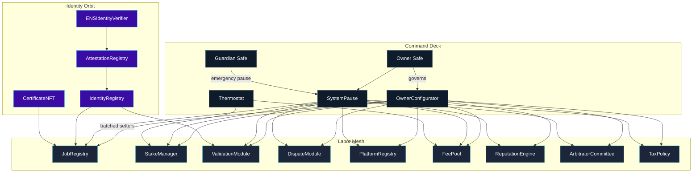
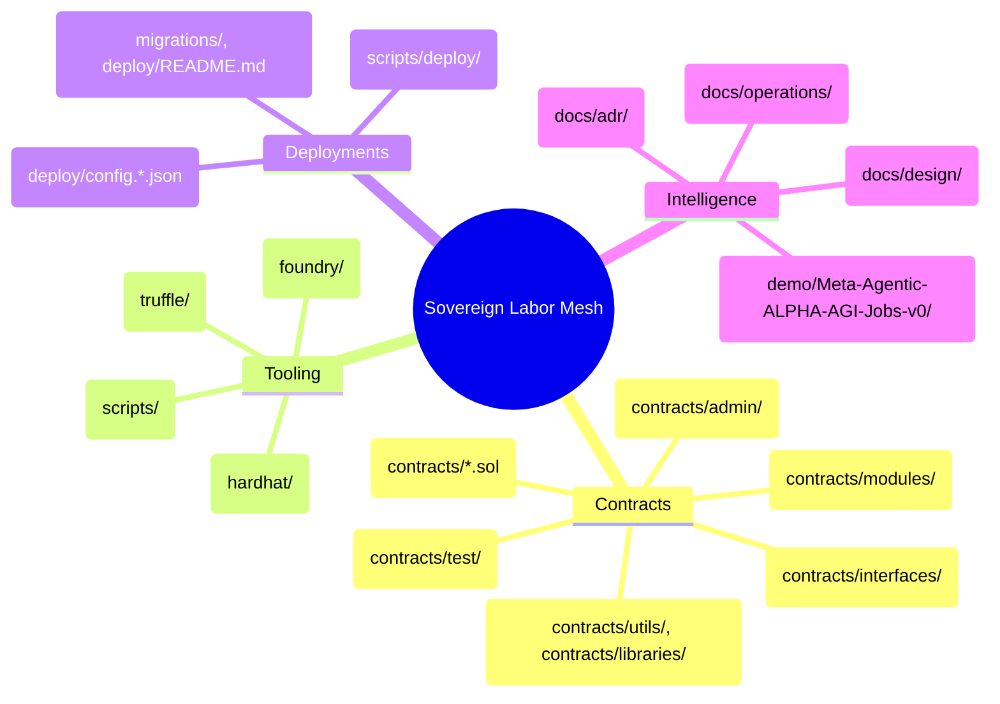
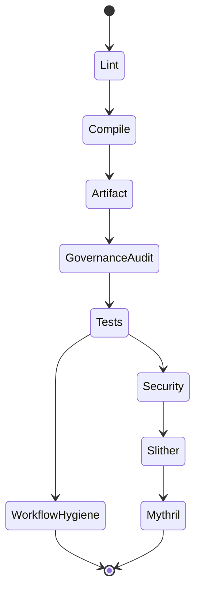
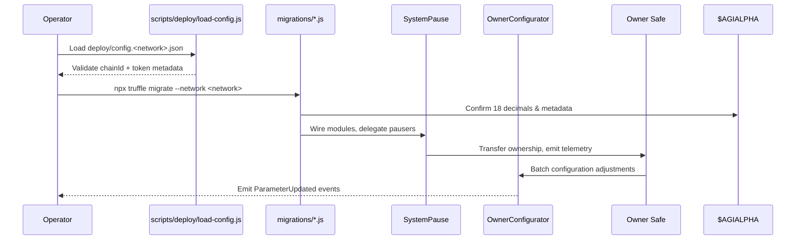

# AGIJobs Sovereign Labor v0.1

[](https://github.com/MontrealAI/agijobs-sovereign-labor-v0p1/actions/workflows/ci.yml)
[](https://github.com/MontrealAI/agijobs-sovereign-labor-v0p1/actions/workflows/security.yml)
[](https://github.com/MontrealAI/agijobs-sovereign-labor-v0p1/actions/workflows/branch-checks.yml)


> The sovereign labor lattice in this repository concentrates economic gravity. Calm governors direct it; markets bend around its precision.

---

## Table of Contents
- [Constellation Overview](#constellation-overview)
- [Architecture Helix](#architecture-helix)
- [$AGIALPHA Economic Spine](#agialpha-economic-spine)
- [Owner Command Authority](#owner-command-authority)
- [Repository Atlas](#repository-atlas)
- [Operational Flight Deck](#operational-flight-deck)
- [CI & Quality Constellation](#ci--quality-constellation)
- [Security & Assurance Mesh](#security--assurance-mesh)
- [Deployment Autopilot](#deployment-autopilot)
- [Branch Protection & Observability](#branch-protection--observability)
- [Quick Command Deck](#quick-command-deck)
- [Knowledge Vault](#knowledge-vault)

---

## Constellation Overview

This lattice coordinates job creation, staking, validation, dispute resolution, identity proofs, treasury routing, and economic policy around the canonical `$AGIALPHA` token. A non-technical operator can run it end to end through runbooks, manifests, and scripts without touching raw calldata. The `demo/Meta-Agentic-ALPHA-AGI-Jobs-v0` workspace mirrors production choreography for workshops and dry runs.



---

## Architecture Helix

The mesh is modular, agentic, and governed through deterministic manifests. The following mind map links the repository components to the runtime surfaces they control.



---

## $AGIALPHA Economic Spine

Every financial surface binds to the ERC-20 token at `0xa61a3b3a130a9c20768eebf97e21515a6046a1fa` with 18 decimals. [`contracts/Constants.sol`](contracts/Constants.sol) hardcodes the address, symbol, name, decimals, burn sink, and scale factor. Constructors across the lattice refuse to deploy or operate if the token metadata deviates.

```mermaid
graph LR
    Constants[Constants.sol\n$AGIALPHA 0xa61a3b3a130a9c20768eebf97e21515a6046a1fa]
    StakeManager -->|IERC20Metadata check| Constants
    FeePool -->|token()| Constants
    JobRegistry -->|escrow + rewards| Constants
    PlatformRegistry -->|registrations| Constants
    Thermostat -->|feedback loops| Constants
    Deploy[deploy/config.*] -->|validate| Constants
    Tests[Truffle/Hardhat/Foundry] -->|assert| Constants
```

Key guarantees:
- **Immutable binding.** `AGIALPHA`, `AGIALPHA_DECIMALS`, and `TOKEN_SCALE` are compile-time constants consumed by every contract, migration, and script.
- **Runtime validation.** Constructors (`StakeManager`, `FeePool`, etc.) assert the token exposes 18 decimals and revert on mismatch.
- **Governance checks.** `scripts/check-governance-matrix.mjs` blocks deployments if manifests diverge from the canonical token metadata.

---

## Owner Command Authority

The owner Safe holds complete control through privileged setters, configurable pauser routing, and the `OwnerConfigurator` facade. Guardians retain emergency pause privileges, but every economic knob, module pointer, and acknowledgement surface remains owner-gated.

| Module | Owner & Guardian Controls | Notes |
| --- | --- | --- |
| [`OwnerConfigurator`](contracts/admin/OwnerConfigurator.sol) | `configure`, `configureBatch`, ownership transfer | Batches arbitrary setter calls with auditable event logs for the owner console. |
| [`SystemPause`](contracts/SystemPause.sol) | `setModules`, `refreshPausers`, `setGlobalPauser`, `pauseAll`, `unpauseAll`, `executeGovernanceCall` | Central pausing hub validating Safe ownership on every module before rewiring. |
| [`StakeManager`](contracts/StakeManager.sol) | Treasury routing, fee/burn tuning, staking thresholds, pauser delegation, thermostat feeds, slash splits, validator locks | Orchestrates staking flows exclusively in `$AGIALPHA` with multi-surface governance checks. |
| [`JobRegistry`](contracts/JobRegistry.sol) | Module pointers, economic parameters, ENS/attestation roots, acknowledgement orchestration, pause lattice | Controls job lifecycle, escrow governance, and acknowledgement policies. |
| [`ValidationModule`](contracts/ValidationModule.sol) & [`modules/DisputeModule`](contracts/modules/DisputeModule.sol) | Validator rosters, commit/reveal cadence, quorum targets, dispute escalation, pause routing | Owner shapes validation cadence while guardians can halt during emergencies. |
| [`FeePool`](contracts/FeePool.sol) | Treasury destinations, burn configuration, operator reward allocation, pauser delegation | Ensures fee collection and reward disbursement remain owner-approved. |
| [`TaxPolicy`](contracts/TaxPolicy.sol) | `setPolicyURI`, acknowledgement management, acknowledger rotation, pause | Enforces compliance acknowledgements before capital moves. |
| [`PlatformRegistry`](contracts/PlatformRegistry.sol) | Stake thresholds, fee/reward parameters, module wiring, pause lattice | Governs platform onboarding, staking agreements, and enumerations. |
| [`ReputationEngine`](contracts/ReputationEngine.sol) | Scoring weights, decay rates, attestation modules, guardian pausing | Allows owner to tune reputation dynamics without redeployments. |
| [`IdentityRegistry`](contracts/IdentityRegistry.sol) & [`ENSIdentityVerifier`](contracts/ENSIdentityVerifier.sol) | ENS roots, verifier hooks, attestation modules | Curates identity proofs and revocation pipelines. |
| [`AttestationRegistry`](contracts/AttestationRegistry.sol) & [`CertificateNFT`](contracts/CertificateNFT.sol) | Schema governance, issuer control, metadata URIs, mint permissions | Keeps credential issuance under direct owner command. |

Runway templates and Safe checklists live in [`docs/operations/owner-control.md`](docs/operations/owner-control.md).

---

## Repository Atlas

| Path | Purpose |
| --- | --- |
| [`contracts/`](contracts) | Solidity sources covering governance, staking, reputation, tax policy, thermodynamics, identity, and attestations. |
| [`contracts/modules/`](contracts/modules) | Plug-in validation and dispute logic invoked by `SystemPause`. |
| [`contracts/admin/`](contracts/admin) | Governance helpers like `OwnerConfigurator` for batched Safe-driven configuration. |
| [`contracts/utils/`](contracts/utils) & [`contracts/libraries/`](contracts/libraries) | Shared math, access control, and guardrails embedded across the mesh. |
| [`deploy/`](deploy) | Manifest definitions, network wiring, and autopilot instructions. |
| [`migrations/`](migrations) | Truffle migrations wiring modules, verifying `$AGIALPHA`, and transferring ownership. |
| [`scripts/`](scripts) | Governance matrix validation, branch checks, deploy utilities, treasury helpers, and compile summaries. |
| [`truffle/`](truffle) | Truffle config extensions and network settings. |
| [`hardhat/`](hardhat) | Hardhat tasks, forked-network tests, and deployment scripts. |
| [`foundry/`](foundry) | Foundry tests, invariants, and mainnet deployment scripts. |
| [`docs/`](docs) | Design dossiers, ADRs, operational runbooks, and governance proofs. |
| [`demo/Meta-Agentic-ALPHA-AGI-Jobs-v0/`](demo/Meta-Agentic-ALPHA-AGI-Jobs-v0) | Narrative demo environment with curated configs, datasets, and orchestrated scripts. |

---

## Operational Flight Deck

1. **Prerequisites.** Use Node.js 20.x (`nvm use`), npm 10.x, Foundry (stable), Truffle 5.11.x, and Hardhat 2.20.x. `.nvmrc` and `foundry.toml` pin toolchains.
2. **Install dependencies.** `npm install` provisions shared tooling for linting, testing, deployments, and scripts.
3. **Compile.** `npm run compile` drives Truffle compilation, then `node scripts/verify-artifacts.js` confirms deterministic outputs.
4. **Run tests.** Execute `npm run test:truffle:ci`, `npm run test:hardhat`, and `npm run test:foundry` to mirror the multi-runtime CI harness.
5. **Governance audit.** `npm run ci:governance` verifies ownership reachability, pause wiring, and `$AGIALPHA` metadata across manifests.
6. **Demo rehearsal.** Explore `demo/Meta-Agentic-ALPHA-AGI-Jobs-v0` for end-to-end orchestration flows and workshop-ready datasets.

---

## CI & Quality Constellation

`ci.yml` orchestrates linting, compilation, artifact verification, governance audits, multi-runtime tests, and workflow hygiene. `security.yml` layers static and symbolic analyzers, while `branch-checks.yml` enforces branch naming discipline. Every job is required for merges via branch protection.



- **Solidity lint.** `npm run lint:sol` enforces Solhint rulesets across `contracts/**`.
- **Compile & verify.** `npm run compile` builds artifacts, while `scripts/verify-artifacts.js` checks hash stability.
- **Governance audit.** `npm run ci:governance` cross-checks owner/guardian control surfaces and `$AGIALPHA` constants.
- **Tests.** Truffle, Hardhat, and Foundry suites share artifacts to cover unit tests, fuzzing, invariants, and timelock simulations.
- **Workflow hygiene.** [`rhysd/actionlint`](https://github.com/rhysd/actionlint) validates workflow syntax and conventions.
- **Security.** Slither produces SARIF reports with `--fail-high`; Mythril performs symbolic execution with aggressive depth limits.

---

## Security & Assurance Mesh

Security coverage spans compile-time invariants, runtime tests, and documentation trails:

- [`slither.config.json`](slither.config.json) sculpts detector sets and suppressions for signal-dense reports.
- [`docs/design/core-contracts.md`](docs/design/core-contracts.md) and [`docs/adr/0002-deterministic-token-discipline.md`](docs/adr/0002-deterministic-token-discipline.md) encode invariants, threat models, and token discipline.
- [`docs/operations/README.md`](docs/operations/README.md) outlines operator drills, CI mirroring, and evidence archiving.
- Foundry invariants (e.g., [`foundry/test/StakeManagerInvariant.t.sol`](foundry/test/StakeManagerInvariant.t.sol)) fuzz staking, pause routing, and `$AGIALPHA` wiring under timelock simulations.
- Mythril and Slither artifacts publish to workflow summaries for audit trails.

---

## Deployment Autopilot

Deployment manifests keep owner authority intact while verifying `$AGIALPHA` metadata before broadcasting any transaction.



1. **Configure manifests.** Populate `deploy/config.*.json` with Safe addresses, guardians, treasury routes, and the fixed `$AGIALPHA` address.
2. **Dry run.** Use Truffle (`truffle migrate --network sepolia`), Hardhat (`npx hardhat run hardhat/scripts/deploy-mainnet.js --network sepolia`), or Foundry (`forge script foundry/script/DeployMainnet.s.sol:DeployMainnet --rpc-url $SEPOLIA_RPC --broadcast --slow`) to rehearse wiring on testnets before mainnet execution.
3. **Mainnet.** Execute the preferred autopilot; migrations halt if owners, guardians, or token metadata diverge.
4. **Archive.** Store generated manifests and Safe transaction hashes in `deploy/` or `docs/operations/` for evidence vaulting.

---

## Branch Protection & Observability

Branch protection rules are codified in [`.github/settings.yml`](.github/settings.yml). Both `main` and `develop` require:

- `Sovereign Compile / Solidity lint`
- `Sovereign Compile / Compile smart contracts`
- `Sovereign Compile / Governance surface audit`
- `Sovereign Compile / Test suites`
- `Sovereign Compile / Workflow hygiene`
- `Security Scans / Slither static analysis`
- `Security Scans / Mythril symbolic execution`
- `Branch Gatekeeper / Validate branch naming conventions`

Strict status checks, linear history, enforced reviews, and conversation resolution are mandatory. Admins follow the same discipline. Configure matching rules on downstream forks before contributing.

---

## Quick Command Deck

| Intent | Command |
| --- | --- |
| Install dependencies | `npm install` |
| Lint Solidity | `npm run lint:sol` |
| Compile contracts | `npm run compile` |
| Verify artifacts | `node scripts/verify-artifacts.js` |
| Governance matrix | `npm run ci:governance` |
| Truffle tests | `npm run test:truffle:ci` |
| Hardhat tests | `npm run test:hardhat` |
| Foundry invariants | `npm run test:foundry` |
| Security scans | `forge build --build-info --skip '*/foundry/test/**' '*/script/**' --force && slither . --config-file slither.config.json --foundry-out-directory foundry/out` |
| Branch naming check | `node scripts/check-branch-name.mjs <branch>` |
| Compile summary | `node scripts/write-compile-summary.js` |

---

## Knowledge Vault

- [Design intelligence atlas](docs/design/core-contracts.md) for contract state vectors and invariants.
- [Operational runbook](docs/operations/operator-runbook.md) for Safe rituals, CI verification, and communication cadence.
- [Owner control surfaces](docs/operations/owner-control.md) for curated transaction templates.
- [Deployment dossiers](deploy/README.md) covering manifest fields, autopilot modes, and validation flows.
- [Demo walkthrough](docs/operations/demo-walkthrough.md) for rehearsals against the sovereign mesh.

Stay disciplined: keep `$AGIALPHA` constants untouched, run the full CI constellation locally before requesting reviews, and archive every governance change with manifests plus CI evidence.
