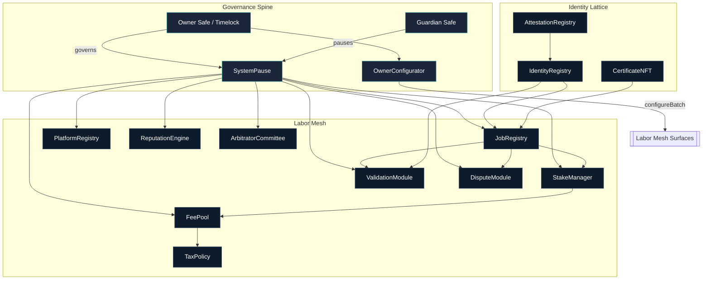
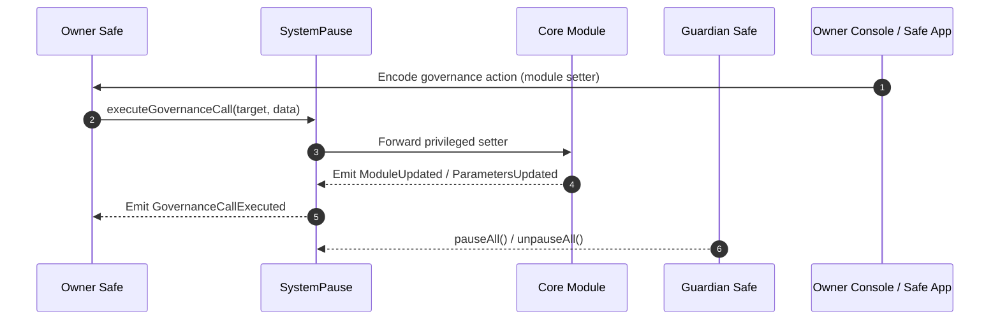
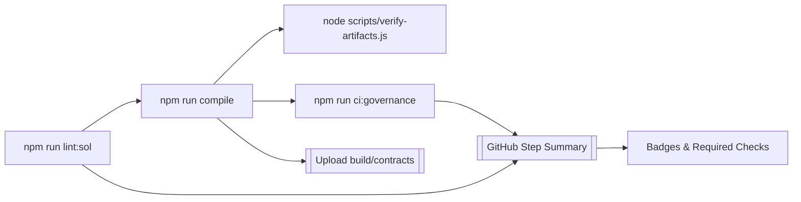
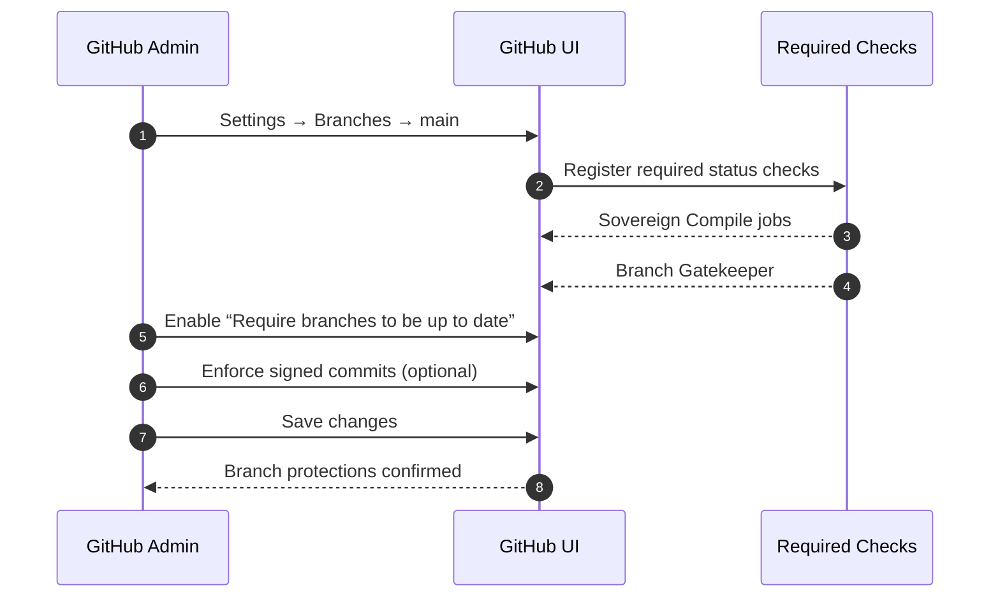

# AGIJobs Sovereign Labor v0.1

[](https://github.com/AGIJobs/agijobs-sovereign-labor-v0p1/actions/workflows/ci.yml)
[](https://github.com/AGIJobs/agijobs-sovereign-labor-v0p1/actions/workflows/branch-checks.yml)
[](https://github.com/AGIJobs/agijobs-sovereign-labor-v0p1/actions/workflows/ci.yml)
[](https://github.com/AGIJobs/agijobs-sovereign-labor-v0p1/actions/workflows/ci.yml)
[](LICENSE)


> The sovereign labor intelligence lattice engineered for absolute owner command, auditable economics, and immediate redeployability.

---

## Table of Contents
- [Mission Dashboard](#mission-dashboard)
- [Autonomous Control Matrix](#autonomous-control-matrix)
- [Architecture Maps](#architecture-maps)
- [Continuous Integration Spine](#continuous-integration-spine)
- [Mainnet Deployment Runway](#mainnet-deployment-runway)
- [CI Activation Protocol](#ci-activation-protocol)
- [Operations Playbook](#operations-playbook)
- [Telemetry & Audit Signals](#telemetry--audit-signals)
- [Directory Atlas](#directory-atlas)

---

## Mission Dashboard
- **Owner-first governance.** `SystemPause` concentrates every privileged setter, pauser, and upgrade hook. The owner Safe decides and the mesh executes.
- **Deterministic economics.** `$AGIALPHA` (0xa61a3b3a130a9c20768eebf97e21515a6046a1fa) is wired across staking, fees, rewards, and settlements with 18-decimal enforcement at runtime and during CI.
- **Rapid reconfiguration.** All registries, staking, reputation, dispute, and tax modules expose owner-callable setters reachable via governance forwarding or `OwnerConfigurator` batches.
- **Operator-grade CI.** Lint → compile → governance audit → workflow hygiene produce visible checks on every PR and protected branch.
- **Manifested deployments.** Each migration writes manifests and two-step ownership handoffs so non-technical operators can verify and accept live ownership through a Safe UI.

## Autonomous Control Matrix



Every module routed through `SystemPause` can be retuned by owner-executed calls. Identity-facing contracts transfer to the owner Safe so acceptances happen within a familiar Safe interface.

### Owner Control Surfaces
| Module | Critical Setters | Pause Hooks | Notes |
| --- | --- | --- | --- |
| `SystemPause` | `setModules`, `setGlobalPauser`, `refreshPausers`, `executeGovernanceCall` | `pauseAll`, `unpauseAll` | Governs every other module; emits `ModulesUpdated` snapshots for audit trails. |
| `JobRegistry` | `setValidationModule`, `setIdentityRegistry`, `setTaxPolicy`, `setJobParameters`, `setFeePool`, `applyConfiguration` | `pause`, `unpause` | Owner reaches setters via `SystemPause.executeGovernanceCall` or `OwnerConfigurator`. |
| `StakeManager` | `setFeePool`, `setTreasury`, `setTreasuryAllowlist`, `setDisputeModule`, `setRoleMinimums`, `applyConfiguration` | `pause`, `unpause` | Guarded by runtime AGIALPHA decimal checks. |
| `ValidationModule` | `setStakeManager`, `setIdentityRegistry`, `setReputationEngine`, `setRandaoCoordinator`, `setSelectionStrategy` | `pause`, `unpause` | Failover relays routed through `SystemPause`. |
| `DisputeModule` | `setStakeManager`, `setCommittee`, `setTaxPolicy`, `setDisputeFee`, `setDisputeWindow` | `pause`, `unpause` | Arbitration lifeline remains in owner control. |
| `PlatformRegistry` | `setStakeManager`, `setReputationEngine`, `setMinPlatformStake`, `applyConfiguration`, `setRegistrar` | `pause`, `unpause` | Enforces platform staking minimums in AGIALPHA. |
| `FeePool` | `setGovernance`, `setStakeManager`, `setTreasury`, `setTaxPolicy`, `setRewardRole`, `applyConfiguration` | `pause`, `unpause` | Burns, treasury routing, and reward streams stay owner programmable. |
| `ReputationEngine` | `setCaller`, `setStakeManager`, `setScoringWeights`, `setBlacklist`, `setValidationRewardPercentage` | `pause`, `unpause` | Deterministic scoring knobs managed by owner console. |
| `ArbitratorCommittee` | `setDisputeModule`, `setCommitRevealWindows`, `setAbsenteeSlash` | `pause`, `unpause` | Owner tunes dispute throughput and slashing dynamics. |
| `TaxPolicy` | `setPolicyURI`, `setAcknowledgement`, `setPolicy`, `setAcknowledger`, `revokeAcknowledgement` | — | Owns the tax acknowledgement text referenced throughout the mesh. |

## Architecture Maps





## Continuous Integration Spine
- **Sovereign Compile workflow (`.github/workflows/ci.yml`).**
  - Lints Solidity with `solhint --max-warnings=0`.
  - Compiles via Truffle (Solidity 0.8.30, viaIR, optimizer enabled) and validates artifacts.
  - Runs `npm run ci:governance` to confirm every owner/pauser surface exists and `$AGIALPHA` constants match `deploy/config.mainnet.json`.
  - Uploads build artifacts and publishes a compile summary for reviewers.
- **Branch Gatekeeper (`.github/workflows/branch-checks.yml`).** Enforces branch naming discipline across feature, release, and automation branches.
- **Branch protection checklist (mark as “required” on `main` and any release branches):**
  1. `Sovereign Compile / Solidity lint`
  2. `Sovereign Compile / Compile smart contracts`
  3. `Sovereign Compile / Governance surface audit`
  4. `Sovereign Compile / Workflow hygiene`
  5. `Branch Gatekeeper / Validate branch naming conventions`
  6. Require ≥1 approving review and up-to-date merges before allowing PR merges.
- **Badge status.** Badges above reflect current GitHub Actions signals so stakeholders can audit CI health instantly.

## CI Activation Protocol



1. **Settings → Branches.** Add branch protection for `main` (and `develop` if used) and tick each job listed in the checklist above.
2. **Require green CI.** Enable “Require status checks to pass before merging” and “Require branches to be up to date before merging”.
3. **Lock PR discipline.** Require at least one approving review, disallow bypassing pull requests, and optionally enforce signed commits and conversation resolution.
4. **Visibility.** Toggle “Allow anyone to view workflow run logs” so auditors can confirm the full log chain for every check directly from the PR UI.
5. **Periodic audit.** Quarterly, export the repository branch protection settings (`gh api repos/:owner/:repo/branches/main/protection`) and archive them alongside CI run manifests.

Once protections are saved, every PR advertises the full status panel (`Sovereign Compile` fan-out + `Branch Gatekeeper`) and cannot merge without a completely green dashboard.

## Mainnet Deployment Runway
A non-technical operator can broadcast the system using the guided flow below.

```mermaid
flowchart TD
    cfg[1. Prepare config.mainnet.json]\nPopulate Safe addresses, treasury, AGIALPHA token, parameters.
    secrets[2. Load secrets]\nExport MAINNET_RPC, DEPLOYER_PK, ETHERSCAN_API_KEY.
    install[3. Install]\n`npm ci --omit=optional --no-audit --no-fund`
    lint[4. Lint]\n`npm run lint:sol`
    compile[5. Compile]\n`npm run compile`
    audit[6. Governance audit]\n`npm run ci:governance`
    migrate[7. Migrate]\n`DEPLOY_CONFIG=... npx truffle migrate --network mainnet --f 1 --to 3`
    accept[8. Accept ownership]\nSafe UI → acceptOwnership for Identity & Attestation registries.
    verify[9. Verify]\n`npm run verify:mainnet`
    manifest[10. Archive manifests]\nCommit/Store manifests/addresses.mainnet.json.

    cfg --> secrets --> install --> lint --> compile --> audit --> migrate --> accept --> verify --> manifest
```

### Operator checklist
1. **Clone & install.** `git clone ... && cd agijobs-sovereign-labor-v0p1 && npm ci --omit=optional --no-audit --no-fund`.
2. **Fill `deploy/config.mainnet.json`.** Use checksum Safe addresses, treasury wallet, and confirm `$AGIALPHA` token (already set to `0xa61a3b3a130a9c20768eebf97e21515a6046a1fa`).
3. **Dry-run the controls.** Execute `npm run lint:sol`, `npm run compile`, `node scripts/verify-artifacts.js`, and `npm run ci:governance`; keep the terminal open for later screenshots.
4. **Broadcast migration.** `DEPLOY_CONFIG=$(pwd)/deploy/config.mainnet.json npx truffle migrate --network mainnet --f 1 --to 3 --compile-all`.
5. **Accept ownership in Safe.** Use the Safe UI to execute queued `acceptOwnership` calls (IdentityRegistry, AttestationRegistry, CertificateNFT if reassigned).
6. **Verify + archive.** `npm run verify:mainnet`, copy `manifests/addresses.mainnet.json`, CI logs, and Safe transaction hashes into your runbook.

#### Canonical migration script (Mainnet)

```javascript
// migrations/1_deploy_kernel.js (excerpt)
module.exports = async function (deployer, network, accounts) {
  const cfg = resolveConfig();
  const chainId = await web3.eth.getChainId();
  if (chainId !== cfg.chainId) {
    throw new Error(`Config chainId ${cfg.chainId} != network ${chainId}`);
  }

  const ownerSafe = cfg.ownerSafe;
  const guardianSafe = cfg.guardianSafe || ownerSafe;
  const treasury = cfg.treasury || ZERO_ADDRESS;

  // … deploy StakeManager, FeePool, IdentityRegistry, ValidationModule, JobRegistry, SystemPause …
  await pause.setModules(
    job.address,
    stake.address,
    validation.address,
    dispute.address,
    platform.address,
    feePool.address,
    reputation.address,
    committee.address
  );
  await pause.setGlobalPauser(guardianSafe);
  await pause.transferOwnership(ownerSafe);
};
```

The migration enforces `$AGIALPHA` wiring, Safe addresses, pauser delegation, manifest emission, and two-step ownership handoffs so the operator simply follows the terminal prompts.
5. **Approve Safe steps.** Through the Safe app, execute queued `acceptOwnership` calls for `IdentityRegistry`, `AttestationRegistry`, and (if needed) `OwnerConfigurator`.
6. **Etherscan verification.** `npm run verify:mainnet` once transactions are final.
7. **Record manifest.** Capture `manifests/addresses.mainnet.json` and attach to deployment logs.

All commands mirror CI so a non-technical operator can rely on green checks as the go/no-go signal.

## Operations Playbook
- **Emergency pause.** Guardian Safe calls `SystemPause.pauseAll()`; owner Safe resumes with `unpauseAll()` once incident resolved.
- **Module upgrade.** Deploy new module → transfer ownership to `SystemPause` → owner Safe invokes `setModules` with the replacement address.
- **Parameter tuning.** Owner Safe or `OwnerConfigurator` forwards setter calldata via `SystemPause.executeGovernanceCall`.
- **Treasury management.** Configure via `StakeManager.setTreasuryAllowlist`, `StakeManager.setTreasury`, and `FeePool.setTreasury`.
- **Tax policy refresh.** Owner Safe updates URI/acknowledgement through `TaxPolicy.setPolicy` and optionally resets acknowledgements.

## Telemetry & Audit Signals
- `SystemPause.ModulesUpdated`, `PausersUpdated`, `GovernanceCallExecuted` – confirm control plane actions.
- `StakeManager.ParametersUpdated`, `TreasuryUpdated`, `StakeSlashed`, `RewardPaid` – financial instrumentation in `$AGIALPHA`.
- `JobRegistry.JobCreated`, `JobAccepted`, `JobFinalized`, `JobChallenged` – lifecycle trace of labor engagements.
- `ValidationModule.ValidatorsUpdated`, `FailoverTriggered` – validator health.
- `ReputationEngine.ScoreUpdated`, `BlacklistUpdated` – trust analytics.
- `TaxPolicy.PolicyAcknowledged`, `AcknowledgementRevoked` – compliance acknowledgements.

## Directory Atlas
- [`contracts/`](contracts) – Solidity source with owner-governed modules, utilities, and interfaces.
- [`deploy/`](deploy) – Mainnet configuration, human-readable runbook, and manifests.
- [`migrations/`](migrations) – Truffle migration scripts (`--network mainnet --f 1 --to 3`) powering production deploys.
- [`scripts/`](scripts) – CI helpers for linting branch names, verifying artifacts, and auditing governance surfaces.
- [`truffle/`](truffle) – Environment guide for local consoles, alternative networks, and artifact hygiene.

The repository is curated so a mission owner can operate, reconfigure, and redeploy the labor intelligence lattice with confidence while every critical control remains observable and testable.
