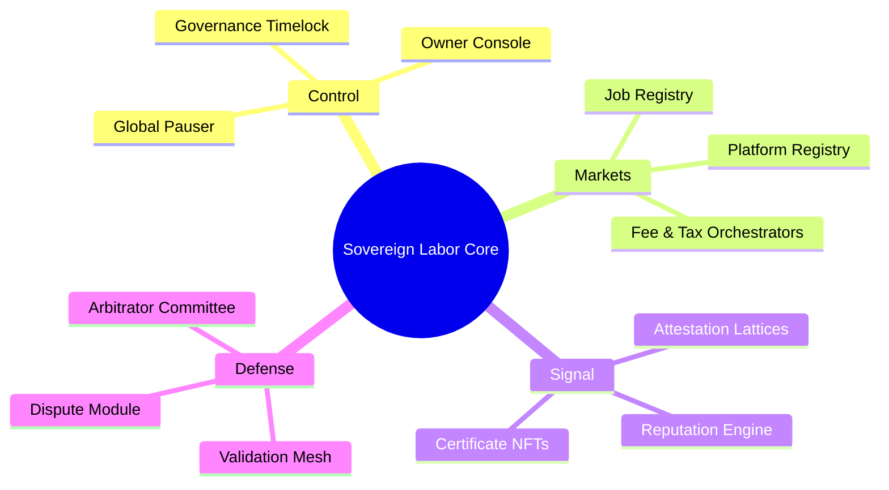
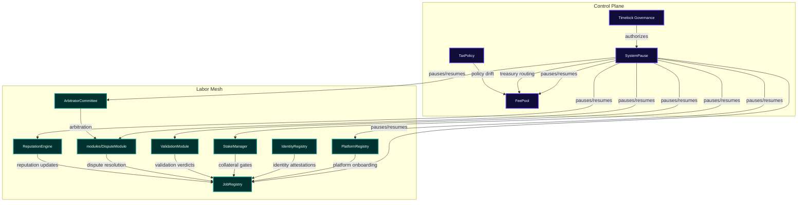
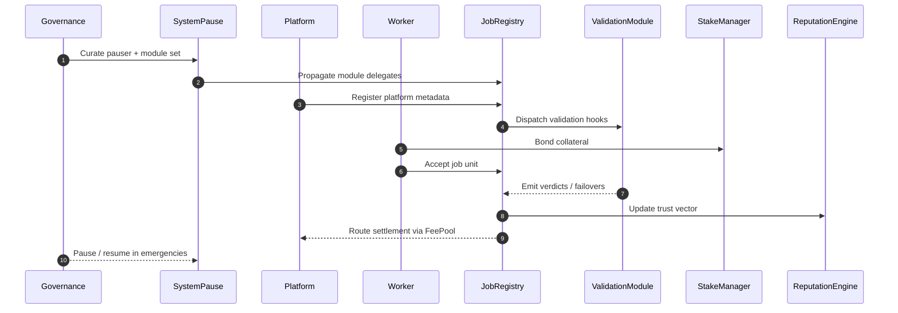
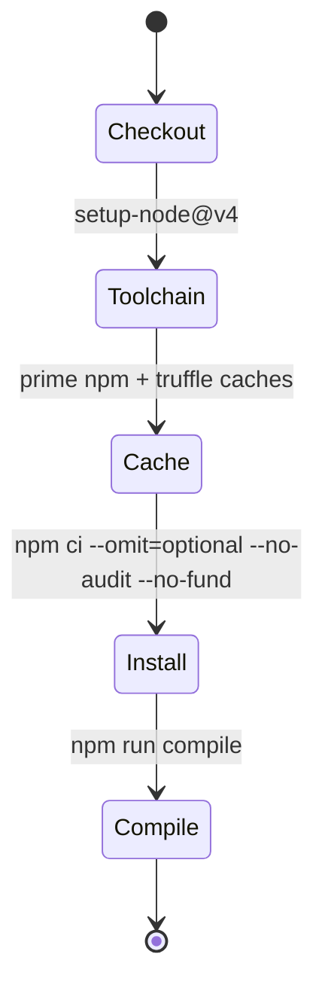
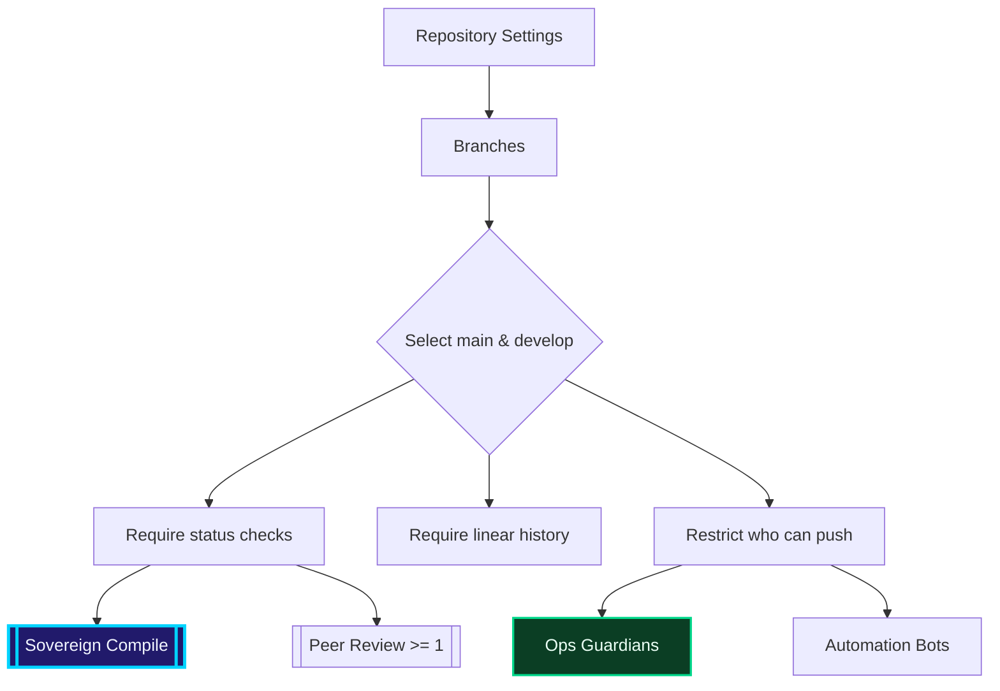

# AGIJobs Sovereign Labor v0.1

[](https://github.com/AGIJobs/agijobs-sovereign-labor-v0p1/actions/workflows/ci.yml)
[](https://github.com/AGIJobs/agijobs-sovereign-labor-v0p1/actions)
[](LICENSE)


> The sovereign labor intelligence substrate that silently choreographs global coordination, composability, and owner-level omnipotence.

---

## Table of Contents
- [Mission Vector](#mission-vector)
- [Repository Topology](#repository-topology)
- [System Cartography](#system-cartography)
- [Lifecycle Orchestration](#lifecycle-orchestration)
- [Governance & Control Surfaces](#governance--control-surfaces)
- [Continuous Integration & Release Discipline](#continuous-integration--release-discipline)
- [Operator Playbooks](#operator-playbooks)
- [Development Quickstart](#development-quickstart)
- [Observability Signals](#observability-signals)
- [Directory Atlases](#directory-atlases)

---

## Mission Vector
- **Precision governance.** Every privileged pathway is timelock mediated, auditable, and reversible by the contract owner with deterministic sequencing.
- **Dynamic labor markets.** Registries, staking, validation, and dispute circuits interlock through hardened interfaces to choreograph human and machine job flows.
- **Instant reconfiguration.** Core modules are hot-swappable, pausable, and parameterizable without downtime, empowering the owner to steer incentives in real time.
- **Command singularity.** The mesh behaves as the intelligence engine that shapes economic gravity—deploy once, steer forever.

## Autonomy Field Manual


> Every branch of the mindmap is live code in this repository. Each leaf links to a pausable, owner-governed module whose parameters can be remapped mid-flight without forfeiting determinism.

## Repository Topology
| Path | Signal |
| --- | --- |
| `contracts/` | Solidity source for registries, staking, arbitration, attestation, tax policy, and composable modules. |
| `deploy/` | Deployment pipelines and scripted environment bootstraps. |
| `migrations/` | Legacy Truffle migrations for historical compatibility. |
| `truffle/` | Network snapshots, fixtures, and environment shims. |
| `truffle-config.js` | Compiler settings (Solidity 0.8.30 via IR, optimizer, deterministic metadata). |
| `package.json` | Tooling manifest and reproducible build scripts. |
| `.github/workflows/` | Sovereign compile workflow enforcing green pipelines on every push and PR. |

## System Cartography


## Lifecycle Orchestration


## Governance & Control Surfaces
The owner (timelock governance) retains complete, immediate command over every parameter:

- `SystemPause.setModules(...)` & `refreshPausers()` keep all subsystem references and pauser roles synchronized under a single lever.
- `SystemPause.executeGovernanceCall(...)` forwards arbitrary governance-approved calldata to any managed module while enforcing ownership and pauser invariants.
- `StakeManager` exposes owner-only routines for collateral ratios, reward curves, slash multipliers, and treasury routing, enabling rapid incentive tuning.
- `JobRegistry` governance setters reshape job templates, fee gradients, arbitration policies, and module endpoints without redeploys.
- Each module inherits pausing and ownership surfaces so the owner can stop, resume, or upgrade any flow instantly.

Every critical operation emits rich telemetry events for downstream automation, dashboards, and compliance archives.

## Continuous Integration & Release Discipline


- The **Sovereign Compile** workflow gates every push to `main`, `develop`, `feature/**`, and `release/**` as well as all PRs targeting protected branches.
- Caches keep compiler downloads deterministic while `npm ci` enforces lockfile integrity.
- Branch protection checklist:
  1. Require the **Sovereign Compile** check.
  2. Enforce up-to-date merges before PR completion.
  3. Require at least one approving review.
  4. (Optional) Require signed commits for audit-grade provenance.

## Branch Protection Enforcement Blueprint


- Align GitHub branch protection rules with the diagram to guarantee that every pull request surfaces the Sovereign Compile check, code review, and governance-approved deployers.
- Mirror the same rules on `develop` (or your staging trunk) so that downstream environments inherit identical guardrails.
- Publish the enforcement policy in your Ops knowledge base; the system’s operators should treat it as a non-negotiable security boundary.

## Operator Playbooks
| Scenario | Action Sequence |
| --- | --- |
| Pause entire mesh | Queue `SystemPause.pauseAll()` via timelock, execute after delay, monitor `PausersUpdated` & `ModulesUpdated`. |
| Rotate pauser delegate | Call `SystemPause.setGlobalPauser(newPauser)` to update every module atomically. |
| Swap out validation logic | Deploy new validation module, transfer ownership to `SystemPause`, call `setModules(...)` with the new address. |
| Adjust staking economics | Invoke `StakeManager` governance setters to revise collateral ratios, reward splits, slash multipliers, and escrow managers. |
| Trigger validation failover | `SystemPause.triggerValidationFailover(jobId, action, extension, reason)` extends windows or escalates to disputes. |

## Development Quickstart
```bash
# Clone & bootstrap
git clone https://github.com/AGIJobs/agijobs-sovereign-labor-v0p1.git
cd agijobs-sovereign-labor-v0p1
npm install --omit=optional --no-audit --no-fund

# Deterministic compile
npm run compile

# Interactive sandbox
npx truffle develop
truffle(develop)> migrate
truffle(develop)> test
```

### Environment secrets for live deployment
| Variable | Purpose |
| --- | --- |
| `MAINNET_RPC` | HTTPS RPC endpoint (archive tier recommended). |
| `SEPOLIA_RPC` | Testnet RPC endpoint. |
| `DEPLOYER_PK` | Hex private key (no `0x`). |
| `ETHERSCAN_API_KEY` | Verification API token. |

Deploy with `truffle migrate --network <network>` and verify via `npm run verify:mainnet` once addresses are stable.

## Observability Signals
- `SystemPause.PausersUpdated` & `ModulesUpdated` — authoritative source of control surface state.
- `StakeManager.Slashed`, `RewardClaimed`, `ParametersUpdated` — staking liquidity and risk posture.
- `JobRegistry.JobCreated`, `JobAccepted`, `JobFinalized`, `JobChallenged` — labor flow telemetry.
- `ReputationEngine.ScoreUpdated` — trust dynamics for platforms and workers.

## Directory Atlases
- [`contracts/`](contracts/README.md) – Architecture, storage layout, and module interfaces for every on-chain component.
- [`deploy/`](deploy/README.md) – Deployment pipelines and environment tunables.
- [`truffle/`](truffle/README.md) – Per-network configuration, fixtures, and simulation harnesses.

---

Harness this repository with the discipline it deserves: precision governance, verified automation, and relentless CI keep the labor intelligence engine aligned with its operators.
