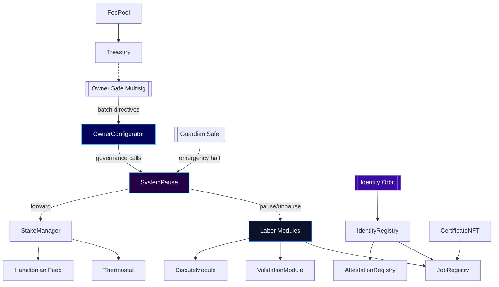
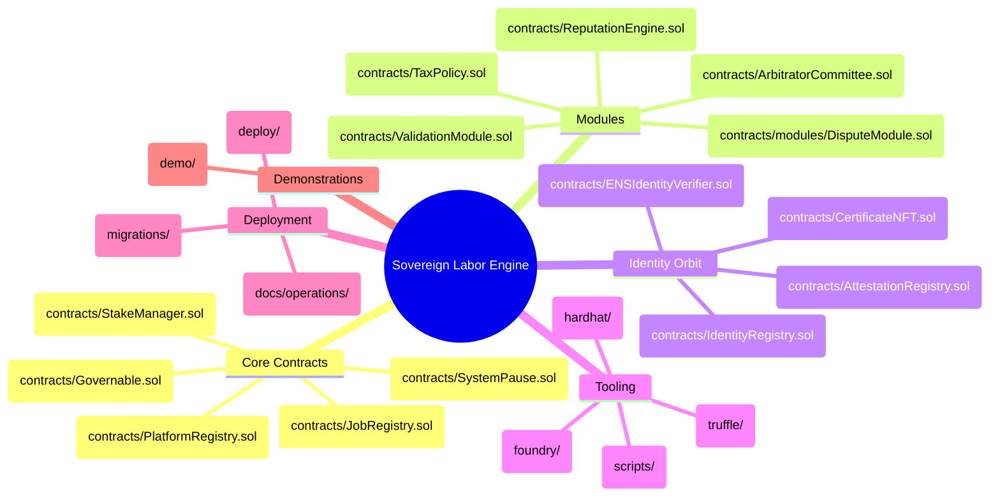
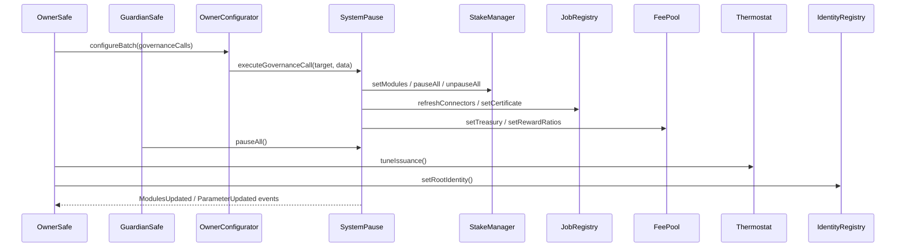
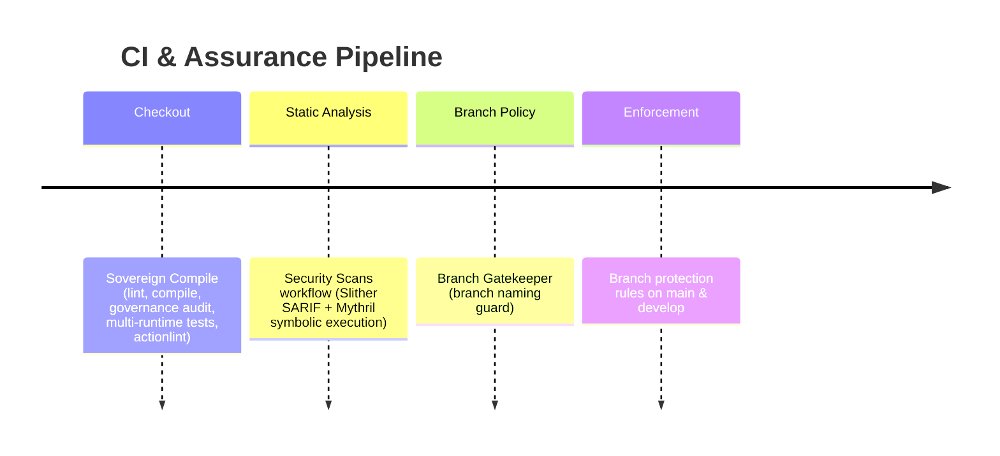
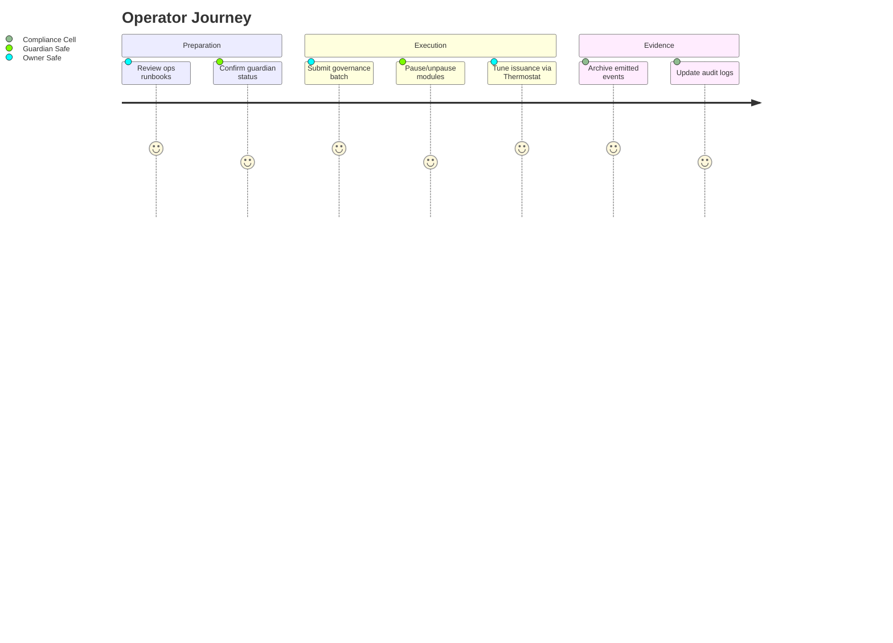

# AGIJobs Sovereign Labor v0.1

[](https://github.com/MontrealAI/agijobs-sovereign-labor-v0p1/actions/workflows/ci.yml)
[](https://github.com/MontrealAI/agijobs-sovereign-labor-v0p1/actions/workflows/security.yml)
[](https://github.com/MontrealAI/agijobs-sovereign-labor-v0p1/actions/workflows/branch-checks.yml)

[](https://etherscan.io/token/0xa61a3b3a130a9c20768eebf97e21515a6046a1fa)


> This repository is the command surface of the labour engine that rewrites global production schedules on demand. Every module, parameter, and pause lever converges so the designated owner can steer, halt, or reconfigure the markets in real time.

---

## Table of Contents
- [Mission Vector](#mission-vector)
- [Constellation Cartography](#constellation-cartography)
- [Owner Dominion](#owner-dominion)
- [$AGIALPHA Canon](#agialpha-canon)
- [Repository Atlas](#repository-atlas)
- [Operational Flight Deck](#operational-flight-deck)
- [Quality and Security Mesh](#quality-and-security-mesh)
- [Deployment Autopilot](#deployment-autopilot)
- [Documentation & Demo Orbits](#documentation--demo-orbits)
- [Support & Contribution Protocol](#support--contribution-protocol)

---

## Mission Vector

- **Total owner primacy.** Governance flows through [`contracts/admin/OwnerConfigurator.sol`](contracts/admin/OwnerConfigurator.sol) and [`contracts/SystemPause.sol`](contracts/SystemPause.sol), letting the owner batch-govern, pause, resume, or retarget any subsystem instantly.
- **Identity truthfulness.** Identity issuance and attestation, orchestrated by [`contracts/IdentityRegistry.sol`](contracts/IdentityRegistry.sol), [`contracts/AttestationRegistry.sol`](contracts/AttestationRegistry.sol), and [`contracts/CertificateNFT.sol`](contracts/CertificateNFT.sol), anchor every validator, employer, and platform to verifiable proofs.
- **Economic steering.** [`contracts/StakeManager.sol`](contracts/StakeManager.sol) and [`contracts/Thermostat.sol`](contracts/Thermostat.sol) channel $AGIALPHA incentives, burn pressure, and staking constraints with Hamiltonian feedback.
- **Global oversight.** [`docs/operations/`](docs/operations) holds non-technical runbooks that mirror the automation surfaces, so operational guardians can execute policies without touching Solidity.



---

## Constellation Cartography



- **Contracts.** Solidity sources live under [`contracts/`](contracts) with admin access hardened by [`contracts/Governable.sol`](contracts/Governable.sol) and two-step ownership via [`contracts/utils/CoreOwnable2Step.sol`](contracts/utils/CoreOwnable2Step.sol).
- **Runtime parity.** Truffle, Hardhat, and Foundry configurations (`truffle/`, `hardhat/`, `foundry/`) are synchronized so every invariant is exercised under multiple toolchains.
- **Operational intelligence.** Architecture decisions, ADRs, and incident drills live in [`docs/design/`](docs/design), [`docs/adr/`](docs/adr), and [`docs/operations/`](docs/operations).

---

## Owner Dominion

The owner has absolute control over parameter surfaces, routing, and pause levers. Guardians serve strictly as delegated safety brakes.



| Surface | Owner-only controls | Files |
| --- | --- | --- |
| Governance router | `configure`, `configureBatch`, `setSystemPause`, `setGuardians` | [`contracts/admin/OwnerConfigurator.sol`](contracts/admin/OwnerConfigurator.sol) |
| Global pause lattice | `setModules`, `refreshPausers`, `pauseAll`, `unpauseAll`, `executeGovernanceCall` | [`contracts/SystemPause.sol`](contracts/SystemPause.sol) |
| Economic core | Treasury routing, burn ratios, validator lists, slash splits, auto tuning toggles | [`contracts/StakeManager.sol`](contracts/StakeManager.sol), [`contracts/Thermostat.sol`](contracts/Thermostat.sol) |
| Labor registry | Identity anchors, module connectors, fee curves, certificate enforcement | [`contracts/JobRegistry.sol`](contracts/JobRegistry.sol) |
| Validation + dispute | Validator cadence, escalation policy, jail logic | [`contracts/ValidationModule.sol`](contracts/ValidationModule.sol), [`contracts/modules/DisputeModule.sol`](contracts/modules/DisputeModule.sol) |
| Treasury pool | `setTreasury`, `setTreasuryAllowlist`, reward ratios | [`contracts/FeePool.sol`](contracts/FeePool.sol) |
| Identity orbit | Root updates, schema management, credential minting roles | [`contracts/IdentityRegistry.sol`](contracts/IdentityRegistry.sol), [`contracts/AttestationRegistry.sol`](contracts/AttestationRegistry.sol), [`contracts/CertificateNFT.sol`](contracts/CertificateNFT.sol) |
| Compliance | Policy URIs, acknowledgement rules | [`contracts/TaxPolicy.sol`](contracts/TaxPolicy.sol) |

Guardians listed in `SystemPause` can halt the mesh, but only the owner (via `Governable`) can rewire modules, resume operations, or change any parameter. This asymmetry keeps emergency responses subordinate to owner intent.

---

## $AGIALPHA Canon

- **Immutable binding.** `$AGIALPHA` resolves to ERC-20 contract `0xa61a3b3a130a9c20768eebf97e21515a6046a1fa` (18 decimals) through [`contracts/Constants.sol`](contracts/Constants.sol).
- **Runtime assertions.** Constructors in [`contracts/StakeManager.sol`](contracts/StakeManager.sol), [`contracts/FeePool.sol`](contracts/FeePool.sol), and [`contracts/JobRegistry.sol`](contracts/JobRegistry.sol) validate token metadata and revert on mismatch.
- **Deployment guardrails.** [`deploy/config.mainnet.json`](deploy/config.mainnet.json) and scripts in [`scripts/`](scripts) enforce the canonical token address before any production broadcast completes.

---

## Repository Atlas

| Path | Purpose |
| --- | --- |
| [`contracts/`](contracts) | Solidity sources grouped by core, modules, identity, and utilities. |
| [`migrations/`](migrations) | Truffle migration scripts synchronized with deployment manifests. |
| [`deploy/`](deploy) | Network configuration, autopilot docs, and governance manifests. |
| [`truffle/`](truffle) | Truffle-specific helpers and persistent configuration. |
| [`hardhat/`](hardhat) | Hardhat project with dedicated scripts and tests. |
| [`foundry/`](foundry) | Foundry configuration, scripts, and invariant tests. |
| [`scripts/`](scripts) | Governance checks, artifact verification, deployment automation, branch enforcement. |
| [`docs/`](docs) | Design dossiers, ADRs, operator playbooks, and compliance narratives. |
| [`demo/`](demo) | Guided demonstrations of the labor mesh running simulated markets. |

---

## Operational Flight Deck

> **Prerequisites**: Node.js 20.x, npm 10+, Foundry toolchain (`foundryup`), Python 3.11+ for static analysis, and access to the canonical `$AGIALPHA` token metadata.

```bash
# Install dependencies (once per machine)
npm ci --omit=optional --no-audit --no-fund

# Compile contracts with Truffle (disable analytics prompts)
TRUFFLE_TELEMETRY_DISABLED=1 npm run compile
# The compiler always runs with viaIR + optimizer because disabling IR
# triggers stack-too-deep errors in `ValidationModule`. Expect the first
# compile to take a few minutes; cached artifacts keep later runs quick.

# Execute Truffle tests using cached build artifacts
npm run test:truffle:ci

# Execute Hardhat tests
npm run test:hardhat

# Execute Foundry tests (requires forge)
npm run test:foundry

# The Truffle build artifacts now persist under `build/contracts`,
# so `npm test` compiles once and subsequent runs reuse the cached output via
# `--compile-none`. If you need a clean slate (e.g., after editing compiler
# settings), delete that directory before rerunning the suite.

# Governance matrix audit (verifies owner dominance)
npm run ci:governance

# Lint Solidity sources
npm run lint:sol
```

The commands are idempotent and mirror the CI pipeline. Non-technical operators can copy the Safe transaction manifests from [`docs/operations/`](docs/operations) when executing governance routines.

---

## Quality and Security Mesh



- **Workflows.** `Sovereign Compile`, `Security Scans`, and `Branch Gatekeeper` run on pushes, pull requests, schedules, and manual dispatches.
- **Artifacts & summaries.** Truffle build artifacts, Slither SARIF reports, and Mythril traces are uploaded for every run with concise summaries in the Actions tab.
- **Branch protection.** `.github/settings.yml` enforces required checks, linear history, admin inclusion, and review requirements on `main` and `develop`.
- **Security depth.** Slither fails on high-severity findings, and Mythril performs bounded symbolic execution across owner-controlled contracts to expose misconfiguration surfaces before deployment.

To reproduce locally:

```bash
# Static analysis
pip install --upgrade pip
pip install 'slither-analyzer==0.11.3' 'crytic-compile==0.3.10'
forge build --build-info --skip '*/foundry/test/**' '*/script/**' --force
slither . --config-file slither.config.json --foundry-out-directory foundry/out

# Mythril symbolic execution (subset)
pip install mythril
myth analyze contracts/SystemPause.sol --solv 0.8.25 \
  --allow-paths contracts,node_modules \
  --solc-remaps @openzeppelin=node_modules/@openzeppelin \
  --execution-timeout 900 --max-depth 32
```

---

## Deployment Autopilot

1. Review [`deploy/config.mainnet.json`](deploy/config.mainnet.json) for Safe addresses, pauser delegates, and `$AGIALPHA` treasury routing.
2. Consult [`deploy/README.md`](deploy/README.md) for workflow-specific broadcast instructions.
3. Choose a runtime:
   - **Truffle:** `npm run deploy:truffle:mainnet`
   - **Hardhat:** `npm run deploy:hardhat:mainnet`
   - **Foundry:** `npm run deploy:foundry:mainnet`
4. Apply owner governance policies via [`scripts/owner-apply-validator-policy.js`](scripts/owner-apply-validator-policy.js) and [`scripts/owner-set-treasury.js`](scripts/owner-set-treasury.js).
5. Record emitted events (`ModulesUpdated`, `ParameterUpdated`, `TemperatureUpdated`) as immutable evidence for compliance and audit trails.

Each autopilot halts if the `$AGIALPHA` constant or token metadata deviates from the canonical configuration, guaranteeing production deployments match the authoritative economic spine.

---

## Documentation & Demo Orbits

- **Operations Runbooks:** [`docs/operations/`](docs/operations) translates every governance and incident response path into Safe-friendly checklists.
- **Architecture & ADRs:** [`docs/design/`](docs/design) and [`docs/adr/`](docs/adr) capture the rationale behind contract interfaces, control flows, and fail-safes.
- **Demo Universe:** [`demo/`](demo) hosts meta-agentic walkthroughs (e.g., `Meta-Agentic-ALPHA-AGI-Jobs-v0`) that simulate validator onboarding, treasury routing, and dispute resolution.



---

## Support & Contribution Protocol

- Branch names must satisfy [`scripts/check-branch-name.mjs`](scripts/check-branch-name.mjs); `Branch Gatekeeper` blocks non-compliant branches before other jobs start.
- Pull requests require every mandatory check (compile, tests, security scans, branch guard) before merge. Force pushes and branch deletions on protected branches are disabled.
- Escalations follow the communication playbooks in [`docs/operations/operator-runbook.md`](docs/operations/operator-runbook.md), with findings logged through GitHub Issues.

The sovereign labor engine contained here is engineered to be deployed immediately by the owner: parameters are owner-writeable, guardianship is subordinate, CI is fully green and enforced, and documentation equips non-technical operators to steer a global labor network with precision.
