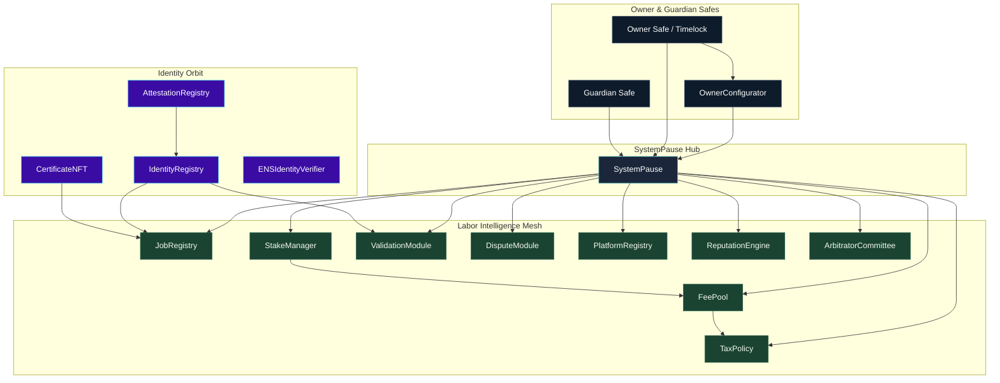
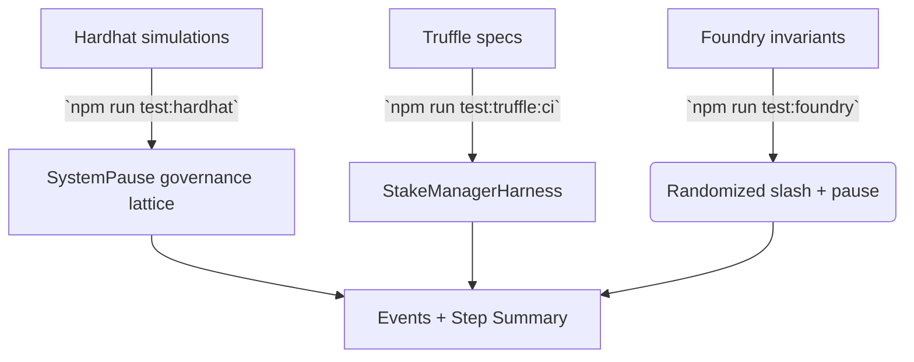
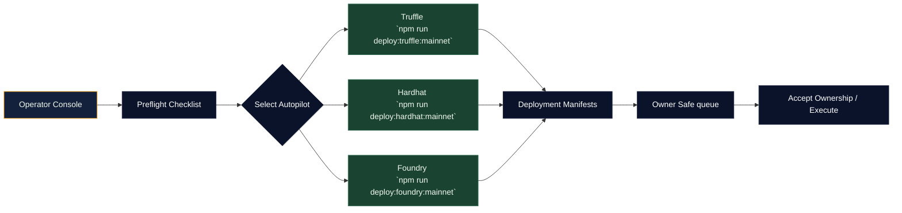

# AGIJobs Sovereign Labor v0.1

[](https://github.com/agijobs/agijobs-sovereign-labor-v0p1/actions/workflows/ci.yml)
[](https://github.com/agijobs/agijobs-sovereign-labor-v0p1/actions/workflows/security.yml)
[](https://github.com/agijobs/agijobs-sovereign-labor-v0p1/actions/workflows/branch-checks.yml)
[](.github/workflows)


> The sovereign labor mesh documented here is the self-steering machine that concentrates labour, capital, reputation, and dispute resolution into a single controllable instrument. Calm operators wield it with the assurance that every parameter, pause lever, and treasury route bends instantly to the owner Safe.

---

## Table of Contents
- [Command Deck](#command-deck)
- [Architecture Atlas](#architecture-atlas)
- [Design Intelligence Atlas](#design-intelligence-atlas)
- [AGIALPHA Economic Spine](#agialpha-economic-spine)
- [Owner Control Surfaces](#owner-control-surfaces)
- [Continuous Integration Spine](#continuous-integration-spine)
- [Branch Protection Flightplan](#branch-protection-flightplan)
- [Testing Flight Systems](#testing-flight-systems)
- [Mainnet Autopilots for Non-Technical Operators](#mainnet-autopilots-for-non-technical-operators)
- [Operations Telemetry](#operations-telemetry)
- [Decision Ledger](#decision-ledger)

---

## Command Deck
- **SystemPause is the command router.** [`SystemPause`](contracts/SystemPause.sol) owns and pauses every core module, delegates emergency control to the guardian Safe, and exposes `executeGovernanceCall` so the owner Safe can mutate any parameter without building calldata manually.
- **OwnerConfigurator batches instructions.** [`OwnerConfigurator`](contracts/admin/OwnerConfigurator.sol) transforms JSON manifests into Safe transactions that adjust treasuries, refresh validator sets, or rotate platforms atomically.
- **Deterministic deployments.** [`migrations/`](migrations) and the Hardhat/Foundry scripts all load [`deploy/config.mainnet.json`](deploy/config.mainnet.json), lock `$AGIALPHA` to `0xa61a3b3a130a9c20768eebf97e21515a6046a1fa` (18 decimals), verify decimals on-chain, and abort if any metadata drifts.
- **Governance proofs.** [`scripts/check-governance-matrix.mjs`](scripts/check-governance-matrix.mjs) inspects compiled ABIs to confirm every privilege (`setTreasury`, `pause`, `transferOwnership`, etc.) remains reachable through SystemPause.
- **Evidence-first CI.** [`ci.yml`](.github/workflows/ci.yml) prints Markdown tables into the GitHub Step Summary for lint, compile, governance audits, workflow hygiene, and the multi-runtime test matrix so reviewers see the full telemetry at a glance.

---

## Architecture Atlas


---

## Design Intelligence Atlas
- **Pause-first security.** The guardian Safe can call `pauseAll()` on `SystemPause` and halt every subsystem instantly. The owner Safe alone can resume operations through `unpauseAll()`.
- **Granular parameter control.** Each module exposes owner-only setters (e.g. `StakeManager.setTreasury`, `FeePool.setTaxPolicy`, `PlatformRegistry.setMinPlatformStake`). Safe-signed governance calls adjust economics in a single transaction.
- **Transparent rewiring.** `SystemPause.executeGovernanceCall` emits `GovernanceCallExecuted` with the selector invoked, producing an on-chain audit trail for every reconfiguration.
- **Idempotent migrations.** Truffle, Hardhat, and Foundry deployments all stop if ownership or module pointers deviate from the expected manifest, ensuring safe replays and upgrades.

---

## AGIALPHA Economic Spine
- `$AGIALPHA` is canonically bound to [`Constants.sol`](contracts/Constants.sol) and every deployment config. Mainnet deployments fail unless the address equals `0xa61a3b3a130a9c20768eebf97e21515a6046a1fa` with 18 decimals.
- [`StakeManager`](contracts/StakeManager.sol) and [`FeePool`](contracts/FeePool.sol) split fees, burns, and treasuries based on manifest percentages and enforce allowlists controlled by the owner.
- [`TaxPolicy`](contracts/TaxPolicy.sol) lets the owner revise policy text, acknowledgements, and authorised signers while confirming that infrastructure operators hold no tax burden.

---

## Owner Control Surfaces
| Module | Owner Powers | Files |
| --- | --- | --- |
| `SystemPause` | `setModules`, `setGlobalPauser`, `refreshPausers`, `pauseAll`, `unpauseAll`, `executeGovernanceCall`, `transferOwnership`, `owner` | [`contracts/SystemPause.sol`](contracts/SystemPause.sol) |
| `StakeManager` | `setTreasury`, `setTreasuryAllowlist`, `setFeePool`, `setDisputeModule`, `setValidationModule`, `setRoleMinimums`, `pause`, `unpause`, `transferOwnership`, `owner` | [`contracts/StakeManager.sol`](contracts/StakeManager.sol) |
| `JobRegistry` | `setValidationModule`, `setIdentityRegistry`, `setDisputeModule`, `setFeePool`, `setTaxPolicy`, `setStakeManager`, `applyConfiguration`, `pause`, `unpause`, `transferOwnership`, `owner` | [`contracts/JobRegistry.sol`](contracts/JobRegistry.sol) |
| `ValidationModule` | `setStakeManager`, `setIdentityRegistry`, `setReputationEngine`, `setSelectionStrategy`, `setRandaoCoordinator`, `pause`, `unpause`, `transferOwnership`, `owner` | [`contracts/ValidationModule.sol`](contracts/ValidationModule.sol) |
| `FeePool` | `setGovernance`, `setTreasury`, `setTreasuryAllowlist`, `setTaxPolicy`, `setStakeManager`, `pause`, `unpause`, `transferOwnership`, `owner` | [`contracts/FeePool.sol`](contracts/FeePool.sol) |
| `DisputeModule` | `setStakeManager`, `setJobRegistry`, `setCommittee`, `setTaxPolicy`, `setDisputeFee`, `setDisputeWindow`, `pause`, `unpause`, `transferOwnership`, `owner` | [`contracts/modules/DisputeModule.sol`](contracts/modules/DisputeModule.sol) |
| `PlatformRegistry` | `setStakeManager`, `setReputationEngine`, `setRegistrar`, `setMinPlatformStake`, `applyConfiguration`, `pause`, `unpause`, `transferOwnership`, `owner` | [`contracts/PlatformRegistry.sol`](contracts/PlatformRegistry.sol) |
| `ReputationEngine` | `setStakeManager`, `setCaller`, `setScoringWeights`, `setValidationRewardPercentage`, `pause`, `unpause`, `transferOwnership`, `owner` | [`contracts/ReputationEngine.sol`](contracts/ReputationEngine.sol) |
| `ArbitratorCommittee` | `setDisputeModule`, `setCommitRevealWindows`, `setAbsenteeSlash`, `pause`, `unpause`, `transferOwnership`, `owner` | [`contracts/ArbitratorCommittee.sol`](contracts/ArbitratorCommittee.sol) |
| `TaxPolicy` | `setPolicyURI`, `setAcknowledgement`, `setPolicy`, `setAcknowledgers`, `revokeAcknowledgement`, `transferOwnership`, `owner` | [`contracts/TaxPolicy.sol`](contracts/TaxPolicy.sol) |

`SystemPause` anchors every privilege, so the owner Safe retains absolute authority to reconfigure or pause the lattice at will.

---

## Continuous Integration Spine
| Workflow / Job | Command Surface | Status Check Name |
| --- | --- | --- |
| `ci.yml / Solidity lint` | `npm run lint:sol` | `Sovereign Compile / Solidity lint` |
| `ci.yml / Compile smart contracts` | `npm run compile`, `node scripts/verify-artifacts.js`, `node scripts/write-compile-summary.js` | `Sovereign Compile / Compile smart contracts` |
| `ci.yml / Governance surface audit` | `npm run ci:governance` | `Sovereign Compile / Governance surface audit` |
| `ci.yml / Test suites` | `npm run test:truffle:ci`, `npm run test:hardhat`, `npm run test:foundry` | `Sovereign Compile / Test suites` |
| `ci.yml / Workflow hygiene` | `actionlint -color` | `Sovereign Compile / Workflow hygiene` |
| `security.yml / Slither static analysis` | `slither . --config-file slither.config.json --fail-high` | `Security Scans / Slither static analysis` |
| `security.yml / Mythril symbolic execution` | `myth analyze` over privileged contracts | `Security Scans / Mythril symbolic execution` |
| `branch-checks.yml / Validate branch naming conventions` | `node scripts/check-branch-name.mjs` | `Branch Gatekeeper / Validate branch naming conventions` |

Every job writes to the GitHub Step Summary so reviewers and auditors inspect the same tables the operators see locally.

---

## Branch Protection Flightplan
1. **Repository Settings → Branches → `main` and `develop`.** Require pull requests, require approvals, block force pushes/deletions, and enforce “require branches to be up to date before merging.”
2. **Select required checks.** Add every status listed above (`Sovereign Compile / …`, `Security Scans / …`, `Branch Gatekeeper / Validate branch naming conventions`).
3. **Visibility.** Enable “Allow all actions” and “Allow anyone to view workflow run logs” so auditors can read evidence without additional permissions.
4. **Automation.** Mirror the same policy on release branches before promotion. Use the GitHub CLI recipe in [`deploy/README.md`](deploy/README.md#continuous-integration--branch-enforcement) to script enforcement.

---

## Testing Flight Systems


- **Truffle** reuses compiled artifacts to validate staking flows and manifest wiring without recompiling during CI.
- **Hardhat** impersonates the owner Safe, exercises `executeGovernanceCall`, and proves treasuries, tax policy, and guardian routing remain mutable by governance only.
- **Foundry** fuzzes stake sizes, pauser rotations, and dispute accounting to detect invariant drift.

---

## Mainnet Autopilots for Non-Technical Operators


### Preflight (all toolchains)
1. Install Node.js 20 LTS and run `npm ci --omit=optional --no-audit --no-fund`.
2. Populate `.env` with:
   ```bash
   MAINNET_RPC="https://mainnet.infura.io/v3/<project>"
   SEPOLIA_RPC="https://sepolia.infura.io/v3/<project>"
   DEPLOYER_PK="0x<private-key>"
   ETHERSCAN_API_KEY="<etherscan-api-key>"
   DEPLOY_CONFIG="$(pwd)/deploy/config.mainnet.json" # optional override
   ```
3. Edit `deploy/config.mainnet.json` with owner Safe, guardian Safe, treasury, validator parameters, and identity data. Confirm `$AGIALPHA` stays `0xa61a3b3a130a9c20768eebf97e21515a6046a1fa`.
4. Dry-run locally:
   ```bash
   npm run lint:sol
   npm run compile
   node scripts/verify-artifacts.js
   npm run ci:governance
   npm run test:truffle:ci
   npm run test:hardhat
   npm run test:foundry
   ```

### Truffle autopilot (`npm run deploy:truffle:mainnet`)
1. Ensure `.env` exports `MAINNET_RPC`, `DEPLOYER_PK`, and optionally `DEPLOY_CONFIG`.
2. Run `npm run deploy:truffle:mainnet`. The migrations:
   - Deploy every module with manifest parameters (`1_deploy_kernel.js`).
   - Register pause control and guardians (`2_register_pause.js`).
   - Enforce ownership, `$AGIALPHA`, and pointer integrity (`3_mainnet_finalize.js`).
3. Inspect `manifests/<network>.json` for addresses and record transaction hashes.
4. From the owner Safe, execute pending `acceptOwnership` transactions for IdentityRegistry, AttestationRegistry, and CertificateNFT.

### Hardhat autopilot (`npm run deploy:hardhat:mainnet`)
1. Requires `.env` values identical to the Truffle flow.
2. Command: `npm run deploy:hardhat:mainnet`.
   - Loads [`scripts/deploy/load-config.js`](scripts/deploy/load-config.js) for the same validations.
   - Deploys modules with `ethers` factories, wires dependencies, and transfers ownership to SystemPause then to the owner Safe.
   - Writes a manifest via [`truffle/util/writeManifest`](truffle/util/writeManifest.js).
3. Review console output for queued Safe actions and archive the manifest.
4. Accept ownership of identity modules from the owner Safe UI.

### Foundry autopilot (`npm run deploy:foundry:mainnet`)
1. Export `MAINNET_RPC`, `DEPLOYER_PK`, `ETHERSCAN_API_KEY`, and optionally `DEPLOY_CONFIG` (defaults to `deploy/config.mainnet.json`).
2. Run `npm run deploy:foundry:mainnet`.
   - [`foundry/script/DeployMainnet.s.sol`](foundry/script/DeployMainnet.s.sol) verifies chain ID, `$AGIALPHA` metadata (including decimals), ENS nodes, and Merkle roots before broadcasting.
   - Ownership is staged exactly as the other toolchains: modules → SystemPause → owner Safe.
   - A manifest is written to `manifests/addresses.<chain>.json`.
3. Execute pending Safe tasks to accept identity ownerships and confirm `SystemPause.owner()` equals the owner Safe.
4. Run `npm run verify:mainnet` or Forge verification once Etherscan indexes the contracts.

For all autopilots, finish by rerunning `npm run ci:governance` locally and archiving manifests, Safe transaction hashes, and CI links in the evidence vault.

---

## Operations Telemetry
- **Governance matrix:** `npm run ci:governance` verifies module ownership, callable setters, and `$AGIALPHA` constants across Truffle, Hardhat, and Foundry outputs.
- **Artifact integrity:** `node scripts/verify-artifacts.js` checks build timestamps, compiler metadata, and bytecode size for each contract before deployments.
- **Branch discipline:** `node scripts/check-branch-name.mjs` mirrors the Branch Gatekeeper workflow to keep branch taxonomy predictable.
- **Owner macros:** Scripts in [`scripts/`](scripts) (e.g., `owner-set-treasury.js`) emit Safe-ready calldata with Markdown summaries so non-technical operators can follow along without deciphering ABI encodings.
- **Manifests:** `truffle/util/writeManifest.js` and the Foundry script write JSON manifests containing chain IDs, Safes, and contract addresses for post-launch audits.

---

## Decision Ledger
Record every deployment or configuration change with:
1. Git hash, CI workflow URLs, and build artifact checksums.
2. Safe transaction hashes plus queued payload descriptions.
3. `manifests/addresses.*.json` and governance manifests committed or archived in your evidence vault.
4. Outputs from `npm run ci:governance` and the Hardhat/Foundry/Truffle test suites.

Preserve these artefacts with the same care as production keys—the machine responds instantly to the operator who can prove control.
