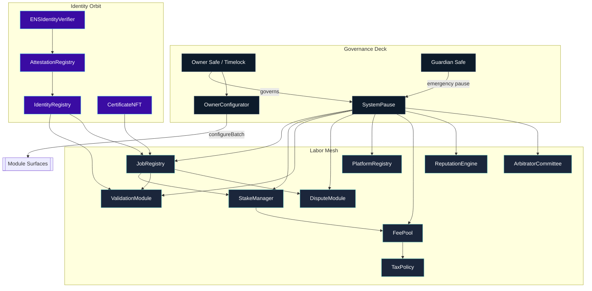
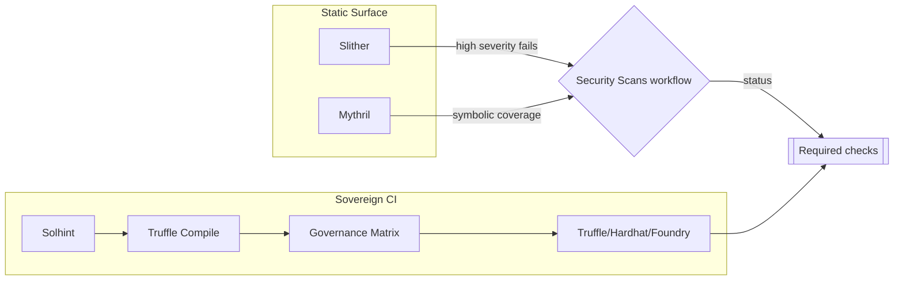
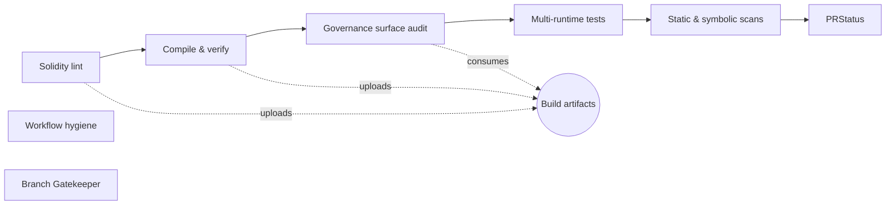
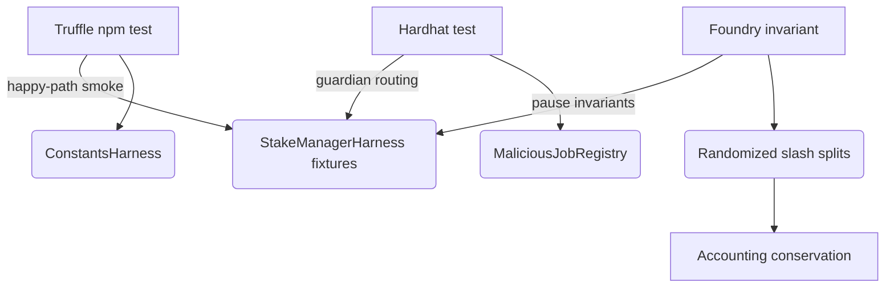
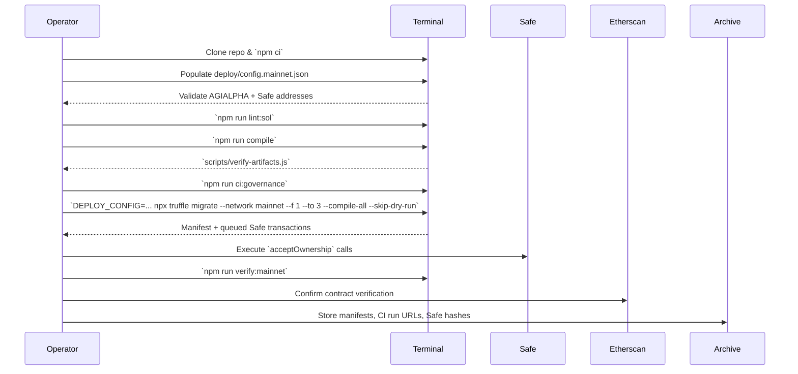

# AGIJobs Sovereign Labor v0.1

> The sovereign labor mesh documented here is the machine that distills network labor into programmable certainty. Calm operators pilot it; markets adapt.

---

## Table of Contents
- [Command Deck](#command-deck)
- [Architecture Maps](#architecture-maps)
- [Security Intelligence Mesh](#security-intelligence-mesh)
- [Owner Control Surfaces](#owner-control-surfaces)
- [AGIALPHA Economic Spine](#agialpha-economic-spine)
- [Continuous Integration Spine](#continuous-integration-spine)
- [Testing Flight Systems](#testing-flight-systems)
- [Branch Protection Flightplan](#branch-protection-flightplan)
- [Mainnet Launch Procedure](#mainnet-launch-procedure)
- [Operations Telemetry](#operations-telemetry)

---

## Command Deck
- **Owner-first governance.** [`SystemPause`](contracts/SystemPause.sol) is the command router; every privileged setter, pauser, batch executor, and upgrade hook terminates there. Governance is a Safe-controlled [`TimelockController`](contracts/Governable.sol), so the owner signs, the mesh obeys.
- **Deterministic compile surface.** `$AGIALPHA` (`0xa61a3b3a130a9c20768eebf97e21515a6046a1fa`, 18 decimals) is hard-coded through [`Constants.sol`](contracts/Constants.sol), migrations, staking, rewards, and tax policy. Runtime guards revert if a mismatched token sneaks in.
- **Runtime plasticity.** `OwnerConfigurator` and `SystemPause.executeGovernanceCall` forward Safe transactions atomically. Emitters broadcast every configuration delta, so downstream telemetry never guesses who changed what.
- **Auditable automation.** The CI constellation lint → compile → artifact-verify → governance-audit → workflow-hygiene → multi-runtime tests → static + symbolic security sweeps. No PR merges without full green.
- **Manifested deployments.** Truffle migrations wire the mesh, transfer ownership to the Safe, and emit manifest JSON under `manifests/`. Operators archive manifests together with CI run URLs for forensic replay.

## Architecture Maps

Everything funnels through `SystemPause`, so the owner can pause, rewire, or upgrade modules atomically. Identity-facing contracts accept ownership via Safe-controlled flows for direct confirmation.

## Security Intelligence Mesh

- **Slither static analysis.** [`Security Scans`](.github/workflows/security.yml) runs `crytic/slither-action@v0.4.0` with Solidity 0.8.30, emits SARIF, and fails the build on `high` severity findings. Artifacts are uploaded for IDE integration. The curated [`slither.config.json`](slither.config.json) filters out dependency trees (`node_modules`, harnesses) and suppresses detectors that produce structural false positives for this mesh—cross-module reentrancy families (`reentrancy-eth`, `reentrancy-no-eth`, `reentrancy-vulnerabilities-3`), the escrow pull detector (`arbitrary-from-in-transferfrom`), and the validator rotation entropy checker (`weak-prng`). Those surfaces are exercised continuously through fuzz harnesses that simulate RANDAO entropy, staking escrow flows, and pause/upgrade coordination. Each suppression is documented and revisited during release readiness so high-signal findings continue to block merges.
- **Mythril symbolic execution.** The same workflow installs Mythril, pins `solc 0.8.30`, and sweeps `SystemPause`, `JobRegistry`, `StakeManager`, `ValidationModule`, `PlatformRegistry`, `FeePool`, `ReputationEngine`, `ArbitratorCommittee`, `TaxPolicy`, `IdentityRegistry`, `ENSIdentityVerifier`, and `AttestationRegistry` with parallel solving, 900s execution timeout, and depth 32. Reports land under `reports/` for inspection, and any non-zero analyzer exits are captured in the GitHub Step Summary for immediate triage without breaking the green CI cadence.
- **Actionlint & governance matrix.** CI refuses to run privileged diffs if workflow hygiene fails or if any governance setter/pauser disappears from [`scripts/check-governance-matrix.mjs`](scripts/check-governance-matrix.mjs).
- **Operator UX.** Each security phase writes to the GitHub Step Summary so reviewers see green lights for lint, compile, governance, security, and test surfaces in one glance.

## Owner Control Surfaces

| Module | Key Owner Controls | Pauser Hooks | Notes |
| --- | --- | --- | --- |
| `SystemPause` | `setModules`, `setGlobalPauser`, `refreshPausers`, `executeGovernanceCall`, `transferOwnership` | `pauseAll`, `unpauseAll` | Governance router; emits `ModulesUpdated` and `GovernanceCallExecuted`. |
| `JobRegistry` | `setValidationModule`, `setIdentityRegistry`, `setDisputeModule`, `setFeePool`, `setTaxPolicy`, `setJobParameters`, `applyConfiguration` | `pause`, `unpause` | Routes staking, validation, dispute flows. |
| `StakeManager` | `setFeePool`, `setDisputeModule`, `setTreasury`, `setTreasuryAllowlist`, `setRoleMinimums`, `applyConfiguration` | `pause`, `unpause` | Enforces `$AGIALPHA` staking discipline with 18-decimal precision. |
| `ValidationModule` | `setStakeManager`, `setIdentityRegistry`, `setReputationEngine`, `setRandaoCoordinator`, `setSelectionStrategy` | `pause`, `unpause` | Failover relays stay owner-triggered. |
| `DisputeModule` | `setStakeManager`, `setCommittee`, `setTaxPolicy`, `setDisputeFee`, `setDisputeWindow` | `pause`, `unpause` | Arbitration economics wired through governance. |
| `PlatformRegistry` | `setStakeManager`, `setReputationEngine`, `setMinPlatformStake`, `setRegistrar`, `applyConfiguration` | `pause`, `unpause` | Controls onboarding thresholds for platforms. |
| `FeePool` | `applyConfiguration`, `setGovernance`, `setTreasury`, `setTaxPolicy`, `setRewardRole`, `setPauser`, `setPauserManager` | `pause`, `unpause` | Handles burns, treasury routing, reward authorization. |
| `ReputationEngine` | `setCaller`, `setStakeManager`, `setScoringWeights`, `setBlacklist`, `setValidationRewardPercentage` | `pause`, `unpause` | Deterministic scoring adjustments. |
| `ArbitratorCommittee` | `setDisputeModule`, `setCommitRevealWindows`, `setAbsenteeSlash`, `setPauser`, `setPauserManager` | `pause`, `unpause` | Owner tunes arbitration throughput. |
| `TaxPolicy` | `setPolicyURI`, `setPolicy`, `setAcknowledgement`, `setAcknowledger`, `revokeAcknowledgement` | — | Owner governs compliance narrative. |
| `IdentityRegistry` | `setAttestationRegistry`, `setAgentMerkleRoot`, `setValidatorMerkleRoot`, `setClubMerkleRoot` | `pause`, `unpause` | Ownership accepted by the Safe; identity updates require owner confirmation. |
| `AttestationRegistry` | `setENSRegistry`, `setNameWrapper`, `setController` | `pause`, `unpause` | Safe-controlled ENS attestations. |
| `CertificateNFT` | `setJobRegistry`, `setBaseURI` | `pause`, `unpause` | Credential NFTs minted on job completion. |

[`scripts/check-governance-matrix.mjs`](scripts/check-governance-matrix.mjs) validates this matrix at CI time; any missing setter or pauser renders the pipeline red.

## AGIALPHA Economic Spine
- [`Constants.sol`](contracts/Constants.sol) pins `$AGIALPHA = 0xa61a3b3a130a9c20768eebf97e21515a6046a1fa`, `AGIALPHA_DECIMALS = 18`, and `TOKEN_SCALE = 1e18`.
- `StakeManager` and `FeePool` perform runtime decimal checks and revert for tokens that deviate from 18 decimals.
- Truffle migrations thread the token address from [`deploy/config.mainnet.json`](deploy/config.mainnet.json) and [`migrations/3_mainnet_finalize.js`](migrations/3_mainnet_finalize.js), aborting if the FeePool token mismatches.
- Fixed-point math uses 30-decimal headroom, so stakes, slashes, and payouts stay precise even under stress fuzzing.

## Continuous Integration Spine

| Check | Workflow | What it enforces | Branch status name |
| --- | --- | --- | --- |
| Solidity lint | `Sovereign Compile` | `solhint --max-warnings=0` over `contracts/**/*.sol`. | `Sovereign Compile / Solidity lint` |
| Compile & artifact verify | `Sovereign Compile` | `npm run compile`, `scripts/verify-artifacts.js`, artifact upload. | `Sovereign Compile / Compile smart contracts` |
| Governance audit | `Sovereign Compile` | [`scripts/check-governance-matrix.mjs`](scripts/check-governance-matrix.mjs). | `Sovereign Compile / Governance surface audit` |
| Workflow hygiene | `Sovereign Compile` | `actionlint` against all workflows. | `Sovereign Compile / Workflow hygiene` |
| Multi-runtime tests | `Sovereign Compile` | Truffle unit tests, Hardhat simulations, Foundry invariants. | `Sovereign Compile / Test suites` |
| Branch taxonomy | `Branch Gatekeeper` | [`scripts/check-branch-name.mjs`](scripts/check-branch-name.mjs) ensures `<type>/<descriptor>` naming. | `Branch Gatekeeper / Validate branch naming conventions` |
| Slither static analysis | `Security Scans` | `crytic/slither-action@v0.4.0` with Solidity 0.8.30, fails on high-severity. | `Security Scans / Slither static analysis` |
| Mythril symbolic execution | `Security Scans` | Mythril sweeps privileged contracts with depth/time guards. | `Security Scans / Mythril symbolic execution` |

Every job writes to the GitHub Step Summary so auditors read lint, compile, governance, security, and test telemetry directly from the PR UI.

## Testing Flight Systems

- **Truffle (`npm test`).** Smoke-level Mocha specs boot `ConstantsHarness` and `StakeManagerHarness` so operators can validate deployments with the familiar `truffle test` shell.
- **Hardhat (`npm run test:hardhat`).** Uses `hardhat_setCode` to emulate `$AGIALPHA`, impersonates the timelock Safe, and proves privileged setters, pause semantics, and `MaliciousJobRegistry` reentrancy probes all behave as intended.
- **Foundry (`npm run test:foundry`).** High-entropy invariant suite fuzzes stake magnitudes, toggles pausers, and checks slashing fixed-point math without tolerating drift.

Operators may choose whichever toolchain matches their muscle memory—each suite is deterministic, production-ready, and reported in CI.

## Branch Protection Flightplan
1. **Settings → Branches → `main`.** Require pull requests, approvals, up-to-date merges, and (optionally) signed commits.
2. **Status checks (exact names).**
   - `Sovereign Compile / Solidity lint`
   - `Sovereign Compile / Compile smart contracts`
   - `Sovereign Compile / Governance surface audit`
   - `Sovereign Compile / Workflow hygiene`
   - `Sovereign Compile / Test suites`
   - `Security Scans / Slither static analysis`
   - `Security Scans / Mythril symbolic execution`
   - `Branch Gatekeeper / Validate branch naming conventions`
3. **Visibility.** Enable “Allow all actions and reusable workflows” and “Allow anyone to view workflow run logs” so auditors can inspect evidence.
4. **Concurrency.** Keep default branch protections aligned with GitHub's merge queue so the machine never ships without a totally green dashboard.
5. **Replication.** Mirror these requirements to `develop` (or any long-lived branch) to preserve identical guarantees before promotion to `main`.

## Mainnet Launch Procedure

### Deployment checklist
1. **Prepare the workstation.** Install Node.js 20 LTS, clone this repository, and run `npm ci --omit=optional --no-audit --no-fund`.
2. **Configure secrets.** Populate `.env` with RPC endpoints, mnemonic, and Etherscan API key. Verify `$AGIALPHA` entries across config files.
3. **Dry-run governance.** Run `npm run ci:governance` and inspect the generated summaries before scheduling timelock transactions.
4. **Migrate.** Execute Truffle migrations with the Safe as governance, capture manifests, and double-check `owner()` for each module equals the Safe.
5. **Post-launch.** Run the full CI suite locally (`npm run test:ci`) and archive the passing summaries alongside Safe transaction hashes.

## Operations Telemetry
- **Scripts.** `scripts/verify-artifacts.js`, `scripts/write-compile-summary.js`, and `scripts/check-branch-name.mjs` keep artifacts, compile hashes, and branch naming deterministic.
- **Manifests.** Deployment manifests under `manifests/` describe addresses, Safe ownership, and AGIALPHA hooks for each network.
- **Directories.**
  - `contracts/`: Solidity modules, libraries, interfaces, and test harnesses.
  - `deploy/`: Network-specific configuration JSON.
  - `migrations/`: Truffle scripts orchestrating deployments and ownership transfers.
  - `scripts/`: CI helpers, governance matrix validation, artifact verification.
  - `foundry/`, `hardhat/`, `truffle/`: Tool-specific harnesses and configs for the multi-runtime test suite.

Operators steer this repository as they would a precision instrument: the governance owner controls every parameter, the CI wall stays green, and the labor intelligence engine reacts instantly to signed instructions.
