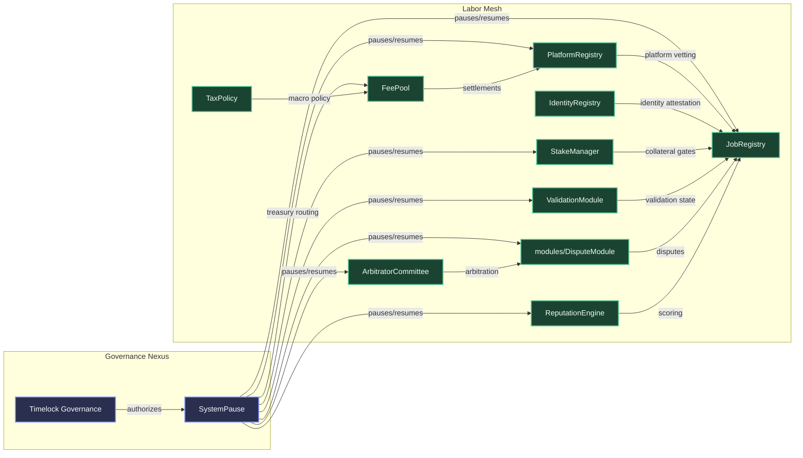
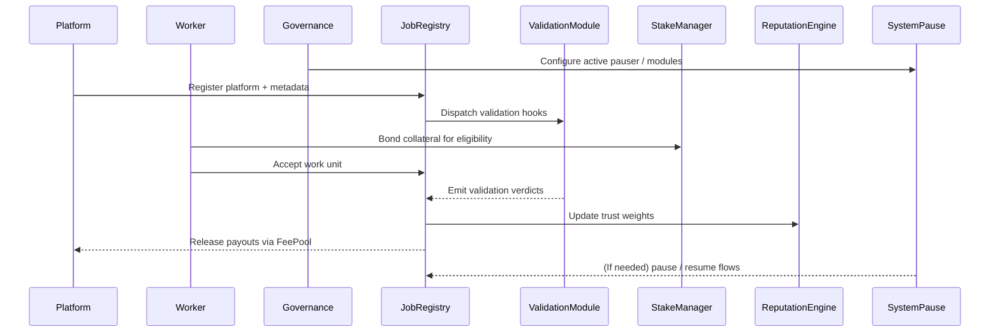

# AGIJobs Sovereign Labor v0.1

[](https://github.com/AGIJobs/agijobs-sovereign-labor-v0p1/actions/workflows/ci.yml)
[](LICENSE)


> A sovereign labor intelligence core designed to choreograph human and machine coordination with surgical precision and total composability.

## ✨ Mission Capsule
This repository concentrates the contract layer that coordinates the AGIJobs sovereign labor economy. Every module cooperates under deterministic governance, letting operators steer global labor policy while workers and platforms experience a fluid, trustworthy marketplace. The system is engineered so that a carefully curated control plane can reshape incentives, pause subsystems, or extend capabilities without downtime.

## 🧭 Repository Atlas
| Path | Purpose |
| --- | --- |
| `contracts/` | Solidity sources for registries, staking, validation, arbitration, treasury, thermostatic tax control, and shared libraries. |
| `deploy/` | Infrastructure scripts for orchestrating contract deployment sequences across environments. |
| `migrations/` | Legacy Truffle migrations retained for compatibility with historical tooling. |
| `truffle/` | Per-network configuration helpers (addresses, environment bootstrap, fixtures). |
| `truffle-config.js` | Compiler and network profile configuration (viaIR Solidity 0.8.25, deterministic artifact layout). |
| `package.json` | Tooling contracts, compile and verification scripts, dependency manifest. |

## 🕸️ Hyper-Operational Architecture


## 🔁 Labor Orbit (Lifecycle)


## 🚀 Quickstart
### Prerequisites
- Node.js 20.x (LTS) and npm 10+
- A modern shell (Bash, Zsh, or compatible) with access to `npx`
- Optional: Docker, Foundry, or Hardhat for extended simulation layers

### Clone & Install
```bash
git clone https://github.com/AGIJobs/agijobs-sovereign-labor-v0p1.git
cd agijobs-sovereign-labor-v0p1
npm install --omit=optional --no-audit --no-fund
```

### Compile Deterministically
```bash
npm run compile
```
Artifacts are produced under `build/contracts/` and align bit-for-bit with CI, thanks to the locked compiler version and `viaIR` configuration in `truffle-config.js`.

### Simulate Interactions
```bash
npx truffle develop
truffle(develop)> migrate
truffle(develop)> test
```
Use `truffle exec` or your own scripts to orchestrate end-to-end flows once fixtures are in place.

## 🛡️ Governance & Control Surfaces
Operators wield an Ownable-compatible timelock (`Governable.sol`) to steer every privileged action. Key capabilities include:
- **Module reconfiguration** via `SystemPause.setModules(...)` ensuring the owner can hot-swap registries, treasuries, or arbitration committees while verifying ownership alignment.
- **Emergency response** with `SystemPause` delegating pausing rights across all subsystems and broadcasting `PausersUpdated` whenever a new safety officer is appointed.
- **Stake policy management** using `StakeManager` owner functions to tune collateral ratios, decay constants, reward splits, and slash factors.
- **Economic levers** in `FeePool` and `TaxPolicy`, letting governance retarget distribution curves, treasury splits, and macro policy thresholds.
- **Identity and reputation oversight** through `IdentityRegistry`, `ValidationModule`, and `ReputationEngine` configurables that the owner may upgrade, pause, or extend.

Every critical contract emits telemetry events for observability. Because governance is timelocked, non-technical operators can queue, inspect, and execute parameter shifts with predictable sequencing.

## 🔄 Continuous Integration & Release Discipline
The `compile` workflow keeps the command surface minimal and transparent:
- Runs on every push to `main`, `feature/**`, and `release/**`, as well as every pull request targeting the protected branches.
- Uses Node.js 20 with dependency caching, `npm install --omit=optional` to avoid platform-specific optional packages, and `npm run compile` to verify Solidity output.
- Publishes a compiler version summary so reviewers can confirm deterministic tooling across contributors.

### Keep CI Green Locally
```bash
npm install --omit=optional --no-audit --no-fund
npm run compile
```

### Recommended Branch Protection (GitHub Settings → Branches)
1. Require status checks to pass before merging, selecting **compile / Compile smart contracts**.
2. Enable “Require branches to be up to date before merging.”
3. Require pull request reviews for additional human-in-the-loop assurance.
4. Optionally enforce signed commits for auditability.

These guardrails ensure that every change is proven against the same pipeline a non-technical operator would trust for production.

## 🌐 Deployment & Verification Path
1. Export environment secrets (never commit them):
   - `MAINNET_RPC` – HTTPS RPC endpoint with archive access.
   - `DEPLOYER_PK` – Hex private key without `0x` prefix (used by `@truffle/hdwallet-provider`).
   - `ETHERSCAN_API_KEY` – Contract verification API key.
2. Compile locally to align with CI:
   ```bash
   npm run compile
   ```
3. Deploy using your preferred network configuration in `truffle-config.js` (HDWallet provider templates are already wired for environment variables).
4. Verify contracts:
   ```bash
   npm run verify:mainnet
   ```
5. Snapshot deployed addresses and governance parameters in your runbook so downstream systems (frontends, off-chain services) can sync immediately.

## 📈 Observability & Telemetry Hooks
- Subscribe to `SystemPause.PausersUpdated` and `ModulesUpdated` to mirror active control endpoints.
- Monitor `StakeManager.Slashed`, `RewardClaimed`, and `ParametersUpdated` to track staking health.
- Listen to `JobRegistry.JobCreated`, `JobAccepted`, `JobFinalized`, and `JobChallenged` for workflow analytics.
- Archive `ReputationEngine.ScoreUpdated` events for advanced ranking or heuristics.

## 🗂️ Directory Deep Dive
- `contracts/admin/` – Higher-order coordinators and config surfaces.
- `contracts/interfaces/` – Minimal ABI boundaries for cross-contract messaging.
- `contracts/libraries/` – Pure libraries (math, bytes, guard rails) reused across modules.
- `contracts/modules/` – Optional extensions (dispute resolution, thermostat controls, validation failover).
- `contracts/utils/` – Helper mixins, custom errors, and instrumentation utilities.

## 🧠 Continuous Evolution
Future-facing integrations (Foundry fuzzing, differential testing, Hardhat tasks) can attach cleanly thanks to the deterministic build pipeline. Issue templates, release cadences, and formal verification harnesses can extend this base without disrupting production deployments.

When operating this stack, remember that you are piloting an intelligence-grade coordination engine: disciplined governance, transparent CI, and careful observability will keep the flywheel compounding safely.
