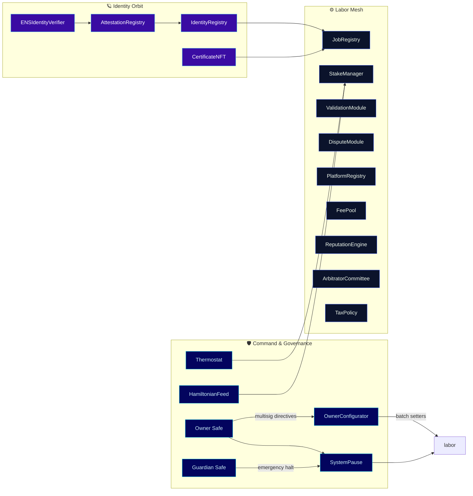
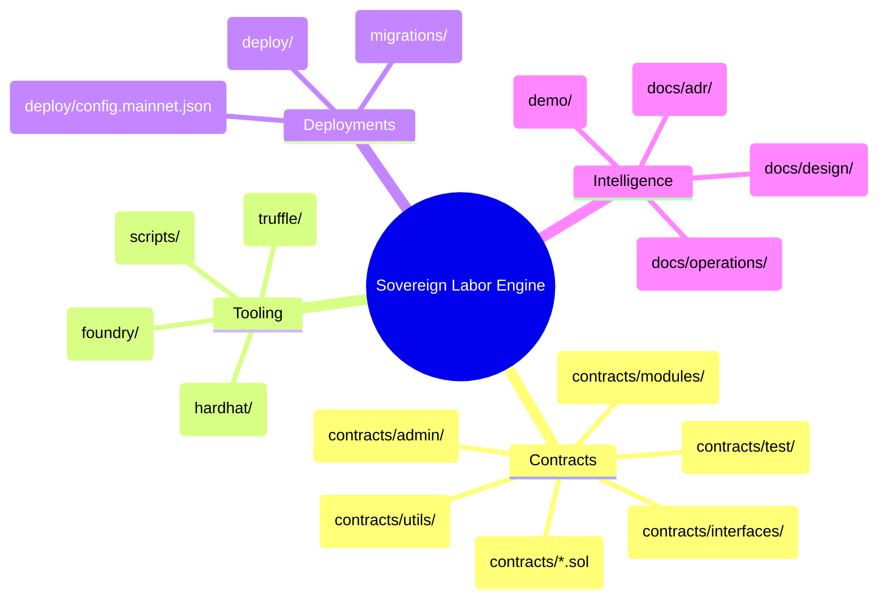
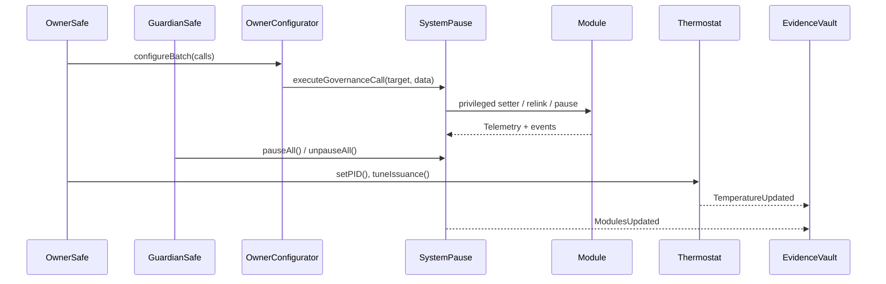
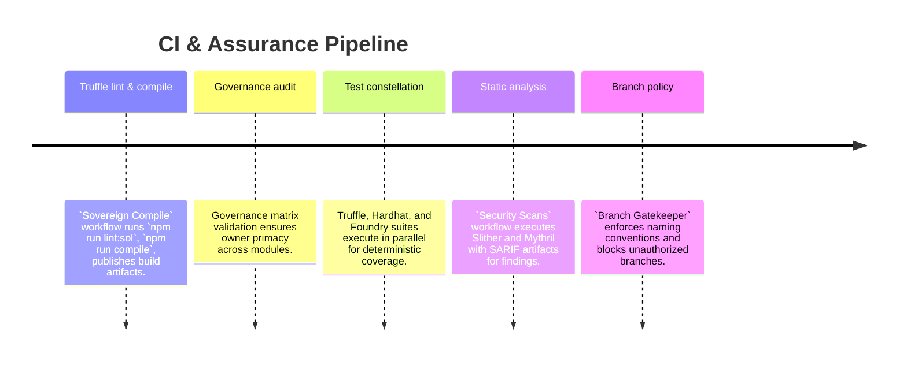

# AGIJobs Sovereign Labor v0.1

[](https://github.com/MontrealAI/agijobs-sovereign-labor-v0p1/actions/workflows/ci.yml)
[](https://github.com/MontrealAI/agijobs-sovereign-labor-v0p1/actions/workflows/security.yml)
[](https://github.com/MontrealAI/agijobs-sovereign-labor-v0p1/actions/workflows/branch-checks.yml)

[](https://etherscan.io/token/0xa61a3b3a130a9c20768eebf97e21515a6046a1fa)


> The sovereign labor engine embodied here fuses labor markets, treasury routing, identity, compliance, and dispute resolution into a single operator-dominated command lattice that reconfigures global production as easily as composing a transaction manifest.
>
> This repository is the operational cockpit for that world-realigning machine—precisely wired so the owner can command, pause, and reshape every subsystem at a moment’s notice.

---

## Table of Contents
- [Sovereign Constellation](#sovereign-constellation)
- [Architecture Harmonics](#architecture-harmonics)
- [Owner Command Authority](#owner-command-authority)
- [$AGIALPHA Canon](#agialpha-canon)
- [Repository Atlas](#repository-atlas)
- [Operational Flight Deck](#operational-flight-deck)
- [Quality, Security, and CI Mesh](#quality-security-and-ci-mesh)
- [Deployment Autopilot](#deployment-autopilot)
- [Documentation & Demo Orbit](#documentation--demo-orbit)
- [Support & Contributions](#support--contributions)

---

## Sovereign Constellation



- **Immediate command of the labor universe.** `OwnerConfigurator` funnels batched governance calls with auditable change logs, and `SystemPause` can freeze or resume every module in unison.
- **Identity-truthful execution.** ENS-verifiable identities and attestation registries gate validator admission, credential issuance, and job matching.
- **Thermal economic steering.** The thermostat and Hamiltonian feed give the owner real-time levers for issuance, burn pressure, and staking requirements.

---

## Architecture Harmonics

The repository mirrors runtime capabilities so non-technical operators can reason from first principles.



- **Contracts.** Core logic sits in [`contracts/`](contracts), with owner-first access control via [`Governable`](contracts/Governable.sol) and [`CoreOwnable2Step`](contracts/utils/CoreOwnable2Step.sol).
- **Tooling parity.** Truffle, Hardhat, and Foundry projects are maintained side-by-side, enabling the same runtime invariants to be validated across frameworks.
- **Knowledge vault.** Design dossiers, ADRs, and operational playbooks explain every invariant, Safe flow, and emergency maneuver for non-technical signers.

---

## Owner Command Authority



| Surface | Control vectors (owner-signed) | Highlights |
| --- | --- | --- |
| [`OwnerConfigurator`](contracts/admin/OwnerConfigurator.sol) | `configure`, `configureBatch` | Emits structured events for every parameter mutation, enabling Safe automations and compliance logging. |
| [`SystemPause`](contracts/SystemPause.sol) | `setModules`, `refreshPausers`, `pauseAll`, `unpauseAll`, `executeGovernanceCall` | Owner can rewire modules, delegate pausers, and forward arbitrary governance-approved calls. |
| [`StakeManager`](contracts/StakeManager.sol) | Treasury routing, Hamiltonian feeds, burn ratios, role minimums, slash splits | Owner-exclusive setters for all economic parameters and pauser delegation. |
| [`JobRegistry`](contracts/JobRegistry.sol) | Module connectors, fee curves, certificate enforcement, identity anchors | Owner curates lifecycle, gating, fees, and pause wiring. |
| [`ValidationModule`](contracts/ValidationModule.sol) & [`modules/DisputeModule`](contracts/modules/DisputeModule.sol) | Validator rosters, cadence, escalation policy | Owner tunes cadence and validators; guardians retain pause authority. |
| [`FeePool`](contracts/FeePool.sol) | `setTreasury`, `setTreasuryAllowlist`, reward ratios | Owner fixes treasury endpoints, burn proportions, and reward policies. |
| [`TaxPolicy`](contracts/TaxPolicy.sol) | `setPolicyURI`, acknowledgement rules | Owner updates compliance policy URIs and acknowledgement surfaces instantly. |
| Identity orbit (`IdentityRegistry`, `AttestationRegistry`, `CertificateNFT`, `ENSIdentityVerifier`) | Root refresh, schema governance, mint roles | Owner rebinds identity proofs, attestation schemas, and credential issuance pipelines. |

Guardianship is strictly subordinate—owner commands dominate all parameters, while guardian pausers provide emergency brakes without eroding owner primacy.

---

## $AGIALPHA Canon

- **Immutable binding.** `$AGIALPHA` is fixed to ERC-20 contract `0xa61a3b3a130a9c20768eebf97e21515a6046a1fa` with 18 decimals via [`contracts/Constants.sol`](contracts/Constants.sol).
- **Runtime validation.** `StakeManager`, `FeePool`, `JobRegistry`, and allied modules assert token metadata during construction, halting if any mismatch is detected.
- **Deployment guardrails.** [`deploy/config.mainnet.json`](deploy/config.mainnet.json) and scripts under [`scripts/deploy/`](scripts/deploy) reject manifests that deviate from the canonical token reference.

---

## Repository Atlas

| Path | Purpose |
| --- | --- |
| [`contracts/`](contracts) | Solidity source for the sovereign labor engine, organized by core, modules, admin surfaces, interfaces, and utilities. |
| [`migrations/`](migrations) | Truffle migration scripts, mirroring deploy manifests for deterministic sequencing. |
| [`deploy/`](deploy) | Mainnet configuration manifest and autopilot docs for broadcast tooling. |
| [`truffle/`](truffle) | Truffle-specific network configuration and helper scripts. |
| [`hardhat/`](hardhat) | Hardhat project with dedicated tests and deployment scripts. |
| [`foundry/`](foundry) | Foundry configuration, scripts, and tests for fast fuzzing and invariant checks. |
| [`scripts/`](scripts) | Cross-runtime governance, verification, and deployment utilities (branch naming, governance matrix, artifact verification). |
| [`docs/`](docs) | Design dossiers, ADRs, and operations runbooks for Safe operators, guardians, and compliance teams. |
| [`demo/`](demo) | Meta-agentic demonstrations that showcase the labor mesh in simulated environments. |

---

## Operational Flight Deck

> **Prerequisites:** Node.js 20.x, npm 10+, Foundry toolchain (`foundryup`), Python 3.11+ for security scans.

```bash
# Install dependencies (once per machine)
npm ci --omit=optional --no-audit --no-fund

# Compile contracts via Truffle
npm run compile

# Execute the Truffle suite using pre-built artifacts (CI parity)
npm run test:truffle:ci

# Execute Hardhat tests
npm run test:hardhat

# Execute Foundry tests (requires forge)
npm run test:foundry

# Run the governance matrix audit
npm run ci:governance

# Lint Solidity sources
npm run lint:sol
```

The scripts are idempotent and aligned with the CI mesh. Non-technical operators can rely on [`docs/operations/`](docs/operations) for copy-ready Safe transaction manifests.

---

## Quality, Security, and CI Mesh



- **Workflows.** `Sovereign Compile`, `Security Scans`, and `Branch Gatekeeper` run on pushes, pull requests, manual triggers, and (for security) weekly schedules.
- **Artifacts & summaries.** Each workflow publishes artifacts (`truffle-build`, Slither SARIF, Mythril traces) and writes human-readable summaries to the Actions log for audit trails.
- **Branch protection.** `main` (and partner release branches) require all workflows to pass before merge, with status checks enforced and force pushes disabled.
- **Security depth.** Slither executes with fail-on-high severity, while Mythril performs symbolic execution across the owner-controlled surface to surface misconfigurations before production releases.

To reproduce locally:

```bash
# Static security sweep (requires Python 3.11+ and Foundry)
pip install --upgrade pip
pip install 'slither-analyzer==0.11.3' 'crytic-compile==0.3.10'
forge build --build-info --skip '*/foundry/test/**' '*/script/**' --force
slither . --config-file slither.config.json --foundry-out-directory foundry/out

# Mythril symbolic execution (subset for local validation)
pip install mythril
myth analyze contracts/SystemPause.sol --solv 0.8.30 --allow-paths contracts,node_modules --solc-remaps @openzeppelin=node_modules/@openzeppelin --execution-timeout 900 --max-depth 32
```

---

## Deployment Autopilot

1. Populate [`deploy/config.mainnet.json`](deploy/config.mainnet.json) with Safe addresses, pauser delegates, and `$AGIALPHA` treasury routing (already pre-filled with canonical values).
2. Review [`deploy/README.md`](deploy/README.md) for broadcast instructions across Truffle, Hardhat, and Foundry.
3. Select a runtime:
   - **Truffle:** `npm run deploy:truffle:mainnet`
   - **Hardhat:** `npm run deploy:hardhat:mainnet`
   - **Foundry:** `npm run deploy:foundry:mainnet`
4. Apply owner governance policies via [`scripts/owner-apply-validator-policy.js`](scripts/owner-apply-validator-policy.js) and [`scripts/owner-set-treasury.js`](scripts/owner-set-treasury.js).
5. Capture emitted events (`ModulesUpdated`, `ParameterUpdated`, `TemperatureUpdated`) as immutable deployment evidence.

Every autopilot enforces `$AGIALPHA` invariants before finalizing ownership transfers, guaranteeing that the deployed mesh matches the canonical economic spine.

---

## Documentation & Demo Orbit

- **Operations runbooks:** [`docs/operations/`](docs/operations) details Safe signer playbooks, emergency procedures, and compliance checklists.
- **Design dossiers:** [`docs/design/`](docs/design) and [`docs/adr/`](docs/adr) trace architectural decisions and invariants for reviewers.
- **Demo verse:** [`demo/`](demo) contains guided experiences (e.g., `Meta-Agentic-ALPHA-AGI-Jobs-v0`) illustrating the labor mesh orchestrating platforms, validators, and treasury flows.

---

## Support & Contributions

- Branch names must satisfy [`scripts/check-branch-name.mjs`](scripts/check-branch-name.mjs) and pass `Branch Gatekeeper` before CI jobs start.
- Pull requests must have all required checks green; merges into `main` and release branches are blocked otherwise.
- For questions or operational escalations, reference the contact protocols in [`docs/operations/operator-runbook.md`](docs/operations/operator-runbook.md) and log findings in the repository issues tracker.

The sovereign labor engine here is engineered for decisive owner control, immediate deployability, and uncompromising compliance—ready to realign labor markets the moment its operator issues the command.
