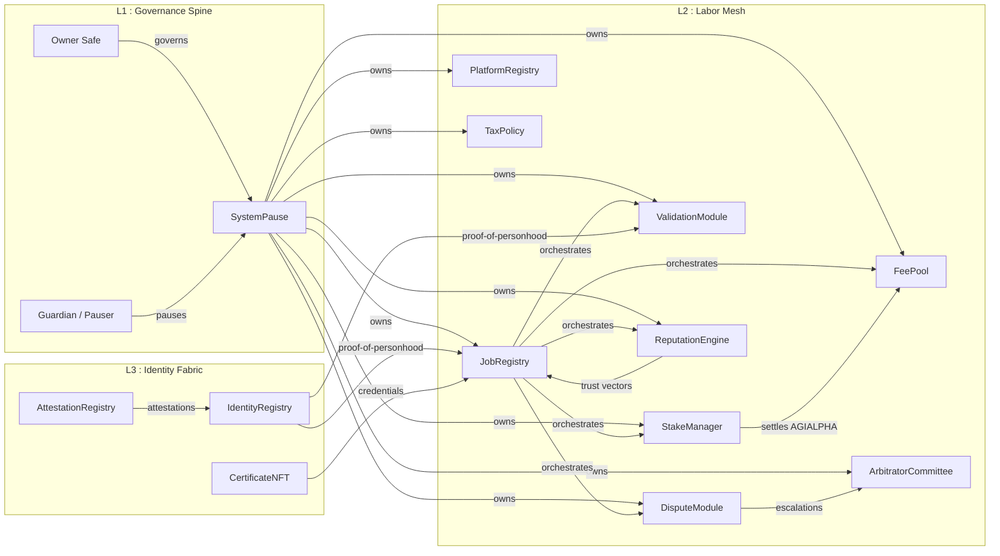
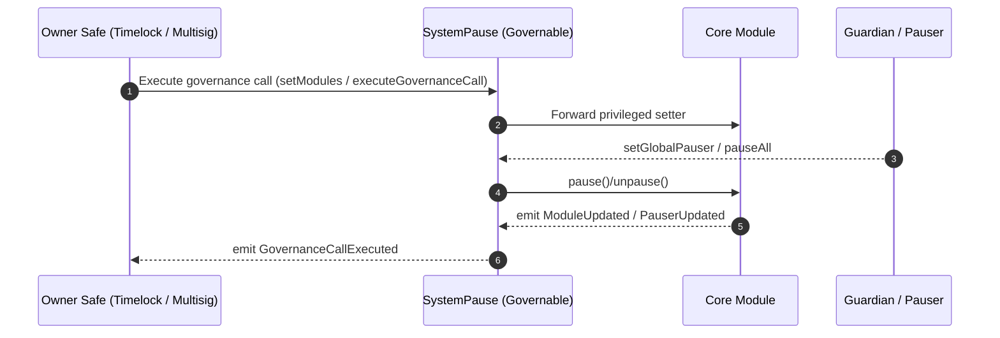
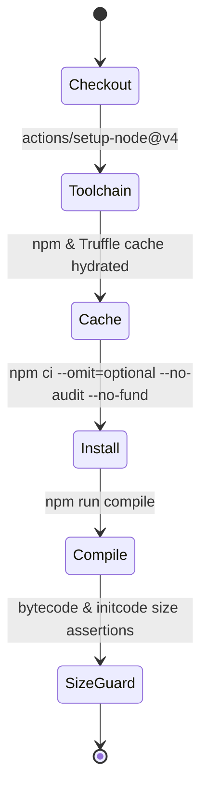
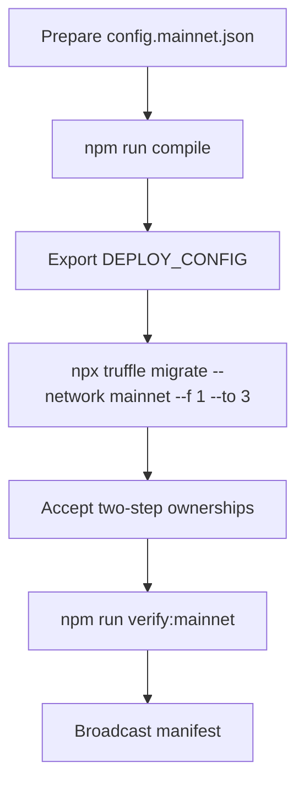

# AGIJobs Sovereign Labor v0.1

> The sovereign labor intelligence lattice engineered to command economic coordination with absolute owner authority.

---

## Table of Contents
- [Mission Trajectory](#mission-trajectory)
- [Neural Cartography](#neural-cartography)
- [Governance Spine](#governance-spine)
- [Continuous Verification](#continuous-verification)
- [Deployment Codex](#deployment-codex)
- [Owner Operations](#owner-operations)
- [Telemetry Signals](#telemetry-signals)
- [Directory Atlas](#directory-atlas)

---

## Mission Trajectory
- **Centralised leverage.** `SystemPause` owns every mutable surface while reporting to the owner Safe; one switch orchestrates pause, upgrades, and governance mutations.
- **Composable labor markets.** Registries, staking, reputation, arbitration, and tax policy interlock through deterministic interfaces so incentives can be rewritten mid-flight.
- **Immediate reconfiguration.** Each module is pausable, upgradeable, and owner-tunable, giving the platform the steering wheel of a global labor cognition engine.
- **Battle-ready CI.** Branch protection, deterministic compiles, and branch-name enforcement keep the intelligence substrate deployable by non-technical operators.

## Neural Cartography

Every module address is etched into the deployment manifest. Ownership is routed through `SystemPause`, so the owner Safe can reconfigure the entire lattice with one governance action.

## Governance Spine

Key control surfaces:
- **`SystemPause.setModules`** rewires module addresses and refreshes pauser delegates in one transaction. Requires the owner Safe.
- **`SystemPause.setGlobalPauser`** hands emergency brake authority to the guardian Safe while retaining ultimate Safe oversight.
- **`SystemPause.executeGovernanceCall`** lets the owner Safe invoke any known module setter without bespoke admin contracts.
- **Ownership topology:** every core module (`JobRegistry`, `StakeManager`, `ValidationModule`, `DisputeModule`, `PlatformRegistry`, `FeePool`, `ReputationEngine`, `ArbitratorCommittee`, `TaxPolicy`) is owned by `SystemPause`. Identity and attestation surfaces hand off to the owner Safe via two-step transfer.

## Continuous Verification

- **Sovereign Compile (ci.yml)** runs on every push and PR targeting `main`, `develop`, `feature/**`, and `release/**`. It compiles via IR, exports toolchain versions into the job summary, and asserts artifact size constraints.
- **Branch Gatekeeper (branch-checks.yml)** enforces canonical branch naming. Set it as a required status check alongside Sovereign Compile.
- **Branch protection** checklist:
  1. Require both workflow checks on `main` (and staging branches).
  2. Enforce linear history & up-to-date merges.
  3. Require ≥1 approved review.
  4. (Optional) Require signed commits for forensic parity.

## Deployment Codex

1. **Bootstrap** – `npm install --omit=optional --no-audit --no-fund`.
2. **Compile** – `npm run compile` (identical to CI).
3. **Configure** – populate `deploy/config.mainnet.json`. Fields:
   - `ownerSafe`, `guardianSafe`, `treasury`
   - `params.platformFeeBps`, `params.minStakeWei`, `params.validatorQuorum`, etc.
   - `identity` ENS roots (`agentRootNode`, `clubRootNode`) are standard ENS names; the migration auto-namehashes them.
4. **Migrate** – `DEPLOY_CONFIG=$(pwd)/deploy/config.mainnet.json npx truffle migrate --network mainnet --f 1 --to 3`.
5. **Accept ownership** – two-step contracts (`IdentityRegistry`, `AttestationRegistry`, any CoreOwnable2Step surfaces) must call `acceptOwnership` from the owner Safe.
6. **Verify** – `npm run verify:mainnet` after confirmations.

The migration writes `manifests/addresses.mainnet.json` capturing module addresses, guardians, and treasury routes for downstream automation.

## Owner Operations
- **Emergency pause:** guardian Safe calls `SystemPause.pauseAll()`; resume with `unpauseAll()`.
- **Module upgrade:** deploy replacement, transfer ownership to `SystemPause`, then call `setModules` with new address.
- **Parameter tuning:** invoke `SystemPause.executeGovernanceCall(target, abi.encodeWithSignature(...))` from the owner Safe to reach any setter.
- **Treasury routing:** `StakeManager.setTreasuryAllowlist` + `setTreasury` configure slashing payouts; `FeePool.setGovernance` remains pointed at `SystemPause` so withdrawals travel through governance.

## Telemetry Signals
- `SystemPause.ModulesUpdated`, `PausersUpdated` – canonical wiring events.
- `StakeManager.ParametersUpdated`, `TreasuryUpdated` – staking economics & treasury snapshots.
- `JobRegistry.JobCreated` / `JobFinalized` / `JobChallenged` – labor flow milestones.
- `ValidationModule.ValidatorsUpdated`, `FailoverTriggered` – validator health.
- `ReputationEngine.ScoreUpdated`, `BlacklistUpdated` – trust analytics.

## Directory Atlas
- [`contracts/`](contracts/README.md) – contract architecture, storage maps, and governance entry points.
- [`deploy/`](deploy/README.md) – migration choreography, env variables, Safe acceptance checklist.
- [`truffle/`](truffle/README.md) – project configuration, manifests, and utility scripts.
- `.github/workflows/` – CI blueprints enforcing green pipelines.

---
Harness this repository as the economic cognition engine it is: disciplined CI, single-switch governance, and owner-grade observability keep every labor market mutation under precise, sovereign control.
