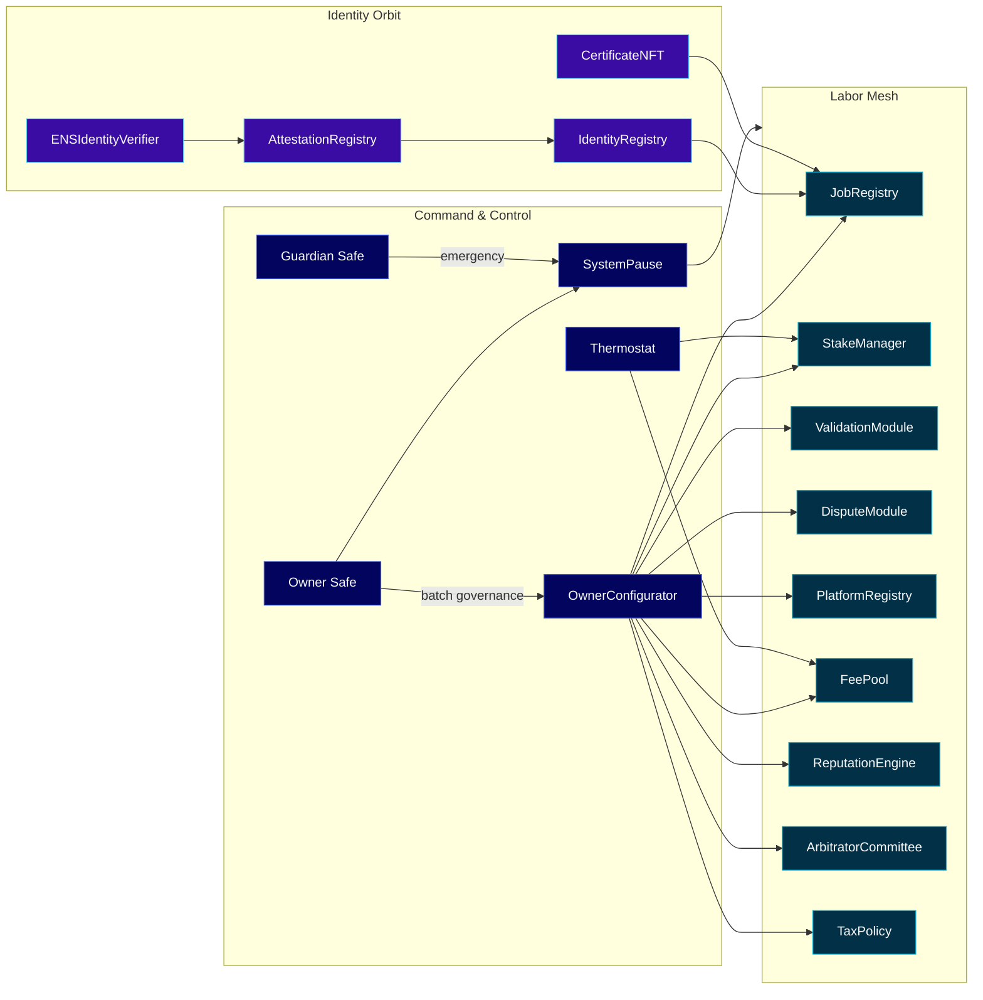
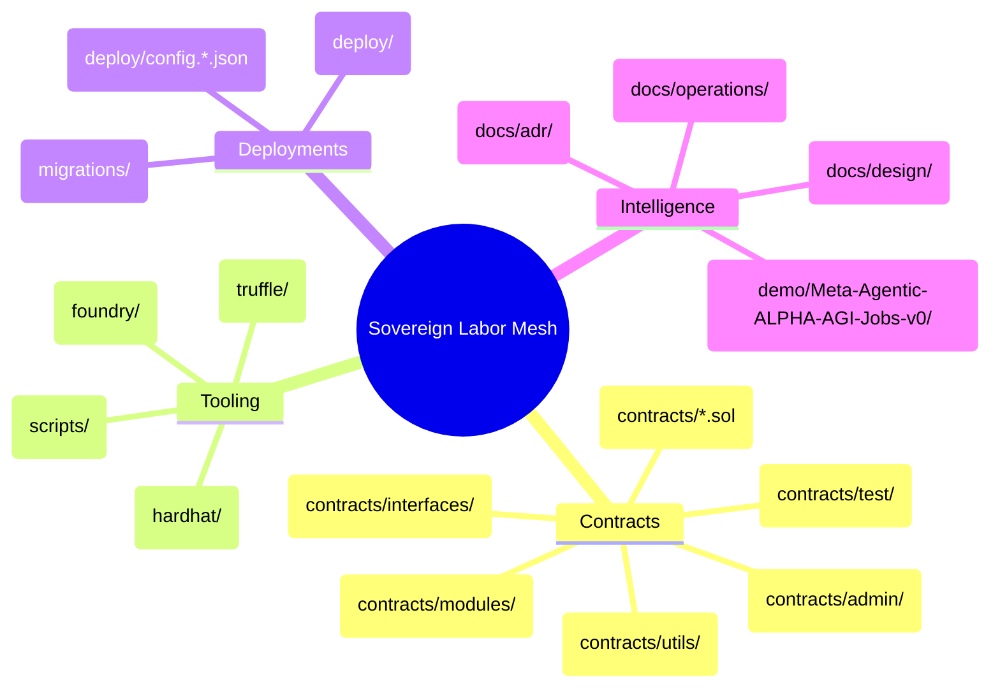
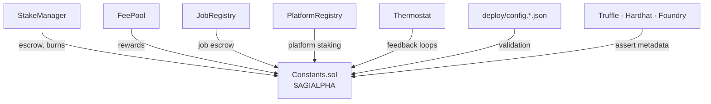
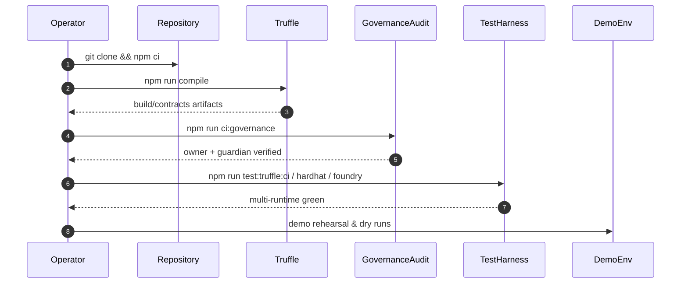
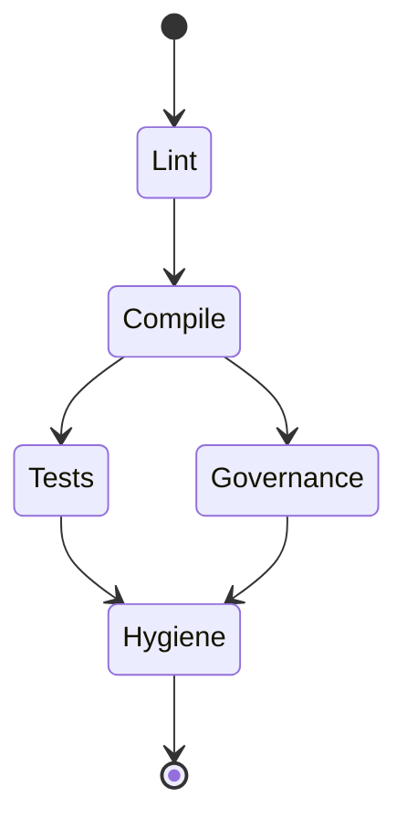
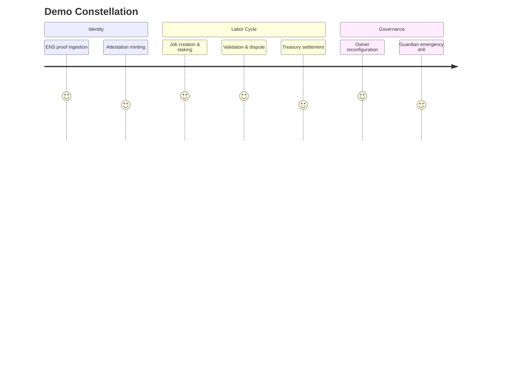

# AGIJobs Sovereign Labor v0.1

> This repository is the continuously self-governing labor machine that composes markets, compliance, and capital routing into a single command lattice. The operator speaks intent; the system orchestrates, amplifying economic gravity beyond classical competition.

---

## Table of Contents
- [Sovereign Snapshot](#sovereign-snapshot)
- [Architecture Helix](#architecture-helix)
- [$AGIALPHA Economic Spine](#agialpha-economic-spine)
- [Governance Command Authority](#governance-command-authority)
- [Repository Atlas](#repository-atlas)
- [Operational Flight Deck](#operational-flight-deck)
- [CI & Quality Constellation](#ci--quality-constellation)
- [Security & Assurance Mesh](#security--assurance-mesh)
- [Deployment Autopilot](#deployment-autopilot)
- [Demo Verse](#demo-verse)
- [Knowledge Vault](#knowledge-vault)

---

## Sovereign Snapshot

The AGIJobs sovereign labor mesh choreographs job creation, staking, validation, dispute resolution, identity proofs, reputation, treasury flows, and compliance policy with `$AGIALPHA` as the single liquidity axis. Non-technical operators can deploy, reconfigure, pause, and audit every surface by executing typed manifests, scripts, and Safe playbooks.

---

## Architecture Helix

Every subsystem is modular, observable, and governed through deterministic manifests. Contracts, tooling, docs, and runbooks mirror each other so the operator can reason about the entire machine from first principles.

---

## $AGIALPHA Economic Spine

`$AGIALPHA` (ERC-20 @ `0xa61a3b3a130a9c20768eebf97e21515a6046a1fa`, 18 decimals) is hard-wired into contract constructors, deploy manifests, and testing fixtures. The lattice refuses to operate if metadata diverges.

Key properties:
- **Immutable binding.** [`contracts/Constants.sol`](contracts/Constants.sol) pins the address, symbol, name, decimals, burn sink, and token scale at compile time.
- **Runtime guards.** Constructors in [`StakeManager`](contracts/StakeManager.sol), [`FeePool`](contracts/FeePool.sol), [`JobRegistry`](contracts/JobRegistry.sol), and allied modules assert the metadata before accepting deposits or routing rewards.
- **Deployment fails closed.** [`deploy/config.mainnet.json`](deploy/config.mainnet.json) and [`migrations/`](migrations) scripts validate `$AGIALPHA` metadata prior to ownership transfers.

---

## Governance Command Authority

The owner Safe commands every economic, identity, and pause surface. Guardians retain emergency stop privileges, but every parameter is owner-gated for fast reconfiguration.

| Surface | Owner & Guardian Controls | Notes |
| --- | --- | --- |
| [`OwnerConfigurator`](contracts/admin/OwnerConfigurator.sol) | `configure`, `configureBatch`, ownership transfer | Batches arbitrary setter calls with auditable event logs for Safe automation. |
| [`SystemPause`](contracts/SystemPause.sol) | `setModules`, `refreshPausers`, `setGlobalPauser`, `pauseAll`, `unpauseAll`, `executeGovernanceCall` | Central pause lattice validating Safe ownership and pauser delegation on every module. |
| [`StakeManager`](contracts/StakeManager.sol) | Treasury routing, fee/burn tuning, staking thresholds, pauser delegation, thermostat feeds, slash splits | Owns the staking economy exclusively in `$AGIALPHA` with invariant-driven accounting. |
| [`JobRegistry`](contracts/JobRegistry.sol) | Module pointers, ENS/attestation anchors, fee curves, acknowledgement policy, pause wiring | Controls lifecycle of work proposals, escrow, and acknowledgements. |
| [`ValidationModule`](contracts/ValidationModule.sol) & [`modules/DisputeModule`](contracts/modules/DisputeModule.sol) | Validator rosters, commit/reveal cadence, escalation parameters, pause routing | Owner can tune verification cadence; guardian pausers can stop propagation. |
| [`FeePool`](contracts/FeePool.sol) | Reward destinations, burn ratios, operator allowances, pause toggles | Ensures revenue and burns remain owner-approved. |
| [`TaxPolicy`](contracts/TaxPolicy.sol) | `setPolicyURI`, acknowledgement management, pauser handoff | Enforces compliance acknowledgements before capital flows. |
| [`PlatformRegistry`](contracts/PlatformRegistry.sol) | Stake thresholds, module wiring, enumeration policies | Governs external platform onboarding with owner-tuned parameters. |
| [`ReputationEngine`](contracts/ReputationEngine.sol) | Scoring weights, decay, attestation modules, guardian pauses | Owner tunes reputation dynamics while retaining guardian emergency brakes. |
| [`IdentityRegistry`](contracts/IdentityRegistry.sol) & [`ENSIdentityVerifier`](contracts/ENSIdentityVerifier.sol) | ENS roots, verifier hooks, attestation modules | Curates identity proofs and revocation pipelines. |
| [`AttestationRegistry`](contracts/AttestationRegistry.sol) & [`CertificateNFT`](contracts/CertificateNFT.sol) | Schema governance, issuer control, metadata URIs, mint permissions | Keeps credential issuance under direct owner command. |

Operator runbooks and Safe checklists live in [`docs/operations/owner-control.md`](docs/operations/owner-control.md).

---

## Repository Atlas

| Path | Purpose |
| --- | --- |
| [`contracts/`](contracts) | Solidity sources spanning governance, staking, reputation, compliance, identity, attestations, and utilities. |
| [`contracts/modules/`](contracts/modules) | Plug-in logic for validation and disputes invoked through `SystemPause`. |
| [`contracts/admin/`](contracts/admin) | Governance helpers for Safe-driven configuration and batched execution. |
| [`contracts/utils/`](contracts/utils) & [`contracts/libraries/`](contracts/libraries) | Shared math, guards, and access primitives. |
| [`deploy/`](deploy) | Network manifests, config schema, deployment autopilot scripts, and operator docs. |
| [`migrations/`](migrations) | Truffle migrations wiring modules, verifying `$AGIALPHA`, and performing ownership handoffs. |
| [`scripts/`](scripts) | Governance matrix validation, branch checks, deploy utilities, treasury tooling, and compile summaries. |
| [`hardhat/`](hardhat) | Hardhat tasks, tests, and network helpers for integration pipelines. |
| [`foundry/`](foundry) | Forge tests, invariants, and deployment scripts. |
| [`truffle/`](truffle) | Truffle configuration extensions and artifacts. |
| [`docs/`](docs) | Design dossiers, architecture decisions, and operational playbooks. |
| [`demo/Meta-Agentic-ALPHA-AGI-Jobs-v0/`](demo/Meta-Agentic-ALPHA-AGI-Jobs-v0) | Narrative demo environment mirroring production orchestration. |

---

## Operational Flight Deck

1. **Toolchains.** Use Node.js 20.x (`nvm use`), npm 10.x, Truffle 5.11.x, Hardhat 2.20.x, Foundry (stable). `.nvmrc`, `package.json`, and `foundry.toml` pin versions.
2. **Install dependencies.** `npm install` (or `npm ci`) provisions shared tooling for linting, testing, and deployments.
3. **Compile.** `npm run compile` generates Truffle artifacts, then `node scripts/verify-artifacts.js` verifies deterministic outputs.
4. **Run tests.** Execute:
   - `npm run test:truffle:ci`
   - `npm run test:hardhat`
   - `npm run test:foundry`
5. **Governance audit.** `npm run ci:governance` ensures owner/guardian reachability and `$AGIALPHA` invariants across manifests.
6. **Demo rehearsal.** Explore [`demo/Meta-Agentic-ALPHA-AGI-Jobs-v0`](demo/Meta-Agentic-ALPHA-AGI-Jobs-v0) for guided walkthroughs and curated data packs.

---

## CI & Quality Constellation

All pull requests must pass the full action matrix before merge; branch protection is enforced on `main` and `develop` via [`.github/settings.yml`](.github/settings.yml).

| Workflow | Purpose | Trigger |
| --- | --- | --- |
| [`ci.yml`](.github/workflows/ci.yml) | Solidity linting, Truffle compilation, artifact verification, governance audit, multi-runtime tests, workflow hygiene | Push/PR to mainline branches |
| [`security.yml`](.github/workflows/security.yml) | Slither static analysis and Mythril symbolic execution | Daily schedule + PRs |
| [`branch-checks.yml`](.github/workflows/branch-checks.yml) | Enforces branch naming policy | Push/PR |

Branch protection requires all statuses (`Sovereign Compile`, `Security Scans`, and `Branch Gatekeeper`) before merge. Admins cannot bypass checks.

---

## Security & Assurance Mesh

- **Static analysis.** [`security.yml`](.github/workflows/security.yml) runs Slither and Mythril across the contract set.
- **Governance matrix.** [`scripts/check-governance-matrix.mjs`](scripts/check-governance-matrix.mjs) verifies owner and pauser controls against compiled ABIs.
- **Deterministic builds.** [`scripts/verify-artifacts.js`](scripts/verify-artifacts.js) hashes artifacts and rejects drift.
- **Invariant testing.** [`foundry/test/StakeManagerInvariant.t.sol`](foundry/test/StakeManagerInvariant.t.sol) enforces staking conservation while paused.
- **Emergency response.** [`docs/operations/owner-control.md`](docs/operations/owner-control.md) enumerates Safe actions for pausing, rewiring, and recovery.

---

## Deployment Autopilot

1. Populate environment variables (`MAINNET_RPC`, `MNEMONIC`, Safe addresses) according to [`deploy/README.md`](deploy/README.md).
2. **Truffle mainnet deploy:** `npm run deploy:truffle:mainnet` — performs compile-all, token metadata validation, ownership transfer.
3. **Hardhat mainnet deploy:** `npm run deploy:hardhat:mainnet` — scripted equivalent with Hardhat tasks.
4. **Foundry broadcast:** `npm run deploy:foundry:mainnet` after configuring RPC and broadcast flags.
5. Post-deployment, execute [`scripts/owner-apply-validator-policy.js`](scripts/owner-apply-validator-policy.js) via Safe to install validator cadence and pauser assignments.

---

## Demo Verse

The [`demo/Meta-Agentic-ALPHA-AGI-Jobs-v0`](demo/Meta-Agentic-ALPHA-AGI-Jobs-v0) workspace mirrors production flows: curated configs, scripted walkthroughs, and scenario datasets that demonstrate identity proofs, staking, dispute arbitration, and treasury routing end to end.

---

## Knowledge Vault

- [`docs/design/`](docs/design) — architecture dossiers and subsystem walkthroughs.
- [`docs/adr/`](docs/adr) — architecture decision records.
- [`docs/operations/`](docs/operations) — Safe playbooks, runbooks, and on-call procedures.
- [`CHANGELOG.md`](CHANGELOG.md) — release notes and upgrade history.
- [`LICENSE`](LICENSE) — MIT license for the full codebase.

---

**The machine is ready for production.** Operators execute manifests; the lattice handles everything else, compounding value according to the owner's encoded policy.
