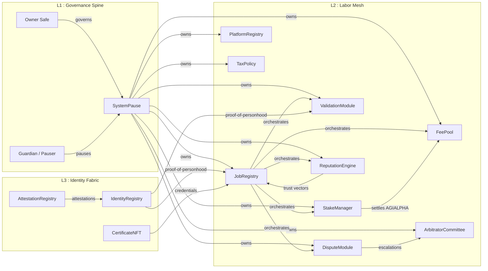
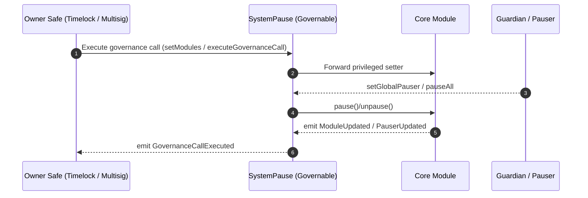
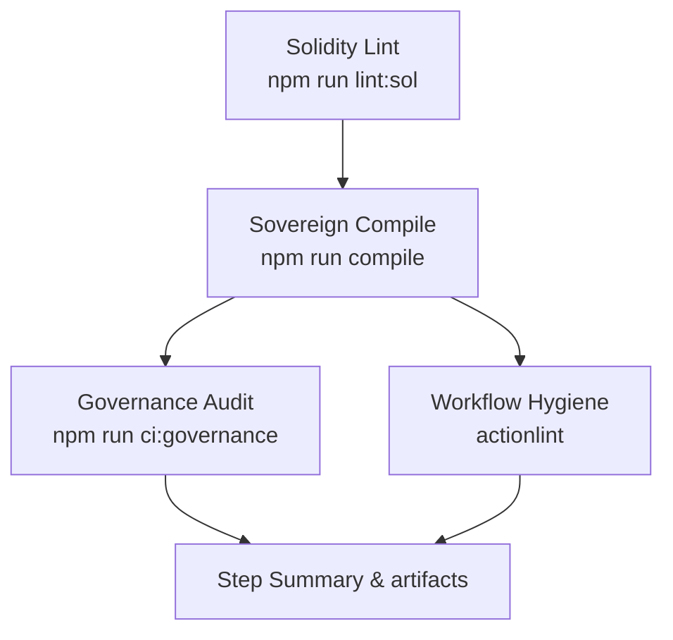
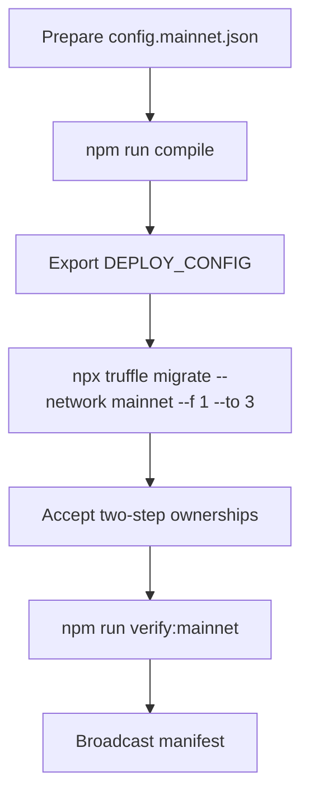

# AGIJobs Sovereign Labor v0.1

> The sovereign labor intelligence lattice engineered to command economic coordination with absolute owner authority.

---

## Table of Contents
- [Mission Trajectory](#mission-trajectory)
- [Neural Cartography](#neural-cartography)
- [Governance Spine](#governance-spine)
- [Continuous Verification](#continuous-verification)
- [Deployment Codex](#deployment-codex)
- [Owner Operations](#owner-operations)
- [Telemetry Signals](#telemetry-signals)
- [Directory Atlas](#directory-atlas)

---

## Mission Trajectory
- **Centralised leverage.** `SystemPause` owns every mutable surface while reporting to the owner Safe; one switch orchestrates pause, upgrades, and governance mutations.
- **Composable labor markets.** Registries, staking, reputation, arbitration, and tax policy interlock through deterministic interfaces so incentives can be rewritten mid-flight.
- **Immediate reconfiguration.** Each module is pausable, upgradeable, and owner-tunable, giving the platform the steering wheel of a global labor cognition engine.
- **Battle-ready CI.** Branch protection, deterministic compiles (`npm ci` + `npm run compile`), and branch-name enforcement keep the intelligence substrate deployable by non-technical operators.
- **Singular token rail.** Every fee and reward flows through immutable `$AGIALPHA` (0xa61a3b3a130a9c20768eebf97e21515a6046a1fa), locking economics to the mainnet anchor.

## Neural Cartography

Every module address is etched into the deployment manifest. Ownership is routed through `SystemPause`, so the owner Safe can reconfigure the entire lattice with one governance action.

## Governance Spine

Key control surfaces:
- **`SystemPause.setModules`** rewires module addresses and refreshes pauser delegates in one transaction. Requires the owner Safe.
- **`SystemPause.setGlobalPauser`** hands emergency brake authority to the guardian Safe while retaining ultimate Safe oversight.
- **`SystemPause.executeGovernanceCall`** lets the owner Safe invoke any known module setter without bespoke admin contracts.
- **Ownership topology:** every core module (`JobRegistry`, `StakeManager`, `ValidationModule`, `DisputeModule`, `PlatformRegistry`, `FeePool`, `ReputationEngine`, `ArbitratorCommittee`, `TaxPolicy`) is owned by `SystemPause`. Identity and attestation surfaces hand off to the owner Safe via two-step transfer.

## Continuous Verification

- **Solidity Lint** guards every Solidity surface with `solhint --max-warnings=0`. The summary attaches to the PR so reviewers can see lint success without digging into logs.
- **Sovereign Compile** (ci.yml) locks Node.js 20.x, hydrates deterministic caches, runs `npm ci --omit=optional --no-audit --no-fund`, `npm run compile`, and `node scripts/verify-artifacts.js`, then archives `build/contracts` for downstream audits.
- **Governance Surface Audit** consumes the compiled artifacts and executes `npm run ci:governance`, confirming every owner/pauser setter and `$AGIALPHA` constant matches `deploy/config.mainnet.json`.
- **Workflow Hygiene** runs [`actionlint`](https://github.com/rhysd/actionlint) on every push so GitHub workflow syntax errors never make it into `main`.
- **Branch Gatekeeper** (branch-checks.yml) enforces canonical branch naming and is required alongside the CI workflow.
- **Branch protection checklist:** mark the following statuses as required on `main` (and staging branches):
  1. `Sovereign Compile / Solidity lint`
  2. `Sovereign Compile / Compile smart contracts`
  3. `Sovereign Compile / Governance surface audit`
  4. `Sovereign Compile / Workflow hygiene`
  5. `Branch Gatekeeper / Validate branch naming conventions`
  6. Require ≥1 approving review, up-to-date merges, and optionally signed commits for forensic parity.

## Deployment Codex

1. **Bootstrap** – `npm install --omit=optional --no-audit --no-fund`.
2. **Lint** – `npm run lint:sol` to catch Solidity regressions locally before CI.
3. **Compile** – `npm run compile` (identical to CI).
4. **Configure** – populate `deploy/config.mainnet.json`. Fields:
   - `ownerSafe`, `guardianSafe`, `treasury`
   - `params.platformFeeBps`, `params.minStakeWei`, `params.validatorQuorum`, etc.
   - `identity` ENS roots (`agentRootNode`, `clubRootNode`) are standard ENS names; the migration auto-namehashes them.
5. **Governance audit** – `npm run ci:governance` to assert owner setters and `$AGIALPHA` wiring before broadcasting.
6. **Migrate** – `DEPLOY_CONFIG=$(pwd)/deploy/config.mainnet.json npx truffle migrate --network mainnet --f 1 --to 3`.
7. **Accept ownership** – two-step contracts (`IdentityRegistry`, `AttestationRegistry`, any CoreOwnable2Step surfaces) must call `acceptOwnership` from the owner Safe.
8. **Verify** – `npm run verify:mainnet` after confirmations.

The migration writes `manifests/addresses.mainnet.json` capturing module addresses, guardians, and treasury routes for downstream automation.

## Owner Operations
- **Emergency pause:** guardian Safe calls `SystemPause.pauseAll()`; resume with `unpauseAll()`.
- **Module upgrade:** deploy replacement, transfer ownership to `SystemPause`, then call `setModules` with new address.
- **Parameter tuning:** invoke `SystemPause.executeGovernanceCall(target, abi.encodeWithSignature(...))` from the owner Safe to reach any setter.
- **Treasury routing:** `StakeManager.setTreasuryAllowlist` + `setTreasury` configure slashing payouts; `FeePool.setGovernance` remains pointed at `SystemPause` so withdrawals travel through governance.
- **Governance matrix audit:** run `npm run ci:governance` whenever modules change to auto-verify that every owner setter, pauser, and `$AGIALPHA` constant matches the production config.

## Telemetry Signals
- `SystemPause.ModulesUpdated`, `PausersUpdated` – canonical wiring events.
- `StakeManager.ParametersUpdated`, `TreasuryUpdated` – staking economics & treasury snapshots.
- `JobRegistry.JobCreated` / `JobFinalized` / `JobChallenged` – labor flow milestones.
- `ValidationModule.ValidatorsUpdated`, `FailoverTriggered` – validator health.
- `ReputationEngine.ScoreUpdated`, `BlacklistUpdated` – trust analytics.

## Directory Atlas
- [`contracts/`](contracts/README.md) – contract architecture, storage maps, and governance entry points.
- [`deploy/`](deploy/README.md) – migration choreography, env variables, Safe acceptance checklist.
- [`truffle/`](truffle/README.md) – project configuration, manifests, and utility scripts.
- `.github/workflows/` – CI blueprints enforcing green pipelines.

---
Harness this repository as the economic cognition engine it is: disciplined CI, single-switch governance, and owner-grade observability keep every labor market mutation under precise, sovereign control.
