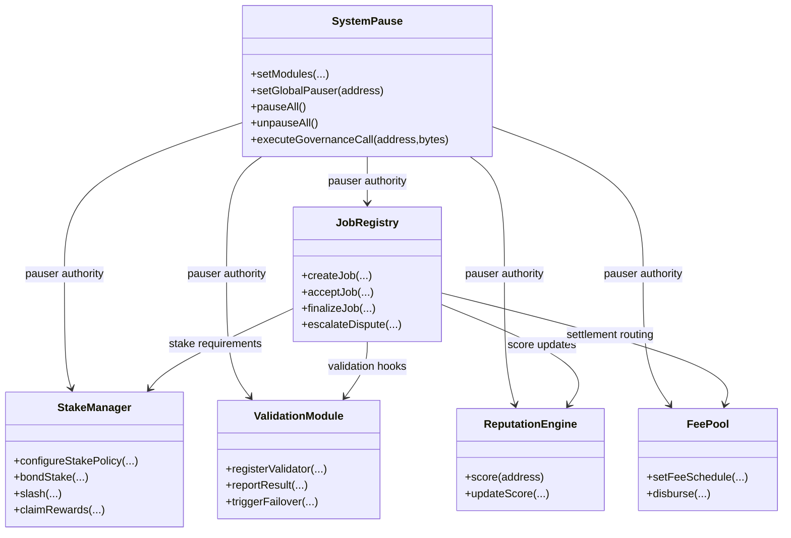
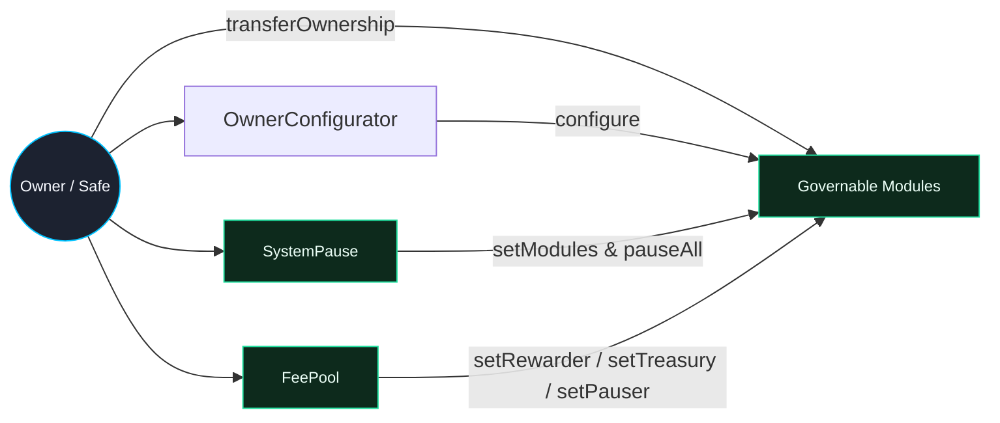

# Contracts Atlas

> This directory is the command lattice for the labor intelligence engine; every contract is owned, pausable, and awaiting operator intent.

## Storage & Upgrade Philosophy
- Every contract inherits [`Governable.sol`](../contracts/Governable.sol) so governance is timelock-controlled and exposes `owner()` for compatibility.
- Custom errors minimize bytecode while conveying precise failure modes.
- `SystemPause` owns all managed modules, ensuring owner-triggered upgrades and pausability cascade across the mesh.
- Owner-configurable parameters are intentionally surfaced via `OwnerConfigurator`, empowering the contract owner to hot-swap validation curves, staking ratios, taxation, pauser delegates, metadata registries, and dispute flows without redeploying.

## Module Notes
- **JobRegistry**: Orchestrates job lifecycle, dispute escalations, tax acknowledgements, and fee routing. Emits dense telemetry for analytics. Owner setters reshape job templates, arbitration committees, metadata, and job economics.
- **StakeManager**: Maintains validator and worker collateral, slash conditions, epoch rewards, and treasury integrations. Owner functions govern ratios, rewards, and validator registries.
- **ValidationModule**: Handles validator enrollment, result aggregation, and failover controls. Owner may rotate validators, scoring weights, and slashing hooks.
- **DisputeModule**: Isolates arbitration, committee membership, and appeals. Works in tandem with `ArbitratorCommittee` and `SystemPause` for escalations.
- **ReputationEngine**: Aggregates multi-dimensional trust vectors, supports operator adjustments, and exposes events for off-chain ranking engines.
- **FeePool** & **TaxPolicy**: Route settlements, taxes, and treasury splits with owner-calibrated coefficients.

## Governance Access Patterns
| Contract | Privileged Entry Points |
| --- | --- |
| `SystemPause` | `setModules`, `refreshPausers`, `setGlobalPauser`, `executeGovernanceCall`, `pauseAll`, `unpauseAll`. |
| `JobRegistry` | Extensive owner setters for job templates, arbitration policies, fee gradients, metadata registries. |
| `StakeManager` | Owner functions for collateral ratios, reward emission, slash penalties, validator registries, treasury sinks. |
| `ValidationModule` | Owner functions for validator sets, scoring weights, failover strategy. |
| `FeePool` | Owner functions for distribution tables, treasury addresses, sweep logic. |
| `ReputationEngine` | Owner functions for scoring coefficients, decays, and aggregator addresses. |

## Owner Override Field Diagram

Every solid line in the diagram corresponds to callable functions exposed to the owner for runtime control—pausing, parameter tuning, treasury assignment, validator rotation, and reward distribution.

## Extensibility Hooks
- Libraries under `libraries/` expose math, guard, and string utilities reused across modules to shrink bytecode.
- Interfaces in `interfaces/` define minimal ABI surfaces for cross-contract messaging, aiding verification and proxy compatibility.
- Modules under `modules/` encapsulate optional behaviors (e.g., disputes) and are owned by `SystemPause` for hot-swapping.

For full symbol references, inspect the JSON artifacts under `build/contracts/` after running `npm run compile`.
