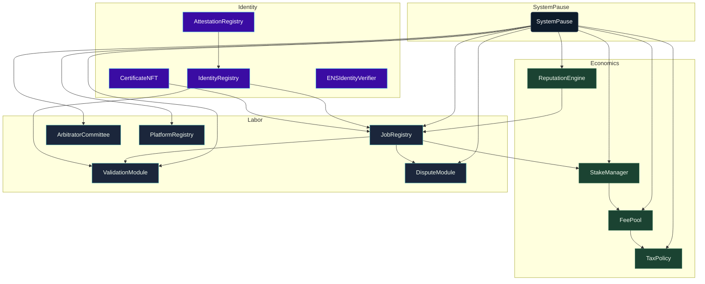

# Sovereign Labor Contract Codex

> These contracts form the controllable labor intelligence kernel. They were engineered so the owner Safe can steer staking, disputes, attestations, economics, and telemetry with surgical precision while CI keeps every privilege visible.

---

## Table of Contents
1. [Contract Constellation](#contract-constellation)
2. [Governance Lattice](#governance-lattice)
3. [Module Capability Matrix](#module-capability-matrix)
4. [Economic & Identity Invariants](#economic--identity-invariants)
5. [CI & Test Harness](#ci--test-harness)
6. [Deployment Integration](#deployment-integration)
7. [Directory Index](#directory-index)
8. [Telemetry Signals](#telemetry-signals)

---

## Contract Constellation

Every arrow is enforced through explicit setter calls inside migrations and autopilot scripts. If a module loses ownership or pointer alignment, deployments revert and CI flags the deviation.

---

## Governance Lattice
- [`Governable`](Governable.sol) wraps OpenZeppelin's `TimelockController` to force every privileged call through the owner Safe.
- [`SystemPause`](SystemPause.sol) is the single point of authority. It validates module ownership, delegates a guardian pauser, and forwards arbitrary governance calls with event-level telemetry (`GovernanceCallExecuted`).
- [`CoreOwnable2Step`](utils/CoreOwnable2Step.sol) underpins modules that need direct owner control (e.g., `TaxPolicy`, identity contracts) so the owner Safe can accept ownership with two-step safety.
- [`OwnerConfigurator`](admin/OwnerConfigurator.sol) emits `ParameterUpdated` events for every configuration change, providing a natural audit log.

---

## Module Capability Matrix
| Contract | Key Capabilities | Owner Path |
| --- | --- | --- |
| [`SystemPause`](SystemPause.sol) | `setModules`, `setGlobalPauser`, `refreshPausers`, `pauseAll`, `unpauseAll`, `executeGovernanceCall` | Owner Safe → Timelock → SystemPause |
| [`StakeManager`](StakeManager.sol) | Stake accounting, slashing splits, treasury routing, guardian-controlled pause | SystemPause executes owner-only setters (`setTreasury`, `setRoleMinimums`, etc.) |
| [`FeePool`](FeePool.sol) | Fee distribution, burn percentages, treasury allowlist, tax policy pointer | Owner Safe adjusts `setTaxPolicy`, `setTreasury`, `setGovernance` via SystemPause |
| [`JobRegistry`](JobRegistry.sol) | Job lifecycle, reward calculation, staking requirements | Owner Safe updates `setTaxPolicy`, `setValidationModule`, `applyConfiguration` |
| [`ValidationModule`](ValidationModule.sol) | Validator selection, quorum configuration, identity alignment | Owner Safe tunes `setStakeManager`, `setSelectionStrategy`, `setRandaoCoordinator` |
| [`DisputeModule`](modules/DisputeModule.sol) | Arbitration fees/windows, committee routing, tax policy pointer | Owner Safe adjusts `setCommittee`, `setDisputeFee`, `setTaxPolicy` |
| [`PlatformRegistry`](PlatformRegistry.sol) | Platform registrar, blacklist, stake minimums | Owner Safe controls `setRegistrar`, `setMinPlatformStake`, `applyConfiguration` |
| [`ReputationEngine`](ReputationEngine.sol) | Scoring weights, caller allowlist, validation reward percentages | Owner Safe calls `setCaller`, `setScoringWeights`, `setValidationRewardPercentage` |
| [`ArbitratorCommittee`](ArbitratorCommittee.sol) | Committee membership, commit/reveal windows, absentee slashing | Owner Safe adjusts commit windows and slash weights |
| [`TaxPolicy`](TaxPolicy.sol) | Policy URI, acknowledgement text, acknowledger permissions, revocations | Owner Safe updates text and permissions directly |
| [`IdentityRegistry`](IdentityRegistry.sol) | ENS-based identity assignment, Merkle roots, attestation registry pointer | Owner Safe updates nodes and root hashes |

`SystemPause` owns every module listed above; the governance matrix script fails CI if any privilege or event is removed.

---

## Economic & Identity Invariants
- **Canonical token:** `$AGIALPHA` is hard-coded to `0xa61a3b3a130a9c20768eebf97e21515a6046a1fa` with 18 decimals. [`Constants.sol`](Constants.sol) and [`scripts/deploy/load-config.js`](../scripts/deploy/load-config.js) enforce the binding across migrations.
- **Manifest-driven economics:** The manifest controls `platformFeeBps`, `burnBpsOfFee`, `slashBps`, `validatorQuorum`, and stake minimums. Each setter reverts if percentages exceed 100% or violate required multiples.
- **Identity authenticity:** ENS node hashes and Merkle roots are validated at deploy time (Foundry uses `vm.ensNamehash`; Hardhat + Truffle compute via `eth-ens-namehash`). Any divergence aborts the deployment.
- **Pause safety:** Guardian Safe retains `pauseAll()` while the owner Safe alone can `unpauseAll()`. Every module exposes per-module `pause`/`unpause` functions to support targeted freezes through governance calls.

---

## CI & Test Harness
- **Solhint lint:** `npm run lint:sol` enforces zero-warning policy (`.solhint.json`).
- **Compilation:** Truffle compiles with `solc 0.8.30` (`viaIR`, `optimizer runs=5`). [`scripts/verify-artifacts.js`](../scripts/verify-artifacts.js) ensures artifacts stay newer than their sources.
- **Governance audit:** `npm run ci:governance` parses `build/contracts` and verifies every owner or pauser function remains reachable.
- **Tests:**
  - [`truffle/test`](../truffle/test) harnesses confirm staking, governance routing, and job flows.
  - [`hardhat/test/systemPause.control.spec.js`](../hardhat/test/systemPause.control.spec.js) impersonates the Safe, testing `executeGovernanceCall` on treasuries, tax policy, and pause cycles.
  - [`foundry/test`](../foundry/test) fuzzes invariants around pauses, slashing splits, and stake balances.
- **Security workflows:** [`security.yml`](../.github/workflows/security.yml) runs Slither and Mythril against all privileged contracts weekly and on every PR.

---

## Deployment Integration
- **Truffle:** [`migrations/`](../migrations) call every setter in sequence, transfer ownership to SystemPause, delegate the guardian pauser, and hand identity contracts to the owner Safe.
- **Hardhat:** [`hardhat/scripts/deploy-mainnet.js`](../hardhat/scripts/deploy-mainnet.js) mirrors the migrations with `ethers` factories and writes manifests via `truffle/util/writeManifest`.
- **Foundry:** [`foundry/script/DeployMainnet.s.sol`](../foundry/script/DeployMainnet.s.sol) validates manifests, ENS nodes, and token metadata before broadcasting via `forge script`.
- **Package scripts:** `npm run deploy:truffle:mainnet`, `npm run deploy:hardhat:mainnet`, and `npm run deploy:foundry:mainnet` provide non-technical operators with a single command per toolchain.

---

## Directory Index
- [`admin/`](admin) – Governance helpers (`OwnerConfigurator`, manifest utilities).
- [`interfaces/`](interfaces) – Contract interfaces for cross-module orchestration.
- [`libraries/`](libraries) – Shared math/util libraries.
- [`modules/`](modules) – Specialized submodules (e.g., `DisputeModule`).
- [`test/`](test) – Solidity harnesses used by Truffle/Foundry tests.
- [`utils/`](utils) – Ownership primitives (`CoreOwnable2Step`, `SafeAccessControl`).

---

## Telemetry Signals
- **Events:** `ModulesUpdated`, `GovernanceCallExecuted`, `Paused`, `Unpaused`, `ParameterUpdated`, and module-specific configuration events.
- **Scripts:** `owner-set-treasury.js` and OwnerConfigurator manifests emit Markdown logs and Safe calldata for archival.
- **Evidence:** Each deployment writes `manifests/addresses.<network>.json` capturing owner Safe, guardian Safe, treasury, and contract addresses for after-action reviews.

This codex describes the same engine that operators wield in production—CI keeps it verifiable, and the owner Safe keeps it obedient.
