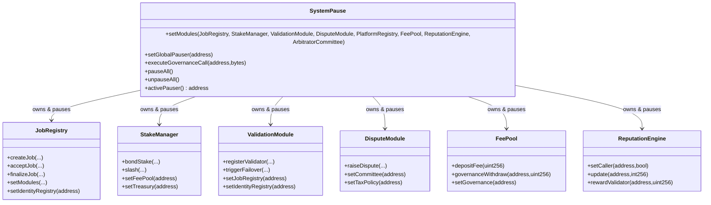
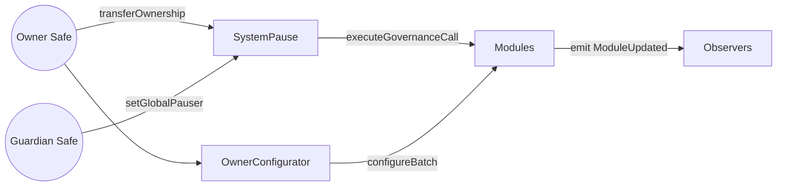

# Contracts Atlas

> The solidity core is a tightly-governed mesh—every mutable surface routes through `SystemPause`, the owner-controlled command relay.

## Ownership Topology
- `SystemPause` owns **all** runtime-critical modules (registry, staking, validation, dispute, platform, fee, reputation, committee, tax policy).
- The owner Safe governs `SystemPause`; the guardian Safe receives pauser powers via `setGlobalPauser`.
- Identity and attestation registries are transferred to the owner Safe via `CoreOwnable2Step`; the migration queues `transferOwnership` so the Safe can `acceptOwnership` post-deployment.

## Module Synopsis
| Contract | Purpose | Owner Surfaces |
| --- | --- | --- |
| `SystemPause` | Aggregates ownership, pausing, and governance forwarding. | `setModules`, `setGlobalPauser`, `refreshPausers`, `executeGovernanceCall`, `pauseAll`, `unpauseAll`. |
| `JobRegistry` | Orchestrates job lifecycle, taxation acknowledgements, arbitration escalations, and settlement routing. | `setModules`, `setIdentityRegistry`, `setDisputeModule`, `setValidationModule`, parameter setters for fees, deadlines, templates. |
| `StakeManager` | Manages AGIALPHA collateral, slashing, validator pools, and treasury routing. | `setJobRegistry`, `setDisputeModule`, `setFeePool`, `setTreasury`, `setRoleMinimums`, `setRewardCurves`. |
| `ValidationModule` | Coordinates validator selection, commit/reveal windows, failover logic. | `setJobRegistry`, `setStakeManager`, `setIdentityRegistry`, `setReputationEngine`, `setValidatorPool`, `setRandaoCoordinator`. |
| `DisputeModule` | Handles dispute fees, committee escalation, and tax policy linkage. | `setJobRegistry`, `setStakeManager`, `setCommittee`, `setTaxPolicy`, `setDisputeFee`, `setDisputeWindow`. |
| `FeePool` | Receives job fees, burns configured percentages, and streams rewards. | `setStakeManager`, `setRewardRole`, `setTaxPolicy`, `setTreasuryAllowlist`, `setTreasury`, `setGovernance`, `setPauserManager`. |
| `ReputationEngine` | Maintains trust vectors and exposes programmable scoring. | `setCaller`, `setStakeManager`, `setScoringWeights`, `setDecay`, `blacklist`. |
| `ArbitratorCommittee` | Seats jurors and processes dispute verdicts. | `setDisputeModule`, `setCommitRevealWindows`, `setAbsenteeSlash`, `pause`. |
| `TaxPolicy` | Stores canonical tax acknowledgement metadata. | Two-step `transferOwnership` / `acceptOwnership`, `setPolicyUri`, `setDescription`. |

## Governance Routines

- **Upgrade:** Deploy replacement contract → `transferOwnership(SystemPause)` → `SystemPause.setModules` with new address.
- **Parameter change:** Encode calldata and call `SystemPause.executeGovernanceCall(target, data)` from the owner Safe.
- **Emergency pause:** Guardian Safe invokes `SystemPause.pauseAll()`; resume with `unpauseAll()`.

## Storage & Bytecode Discipline
- All contracts use custom errors, unchecked arithmetic where safe, and shared libraries from `libraries/` to stay under EIP-170 limits.
- `Governable` surfaces expose `owner()` for compatibility while enforcing Timelock discipline.
- Events include precise deltas so off-chain automation can reconcile state without expensive reads.

## Extensibility Hooks
- Interfaces under `interfaces/` define the minimum ABI for external integrations (staking, reputation, dispute, identity, FeePool).
- Utility contracts under `utils/` provide reusable Ownable2Step, math, and guard constructs.
- Modules in `modules/` (e.g. `DisputeModule`) can be hot-swapped through `SystemPause.setModules` with no downtime.

Compile artifacts live in `build/contracts/` after `npm run compile` and mirror the exact ABI/bytecode consumed by CI and deployment.
