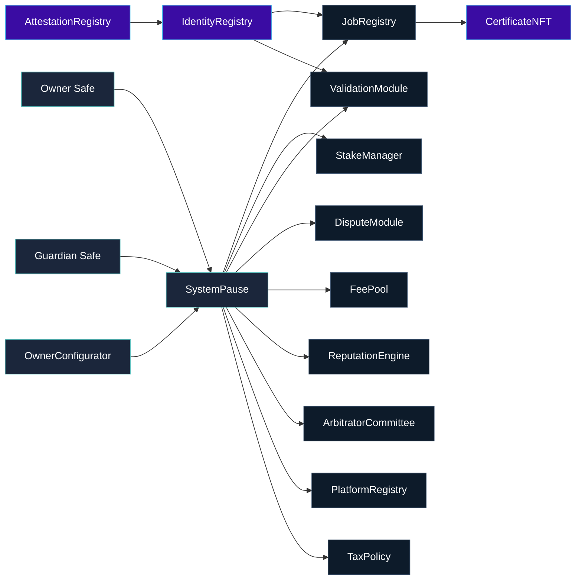

# Contracts Atlas

> Every contract orbits `SystemPause`, giving the owner Safe full command over pausing, reconfiguration, and upgrades while preserving an auditable spine.

---

## Governance Spine

Identity contracts transfer to the owner Safe so operators accept ownership directly through Safe UI flows. All other modules remain under `SystemPause` to guarantee coordinated pause/unpause and upgrade execution.

## Owner Surfaces by Module

| Contract | Purpose | Owner & Pauser Surfaces |
| --- | --- | --- |
| `SystemPause` | Governance router, pause switch, upgrade dispatcher. | `setModules`, `setGlobalPauser`, `refreshPausers`, `executeGovernanceCall`, `pauseAll`, `unpauseAll`, `transferOwnership`, `owner`. |
| `JobRegistry` | Job lifecycle, staking orchestration, dispute hooks. | `setValidationModule`, `setIdentityRegistry`, `setDisputeModule`, `setFeePool`, `setTaxPolicy`, `setStakeManager`, `setPauser`, `setPauserManager`, `applyConfiguration`, `pause`, `unpause`, `transferOwnership`, `owner`. |
| `StakeManager` | `$AGIALPHA` staking, slashing, treasury routing. | `setFeePool`, `setDisputeModule`, `setValidationModule`, `setJobRegistry`, `setTreasury`, `setTreasuryAllowlist`, `setRoleMinimums`, `applyConfiguration`, `pause`, `unpause`, `transferOwnership`, `owner`. |
| `ValidationModule` | Validator selection, commit/reveal governance, failovers. | `setStakeManager`, `setIdentityRegistry`, `setReputationEngine`, `setRandaoCoordinator`, `setSelectionStrategy`, `setPauser`, `setPauserManager`, `pause`, `unpause`, `transferOwnership`, `owner`. |
| `DisputeModule` | Arbitration economics and committee coordination. | `setStakeManager`, `setJobRegistry`, `setCommittee`, `setTaxPolicy`, `setDisputeFee`, `setDisputeWindow`, `setPauser`, `setPauserManager`, `pause`, `unpause`, `transferOwnership`, `owner`. |
| `PlatformRegistry` | Platform onboarding, staking minimums, registrar authority. | `setStakeManager`, `setReputationEngine`, `setMinPlatformStake`, `setRegistrar`, `setBlacklist`, `applyConfiguration`, `setPauser`, `setPauserManager`, `pause`, `unpause`, `transferOwnership`, `owner`. |
| `FeePool` | Fee custody, burns, treasury payouts. | `applyConfiguration`, `setGovernance`, `setStakeManager`, `setTaxPolicy`, `setTreasury`, `setTreasuryAllowlist`, `setRewardRole`, `setPauser`, `setPauserManager`, `pause`, `unpause`, `transferOwnership`, `owner`. |
| `ReputationEngine` | Reputation weighting and validator incentives. | `setCaller`, `setStakeManager`, `setScoringWeights`, `setBlacklist`, `setValidationRewardPercentage`, `setPauser`, `setPauserManager`, `pause`, `unpause`, `transferOwnership`, `owner`. |
| `ArbitratorCommittee` | Commit/reveal windows, juror governance. | `setDisputeModule`, `setCommitRevealWindows`, `setAbsenteeSlash`, `setPauser`, `setPauserManager`, `pause`, `unpause`, `transferOwnership`, `owner`. |
| `TaxPolicy` | Policy metadata and acknowledgement registry. | `setPolicyURI`, `setPolicy`, `setAcknowledgement`, `setAcknowledger`, `setAcknowledgers`, `revokeAcknowledgement`, `transferOwnership`, `owner`. |
| `IdentityRegistry` | ENS-integrated identity proofs. | Owner Safe accepts ownership; setters include `setAttestationRegistry`, `setAgentMerkleRoot`, `setValidatorMerkleRoot`, `setClubMerkleRoot`, `pause`, `unpause`, `transferOwnership`, `owner`. |
| `AttestationRegistry` | ENS-backed attestations. | Owner Safe controls `setENSRegistry`, `setNameWrapper`, `setController`, `pause`, `unpause`, `transferOwnership`, `owner`. |
| `CertificateNFT` | Credential NFT minted on job completion. | Owner Safe can `setJobRegistry`, `setBaseURI`, `pause`, `unpause`, `transferOwnership`, `owner`. |

[`scripts/check-governance-matrix.mjs`](../scripts/check-governance-matrix.mjs) asserts this table inside CI so any missing setter or pauser fails `Sovereign Compile`.

## `$AGIALPHA` Discipline
- [`Constants.sol`](Constants.sol) hardcodes `$AGIALPHA` with 18 decimals (`TOKEN_SCALE = 1e18`).
- `StakeManager` and `FeePool` validate `IERC20Metadata.decimals()` during construction and refuse mismatched tokens.
- `FeePool` burns and redistributes fees using accumulator math with `ACCUMULATOR_SCALE = 1e12` for precise payouts.
- Migrations (`1_deploy_kernel.js` and `3_mainnet_finalize.js`) check the FeePool token against the config and block deployment if a wrong address appears.

## Identity & Attestation Orbit
- `IdentityRegistry` wires ENS (`ensRegistry`, `nameWrapper`), merkle roots, and attestation registry; Safe acceptance is required for final ownership.
- `AttestationRegistry` exposes `setController` so the owner can rotate controllers without redeploying.
- `CertificateNFT` inherits from OpenZeppelin ERC721 and restricts minting to `JobRegistry`; the owner can update metadata via `setBaseURI`.

## Pause & Upgrade Playbook
1. **Emergency pause.** Guardian Safe calls `SystemPause.pauseAll()`. Resume with the owner Safe via `unpauseAll()` once mitigations land.
2. **Parameter tuning.** Encode setter calldata (e.g., `StakeManager.setTreasury`) and send through `OwnerConfigurator.configure` or `SystemPause.executeGovernanceCall`.
3. **Module upgrade.** Deploy the replacement module, transfer its ownership to `SystemPause`, call `setModules`, and confirm `ModulesUpdated` + `PausersUpdated` events.
4. **Treasury rotation.** Allowlist the new treasury in `StakeManager` and `FeePool` (`setTreasuryAllowlist`) before switching `setTreasury`.

## Directory Signals
- [`admin/`](admin) – `OwnerConfigurator` and future governance helpers.
- [`interfaces/`](interfaces) – ABI surfaces used by cross-module calls and migrations.
- [`libraries/`](libraries) – Math/util libraries (e.g., `TaxAcknowledgement`).
- [`modules/`](modules) – Specialized module implementations (e.g., `DisputeModule`).
- [`utils/`](utils) – Ownership primitives such as `CoreOwnable2Step`.

The contract layer is designed so the owner can redirect any vector (pause state, parameters, treasuries, identity controls) with a single Safe transaction, and every change emits structured events for downstream analytics.
