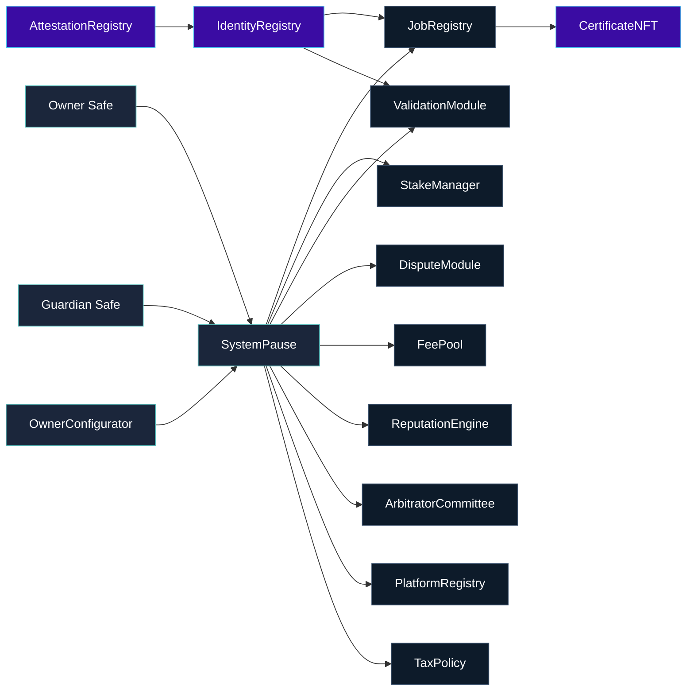
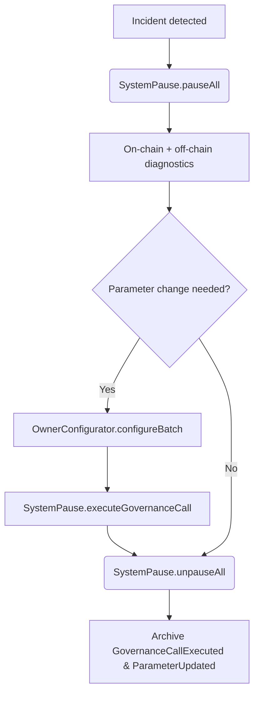

# Contracts Atlas

> Every contract orbits `SystemPause`, giving the owner Safe absolute leverage over pausing, reconfiguration, and upgrades.

---

## Governance Spine

Identity-facing contracts transfer to the owner Safe for direct Safe-level governance while staying wired into the pause mesh. All other surfaces remain under `SystemPause` custody for synchronized pausing and upgrade routing.

## Owner Surfaces by Module

| Contract | Purpose | Owner & Pauser Surfaces |
| --- | --- | --- |
| `SystemPause` | Governance router, pause switch, upgrade dispatcher. | `setModules`, `setGlobalPauser`, `refreshPausers`, `executeGovernanceCall`, `pauseAll`, `unpauseAll`, `transferOwnership`, `owner`. |
| `JobRegistry` | Job lifecycle, staking orchestration, dispute hooks. | `setValidationModule`, `setIdentityRegistry`, `setDisputeModule`, `setFeePool`, `setTaxPolicy`, `setStakeManager`, `setPauser`, `setPauserManager`, `applyConfiguration`, `pause`, `unpause`, `transferOwnership`, `owner`. |
| `StakeManager` | `$AGIALPHA` staking, slashing, treasury routing. | `setFeePool`, `setJobRegistry`, `setValidationModule`, `setDisputeModule`, `setTreasury`, `setTreasuryAllowlist`, `setRoleMinimums`, `applyConfiguration`, `pause`, `unpause`, `transferOwnership`, `owner`. |
| `ValidationModule` | Validator selection, commit/reveal governance, failovers. | `setStakeManager`, `setIdentityRegistry`, `setReputationEngine`, `setRandaoCoordinator`, `setSelectionStrategy`, `setPauser`, `setPauserManager`, `pause`, `unpause`, `transferOwnership`, `owner`. |
| `DisputeModule` | Dispute economics and committee linkage. | `setStakeManager`, `setJobRegistry`, `setCommittee`, `setTaxPolicy`, `setDisputeFee`, `setDisputeWindow`, `setPauser`, `setPauserManager`, `pause`, `unpause`, `transferOwnership`, `owner`. |
| `PlatformRegistry` | Platform onboarding, staking minimums, registrar control. | `setStakeManager`, `setReputationEngine`, `setMinPlatformStake`, `setRegistrar`, `setBlacklist`, `applyConfiguration`, `setPauser`, `setPauserManager`, `pause`, `unpause`, `transferOwnership`, `owner`. |
| `FeePool` | Fee custody, burns, treasury payouts. | `setGovernance`, `setStakeManager`, `setTaxPolicy`, `setTreasury`, `setTreasuryAllowlist`, `setRewardRole`, `applyConfiguration`, `setPauser`, `setPauserManager`, `pause`, `unpause`, `transferOwnership`, `owner`. |
| `ReputationEngine` | Reputation weighting and validator incentives. | `setCaller`, `setStakeManager`, `setScoringWeights`, `setBlacklist`, `setValidationRewardPercentage`, `setPauser`, `setPauserManager`, `pause`, `unpause`, `transferOwnership`, `owner`. |
| `ArbitratorCommittee` | Commit/reveal windows, juror governance. | `setDisputeModule`, `setCommitRevealWindows`, `setAbsenteeSlash`, `setPauser`, `setPauserManager`, `pause`, `unpause`, `transferOwnership`, `owner`. |
| `TaxPolicy` | Policy metadata and acknowledgement registry. | `setPolicyURI`, `setAcknowledgement`, `setPolicy`, `setAcknowledger`, `setAcknowledgers`, `revokeAcknowledgement`, `transferOwnership`, `owner`. |
| `IdentityRegistry` | ENS-integrated identity proofs. | Owner Safe accepts ownership; setters include `setAttestationRegistry`, `setAgentMerkleRoot`, `setValidatorMerkleRoot`, `setClubMerkleRoot`. |
| `AttestationRegistry` | ENS-backed attestations. | Owner Safe controls `setENSRegistry`, `setNameWrapper`, `setController`, `transferOwnership`, `owner`. |
| `CertificateNFT` | Credential NFT minted on job completion. | Owner Safe can `setJobRegistry`, `setBaseURI`, `transferOwnership`, `owner`. |

Every entry in the table is enforced by `scripts/check-governance-matrix.mjs`; CI fails if ABI changes remove an owner or pauser surface.

## `$AGIALPHA` Discipline

- `Constants.sol` hardcodes `$AGIALPHA = 0xa61a3b3a130a9c20768eebf97e21515a6046a1fa` with `AGIALPHA_DECIMALS = 18` and `TOKEN_SCALE = 1e18`.
- `StakeManager` and `FeePool` validate ERC-20 decimals at runtime, rejecting tokens that are not 18-decimal `$AGIALPHA`.
- Migrations enforce configuration parity between on-chain constants and `deploy/config.mainnet.json`.
- Accounting flows (`StakeManager`, `JobRegistry`, `FeePool`) apply the `TOKEN_SCALE` multiplier so all balances align with ERC-20 expectations.

## Libraries & Directories

- [`utils/`](utils) – `CoreOwnable2Step`, guards, and helper primitives for ownership/pauser control.
- [`libraries/`](libraries) – Math and encoding libraries reused across modules.
- [`interfaces/`](interfaces) – ABI definitions for cross-module calls (staking, identity, taxation, reputation, disputes).
- [`modules/`](modules) – Specialized module implementations referenced by registries.
- [`admin/`](admin) – `OwnerConfigurator`, the Safe-friendly batching facade that emits `ParameterUpdated` events.

## Compilation & Verification

1. `npm run lint:sol`
2. `npm run compile`
3. `node scripts/verify-artifacts.js`
4. `npm run ci:governance`

GitHub Actions runs the same sequence (`Sovereign Compile` workflow) and uploads artifacts for auditors.

## Owner Reaction Playbook

- **Emergency pause.** Guardian Safe hits `pauseAll`; resume via owner Safe after mitigations.
- **Parameter update.** Encode setter calldata (e.g., `JobRegistry.setValidationModule`) and dispatch through `OwnerConfigurator` or direct Safe transactions targeting `SystemPause.executeGovernanceCall`.
- **Audit trail.** Capture `GovernanceCallExecuted` + `ParameterUpdated` events per change; file them with runbooks for compliance and after-action reviews.
