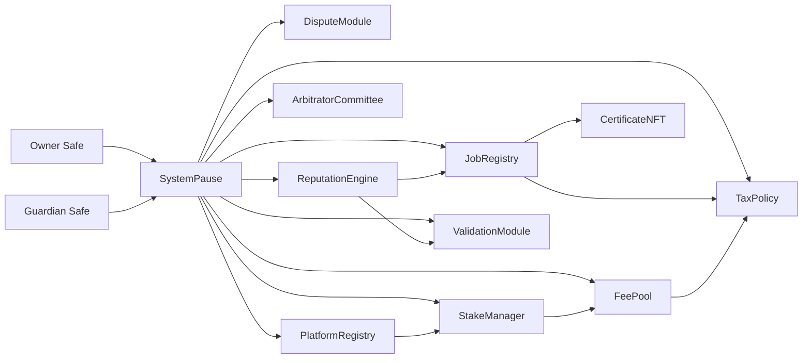

# Contracts Atlas

> Every contract is orchestrated through `SystemPause`, giving the owner Safe one switch for pausing, upgrading, and retuning the entire lattice.

---

## Governance Spine

`SystemPause` owns every core module. Identity-facing contracts (`IdentityRegistry`, `AttestationRegistry`, `CertificateNFT`) transfer to the owner Safe for direct Safe-level governance while still wiring into the mesh.

## Owner Surfaces by Module
| Contract | Purpose | Owner & Pauser Surfaces |
| --- | --- | --- |
| `SystemPause` | Central governance router, pauser, and upgrade switch. | `setModules`, `setGlobalPauser`, `refreshPausers`, `executeGovernanceCall`, `pauseAll`, `unpauseAll`. |
| `JobRegistry` | Creates, finalises, and challenges jobs while coordinating staking, validation, and reputation updates. | `setValidationModule`, `setIdentityRegistry`, `setDisputeModule`, `setFeePool`, `setTaxPolicy`, `setStakeManager`, `setPauser`, `setPauserManager`, `applyConfiguration`, `pause`, `unpause`. |
| `StakeManager` | Custodies `$AGIALPHA` stakes, slashes violators, and routes treasury flows. | `setFeePool`, `setJobRegistry`, `setValidationModule`, `setDisputeModule`, `setTreasury`, `setTreasuryAllowlist`, `setRoleMinimums`, `applyConfiguration`, `pause`, `unpause`. |
| `ValidationModule` | Orchestrates validator pools, failovers, and quorum. | `setStakeManager`, `setIdentityRegistry`, `setReputationEngine`, `setRandaoCoordinator`, `setSelectionStrategy`, `setPauser`, `setPauserManager`, `pause`, `unpause`. |
| `DisputeModule` | Escalates disputes, manages committees, and enforces dispute economics. | `setStakeManager`, `setJobRegistry`, `setCommittee`, `setTaxPolicy`, `setDisputeFee`, `setDisputeWindow`, `setPauser`, `setPauserManager`, `pause`, `unpause`. |
| `PlatformRegistry` | Governs platforms onboarding, staking minimums, and registrar roles. | `setStakeManager`, `setReputationEngine`, `setMinPlatformStake`, `setRegistrar`, `setBlacklist`, `applyConfiguration`, `setPauser`, `setPauserManager`, `pause`, `unpause`. |
| `FeePool` | Receives and distributes `$AGIALPHA` fees, manages burns and treasuries. | `setGovernance`, `setStakeManager`, `setTaxPolicy`, `setTreasury`, `setTreasuryAllowlist`, `setRewardRole`, `applyConfiguration`, `setPauser`, `setPauserManager`, `pause`, `unpause`. |
| `ReputationEngine` | Maintains trust metrics and scoring weights. | `setCaller`, `setStakeManager`, `setScoringWeights`, `setBlacklist`, `setValidationRewardPercentage`, `setPauser`, `setPauserManager`, `pause`, `unpause`. |
| `ArbitratorCommittee` | Coordinates juror assignment and commit/reveal timing. | `setDisputeModule`, `setCommitRevealWindows`, `setAbsenteeSlash`, `setPauser`, `setPauserManager`, `pause`, `unpause`. |
| `TaxPolicy` | Broadcasts tax acknowledgement text and permissions. | `setPolicyURI`, `setAcknowledgement`, `setPolicy`, `setAcknowledger`, `revokeAcknowledgement`, `transferOwnership` (two-step). |
| `IdentityRegistry` | ENS-integrated identity verification. | Owner Safe controls via `transferOwnership` / `acceptOwnership`, plus `setAttestationRegistry`, `setAgentMerkleRoot`, `setValidatorMerkleRoot`. |
| `AttestationRegistry` | Stores ENS-backed attestations. | Owner Safe updates via `setENSRegistry`, `setNameWrapper`, `setController`, `transferOwnership`. |
| `CertificateNFT` | Credential NFT minted for completed jobs. | Owner Safe updates via `setJobRegistry`, `setBaseURI`, `transferOwnership`. |

All surfaces are reachable through `SystemPause.executeGovernanceCall` or owner Safe transactions recorded by `OwnerConfigurator`.

## `$AGIALPHA` Discipline
- `Constants.sol` pins `$AGIALPHA` to `0xa61a3b3a130a9c20768eebf97e21515a6046a1fa` with `AGIALPHA_DECIMALS = 18`.
- `StakeManager` and `FeePool` verify token decimals at runtime; migrations revert if config mismatches occur.
- `scripts/check-governance-matrix.mjs` fails CI if artifacts omit required setters/events or if the address/decimals diverge from `deploy/config.mainnet.json`.

## Libraries & Utilities
- [`utils/`](utils) – `CoreOwnable2Step`, guards, math helpers, pauser patterns.
- [`libraries/`](libraries) – reusable math and encoding primitives tuned for gas and audit clarity.
- [`interfaces/`](interfaces) – ABI contracts for external integrations (staking, validation, taxation, identity, committee coordination).
- [`modules/`](modules) – Specialized module implementations (e.g., dispute) referenced by the registry mesh.

## Compilation Notes
- Solidity 0.8.30, optimizer enabled, viaIR compilation to stay within EIP-170 constraints.
- Metadata stripped for reproducible bytecode.
- Run `npm run compile` to regenerate artifacts in `build/contracts/` (CI uploads these as workflow artifacts for auditability).

## Verification Routine
1. `npm run lint:sol`
2. `npm run compile`
3. `node scripts/verify-artifacts.js`
4. `npm run ci:governance`

Once these pass locally, the same sequence executes inside GitHub Actions ensuring parity between local builds and automated enforcement.
