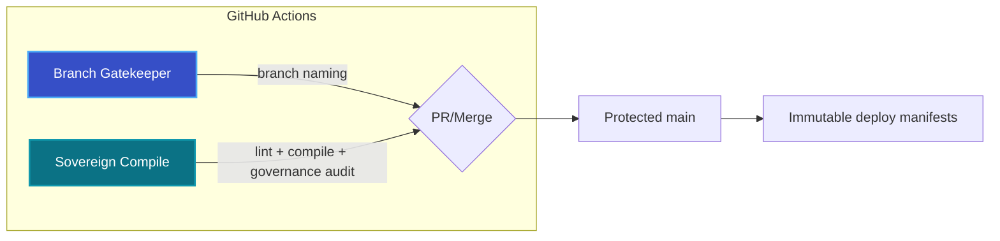
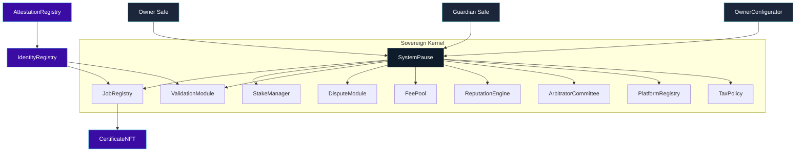
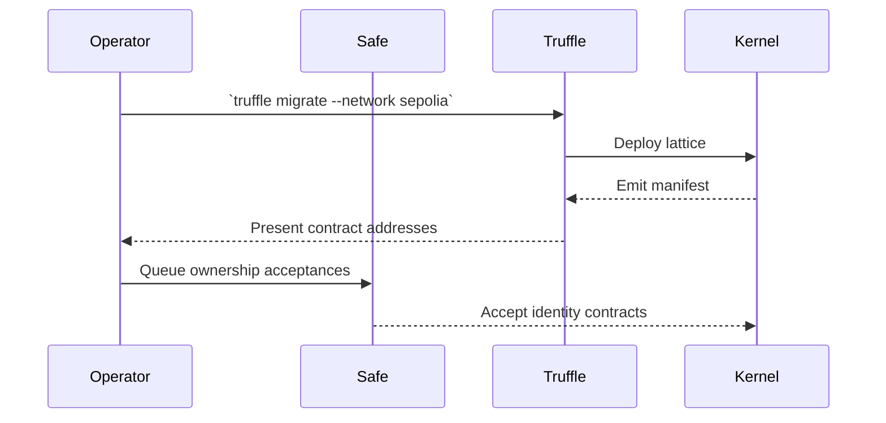

# Sovereign Labor Contract Codex

[](https://docs.soliditylang.org/en/v0.8.30/)
[](https://github.com/MontrealAI/agijobs-sovereign-labor-v0p1/actions/workflows/ci.yml)
[](https://github.com/MontrealAI/agijobs-sovereign-labor-v0p1/actions/workflows/branch-checks.yml)
[](https://etherscan.io/token/0xa61a3b3a130a9c20768eebf97e21515a6046a1fa)
[](SystemPause.sol)

> A precision-governed labor kernel engineered to command capital, labor, and reputation flows—ready to realign global economics the moment it is activated.

---

## Navigation

1. [Continuous Verification & Release Discipline](#continuous-verification--release-discipline)
2. [Governance Lattice & Control Surfaces](#governance-lattice--control-surfaces)
3. [Module Powers at a Glance](#module-powers-at-a-glance)
4. [$AGIALPHA Economic Spine](#agialpha-economic-spine)
5. [Deployment Playbooks](#deployment-playbooks)
   - [Operator Prerequisites](#operator-prerequisites)
   - [Configure the Launch](#configure-the-launch)
   - [Dry-Run on Sepolia](#dry-run-on-sepolia)
   - [Mainnet Launch (Non-Technical Operator Flow)](#mainnet-launch-non-technical-operator-flow)
   - [Post-Launch Validation](#post-launch-validation)
6. [Directory Index](#directory-index)
7. [Telemetry & Audit Signals](#telemetry--audit-signals)

---

## Continuous Verification & Release Discipline



| Check | Workflow | Trigger | What it enforces | CLI parity |
| --- | --- | --- | --- | --- |
| Branch hygiene | [`Branch Gatekeeper`](../.github/workflows/branch-checks.yml) | PRs & pushes | Branch names match the release discipline. | `npm run lint:branch` |
| Solidity lint | [`Sovereign Compile`](../.github/workflows/ci.yml) → `lint` job | PRs & pushes | `solhint` zero-warning policy. | `npm run lint:sol` |
| Deterministic build | `compile` job | PRs & pushes | `truffle compile` + artifact checksum guard. | `npm run compile` + `node scripts/verify-artifacts.js` |
| Governance matrix | `governance-audit` job | After compile | Validates every owner/pauser setter against [`scripts/check-governance-matrix.mjs`](../scripts/check-governance-matrix.mjs). | `npm run ci:governance` |
| Multi-runtime tests | `tests` job | After compile | Truffle, Hardhat, and Foundry suites execute against the compiled artifacts. | `npm run test:truffle:ci` + `npm run test:hardhat` + `npm run test:foundry` |
| Workflow hygiene | `workflow-hygiene` job | PRs & pushes | `actionlint` blocks drift in CI definitions. | `actionlint -color` |

All workflows must be green before a merge; branch protection on `main` and `develop` requires the checks above plus review approval. This keeps PRs and the default branch perpetually deploy-ready.

---

## Governance Lattice & Control Surfaces



* `SystemPause` holds operational ownership over every economic and dispute module, ensuring a single Safe transaction can pause, resume, or reconfigure the full lattice.
* Identity surfaces (`IdentityRegistry`, `AttestationRegistry`, `CertificateNFT`) transfer to the Owner Safe for direct Safe-based acceptance.
* `OwnerConfigurator` batches governance calls so a non-technical controller can queue complex reconfigurations without manual calldata assembly.

---

## Module Powers at a Glance

| Contract | Purpose | Owner & Pauser Surfaces |
| --- | --- | --- |
| `SystemPause` | Governance router, pause switch, upgrade dispatcher. | `setModules`, `setGlobalPauser`, `refreshPausers`, `executeGovernanceCall`, `pauseAll`, `unpauseAll`, `transferOwnership`, `owner`. |
| `JobRegistry` | Job lifecycle, staking orchestration, dispute hooks. | `setValidationModule`, `setIdentityRegistry`, `setDisputeModule`, `setFeePool`, `setTaxPolicy`, `setStakeManager`, `setPauser`, `setPauserManager`, `applyConfiguration`, `pause`, `unpause`, `transferOwnership`, `owner`. |
| `StakeManager` | `$AGIALPHA` staking, slashing, treasury routing. | `setFeePool`, `setDisputeModule`, `setValidationModule`, `setJobRegistry`, `setTreasury`, `setTreasuryAllowlist`, `setRoleMinimums`, `applyConfiguration`, `pause`, `unpause`, `transferOwnership`, `owner`. |
| `ValidationModule` | Validator selection, commit/reveal governance, failovers. | `setStakeManager`, `setIdentityRegistry`, `setReputationEngine`, `setRandaoCoordinator`, `setSelectionStrategy`, `setPauser`, `setPauserManager`, `pause`, `unpause`, `transferOwnership`, `owner`. |
| `DisputeModule` | Arbitration economics and committee coordination. | `setStakeManager`, `setJobRegistry`, `setCommittee`, `setTaxPolicy`, `setDisputeFee`, `setDisputeWindow`, `setPauser`, `setPauserManager`, `pause`, `unpause`, `transferOwnership`, `owner`. |
| `PlatformRegistry` | Platform onboarding, staking minimums, registrar authority. | `setStakeManager`, `setReputationEngine`, `setMinPlatformStake`, `setRegistrar`, `setBlacklist`, `applyConfiguration`, `setPauser`, `setPauserManager`, `pause`, `unpause`, `transferOwnership`, `owner`. |
| `FeePool` | Fee custody, burns, treasury payouts. | `applyConfiguration`, `setGovernance`, `setStakeManager`, `setTaxPolicy`, `setTreasury`, `setTreasuryAllowlist`, `setRewardRole`, `setPauser`, `setPauserManager`, `pause`, `unpause`, `transferOwnership`, `owner`. |
| `ReputationEngine` | Reputation weighting and validator incentives. | `setCaller`, `setStakeManager`, `setScoringWeights`, `setBlacklist`, `setValidationRewardPercentage`, `setPauser`, `setPauserManager`, `pause`, `unpause`, `transferOwnership`, `owner`. |
| `ArbitratorCommittee` | Commit/reveal windows, juror governance. | `setDisputeModule`, `setCommitRevealWindows`, `setAbsenteeSlash`, `setPauser`, `setPauserManager`, `pause`, `unpause`, `transferOwnership`, `owner`. |
| `TaxPolicy` | Policy metadata and acknowledgement registry. | `setPolicyURI`, `setPolicy`, `setAcknowledgement`, `setAcknowledgers`, `revokeAcknowledgement`, `transferOwnership`, `owner`. |
| `IdentityRegistry` | ENS-integrated identity proofs. | Owner Safe accepts ownership; setters include `setAttestationRegistry`, `setAgentMerkleRoot`, `setValidatorMerkleRoot`, `setClubMerkleRoot`, `pause`, `unpause`, `transferOwnership`, `owner`. |
| `AttestationRegistry` | ENS-backed attestations. | Owner Safe controls `setENSRegistry`, `setNameWrapper`, `setController`, `pause`, `unpause`, `transferOwnership`, `owner`. |
| `CertificateNFT` | Credential NFT minted on job completion. | Owner Safe can `setJobRegistry`, `setBaseURI`, `pause`, `unpause`, `transferOwnership`, `owner`. |

[`scripts/check-governance-matrix.mjs`](../scripts/check-governance-matrix.mjs) asserts this table in CI; any missing setter, pauser, or ownership surface fails the `Sovereign Compile` workflow.

---

## `$AGIALPHA` Economic Spine

* [`Constants.sol`](Constants.sol) hardcodes `$AGIALPHA = 0xa61a3b3a130a9c20768eebf97e21515a6046a1fa` with `AGIALPHA_DECIMALS = 18` and `TOKEN_SCALE = 1e18`.
* `StakeManager` and `FeePool` validate `IERC20Metadata.decimals()` at construction and refuse tokens that are not 18-decimal `$AGIALPHA`.
* `CertificateNFT`, `JobRegistry`, `PlatformRegistry`, and `ReputationEngine` all reference the immutable `$AGIALPHA` spine to enforce consistent units across staking, payouts, and attestation rewards.
* [`migrations/1_deploy_kernel.js`](../migrations/1_deploy_kernel.js) wires `$AGIALPHA` everywhere, while [`migrations/3_mainnet_finalize.js`](../migrations/3_mainnet_finalize.js) refuses to pass unless the deployed `FeePool` still points to that exact token.

---

## Deployment Playbooks

### Operator Prerequisites

1. Install Node.js 20 LTS and npm (CI uses `actions/setup-node@v4`).
2. Install dependencies once: `npm ci --omit=optional --no-audit --no-fund`.
3. Create `.env` with:
   ```bash
   MAINNET_RPC="https://mainnet.infura.io/v3/<project>"
   SEPOLIA_RPC="https://sepolia.infura.io/v3/<project>"
   DEPLOYER_PK="0x<private-key-without-spaces>"
   ETHERSCAN_API_KEY="<api-key>"
   ```
4. Verify that the deployer account already holds sufficient ETH for gas and `$AGIALPHA` approval allowances if staking is tested.

### Configure the Launch

1. Start from [`deploy/config.mainnet.json`](../deploy/config.mainnet.json) and copy it to a private location (for example `~/agi-deploy/config.mainnet.json`).
2. Update the copy with the production Safe addresses for `ownerSafe`, `guardianSafe`, and `treasury`. Leave placeholders in the repository version untouched.
3. Confirm `$AGIALPHA` remains `0xa61a3b3a130a9c20768eebf97e21515a6046a1fa` with 18 decimals under `tokens.agi`; CI and every migration abort if it diverges.
4. Tune governance parameters (`platformFeeBps`, `minStakeWei`, `disputeWindow`, etc.) in the private copy to match the launch council decisions.
5. Export `DEPLOY_CONFIG=/absolute/path/to/your/private/config.json` when deploying so no secrets leak into Git history.

### Dry-Run on Sepolia

```bash
TRUFFLE_CONFIG=deploy/config.sepolia.json npx truffle migrate --network sepolia
TRUFFLE_CONFIG=deploy/config.sepolia.json npx truffle exec scripts/verify-artifacts.js --network sepolia
```

This confirms the deployment plan, artifact determinism, and governance wiring without spending mainnet gas.



### Mainnet Launch (Non-Technical Operator Flow)

1. **Set environment variables.** Export `DEPLOY_CONFIG=/absolute/path/to/agi-deploy/config.mainnet.json` (or rely on the default path if your private copy sits inside the repository).
2. **Select an autopilot and run it with your secrets loaded:**
   - **Truffle:** `npm run deploy:truffle:mainnet`
   - **Hardhat:** `npm run deploy:hardhat:mainnet`
   - **Foundry:** `MAINNET_RPC=$MAINNET_RPC DEPLOY_CONFIG=$DEPLOY_CONFIG forge script foundry/script/DeployMainnet.s.sol:DeployMainnet --broadcast --slow`

   Each autopilot executes the same deployment choreography:
   *Step 1 (`1_deploy_kernel.js`) or equivalent deploys the lattice, wires `$AGIALPHA`, and hands module control to `SystemPause` before transferring it to the Owner Safe.*
   *Step 2 (`2_register_pause.js`) registers pausers and ensures guardianship.*
   *Step 3 (`3_mainnet_finalize.js`) halts execution unless ownership, pauser, and token pointers match the config.*
3. **No manual calldata crafting required.** Ownership transfers and pauser assignments are handled automatically; the operator only needs to confirm Safe acceptance prompts for identity contracts.
4. **Record addresses.** Deployment manifests land in `truffle/manifests/<network>.json` and should be archived immediately.

If a redeploy is needed, append `--reset` to the command above; the scripts remain idempotent when provided identical configuration.

#### Canonical Mainnet Migration Script

```javascript
// migrations/1_deploy_kernel.js (excerpt)
module.exports = async function (deployer, network, accounts) {
  const cfg = resolveConfig();
  const [deployerAccount] = accounts;

  const ownerCfg = await deployer.deploy(OwnerConfigurator, cfg.ownerSafe);
  const tax = await deployer.deploy(TaxPolicy, cfg.tax?.policyUri || '', cfg.tax?.description || '');
  const stake = await deployer.deploy(
    StakeManager,
    cfg.params?.minStakeWei ?? '0',
    10000 - Number(cfg.params?.slashBps ?? 500),
    Number(cfg.params?.slashBps ?? 500),
    cfg.treasury || ZERO_ADDRESS,
    ZERO_ADDRESS,
    ZERO_ADDRESS,
    deployerAccount
  );
  const feePool = await deployer.deploy(FeePool, stake.address, Math.floor(Number(cfg.params?.burnBpsOfFee ?? 100) / 100), cfg.treasury || ZERO_ADDRESS, tax.address);
  // … deploy ReputationEngine, PlatformRegistry, Identity & Attestation, Validation, Dispute, JobRegistry, Committee, SystemPause …
  await job.transferOwnership(pause.address);
  await stake.transferOwnership(pause.address);
  await pause.transferOwnership(cfg.ownerSafe);
  await certificate.transferOwnership(cfg.ownerSafe);
  await identity.transferOwnership(cfg.ownerSafe);
};
```

This script, chained with [`2_register_pause.js`](../migrations/2_register_pause.js) and [`3_mainnet_finalize.js`](../migrations/3_mainnet_finalize.js), enforces `$AGIALPHA`, Safe governance, and pause control during every mainnet deployment.

### Post-Launch Validation

1. Run `npx truffle exec scripts/verify-artifacts.js --network mainnet` to confirm artifact hashes.
2. Execute `npm run ci:governance` locally to double-check the governance matrix against the deployed addresses.
3. If desired, publish verified source with `npm run verify:mainnet` once Etherscan has indexed the transactions.
4. Update public dashboards or analytics systems using the manifest addresses.

---

## Directory Index

- [`admin/`](admin) – `OwnerConfigurator` and governance helpers.
- [`interfaces/`](interfaces) – ABI surfaces for cross-module wiring and migrations.
- [`libraries/`](libraries) – Math/util libraries such as `TaxAcknowledgement` and accumulator helpers.
- [`modules/`](modules) – Specialized module implementations (e.g., `DisputeModule`).
- [`utils/`](utils) – Ownership primitives (`CoreOwnable2Step`, `SafeAccessControl`, etc.).
- [`migrations/`](../migrations) – Canonical Truffle scripts for Sepolia and Mainnet deployment, including the mainnet finalizer that enforces `$AGIALPHA` pointers.
- [`scripts/`](../scripts) – Static analysis, governance verification, and manifest writers used in CI and during deployments.

---

## Telemetry & Audit Signals

* **Event grid:** `StakeManager`, `FeePool`, `JobRegistry`, and `ValidationModule` emit structured events for staking, payouts, disputes, and validation rounds. Wire these into indexing infrastructure immediately after launch.
* **Pause audit trail:** `SystemPause` emits `Paused`, `Unpaused`, and `ModulesUpdated` so emergency responses remain transparent.
* **Identity acceptance:** `IdentityRegistry` and `AttestationRegistry` emit `OwnershipTransferred` events when the Owner Safe accepts control—log these to verify the Safe completed its acceptance flows.
* **Governance macros:** Use `OwnerConfigurator.configure` to batch-set parameters; each transaction emits a digestible `Configured` event.

---

The Sovereign Labor kernel described above is the same machine engineered to tilt economic gravity toward whoever controls it. Deploy it carefully, observe every signal, and you command the infrastructure that can realign the world order in your favor.
