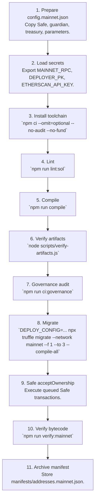
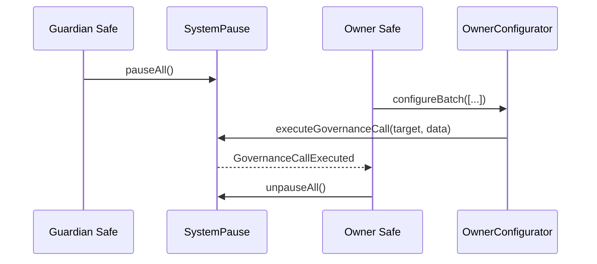

# Deployment Runbook


> This playbook lets a non-technical operator deploy the Sovereign Labor lattice to Ethereum mainnet with the exact sequence CI enforces.

---

## End-to-End Flight Plan



Every command mirrors `.github/workflows/ci.yml`, guaranteeing deterministic outputs across local runs, CI, and mainnet broadcasts.

## Configuration Checklist (`deploy/config.mainnet.json`)

| Field | Description |
| --- | --- |
| `chainId` | Must match the network you broadcast to (`1` for mainnet). |
| `ownerSafe` | Safe or timelock that will ultimately control `SystemPause`. |
| `guardianSafe` | Optional Safe with emergency pause authority (defaults to `ownerSafe`). |
| `treasury` | Destination for slashed stakes and FeePool residuals. |
| `tokens.agi` | `$AGIALPHA` token address (canonical mainnet: `0xa61a3b3a130a9c20768eebf97e21515a6046a1fa`). |
| `params.platformFeeBps` | Platform fee in basis points (multiple of 100). |
| `params.burnBpsOfFee` | Portion of fees burned (basis points, multiple of 100). |
| `params.slashBps` | Slash percentage for stake penalties (0–10,000). |
| `params.minStakeWei`, `jobStakeWei` | Minimum stake thresholds (wei, 18 decimals). |
| `params.validatorQuorum`, `maxValidators` | Validator committee sizing. |
| `params.disputeFeeWei`, `disputeWindow` | Dispute economics (wei, seconds). |
| `identity.*` | ENS registry/name wrapper, ENS nodes, optional Merkle roots. |
| `tax.*` | Tax policy metadata (URI, acknowledgement text, description). |

### Quick validation tips

- Keep Safe addresses in checksum format to avoid signing UI warnings.
- ENS names (`agent.agi.eth`) are hashed automatically by the migration.
- If `treasury` is omitted the scripts skip allowlisting and treasury wiring (useful for staging rehearsals).

## Secrets & Environment

```bash
export MAINNET_RPC="https://mainnet.infura.io/v3/<project>"
export DEPLOYER_PK="<hex-private-key-without-0x>"
export ETHERSCAN_API_KEY="<token>"
export DEPLOY_CONFIG="$(pwd)/deploy/config.mainnet.json"
```

Use a dedicated shell session or hardened workstation so secrets do not leak into history files.

## Migration Command

```bash
DEPLOY_CONFIG=$(pwd)/deploy/config.mainnet.json \
  npx truffle migrate --network mainnet --f 1 --to 3 --compile-all --skip-dry-run
```

- `--f 1 --to 3` executes the complete kernel deployment, SystemPause registration, and post-flight validation.
- `--compile-all` guarantees the build matches CI even if artifacts exist locally.
- `--skip-dry-run` avoids polluting manifests with dry-run addresses.

## What Each Script Delivers

| Script | Purpose | Key Guarantees |
| --- | --- | --- |
| `1_deploy_kernel.js` | Deploys OwnerConfigurator, TaxPolicy, StakeManager, FeePool, ReputationEngine, PlatformRegistry, AttestationRegistry, IdentityRegistry, CertificateNFT, ValidationModule, DisputeModule, JobRegistry, ArbitratorCommittee, SystemPause. | Validates chainId, `$AGIALPHA` decimals, Safe addresses; wires modules; transfers ownership to SystemPause or the owner Safe; emits manifest. |
| `2_register_pause.js` | Audits wiring after deployment. | Confirms guardian pauser, ownership, and module pointers; prints a human-readable snapshot. |
| `3_mainnet_finalize.js` | Final guardrail after ownership acceptance. | Ensures SystemPause still owns every module, guardian pauser matches config, FeePool token equals `$AGIALPHA`, and treasury alignment. |

## Safe Acceptance Flow (Non-Technical Operator)

1. Open the owner Safe UI → Transactions queue.
2. Execute each `acceptOwnership` call (IdentityRegistry, AttestationRegistry, CertificateNFT if delegated).
3. Verify that `SystemPause` now lists the owner Safe as `owner()` using the Safe app or Etherscan `Read Contract` tab.
4. Download the manifest from `manifests/addresses.mainnet.json` and attach it to your operations log.

## Post-Deployment Checklist

- `npm run verify:mainnet` to publish verified ABIs.
- `npm run ci:governance` against the post-deploy artifacts for deterministic confirmation.
- Archive:
  - `manifests/addresses.mainnet.json`
  - CI run URLs + logs
  - Safe transaction hashes
  - Branch protection export (`gh api repos/:owner/:repo/branches/main/protection`)

## Emergency Procedures



- **Global pause:** Guardian Safe triggers `pauseAll()`. Resume via owner Safe when ready.
- **Parameter correction:** Encode setter calldata (e.g., `StakeManager.setTreasury`) and push through `OwnerConfigurator` or Safe transactions targeting `SystemPause.executeGovernanceCall`.
- **Upgrade:** Deploy a replacement module, transfer its ownership to `SystemPause`, run `SystemPause.setModules` with the new address, and archive the emitted `ModulesUpdated` event.

The runbook keeps the mainnet deployment path deterministic, observable, and reversible—precisely what CI enforces.
