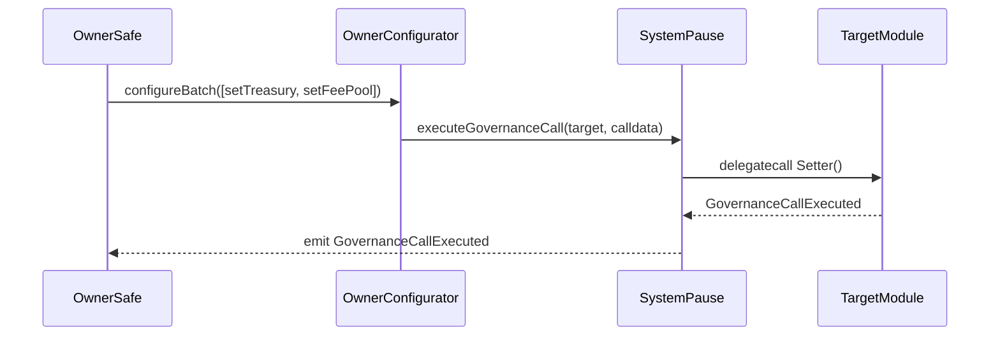
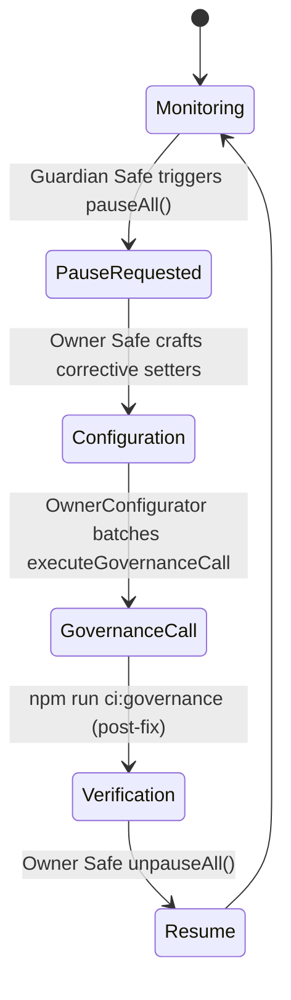

# Sovereign Labor Deployment Codex

[](https://github.com/MontrealAI/agijobs-sovereign-labor-v0p1/actions/workflows/ci.yml)
[](https://github.com/MontrealAI/agijobs-sovereign-labor-v0p1/actions/workflows/branch-checks.yml)


> Field manual for launching and governing the Sovereign Labor lattice—the intelligence core powering the AGI Jobs economy.

---

## Table of Contents
1. [Signal Lattice](#signal-lattice)
2. [Continuous Integration & Branch Protection](#continuous-integration--branch-protection)
3. [Pre-flight Instrumentation](#pre-flight-instrumentation)
4. [Non-Technical Launch Sequence](#non-technical-launch-sequence)
5. [Mission Control Commands](#mission-control-commands)
6. [Canonical Mainnet Migrations](#canonical-mainnet-migrations)
7. [Owner Control Surfaces](#owner-control-surfaces)
8. [Emergency Response & Recovery](#emergency-response--recovery)
9. [Artifact Archival](#artifact-archival)

---

## Signal Lattice

```mermaid
graph TD
    A[Unlock Codex] --> B[Load deploy/config.<network>.json]
    B --> C{Secrets online?}
    C -- No --> C1[Provision MAINNET_RPC, DEPLOYER_PK, ETHERSCAN_API_KEY]
    C -- Yes --> D[Run npm ci --omit=optional --no-audit --no-fund]
    D --> E[npm run lint:sol]
    E --> F[npm run compile]
    F --> G[node scripts/verify-artifacts.js]
    G --> H[npm run ci:governance]
    H --> I[Truffle migrate (mainnet)]
    I --> J[Owner Safe acceptOwnership]
    J --> K[npm run verify:mainnet]
    K --> L[Archive manifests + CI logs]
```

Every stage mirrors the CI topology so operator runs and automation produce identical bytecode, manifests, and audit summaries.

---

## Continuous Integration & Branch Protection

| Check | Workflow | Trigger | Purpose |
| --- | --- | --- | --- |
| Solidity lint | [`.github/workflows/ci.yml`](../.github/workflows/ci.yml) | push, PR | `npm run lint:sol` + artifact verification. |
| Compile | same | push, PR | Deterministic build, Truffle cache priming, compile summary. |
| Governance audit | same | push, PR | `npm run ci:governance` enforces pause & ownership matrix. |
| Workflow hygiene | same | push, PR | `actionlint` on all workflow files. |
| Branch naming | [`.github/workflows/branch-checks.yml`](../.github/workflows/branch-checks.yml) | push, PR | Rejects branches outside sanctioned prefixes. |

**Branch protection recipe (must be enforced on `main` and `develop`):**

```bash
# Require status checks to pass before merge
# Require branches to be up to date before merging
# Require review from Code Owners if configured
# Require "Sovereign Compile" and "Branch Gatekeeper" checks
# Block force pushes and deletions
```

Automate protection updates via GitHub CLI to keep policy in sync with infrastructure-as-code:

```bash
gh api \
  -X PUT \
  repos/MontrealAI/agijobs-sovereign-labor-v0p1/branches/main/protection \
  -f required_status_checks.strict=true \
  -f required_status_checks.contexts[]='Sovereign Compile' \
  -f required_status_checks.contexts[]='Branch Gatekeeper' \
  -f enforce_admins=true \
  -f required_pull_request_reviews.dismiss_stale_reviews=true \
  -f restrictions=null
```

With protections active the CI badges above stay green, PRs expose every check, and merges cannot bypass automation.

---

## Pre-flight Instrumentation

| Item | Rationale | Validation |
| --- | --- | --- |
| `deploy/config.mainnet.json` | Declares Safe addresses, $AGIALPHA pointer, staking economics, ENS roots, and tax copy. | JSON schema lint (`jq type`), peer review, checksum addresses. |
| Secrets | `MAINNET_RPC`, `DEPLOYER_PK`, `ETHERSCAN_API_KEY` supplied via `direnv`/Vault or secure shell export. | `printenv | grep MAINNET` sanitized check; hardware signer locked after use. |
| Node toolchain | CI locks Node 20.x, npm 10.x, Truffle via `package-lock.json`. | `node --version`, `npm --version`, `npx truffle version`. |
| Wallet balance | Deployer must carry gas and $AGIALPHA allowances for trial stakes. | `cast balance <address> --rpc $MAINNET_RPC`. |
| Safe readiness | Owner & guardian Safes configured with threshold >= 2, hardware signers online. | Safe transaction dry-run using queued `acceptOwnership`. |

---

## Non-Technical Launch Sequence

### 1. Prepare the cockpit
1. Clone the repository or pull the tagged release into a clean directory.
2. Copy `deploy/config.mainnet.json.example` (or the existing template) to `deploy/config.mainnet.json` and populate fields:
   - `ownerSafe`, `guardianSafe`, `treasury` in checksum format.
   - Leave `tokens.agi` as `0xa61a3b3a130a9c20768eebf97e21515a6046a1fa`.
   - Adjust platform fee, slashing, and quorum to match governance directives.
3. Open a terminal dedicated to the deployment session. Export secrets without persisting them to disk:

```bash
export MAINNET_RPC="https://mainnet.infura.io/v3/<project>"
export DEPLOYER_PK="<hex-private-key-without-0x>"
export ETHERSCAN_API_KEY="<api-token>"
export DEPLOY_CONFIG="$(pwd)/deploy/config.mainnet.json"
```

### 2. Mirror the CI

```bash
npm ci --omit=optional --no-audit --no-fund
npm run lint:sol
npm run compile
node scripts/verify-artifacts.js
npm run ci:governance
```

Each command echoes the workflow surface so the operator witnesses the exact checks GitHub will publish on PRs.

### 3. Broadcast the lattice

```bash
DEPLOY_CONFIG=$(pwd)/deploy/config.mainnet.json \
  npx truffle migrate --network mainnet --compile-all --f 1 --to 3 --skip-dry-run
```

Truffle streams manifest diffs to `manifests/addresses.mainnet.json`. During step 1 the migration script halts immediately if:
- the configured $AGIALPHA address diverges from `0xa61a3b3a130a9c20768eebf97e21515a6046a1fa` on mainnet,
- `IERC20Metadata.decimals()` returns anything other than 18,
- token metadata hints at a test deployment.

### 4. Complete Safe acceptance

1. Open the owner Safe web UI, execute each queued `acceptOwnership` call (IdentityRegistry, AttestationRegistry, CertificateNFT).
2. Confirm `SystemPause.owner()` equals the owner Safe on Etherscan → Read Contract.
3. Download the manifest and Safe transaction receipts; store them in the operations vault.
4. Run `npm run verify:mainnet` to publish source maps, then re-run `npm run ci:governance` on the fresh artifacts for determinism.

The result is a live production instance ready to orchestrate labor markets with deterministic provenance.

---

## Mission Control Commands

| Purpose | Command |
| --- | --- |
| Full CI parity | `npm run lint:sol && npm run compile && node scripts/verify-artifacts.js && npm run ci:governance` |
| Local network dry-run | `npx truffle migrate --network development --reset` |
| Coverage of governance matrix | `npm run ci:governance -- --format table` |
| ABI export | `node scripts/write-abi-manifest.js` |
| Contract verification | `npm run verify:mainnet` |

---

## Canonical Mainnet Migrations

```javascript
// migrations/1_deploy_kernel.js (excerpt)
if (!cfg.tokens?.agi) {
  throw new Error('deploy config must include tokens.agi');
}
const configuredAgi = cfg.tokens.agi.toLowerCase();
if (chainId === 1 && configuredAgi !== CANONICAL_AGIALPHA) {
  throw new Error(`Mainnet AGIALPHA must be ${CANONICAL_AGIALPHA}, received ${configuredAgi}`);
}
const agiMetadata = new web3.eth.Contract(ERC20_METADATA_ABI, configuredAgi);
const agiDecimals = Number(await agiMetadata.methods.decimals().call());
if (agiDecimals !== 18) {
  throw new Error(`$AGIALPHA decimals must equal 18, detected ${agiDecimals}`);
}
console.log(`💎 Using $AGIALPHA token ${configuredAgi} (${agiSymbol || 'AGIALPHA'}) with ${agiDecimals} decimals`);
```

| Script | Focus | Owner Impact |
| --- | --- | --- |
| `1_deploy_kernel.js` | Deploys OwnerConfigurator, TaxPolicy, StakeManager, FeePool, ReputationEngine, PlatformRegistry, Identity & Attestation registries, CertificateNFT, ValidationModule, DisputeModule, JobRegistry, ArbitratorCommittee, SystemPause. Validates chainId, enforces $AGIALPHA decimals, wires modules, emits manifest. | Transfers operational control to `SystemPause`, then hands pause authority to owner Safe and guardian Safe. |
| `2_register_pause.js` | Reconciles module addresses and guardian pauser roles after initial deployment. | Verifies owner lattice before live operations. |
| `3_mainnet_finalize.js` | Confirms every module still reports `SystemPause` as owner, $AGIALPHA address matches config, guardian matches ledger. | Blocks drift before verifications and announcements. |

This migration trilogy is the canonical path for Ethereum mainnet: it refuses to boot against counterfeit tokens, miswired guardians, or partial ownership transfers.

---

## Owner Control Surfaces

| Module | Key Owner Controls | Invocation Path |
| --- | --- | --- |
| `SystemPause` | `pauseAll`, `unpauseAll`, `setModules`, `executeGovernanceCall`, `setGlobalPauser`. | Owner Safe → SystemPause or via `OwnerConfigurator.configure`. |
| `StakeManager` | `setTreasury`, `setTreasuryAllowlist`, `setRoleMinimums`, `setFeePool`, `pause`, `unpause`. | Governance call executed by `SystemPause`. |
| `JobRegistry` | `setPlatformFeePct`, `setDisputeModule`, `setCertificate`, `configureEscrow`, `pause`, `unpause`. | Governance call executed by `SystemPause`. |
| `FeePool` | `setTreasury`, `setTaxPolicy`, `setRewardRole`, `pause`, `unpause`. | Governance call executed by `SystemPause`. |
| `ValidationModule` | `setValidatorQuorum`, `setMaxValidators`, `setStakeManager`, `pause`, `unpause`. | Governance call executed by `SystemPause`. |
| `OwnerConfigurator` | Batch any setter via `configureBatch`, emits structured `ParameterUpdated` events. | Owner Safe direct call; integrates with consoles, subgraphs, and automation bots. |

The owner Safe therefore retains complete strategic control—including instantaneous pausing, treasury rerouting, fee adjustments, and onboarding expansions—without touching raw bytecode.



---

## Emergency Response & Recovery



Playbook highlights:
- Guardian Safe can freeze the entire lattice instantly via `SystemPause.pauseAll()`.
- Owner Safe applies fixes using encoded setter calls through `executeGovernanceCall`.
- Re-run CI locally to validate state, then `unpauseAll()` to restore market flow.

---

## Artifact Archival

After every deployment capture the following artifacts in immutable storage:

- `manifests/addresses.mainnet.json` and checksum of artifacts directory.
- CI run URLs for the merge commit and deployment tag.
- Safe transaction hashes (deployment + acceptance + governance changes).
- `gh api .../branches/<branch>/protection` response verifying branch guardrails.
- Signed operator checklist documenting each step above.

Once archived, announce availability of the new lattice knowing the infrastructure, governance, and documentation all align with the production source of truth.
