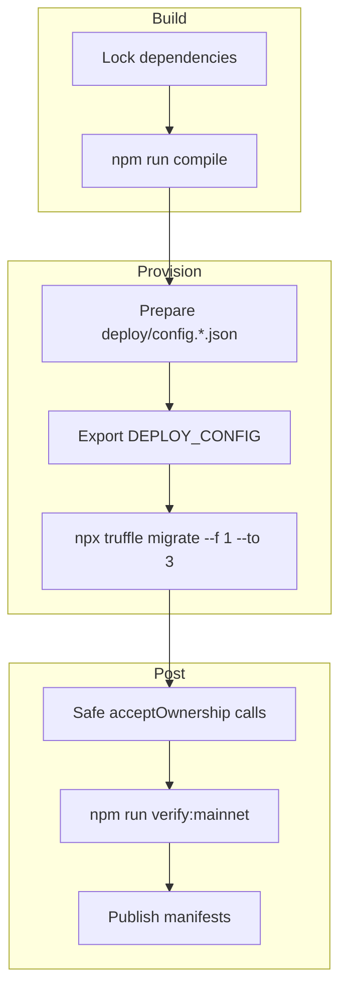

# Deployment Runbook

> Follow this codex to instantiate the sovereign labor lattice on any EVM network while preserving total owner control.

## Pipeline Overview


The compilation step mirrors CI: Node.js 20.x, `npm ci --omit=optional --no-audit --no-fund`, then `npm run compile` so bytecode stays deterministic between local and automated runs.

## Environment Variables
| Variable | Description |
| --- | --- |
| `MAINNET_RPC` | HTTPS endpoint for Ethereum mainnet (archive recommended). |
| `SEPOLIA_RPC` | HTTPS endpoint for Sepolia tests. |
| `DEPLOYER_PK` | Hex private key (without `0x`) for the deployer account. |
| `ETHERSCAN_API_KEY` | API token for verification. |

Export `DEPLOY_CONFIG` if you use an alternate config file:
```bash
export DEPLOY_CONFIG=$(pwd)/deploy/config.mainnet.json
```

## Configuration Checklist (`deploy/config.mainnet.json`)
- `chainId` – must match the broadcast network.
- `ownerSafe` – multisig / timelock that will ultimately control `SystemPause`.
- `guardianSafe` – pauser delegate (falls back to `ownerSafe` if omitted).
- `treasury` – recipient for staking slashes and FeePool dust.
- `tokens.agi` – immutable `$AGIALPHA` ERC-20 address (mainnet default provided and enforced at runtime; decimals must equal 18 or deployment reverts).
- `params`
  - `platformFeeBps` (multiple of 100)
  - `burnBpsOfFee` (multiple of 100)
  - `minStakeWei`, `jobStakeWei`, `validatorQuorum`, optional `maxValidators`
  - `slashBps`, `disputeFeeWei`, `disputeWindow`
- `identity`
  - `ensRegistry`, `nameWrapper`
  - `agentRootNode`, `clubRootNode` (plain ENS names; migration auto-hashes)
  - `agentMerkleRoot`, `validatorMerkleRoot`

## Migration Command
```bash
npx truffle migrate --network mainnet --f 1 --to 3 --skip-dry-run --compile-all
```

### What the migration does
1. Deploys `OwnerConfigurator`, `TaxPolicy`, `StakeManager`, `FeePool`, `ReputationEngine`, `PlatformRegistry`, `AttestationRegistry`, `IdentityRegistry`, `CertificateNFT`, `ValidationModule`, `DisputeModule`, `JobRegistry`, `ArbitratorCommittee`, and `SystemPause`.
2. Wires module references, treasury allowlists, validator quorum, pauser managers, the canonical tax policy pointer, and reputation callers.
3. Transfers ownership of all core modules + `TaxPolicy` to `SystemPause`, sets the guardian pauser, and finally transfers `SystemPause` governance to the owner Safe.
4. Writes `manifests/addresses.<network>.json` capturing addresses, treasury, guardian, and token metadata.

### Post-migration Safe actions
The migration queues ownership transfers for `IdentityRegistry` and `AttestationRegistry` (two-step Ownable2Step). The owner Safe must execute:
```
IdentityRegistry.acceptOwnership()
AttestationRegistry.acceptOwnership()
```
Optionally accept `OwnerConfigurator` if you redeploy with a different initial owner.

## Verification
After confirmations:
```bash
npm run verify:mainnet
```
Ensure `ETHERSCAN_API_KEY` is exported and the manifest addresses match Etherscan results.

## Emergency & Upgrade Playbooks
- **Global pause:** guardian Safe calls `SystemPause.pauseAll()`; resume with `unpauseAll()`.
- **Module upgrade:** deploy replacement → `transferOwnership(SystemPause)` → owner Safe invokes `SystemPause.setModules` with new address.
- **Parameter tuning:** owner Safe encodes calldata and calls `SystemPause.executeGovernanceCall`.

## Release Management
- Tag git releases once `3_mainnet_finalize.js` reports success.
- Archive the generated manifest and share with downstream services.
- Document which Safe transactions accepted ownership for auditability.

The deployment artifacts are deterministic—rerunning the migration with identical config yields identical manifests, keeping the sovereign labor machine reproducible and audit-ready.
