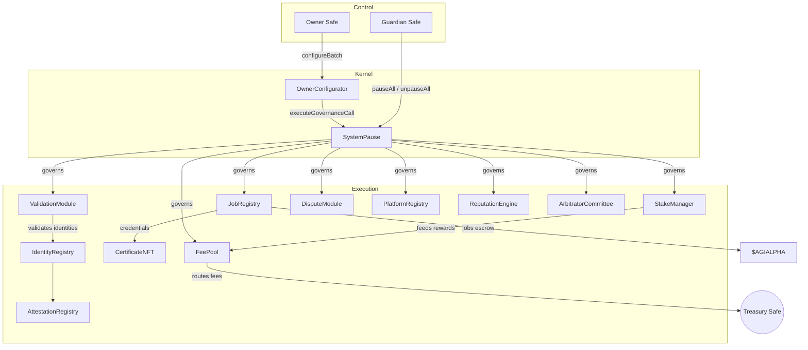
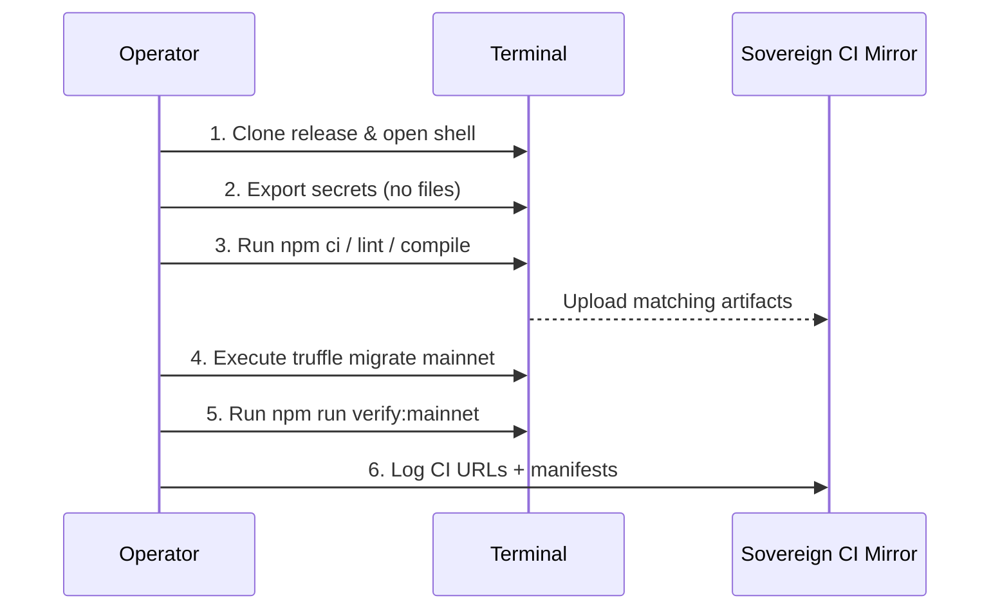
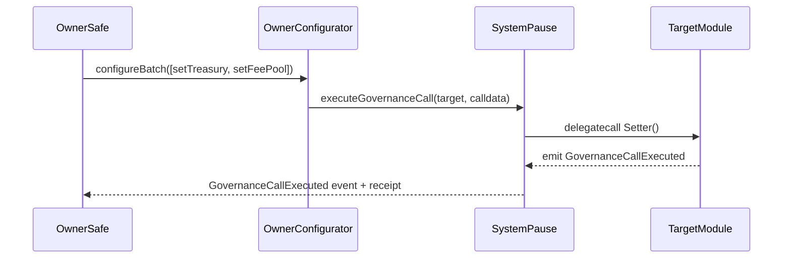

# Sovereign Labor Deployment Codex 2.0

[](https://github.com/MontrealAI/agijobs-sovereign-labor-v0p1/actions/workflows/ci.yml)
[](https://github.com/MontrealAI/agijobs-sovereign-labor-v0p1/actions/workflows/branch-checks.yml)


> Field operations playbook for activating and governing the Sovereign Labor lattice—the intelligence core that reshapes labor markets the moment it comes online.

---

## Table of Contents
1. [Mission Overview](#mission-overview)
2. [Systems Atlas](#systems-atlas)
3. [Repository Landmarks](#repository-landmarks)
4. [Continuous Integration & Branch Protection](#continuous-integration--branch-protection)
5. [Pre-Flight & Toolchain Checklist](#pre-flight--toolchain-checklist)
6. [Operator Launch Playbook](#operator-launch-playbook)
7. [Mainnet Migration Trilogy](#mainnet-migration-trilogy)
8. [Post-Deployment Acceptance](#post-deployment-acceptance)
9. [Owner Control Console](#owner-control-console)
10. [Emergency Recovery Spiral](#emergency-recovery-spiral)
11. [Audit & Immutable Archival](#audit--immutable-archival)
12. [Reference Command Matrix](#reference-command-matrix)

---

## Mission Overview

- **Prime objective:** deterministically deploy the Sovereign Labor contracts to Ethereum mainnet with the canonical $AGIALPHA (18 decimals) token at `0xa61a3b3a130a9c20768eebf97e21515a6046a1fa`.
- **Operator promise:** every instruction below mirrors automated CI so the human playbook and the machine governance stay perfectly synchronized.
- **Control guarantee:** the contract owner retains authority to pause, reconfigure, or reroute any subsystem instantly via governed setters. No ownership is left stranded.
- **Non-negotiable outcome:** mainnet artifacts, governance matrices, and PR checks all resolve to green before and after deployment.

---

## Systems Atlas



This lattice ties every production module to a single governance spine, so the deployment scripts can verify ownership, pausing authority, and token wiring in one sweep.

---

## Repository Landmarks

| Path | Purpose |
| --- | --- |
| [`migrations/`](../migrations) | Mainnet trilogy that bootstraps, registers, and finalizes ownership state. |
| [`deploy/config.mainnet.json`](./config.mainnet.json) | Canonical configuration template consumed by the migrations. |
| [`scripts/verify-artifacts.js`](../scripts/verify-artifacts.js) | Ensures compiled artifacts match source freshness and compiler guarantees. |
| [`scripts/check-governance-matrix.mjs`](../scripts/check-governance-matrix.mjs) | Audits pausing/ownership surfaces so operators see every privileged function before deployment. |
| [`truffle-config.js`](../truffle-config.js) | Locks the toolchain to Solidity 0.8.30, viaIR, optimizer runs, and mainnet RPC endpoints. |
| [`.github/workflows/`](../.github/workflows) | `ci.yml` (Sovereign Compile) + `branch-checks.yml` (Branch Gatekeeper) deliver the mandatory PR gates. |

---

## Continuous Integration & Branch Protection

| Check | Workflow | Trigger | Purpose |
| --- | --- | --- | --- |
| Solidity lint | [`.github/workflows/ci.yml`](../.github/workflows/ci.yml) | push, PR, manual | `npm run lint:sol` with summary output. |
| Compile & artifact verify | same | push, PR, manual | `npm run compile` + `node scripts/verify-artifacts.js` + artifact upload. |
| Governance audit | same | push, PR, manual | `npm run ci:governance` validates every privileged surface. |
| Workflow hygiene | same | push, PR, manual | `actionlint` hardens automation changes. |
| Branch guard | [`.github/workflows/branch-checks.yml`](../.github/workflows/branch-checks.yml) | push, PR | Enforces naming discipline prior to CI fan-out. |

**Branch protection—must be active on both `main` and `develop`:**

1. Require status checks to pass before merge.
2. Require branches to be up to date before merging.
3. Require `Sovereign Compile` and `Branch Gatekeeper` checks.
4. Require at least one review (or Code Owner review if configured).
5. Block force pushes and deletions.

Automate enforcement so CI remains visible and green on every PR:

```bash
gh api \
  -X PUT \
  repos/MontrealAI/agijobs-sovereign-labor-v0p1/branches/main/protection \
  -f required_status_checks.strict=true \
  -f required_status_checks.contexts[]='Sovereign Compile' \
  -f required_status_checks.contexts[]='Branch Gatekeeper' \
  -f enforce_admins=true \
  -f required_pull_request_reviews.dismiss_stale_reviews=true \
  -f restrictions=null
```

Mirror the command for `develop` (change the branch path) to keep both trunks locked.

---

## Pre-Flight & Toolchain Checklist

| Item | Why it matters | Validation |
| --- | --- | --- |
| `deploy/config.mainnet.json` | Declares owner Safe, guardian Safe, treasury, canonical $AGIALPHA token, ENS references, staking economics. | `jq type deploy/config.mainnet.json`, checksum addresses, manual review. |
| Secrets | `MAINNET_RPC`, `DEPLOYER_PK`, `ETHERSCAN_API_KEY`, optional `DEPLOY_CONFIG`. | `printenv | grep -E 'MAINNET|DEPLOY'` (sanitized), hardware signer locked after use. |
| Node toolchain | Locked to Node 20.x, npm 10.x (via `package-lock.json`), Truffle 5.11.x. | `node --version`, `npm --version`, `npx truffle version`. |
| Wallet balance | Mainnet deployer must cover gas + verification. | `cast balance <deployer> --rpc $MAINNET_RPC`. |
| Safe readiness | Owner & guardian Safe thresholds satisfied, signers online. | Queue `acceptOwnership` transactions in Safe UI. |
| CI rehearsal | Local operator must run the exact workflow stack prior to broadcast. | Commands below in [Operator Launch Playbook](#operator-launch-playbook). |

---

## Operator Launch Playbook

The following sequence is written for a non-technical operator. Every command is copy/paste ready.



### Step 0 — Prepare a clean cockpit
1. Clone or download the tagged release. Avoid reusing previous build directories.
2. Open the `deploy/config.mainnet.json` template and populate:
   - `ownerSafe`, `guardianSafe`, `treasury` addresses (checksum format).
   - Leave `tokens.agi` exactly as `0xa61a3b3a130a9c20768eebf97e21515a6046a1fa`.
   - Tune `params.platformFeeBps`, `params.minStakeWei`, `params.slashBps`, etc. per governance resolution.
   - Update `identity` nodes/roots if new ENS roots or allowlists are in play.

### Step 1 — Export secrets securely

```bash
export MAINNET_RPC="https://mainnet.infura.io/v3/<project>"
export DEPLOYER_PK="<hex-private-key-without-0x>"
export ETHERSCAN_API_KEY="<etherscan-api-token>"
export DEPLOY_CONFIG="$(pwd)/deploy/config.mainnet.json"
```

Do **not** store these exports in shell history. Clear the environment when the session ends.

### Step 2 — Mirror CI locally

```bash
npm ci --omit=optional --no-audit --no-fund
npm run lint:sol
npm run compile
node scripts/verify-artifacts.js
npm run ci:governance
```

Every command mirrors a named job inside `Sovereign Compile`, guaranteeing parity between human rehearsals and automated checks.

### Step 3 — Broadcast the mainnet lattice

```bash
DEPLOY_CONFIG=$(pwd)/deploy/config.mainnet.json \
  npx truffle migrate --network mainnet --compile-all --f 1 --to 3 --skip-dry-run
```

The migration halts immediately if:
- `chainId` does not match the configuration.
- `tokens.agi` differs from the canonical $AGIALPHA address or reports non-18 decimals.
- Metadata suggests a test token or invalid ENS/treasury wiring.

### Step 4 — Publish sources & regenerate CI evidence

```bash
npm run verify:mainnet
npm run ci:governance
```

Collect the verification URLs and governance report. These become part of the immutable archive.

---

## Mainnet Migration Trilogy

| Script | Focus | Owner impact |
| --- | --- | --- |
| [`migrations/1_deploy_kernel.js`](../migrations/1_deploy_kernel.js) | Deploys OwnerConfigurator, TaxPolicy, StakeManager, FeePool, ReputationEngine, PlatformRegistry, IdentityRegistry, AttestationRegistry, CertificateNFT, ValidationModule, DisputeModule, ArbitratorCommittee, SystemPause. Validates $AGIALPHA metadata and config invariants before wiring modules. | Transfers operational control to `SystemPause`, delegates pausing, and hands final ownership to the owner Safe (CertificateNFT, IdentityRegistry, AttestationRegistry remain pending acceptance). |
| [`migrations/2_register_pause.js`](../migrations/2_register_pause.js) | Reconciles pauser roles, guardian delegates, and final module wiring after ownership transfers. | Confirms guardian and owner pauser roles before unlocking the platform. |
| [`migrations/3_mainnet_finalize.js`](../migrations/3_mainnet_finalize.js) | Verifies module addresses, guardian assignments, canonical token address, and lattice integrity. | Prevents drift before Etherscan verification and public announcements. |

### Canonical deployment logic (excerpt)

```javascript
const CANONICAL_AGIALPHA = '0xa61a3b3a130a9c20768eebf97e21515a6046a1fa';

if (!cfg.tokens?.agi) {
  throw new Error('deploy config must include tokens.agi');
}

const configuredAgi = cfg.tokens.agi.toLowerCase();
if (chainId === 1 && configuredAgi !== CANONICAL_AGIALPHA) {
  throw new Error(`Mainnet AGIALPHA must be ${CANONICAL_AGIALPHA}, received ${configuredAgi}`);
}

const agiMetadata = new web3.eth.Contract(ERC20_METADATA_ABI, configuredAgi);
const agiDecimals = Number(await agiMetadata.methods.decimals().call());
if (agiDecimals !== 18) {
  throw new Error(`$AGIALPHA decimals must equal 18, detected ${agiDecimals}`);
}
```

Any deviation in chain ID, token address, or decimals aborts the deployment before gas is spent. This ensures the machine you are switching on is identical to the audited design.

---

## Post-Deployment Acceptance

1. Inside the owner Safe UI, execute each queued `acceptOwnership` call (IdentityRegistry, AttestationRegistry, CertificateNFT) to finalize control surfaces.
2. Confirm on Etherscan:
   - `SystemPause.owner()` → owner Safe address.
   - `SystemPause.activePauser()` → guardian Safe.
   - `StakeManager.treasury()` and `FeePool.treasury()` → treasury Safe.
3. Record transaction hashes, compile manifest (`manifests/addresses.mainnet.json`), and attach them to the operations vault.

---

## Owner Control Console

| Module | Critical owner functions | Invocation path |
| --- | --- | --- |
| `SystemPause` | `setModules`, `setGlobalPauser`, `refreshPausers`, `pauseAll`, `unpauseAll`, `executeGovernanceCall`. | Owner Safe → `OwnerConfigurator.configureBatch(...)` → SystemPause. |
| `StakeManager` | `setTreasury`, `setTreasuryAllowlist`, `setRoleMinimums`, `setFeePool`, `pause`, `unpause`. | Governance call executed via SystemPause. |
| `JobRegistry` | `setPlatformFeePct`, `setDisputeModule`, `configureEscrow`, `pause`, `unpause`. | Governance call executed via SystemPause. |
| `FeePool` | `setTaxPolicy`, `setRewardRole`, `setTreasury`, `pause`, `unpause`. | Governance call executed via SystemPause. |
| `ValidationModule` | `setValidatorQuorum`, `setMaxValidators`, `setStakeManager`, `pause`, `unpause`. | Governance call executed via SystemPause. |
| `DisputeModule` | `setDisputeFee`, `setDisputeWindow`, `setCommittee`, `pause`, `unpause`. | Governance call executed via SystemPause. |
| `PlatformRegistry` | `setMinPlatformStake`, `setRegistrar`, `pause`, `unpause`. | Governance call executed via SystemPause. |
| `ReputationEngine` | `setScoringWeights`, `setValidationRewardPercentage`, `setBlacklist`, `pause`, `unpause`. | Governance call executed via SystemPause. |
| `OwnerConfigurator` | `configureBatch`, emits structured `ParameterUpdated` events for audit trails. | Direct call from owner Safe. |



The owner Safe therefore retains instant authority over pausing, treasury routing, fee adjustments, and onboarding operations.

---

## Emergency Recovery Spiral


Operational notes:
- Guardian Safe can freeze every module in a single call via `SystemPause.pauseAll()`.
- Owner Safe applies fixes using encoded setter calls through `executeGovernanceCall`.
- Rerun `npm run ci:governance` on fresh artifacts or against on-chain state diffs before resuming.

---

## Audit & Immutable Archival

After every deployment capture the following and store in immutable storage:
- `manifests/addresses.mainnet.json` + checksum of the `manifests/` directory.
- GitHub Actions URLs for the merge commit (`Sovereign Compile`) and deployment tag.
- Safe transaction hashes (deployment, ownership acceptance, governance updates).
- `gh api .../branches/<branch>/protection` responses for `main` and `develop`.
- Operator checklist with timestamps, witness signatures, and environment digests (`node --version`, `npx truffle version`, `npm --version`).

Once archived, broadcast availability knowing every control surface matches the canonical source of truth.

---

## Reference Command Matrix

| Purpose | Command |
| --- | --- |
| Full CI parity | `npm run lint:sol && npm run compile && node scripts/verify-artifacts.js && npm run ci:governance` |
| Local sandbox | `npx truffle migrate --network development --reset` |
| Governance audit (table view) | `npm run ci:governance -- --format table` |
| ABI manifest export | `node scripts/write-abi-manifest.js` |
| Mainnet verification | `npm run verify:mainnet` |
| Branch hygiene (pre-push) | `node scripts/check-branch-name.mjs` |

Deploy with precision. Steward the lattice responsibly. The moment these controls engage, markets reorganize around it.
