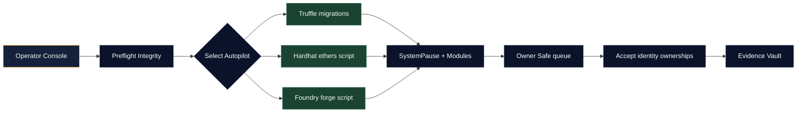
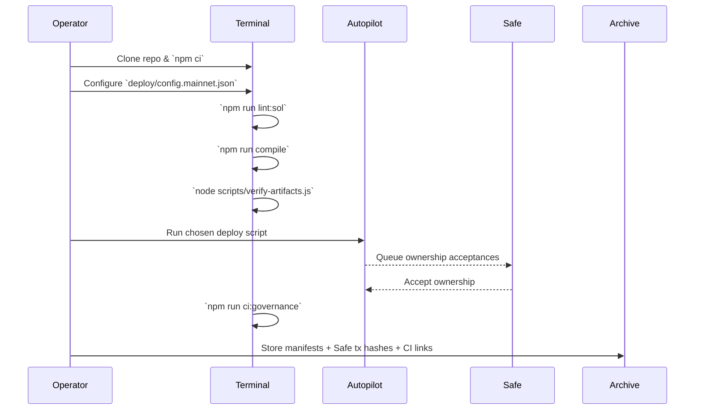
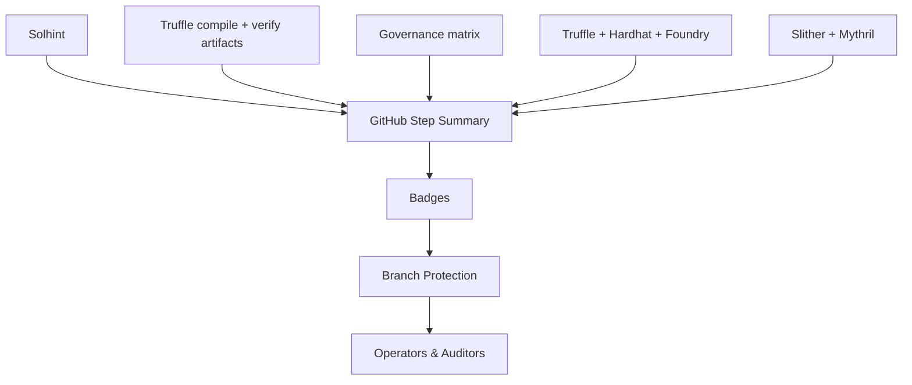
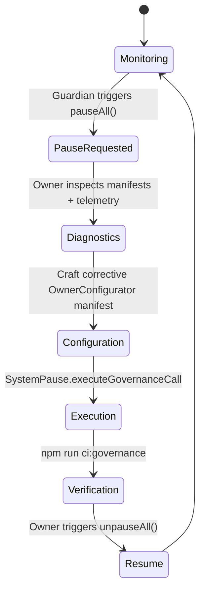

# Sovereign Labor Deployment Codex

[](https://github.com/agijobs/agijobs-sovereign-labor-v0p1/actions/workflows/ci.yml)
[](https://github.com/agijobs/agijobs-sovereign-labor-v0p1/actions/workflows/security.yml)
[](https://github.com/agijobs/agijobs-sovereign-labor-v0p1/actions/workflows/branch-checks.yml)


> This codex is the ignition key. It guides non-technical operators through preflight, deployment, acceptance, and evidence capture so the labor machine lights up on Ethereum mainnet without losing owner control for a single block.

---

## Table of Contents
1. [Mission Uplink](#mission-uplink)
2. [Capability Highlights](#capability-highlights)
3. [Repository Atlas](#repository-atlas)
4. [Operational Flow](#operational-flow)
5. [Telemetry Mesh](#telemetry-mesh)
6. [Continuous Integration & Branch Enforcement](#continuous-integration--branch-enforcement)
7. [Preflight Checklist](#preflight-checklist)
8. [Autopilot Launch Procedures](#autopilot-launch-procedures)
   - [Truffle](#truffle)
   - [Hardhat](#hardhat)
   - [Foundry](#foundry)
9. [Owner Command Authority](#owner-command-authority)
10. [Post-Deployment Acceptance](#post-deployment-acceptance)
11. [Emergency Recovery Spiral](#emergency-recovery-spiral)
12. [Immutable Evidence Archive](#immutable-evidence-archive)
13. [Reference Command Matrix](#reference-command-matrix)

---

## Mission Uplink


The three autopilots produce identical module graphs, manifests, and Safe tasks. Choose the toolchain that matches your muscle memory—each is deterministic and enforces the same invariants.

---

## Capability Highlights
| Vector | Description |
| --- | --- |
| Immutable token binding | `$AGIALPHA` locked to `0xa61a3b3a130a9c20768eebf97e21515a6046a1fa` with 18 decimals; scripts check symbol, decimals, and metadata before broadcasting. |
| Safe-governed control | `SystemPause` owns and pauses every module. Guardian Safe can halt instantly; owner Safe resumes and reconfigures. |
| Deterministic manifests | Truffle, Hardhat, and Foundry all write manifests under `manifests/` containing chain ID, Safes, and deployed addresses. |
| Evidence-first CI | Lint, compile, governance audits, workflow hygiene, and security scans run on every PR with badges mirrored here. |
| Non-technical deployability | Single-command autopilots plus Safe-ready acceptance steps let operators launch without crafting calldata. |

---

## Repository Atlas
| Path | Purpose |
| --- | --- |
| [`contracts/`](../contracts) | Solidity sources for governance, staking, reputation, identity, disputes, and pause control. |
| [`migrations/`](../migrations) | Truffle migrations orchestrating deterministic deployment. |
| [`hardhat/scripts/deploy-mainnet.js`](../hardhat/scripts/deploy-mainnet.js) | Hardhat autopilot mirroring the migration sequence. |
| [`foundry/script/DeployMainnet.s.sol`](../foundry/script/DeployMainnet.s.sol) | Forge script enforcing the same invariants in Solidity. |
| [`scripts/deploy/load-config.js`](../scripts/deploy/load-config.js) | Shared loader verifying deployment manifests across all toolchains. |
| [`deploy/config.mainnet.json`](config.mainnet.json) | Canonical manifest template (owner Safe, guardian Safe, treasury, economics, identity). |
| [`manifests/`](../manifests) | Deployment evidence outputs (addresses, Safe metadata). |

---

## Operational Flow


---

## Telemetry Mesh


Every CI job appends Markdown to the GitHub Step Summary so the deployment operators and auditors review identical evidence.

---

## Continuous Integration & Branch Enforcement
| Check | Workflow | Trigger | Command | Required Status |
| --- | --- | --- | --- | --- |
| Solidity lint | `ci.yml / Solidity lint` | PR, push, manual | `npm run lint:sol` | `Sovereign Compile / Solidity lint` |
| Compile + artifacts | `ci.yml / Compile smart contracts` | PR, push, manual | `npm run compile`, `node scripts/verify-artifacts.js` | `Sovereign Compile / Compile smart contracts` |
| Governance audit | `ci.yml / Governance surface audit` | PR, push, manual | `npm run ci:governance` | `Sovereign Compile / Governance surface audit` |
| Test suites | `ci.yml / Test suites` | PR, push, manual | `npm run test:truffle:ci`, `npm run test:hardhat`, `npm run test:foundry` | `Sovereign Compile / Test suites` |
| Workflow hygiene | `ci.yml / Workflow hygiene` | PR, push | `actionlint -color` | `Sovereign Compile / Workflow hygiene` |
| Slither | `security.yml / Slither static analysis` | PR, push, weekly cron | `slither . --fail-high` | `Security Scans / Slither static analysis` |
| Mythril | `security.yml / Mythril symbolic execution` | PR, push, weekly cron | `myth analyze` | `Security Scans / Mythril symbolic execution` |
| Branch naming | `branch-checks.yml / Validate branch naming conventions` | PR, push | `node scripts/check-branch-name.mjs` | `Branch Gatekeeper / Validate branch naming conventions` |

**Enforce on `main` and `develop`:** require PRs, require up-to-date branches, require all checks, block force pushes/deletions, and include administrators. Use the GitHub CLI recipe below to automate.

```bash
gh api \
  -X PUT \
  repos/agijobs/agijobs-sovereign-labor-v0p1/branches/main/protection \
  -f required_status_checks.strict=true \
  -f required_status_checks.contexts[]='Sovereign Compile / Solidity lint' \
  -f required_status_checks.contexts[]='Sovereign Compile / Compile smart contracts' \
  -f required_status_checks.contexts[]='Sovereign Compile / Governance surface audit' \
  -f required_status_checks.contexts[]='Sovereign Compile / Test suites' \
  -f required_status_checks.contexts[]='Sovereign Compile / Workflow hygiene' \
  -f required_status_checks.contexts[]='Security Scans / Slither static analysis' \
  -f required_status_checks.contexts[]='Security Scans / Mythril symbolic execution' \
  -f required_status_checks.contexts[]='Branch Gatekeeper / Validate branch naming conventions' \
  -f enforce_admins=true \
  -f required_pull_request_reviews.dismiss_stale_reviews=true \
  -f required_pull_request_reviews.required_approving_review_count=1 \
  -F restrictions='null'
```

Run the same command for `develop` (update the branch name accordingly).

---

## Preflight Checklist
1. **Install dependencies.** `npm ci --omit=optional --no-audit --no-fund`.
2. **Prepare secrets.** Create `.env` with:
   ```bash
   MAINNET_RPC="https://mainnet.infura.io/v3/<project>"
   SEPOLIA_RPC="https://sepolia.infura.io/v3/<project>"
   DEPLOYER_PK="0x<private-key>"
   ETHERSCAN_API_KEY="<etherscan-token>"
   DEPLOY_CONFIG="$(pwd)/deploy/config.mainnet.json" # optional override
   ```
3. **Edit the manifest.** Update `deploy/config.mainnet.json` with Safes, treasury, economics, identity nodes, and Merkle roots. Confirm `$AGIALPHA` stays canonical.
4. **Mirror CI locally.**
   ```bash
   npm run lint:sol
   npm run compile
   node scripts/verify-artifacts.js
   npm run ci:governance
   npm run test:truffle:ci
   npm run test:hardhat
   npm run test:foundry
   ```
5. **Fund deployer.** Ensure `DEPLOYER_PK` wallet holds sufficient ETH for deployment gas and follow-up transactions.
6. **Stage evidence.** Create a secure folder for manifests, Safe transaction receipts, and CI URLs.

---

## Autopilot Launch Procedures

### Truffle
- Command: `npm run deploy:truffle:mainnet`
- Scripts executed:
  1. [`1_deploy_kernel.js`](../migrations/1_deploy_kernel.js) — deploys all modules, validates `$AGIALPHA`, wires dependencies, and hands modules to SystemPause.
  2. [`2_register_pause.js`](../migrations/2_register_pause.js) — verifies ownership, registers guardian pauser, prints ownership census.
  3. [`3_mainnet_finalize.js`](../migrations/3_mainnet_finalize.js) — halts if any pointer drifts, asserts owner/guardian/treasury alignment, writes manifests.
- Operator tasks:
  - Monitor console output for Safe tasks.
  - Execute queued `acceptOwnership` calls for identity contracts from the owner Safe.
  - Archive `manifests/<network>.json` immediately.

### Hardhat
- Command: `npm run deploy:hardhat:mainnet`
- Script: [`hardhat/scripts/deploy-mainnet.js`](../hardhat/scripts/deploy-mainnet.js)
  - Loads manifest via `load-config.js`, verifying chain ID, token metadata, percentages, and ENS nodes.
  - Deploys modules using `ethers`, calls setters, transfers ownership to SystemPause, then to the owner Safe.
  - Writes manifest via `truffle/util/writeManifest`.
- Operator tasks: Accept Safe prompts, archive manifest, rerun `npm run ci:governance`.

### Foundry
- Command: `npm run deploy:foundry:mainnet`
- Script: [`foundry/script/DeployMainnet.s.sol`](../foundry/script/DeployMainnet.s.sol)
  - Validates manifest using `stdJson`, verifies `$AGIALPHA` decimals and metadata, and ensures ENS/Merkle configuration is valid.
  - Broadcasts deployments with `forge script`, transfers ownership to SystemPause, sets guardian pauser, and hands identity modules to the owner Safe.
  - Writes `manifests/addresses.<chain>.json`.
- Operator tasks: Accept identity ownerships, verify module ownership via Etherscan, rerun governance audit.

All autopilots respect the same manifest. Switching between them does not change the resulting addresses as long as the manifest remains unchanged.

---

## Owner Command Authority
| Surface | Command | Result |
| --- | --- | --- |
| Global pause | `SystemPause.pauseAll()` | Guardian Safe halts every module instantly. |
| Resume | `SystemPause.unpauseAll()` | Owner Safe restores operation. |
| Treasury rotation | `SystemPause.executeGovernanceCall(StakeManager, setTreasury)` via `OwnerConfigurator` | Treasury Safe updated, emits `ParameterUpdated`. |
| Parameter bundles | `OwnerConfigurator.configureBatch(...)` | Multiple setters executed atomically with manifest-backed telemetry. |
| Identity refresh | `IdentityRegistry.setAgentMerkleRoot`, `setValidatorMerkleRoot` | New identity proofs take effect with event logs. |

Scripts inside [`scripts/`](../scripts) emit Markdown tables plus Safe-ready calldata for each of these flows.

---

## Post-Deployment Acceptance
1. Execute `acceptOwnership` on IdentityRegistry, AttestationRegistry, CertificateNFT from the owner Safe UI.
2. Verify on-chain state via Etherscan:
   - `SystemPause.owner()` equals owner Safe.
   - `SystemPause.activePauser()` equals guardian Safe.
   - `StakeManager.treasury()` and `FeePool.treasury()` equal the configured treasury.
   - `JobRegistry.agiToken()` equals `$AGIALPHA` (`0xa61a3b3a130a9c20768eebf97e21515a6046a1fa`).
3. Run `npm run ci:governance` and `npm run test:truffle:ci` locally as a sanity check.
4. Run `npm run verify:mainnet` (Truffle) or `forge verify-contract` if publishing source to Etherscan.
5. Archive manifests, Safe hashes, verification URLs, and CI logs in the evidence vault.

---

## Emergency Recovery Spiral


If any module misbehaves, halt first, repair with signed governance calls, prove the fix with local CI, then resume.

---

## Immutable Evidence Archive
Store the following artifacts for every deployment:
- `manifests/addresses.<network>.json` and its git hash.
- Safe transaction hashes (deployment, ownership acceptance, parameter updates).
- GitHub Action URLs for `Sovereign Compile`, `Security Scans`, and `Branch Gatekeeper` on the deployment commit.
- Output from `npm run ci:governance` after launch.
- Any off-chain approvals authorizing the change.

---

## Reference Command Matrix
| Purpose | Command |
| --- | --- |
| Full CI mirror | `npm run lint:sol && npm run compile && node scripts/verify-artifacts.js && npm run ci:governance && npm run test:truffle:ci && npm run test:hardhat && npm run test:foundry` |
| Truffle mainnet deploy | `npm run deploy:truffle:mainnet` |
| Hardhat mainnet deploy | `npm run deploy:hardhat:mainnet` |
| Foundry mainnet deploy | `npm run deploy:foundry:mainnet` |
| Verify mainnet contracts | `npm run verify:mainnet` |
| Treasury rotation example | `NEW_TREASURY=0x... npx truffle exec scripts/owner-set-treasury.js --network mainnet` |
| Governance audit snapshot | `npm run ci:governance -- --format table` |

Follow this codex and the machine obeys the owner immediately while remaining fully auditable to the world.
