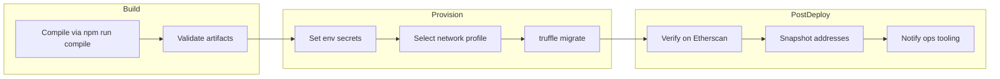
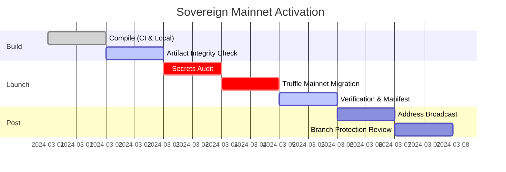

# Deployment Runbook

> Execute these steps to breathe life into the production labor intelligence mesh while keeping absolute owner control over every parameter.

## Pipeline Overview


## Environment Variables
| Variable | Description |
| --- | --- |
| `MAINNET_RPC` | HTTPS endpoint for Mainnet execution client (archive tier recommended). |
| `SEPOLIA_RPC` | HTTPS endpoint for Sepolia testnet. |
| `DEPLOYER_PK` | Hex-encoded private key without `0x`. |
| `ETHERSCAN_API_KEY` | API token for contract verification. |

Store these secrets in your execution environment, CI vault, or GitHub environment secrets. Never commit plaintext secrets.

## Deployment Steps
1. **Compile** – `npm run compile` to ensure bytecode matches CI artifacts.
2. **Select network** – update `truffle-config.js` or use `--network` flag referencing prepared profiles.
3. **Broadcast** – `npx truffle migrate --network <network>`; monitor gas usage and transaction receipts.
4. **Verify** – `npm run verify:mainnet` (or equivalent network script) once deployment transactions are final.
5. **Record** – capture deployed addresses, initialization parameters, pauser assignments, and governance timelock IDs in your runbook.

## Mainnet Migration Script
```bash
npx truffle migrate --network mainnet --f 1 --to 3 \
  --skip-dry-run \
  --compile-all
```

- `migrations/3_mainnet_finalize.js` aligns runtime parameters (pausers, treasury routes, token metadata) with [`deploy/config.mainnet.json`](./config.mainnet.json).
- Ensure `DEPLOY_CONFIG` points at a production-tuned JSON if you need different addresses.
- The `$AGIALPHA` token (18 decimals) is hard-wired at `0xa61a3b3a130a9c20768eebf97e21515a6046a1fa` to guarantee deterministic FeePool semantics.

## Rollback & Emergency Procedures
- To halt the system quickly, queue `SystemPause.pauseAll()` through the governance timelock.
- To rotate critical modules, deploy replacements, transfer ownership to `SystemPause`, and invoke `setModules(...)`.
- Maintain a cold storage backup of deployment keys and timelock proposer accounts.

## Release Management
- Tag releases once contracts are deployed and verified.
- Mirror release notes with the parameter set applied (staking ratios, treasury splits, active modules).
- Coordinate with front-end and off-chain services to update addresses immediately after verification succeeds.


