# Sovereign Labor Deployment Codex // Lattice Prime

[](https://github.com/MontrealAI/agijobs-sovereign-labor-v0p1/actions/workflows/ci.yml)
[](https://github.com/MontrealAI/agijobs-sovereign-labor-v0p1/actions/workflows/branch-checks.yml)
[](#continuous-integration--branch-enforcement)
[](#continuous-integration--branch-enforcement)


> This codex is the ignition key for the Sovereign Labor lattice—the field manual for the machine that bends labour markets around its operator with clinical precision.

---

## Table of Contents
1. [Mission Uplink](#mission-uplink)
2. [Capability Highlights](#capability-highlights)
3. [Repository Atlas](#repository-atlas)
4. [Operational Flow (Mermaid)](#operational-flow-mermaid)
5. [Observability Telemetry (Mermaid)](#observability-telemetry-mermaid)
6. [Continuous Integration & Branch Enforcement](#continuous-integration--branch-enforcement)
7. [Toolchain & Pre-Flight Checklist](#toolchain--pre-flight-checklist)
8. [Launch Playbook for Non-Technical Operators](#launch-playbook-for-non-technical-operators)
9. [Ethereum Mainnet Migration Suite](#ethereum-mainnet-migration-suite)
10. [Owner Command Authority](#owner-command-authority)
11. [Owner Mutation Console](#owner-mutation-console)
12. [Post-Deployment Acceptance](#post-deployment-acceptance)
13. [Emergency Recovery Spiral](#emergency-recovery-spiral)
14. [Immutable Evidence Archive](#immutable-evidence-archive)
15. [Reference Command Matrix](#reference-command-matrix)

---

## Mission Uplink


Every module orbits the owner’s Safe. Configuration, pausing, treasury routing, staking economics, dispute handling, and identity attestation all respond instantly to the owner’s governance calls. The lattice embodied here is the superintelligent machine that concentrates economic leverage for its operator.

---

## Capability Highlights

| Vector | Description |
| --- | --- |
| Autonomous labour orchestration | Contracts choreograph registries, staking, attestations, disputes, and treasury so the operator steers entire economies from a single Safe. |
| Guardian-controlled safety | A dedicated guardian Safe can halt every subsystem instantly, while the owner resumes operations on demand. |
| Deterministic deployments | Mainnet manifests, migration scripts, and manifest writers guarantee reproducible addresses and immutable audit trails. |
| Immutable token binding | `$AGIALPHA` is locked to `0xa61a3b3a130a9c20768eebf97e21515a6046a1fa` with 18 decimals; migrations abort if metadata diverges. |
| Evidence-first CI | Linting, compilation, governance audits, and workflow hygiene produce artefacts uploaded on every run, turning CI into a living dossier. |

---

## Repository Atlas

| Path | Purpose |
| --- | --- |
| [`contracts/`](../contracts) | Solidity sources for governance, registries, staking, reputation, attestation, certificates, and pause control. |
| [`migrations/`](../migrations) | Truffle migrations that materialise the lattice on-chain and wire governance. |
| [`deploy/config.mainnet.json`](./config.mainnet.json) | Canonical deployment manifest consumed by migrations (owner Safe, guardian Safe, treasury, parameters, ENS data). |
| [`deploy/README.md`](./README.md) | This deployment codex—keep it versioned with every release. |
| [`scripts/`](../scripts) | Automation utilities (`verify-artifacts.js`, `check-governance-matrix.mjs`, `write-compile-summary.js`, `owner-set-treasury.js`). |
| [`manifests/`](../manifests) | Deployment evidence (addresses, transactions, toolchain digests). |
| [`truffle-config.js`](../truffle-config.js) | Compiler, optimizer, and network configuration (Solidity 0.8.30 viaIR, Node 20, HD wallet provider). |
| [`.github/workflows/`](../.github/workflows) | GitHub Actions (`Sovereign Compile`, `Branch Gatekeeper`) enforcing lint, compile, governance, and workflow hygiene. |
| [`truffle/util/`](../truffle/util) | Shared helpers for CLI ergonomics and manifest management. |

---

## Operational Flow (Mermaid)

```mermaid
sequenceDiagram
    participant Operator
    participant LocalCI as Local Terminal
    participant Actions as GitHub Actions
    participant Ethereum as Ethereum Mainnet
    Operator->>LocalCI: Clone release & review config.mainnet.json
    Operator->>LocalCI: Export MAINNET_RPC, DEPLOYER_PK, ETHERSCAN_API_KEY
    LocalCI->>LocalCI: npm ci • npm run lint:sol • npm run compile
    LocalCI->>LocalCI: node scripts/verify-artifacts.js • npm run ci:governance
    LocalCI-->>Actions: Mirror CI logs/artifacts (for audit trail)
    Operator->>Ethereum: npx truffle migrate --network mainnet --compile-all
    Operator->>Ethereum: npm run verify:mainnet
    Operator->>Actions: Upload manifests & verification links to Evidence Archive
```



This is the loop that keeps CI green, documentation honest, and deployment reproducible even for non-technical operators.

---

## Observability Telemetry (Mermaid)


Every executed workflow emits artefacts, manifests, and signed logs into the same archive that the owner Safe reviews before authorising governance calls. Branch protection consumes the CI signals in real time, ensuring that the badges on this codex reflect the live truth of the machine.

---

## Continuous Integration & Branch Enforcement

| Check | Workflow | Trigger | Description |
| --- | --- | --- | --- |
| Solidity lint | [`ci.yml`](../.github/workflows/ci.yml) | push, PR, manual | `npm run lint:sol` with zero tolerance for warnings. |
| Compile & artifact verify | [`ci.yml`](../.github/workflows/ci.yml) | push, PR, manual | `npm run compile`, `node scripts/verify-artifacts.js`, artifact upload, toolchain digest. |
| Governance surface audit | [`ci.yml`](../.github/workflows/ci.yml) | push, PR, manual | `npm run ci:governance` checks every privileged function and role. |
| Workflow hygiene | [`ci.yml`](../.github/workflows/ci.yml) | push, PR, manual | `actionlint` validates automation updates. |
| Branch naming policy | [`branch-checks.yml`](../.github/workflows/branch-checks.yml) | push, PR, manual | `node scripts/check-branch-name.mjs` blocks off-spec branches. |

**Branch protection (enforce on both `main` and `develop`):**

1. Require branches to be up to date before merging.
2. Require status checks `Sovereign Compile` and `Branch Gatekeeper`.
3. Require at least one approved review (or Code Owner review when configured).
4. Block force pushes and deletions.
5. Enable signed commits if organisational policy permits.

Automate enforcement with the GitHub CLI (run per protected branch):

```bash
gh api \
  -X PUT \
  repos/MontrealAI/agijobs-sovereign-labor-v0p1/branches/main/protection \
  -f required_status_checks.strict=true \
  -f required_status_checks.contexts[]='Sovereign Compile' \
  -f required_status_checks.contexts[]='Branch Gatekeeper' \
  -f enforce_admins=true \
  -f required_pull_request_reviews.dismiss_stale_reviews=true \
  -f required_pull_request_reviews.require_code_owner_reviews=false \
  -f required_pull_request_reviews.required_approving_review_count=1 \
  -F restrictions='null'
```

Mirror the same command for the `develop` branch. Keep badges visible on this README so everyone can verify the build is green before deploying.

---

## Toolchain & Pre-Flight Checklist

| Item | Why it matters | Verification |
| --- | --- | --- |
| Node 20.x & npm 10.x | Matches `actions/setup-node` and `package-lock.json`. | `node --version`, `npm --version`. |
| Truffle 5.11.x | Aligns with optimizer + viaIR settings. | `npx truffle version`. |
| `deploy/config.mainnet.json` | Single source for owner Safe, guardian Safe, treasury, `$AGIALPHA`, staking parameters, ENS data. | `jq type deploy/config.mainnet.json` then manual checksum. |
| Secrets | `MAINNET_RPC`, `DEPLOYER_PK`, `ETHERSCAN_API_KEY`, optional `DEPLOY_CONFIG`. | `printenv | grep -E 'MAINNET|DEPLOY'` (sanitize output before sharing). |
| Wallet balance | Gas budget for the entire migration suite. | `cast balance <deployer> --rpc $MAINNET_RPC`. |
| Safe readiness | Owner & guardian signers prepared to accept ownership and pause if required. | Queue `acceptOwnership` transactions in the Safe UI. |
| CI rehearsal | Run the same commands as GitHub Actions before mainnet broadcast. | `npm run lint:sol`, `npm run compile`, `node scripts/verify-artifacts.js`, `npm run ci:governance`. |

---

## Launch Playbook for Non-Technical Operators

```mermaid
stateDiagram-v2
    [*] --> AcquireRelease
    AcquireRelease: Retrieve signed release bundle
    AcquireRelease --> ConfigureManifest: Populate deploy/config.mainnet.json
    ConfigureManifest --> SecureEnv: Export MAINNET_RPC • DEPLOYER_PK • ETHERSCAN_API_KEY
    SecureEnv --> MirrorCI: Run npm ci + lint + compile + governance checks
    MirrorCI --> MainnetBroadcast: Execute migrations with DEPLOY_CONFIG
    MainnetBroadcast --> VerifySources: truffle run verify + governance audit
    VerifySources --> ArchiveEvidence: Capture manifests, Safe tx hashes, CI URLs
    ArchiveEvidence --> [*]
```



### Step 0 — Prepare a clean cockpit
1. Download the tagged release into a fresh directory (no cached build artefacts) and verify checksums against the release notes.
2. Populate `deploy/config.mainnet.json`:
   - `ownerSafe`, `guardianSafe`, `treasury` must be EIP-55 checksum addresses.
   - Keep `$AGIALPHA` fixed at `0xa61a3b3a130a9c20768eebf97e21515a6046a1fa` (18 decimals).
   - Adjust `params` (`platformFeeBps`, `minStakeWei`, `slashBps`, `validatorQuorum`, `burnBpsOfFee`, optional `jobStakeWei`, `disputeFeeWei`, `disputeWindow`) to match governance decisions.
   - Update `identity` fields (ENS registry, name wrapper, agent/club root nodes, Merkle roots) when onboarding new cohorts.
   - Toggle `tax.enabled` and populate `tax.policyUri`/`tax.description` if treasury governance requires live tax routing.

### Step 1 — Export secrets securely
```bash
export MAINNET_RPC="https://mainnet.infura.io/v3/<project>"
export DEPLOYER_PK="<hex-private-key-without-0x>"
export ETHERSCAN_API_KEY="<etherscan-api-token>"
export DEPLOY_CONFIG="$(pwd)/deploy/config.mainnet.json"
```
> Clear these environment variables after deployment. Never save them to disk.

### Step 2 — Mirror CI locally
```bash
npm ci --omit=optional --no-audit --no-fund
npm run lint:sol
npm run compile
node scripts/verify-artifacts.js
npm run ci:governance
```
> Local verification must mirror GitHub Actions output. Capture terminal logs for the Evidence Archive.

### Step 3 — Broadcast to Ethereum mainnet
```bash
DEPLOY_CONFIG=$(pwd)/deploy/config.mainnet.json \
  npx truffle migrate --network mainnet --compile-all --f 1 --to 3 --skip-dry-run
```
The migration aborts automatically if:
- `chainId` mismatches the configuration.
- `$AGIALPHA` is not `0xa61a3b3a130a9c20768eebf97e21515a6046a1fa`.
- Token decimals differ from `18`.
- ENS roots or treasury wiring fail validation.

### Step 4 — Verify sources and regenerate governance proofs
```bash
npm run verify:mainnet
npm run ci:governance
```
Collect verification URLs, governance audit outputs, and store them alongside deployment manifests.

### Step 5 — Publish the evidence pack
1. Upload `manifests/addresses.mainnet.json`, Safe transaction exports, and GitHub Action URLs to your evidence vault.
2. Notify the owner and guardian signers that the machine is live, sharing verification links for independent validation.
3. Clear `MAINNET_RPC`, `DEPLOYER_PK`, `ETHERSCAN_API_KEY`, and `DEPLOY_CONFIG` from the shell (`unset VAR`) before closing the session.

---

## Ethereum Mainnet Migration Suite

These migrations are production hardened for chain ID `1`. Keep them under source control and review diff outputs before any change.

### `migrations/1_deploy_kernel.js`

```javascript
const fs = require('fs');
const path = require('path');
const namehash = require('eth-ens-namehash');

const SystemPause = artifacts.require('SystemPause');
const OwnerConfigurator = artifacts.require('OwnerConfigurator');
const JobRegistry = artifacts.require('JobRegistry');
const StakeManager = artifacts.require('StakeManager');
const ValidationModule = artifacts.require('ValidationModule');
const DisputeModule = artifacts.require('DisputeModule');
const ArbitratorCommittee = artifacts.require('ArbitratorCommittee');
const PlatformRegistry = artifacts.require('PlatformRegistry');
const ReputationEngine = artifacts.require('ReputationEngine');
const IdentityRegistry = artifacts.require('IdentityRegistry');
const AttestationRegistry = artifacts.require('AttestationRegistry');
const CertificateNFT = artifacts.require('CertificateNFT');
const TaxPolicy = artifacts.require('TaxPolicy');
const FeePool = artifacts.require('FeePool');

const ZERO_ADDRESS = '0x0000000000000000000000000000000000000000';
const ZERO_BYTES32 = '0x0000000000000000000000000000000000000000000000000000000000000000';
const CANONICAL_AGIALPHA = '0xa61a3b3a130a9c20768eebf97e21515a6046a1fa';

const ERC20_METADATA_ABI = [
  {
    constant: true,
    inputs: [],
    name: 'decimals',
    outputs: [{ name: '', type: 'uint8' }],
    type: 'function'
  },
  {
    constant: true,
    inputs: [],
    name: 'symbol',
    outputs: [{ name: '', type: 'string' }],
    type: 'function'
  },
  {
    constant: true,
    inputs: [],
    name: 'name',
    outputs: [{ name: '', type: 'string' }],
    type: 'function'
  }
];

function resolveConfig() {
  const cfgPath = process.env.DEPLOY_CONFIG || path.join(__dirname, '../deploy/config.mainnet.json');
  return JSON.parse(fs.readFileSync(cfgPath, 'utf8'));
}

async function send(label, fn) {
  console.log(`▶️  ${label}`);
  return fn();
}

module.exports = async function (deployer, network, accounts) {
  const [deployerAccount] = accounts;
  const cfg = resolveConfig();
  const chainId = await web3.eth.getChainId();
  if (chainId !== cfg.chainId) {
    throw new Error(`Config chainId ${cfg.chainId} != network ${chainId}`);
  }

  if (!cfg.tokens?.agi) {
    throw new Error('deploy config must include tokens.agi');
  }

  const configuredAgi = cfg.tokens.agi.toLowerCase();
  if (chainId === 1 && configuredAgi !== CANONICAL_AGIALPHA) {
    throw new Error(`Mainnet AGIALPHA must be ${CANONICAL_AGIALPHA}, received ${configuredAgi}`);
  }

  const agiMetadata = new web3.eth.Contract(ERC20_METADATA_ABI, configuredAgi);
  const agiDecimals = Number(await agiMetadata.methods.decimals().call());
  if (agiDecimals !== 18) {
    throw new Error(`$AGIALPHA decimals must equal 18, detected ${agiDecimals}`);
  }

  const agiSymbol = await agiMetadata.methods.symbol().call().catch(() => '');
  if (agiSymbol && agiSymbol !== 'AGIALPHA') {
    console.warn(`⚠️  Expected $AGIALPHA symbol to be AGIALPHA, observed ${agiSymbol}`);
  }

  const agiName = await agiMetadata.methods.name().call().catch(() => '');
  if (agiName && agiName.toLowerCase().includes('test')) {
    throw new Error(`$AGIALPHA metadata indicates a test token (${agiName}); aborting.`);
  }

  console.log(`💎 Using $AGIALPHA token ${configuredAgi} (${agiSymbol || 'AGIALPHA'}) with ${agiDecimals} decimals`);

  const ownerSafe = cfg.ownerSafe;
  const guardianSafe = cfg.guardianSafe || ownerSafe;
  const treasury = cfg.treasury || ZERO_ADDRESS;

  const params = cfg.params || {};
  const platformFeeBps = Number(params.platformFeeBps ?? 1000);
  if (platformFeeBps % 100 !== 0) {
    throw new Error('platformFeeBps must be a multiple of 100');
  }
  const platformFeePct = Math.floor(platformFeeBps / 100);
  if (platformFeePct > 100) {
    throw new Error(`platformFeeBps ${platformFeeBps} exceeds 100%`);
  }

  const burnBpsOfFee = Number(params.burnBpsOfFee ?? 100);
  if (burnBpsOfFee % 100 !== 0) {
    throw new Error('burnBpsOfFee must be a multiple of 100');
  }
  const burnPct = Math.floor(burnBpsOfFee / 100);
  if (burnPct > 100) {
    throw new Error(`burnBpsOfFee ${burnBpsOfFee} exceeds 100%`);
  }

  const slashBps = Number(params.slashBps ?? 500);
  if (slashBps < 0 || slashBps > 10000) {
    throw new Error('slashBps must be between 0 and 10_000');
  }
  const treasuryPct = slashBps;
  const employerPct = 10000 - treasuryPct;

  const validatorQuorum = Number(params.validatorQuorum ?? 3);
  const maxValidators = Number(params.maxValidators ?? Math.max(validatorQuorum * 2, validatorQuorum));
  const minStakeWei = params.minStakeWei ?? '0';
  const jobStakeWei = params.jobStakeWei ?? minStakeWei;
  const disputeFeeWei = params.disputeFeeWei ?? '0';
  const disputeWindow = Number(params.disputeWindow ?? 0);

  const agentRootNode = cfg.identity?.agentRootNode ? namehash.hash(cfg.identity.agentRootNode) : ZERO_BYTES32;
  const clubRootNode = cfg.identity?.clubRootNode ? namehash.hash(cfg.identity.clubRootNode) : ZERO_BYTES32;
  const agentMerkleRoot = cfg.identity?.agentMerkleRoot ?? ZERO_BYTES32;
  const validatorMerkleRoot = cfg.identity?.validatorMerkleRoot ?? ZERO_BYTES32;

  console.log('🚀 Deploying Sovereign Labor kernel with deployer', deployerAccount);

  const ownerCfg = await send('Deploy OwnerConfigurator', () => deployer.deploy(OwnerConfigurator, ownerSafe).then(() => OwnerConfigurator.deployed()));
  const tax = await send('Deploy TaxPolicy', () => deployer.deploy(TaxPolicy, cfg.tax?.policyUri || '', cfg.tax?.description || '').then(() => TaxPolicy.deployed()));

  const stake = await send('Deploy StakeManager', () =>
    deployer
      .deploy(
        StakeManager,
        minStakeWei,
        employerPct,
        treasuryPct,
        treasury,
        ZERO_ADDRESS,
        ZERO_ADDRESS,
        deployerAccount
      )
      .then(() => StakeManager.deployed())
  );

  const feePool = await send('Deploy FeePool', () =>
    deployer
      .deploy(FeePool, stake.address, burnPct, treasury, tax.address)
      .then(() => FeePool.deployed())
  );

  const reputation = await send('Deploy ReputationEngine', () =>
    deployer.deploy(ReputationEngine, stake.address).then(() => ReputationEngine.deployed())
  );

  const platform = await send('Deploy PlatformRegistry', () =>
    deployer.deploy(PlatformRegistry, stake.address, reputation.address, minStakeWei).then(() => PlatformRegistry.deployed())
  );

  const attestation = await send('Deploy AttestationRegistry', () =>
    deployer
      .deploy(AttestationRegistry, cfg.identity?.ensRegistry || ZERO_ADDRESS, cfg.identity?.nameWrapper || ZERO_ADDRESS)
      .then(() => AttestationRegistry.deployed())
  );

  const identity = await send('Deploy IdentityRegistry', () =>
    deployer
      .deploy(
        IdentityRegistry,
        cfg.identity?.ensRegistry || ZERO_ADDRESS,
        cfg.identity?.nameWrapper || ZERO_ADDRESS,
        reputation.address,
        agentRootNode,
        clubRootNode
      )
      .then(() => IdentityRegistry.deployed())
  );

  const certificate = await send('Deploy CertificateNFT', () =>
    deployer.deploy(CertificateNFT, 'Sovereign Labor Credential', 'SLC').then(() => CertificateNFT.deployed())
  );

  const validation = await send('Deploy ValidationModule', () =>
    deployer
      .deploy(
        ValidationModule,
        ZERO_ADDRESS,
        stake.address,
        0,
        0,
        validatorQuorum,
        maxValidators,
        []
      )
      .then(() => ValidationModule.deployed())
  );

  const dispute = await send('Deploy DisputeModule', () =>
    deployer
      .deploy(
        DisputeModule,
        ZERO_ADDRESS,
        disputeFeeWei,
        disputeWindow,
        ZERO_ADDRESS,
        deployerAccount
      )
      .then(() => DisputeModule.deployed())
  );

  const job = await send('Deploy JobRegistry', () =>
    deployer
      .deploy(
        JobRegistry,
        validation.address,
        stake.address,
        reputation.address,
        dispute.address,
        certificate.address,
        feePool.address,
        tax.address,
        platformFeePct,
        jobStakeWei,
        [tax.address],
        deployerAccount
      )
      .then(() => JobRegistry.deployed())
  );

  const committee = await send('Deploy ArbitratorCommittee', () =>
    deployer.deploy(ArbitratorCommittee, job.address, dispute.address).then(() => ArbitratorCommittee.deployed())
  );

  const pause = await send('Deploy SystemPause', () =>
    deployer
      .deploy(
        SystemPause,
        job.address,
        stake.address,
        validation.address,
        dispute.address,
        platform.address,
        feePool.address,
        reputation.address,
        committee.address,
        deployerAccount
      )
      .then(() => SystemPause.deployed())
  );

  console.log('🔧 Wiring modules');

  if (attestation.address !== ZERO_ADDRESS) {
    await send('IdentityRegistry.setAttestationRegistry', () => identity.setAttestationRegistry(attestation.address));
  }
  if (agentMerkleRoot !== ZERO_BYTES32) {
    await send('IdentityRegistry.setAgentMerkleRoot', () => identity.setAgentMerkleRoot(agentMerkleRoot));
  }
  if (validatorMerkleRoot !== ZERO_BYTES32) {
    await send('IdentityRegistry.setValidatorMerkleRoot', () => identity.setValidatorMerkleRoot(validatorMerkleRoot));
  }

  await send('ValidationModule.setJobRegistry', () => validation.setJobRegistry(job.address));
  await send('ValidationModule.setStakeManager', () => validation.setStakeManager(stake.address));
  await send('ValidationModule.setIdentityRegistry', () => validation.setIdentityRegistry(identity.address));
  await send('ValidationModule.setReputationEngine', () => validation.setReputationEngine(reputation.address));

  await send('StakeManager.setFeePool', () => stake.setFeePool(feePool.address));
  await send('StakeManager.setJobRegistry', () => stake.setJobRegistry(job.address));
  await send('StakeManager.setDisputeModule', () => stake.setDisputeModule(dispute.address));
  if (treasury !== ZERO_ADDRESS) {
    await send('StakeManager.setTreasuryAllowlist', () => stake.setTreasuryAllowlist(treasury, true));
    await send('StakeManager.setTreasury', () => stake.setTreasury(treasury));
  }

  await send('DisputeModule.setJobRegistry', () => dispute.setJobRegistry(job.address));
  await send('DisputeModule.setStakeManager', () => dispute.setStakeManager(stake.address));
  await send('DisputeModule.setCommittee', () => dispute.setCommittee(committee.address));
  await send('DisputeModule.setTaxPolicy', () => dispute.setTaxPolicy(tax.address));

  await send('FeePool.setStakeManager', () => feePool.setStakeManager(stake.address));
  await send('FeePool.setRewardRole', () => feePool.setRewardRole(2));
  await send('FeePool.setTaxPolicy', () => feePool.setTaxPolicy(tax.address));
  if (treasury !== ZERO_ADDRESS) {
    await send('FeePool.setTreasuryAllowlist', () => feePool.setTreasuryAllowlist(treasury, true));
    await send('FeePool.setTreasury', () => feePool.setTreasury(treasury));
  }
  await send('FeePool.setGovernance', () => feePool.setGovernance(pause.address));

  await send('ReputationEngine.setCaller(JobRegistry)', () => reputation.setCaller(job.address, true));
  await send('ReputationEngine.setCaller(ValidationModule)', () => reputation.setCaller(validation.address, true));

  await send('CertificateNFT.setJobRegistry', () => certificate.setJobRegistry(job.address));

  console.log('🎛️  Transferring ownership to SystemPause lattice');

  await send('TaxPolicy.transferOwnership(SystemPause)', () => tax.transferOwnership(pause.address));

  await send('JobRegistry.transferOwnership(SystemPause)', () => job.transferOwnership(pause.address));
  await send('StakeManager.transferOwnership(SystemPause)', () => stake.transferOwnership(pause.address));
  await send('ValidationModule.transferOwnership(SystemPause)', () => validation.transferOwnership(pause.address));
  await send('DisputeModule.transferOwnership(SystemPause)', () => dispute.transferOwnership(pause.address));
  await send('PlatformRegistry.transferOwnership(SystemPause)', () => platform.transferOwnership(pause.address));
  await send('FeePool.transferOwnership(SystemPause)', () => feePool.transferOwnership(pause.address));
  await send('ReputationEngine.transferOwnership(SystemPause)', () => reputation.transferOwnership(pause.address));
  await send('ArbitratorCommittee.transferOwnership(SystemPause)', () => committee.transferOwnership(pause.address));

  await send('SystemPause.accept TaxPolicy ownership', () =>
    pause.executeGovernanceCall(tax.address, tax.contract.methods.acceptOwnership().encodeABI())
  );

  await send('SystemPause.setModules', () =>
    pause.setModules(
      job.address,
      stake.address,
      validation.address,
      dispute.address,
      platform.address,
      feePool.address,
      reputation.address,
      committee.address
    )
  );

  await send('SystemPause.setGlobalPauser', () => pause.setGlobalPauser(guardianSafe));
  await send('SystemPause.transferOwnership(ownerSafe)', () => pause.transferOwnership(ownerSafe));

  await send('CertificateNFT.transferOwnership(ownerSafe)', () => certificate.transferOwnership(ownerSafe));
  await send('AttestationRegistry.transferOwnership(ownerSafe)', () => attestation.transferOwnership(ownerSafe));
  await send('IdentityRegistry.transferOwnership(ownerSafe)', () => identity.transferOwnership(ownerSafe));

  const writeManifest = require('../truffle/util/writeManifest');
  await writeManifest(network, {
    chainId,
    ownerSafe,
    guardianSafe,
    treasury,
    SystemPause: pause.address,
    OwnerConfigurator: ownerCfg.address,
    JobRegistry: job.address,
    StakeManager: stake.address,
    ValidationModule: validation.address,
    DisputeModule: dispute.address,
    ArbitratorCommittee: committee.address,
    PlatformRegistry: platform.address,
    ReputationEngine: reputation.address,
    IdentityRegistry: identity.address,
    AttestationRegistry: attestation.address,
    CertificateNFT: certificate.address,
    TaxPolicy: tax.address,
    FeePool: feePool.address
  });

  console.log('✅ Sovereign Labor kernel deployed. Update pending ownerships (Identity & Attestation) must be accepted by owner safe.');
};
```

### `migrations/2_register_pause.js`

```javascript
const fs = require('fs');
const path = require('path');

const SystemPause = artifacts.require('SystemPause');
const JobRegistry = artifacts.require('JobRegistry');
const StakeManager = artifacts.require('StakeManager');
const ValidationModule = artifacts.require('ValidationModule');
const DisputeModule = artifacts.require('DisputeModule');
const PlatformRegistry = artifacts.require('PlatformRegistry');
const FeePool = artifacts.require('FeePool');
const ReputationEngine = artifacts.require('ReputationEngine');
const ArbitratorCommittee = artifacts.require('ArbitratorCommittee');
const TaxPolicy = artifacts.require('TaxPolicy');

function loadConfig() {
  const cfgPath = process.env.DEPLOY_CONFIG || path.join(__dirname, '../deploy/config.mainnet.json');
  return JSON.parse(fs.readFileSync(cfgPath, 'utf8'));
}

async function ownerOf(contract) {
  if (typeof contract.owner === 'function') {
    return contract.owner();
  }
  return '0x0000000000000000000000000000000000000000';
}

module.exports = async function () {
  const cfg = loadConfig();
  const pause = await SystemPause.deployed();

  const guardian = (cfg.guardianSafe || cfg.ownerSafe || '').toLowerCase();
  const pauseOwner = (await pause.owner()).toLowerCase();
  if (pauseOwner !== (cfg.ownerSafe || '').toLowerCase()) {
    throw new Error(`SystemPause owner ${pauseOwner} != configured ownerSafe ${cfg.ownerSafe}`);
  }

  const activePauser = (await pause.activePauser()).toLowerCase();
  if (guardian && activePauser !== guardian) {
    throw new Error(`Active pauser ${activePauser} != configured guardian ${guardian}`);
  }

  const records = [];
  const moduleEntries = [
    ['JobRegistry', JobRegistry, await pause.jobRegistry()],
    ['StakeManager', StakeManager, await pause.stakeManager()],
    ['ValidationModule', ValidationModule, await pause.validationModule()],
    ['DisputeModule', DisputeModule, await pause.disputeModule()],
    ['PlatformRegistry', PlatformRegistry, await pause.platformRegistry()],
    ['FeePool', FeePool, await pause.feePool()],
    ['ReputationEngine', ReputationEngine, await pause.reputationEngine()],
    ['ArbitratorCommittee', ArbitratorCommittee, await pause.arbitratorCommittee()],
    ['TaxPolicy', TaxPolicy, (await TaxPolicy.deployed()).address]
  ];

  for (const [label, artifact, address] of moduleEntries) {
    const instance = await artifact.at(address);
    const moduleOwner = (await ownerOf(instance)).toLowerCase();
    records.push({
      module: label,
      address,
      ownedByPause: moduleOwner === pause.address.toLowerCase(),
      owner: moduleOwner
    });
  }

  console.log('📊 SystemPause wiring snapshot');
  for (const row of records) {
    console.log(
      `${row.module.padEnd(22)} :: ${row.address} :: owner=${row.owner} :: ownedByPause=${row.ownedByPause}`
    );
  }

  console.log('✅ SystemPause lattice verified. All core modules wired under pause control.');
};
```

### `migrations/3_mainnet_finalize.js`

```javascript
const fs = require('fs');
const path = require('path');

const SystemPause = artifacts.require('SystemPause');
const JobRegistry = artifacts.require('JobRegistry');
const StakeManager = artifacts.require('StakeManager');
const ValidationModule = artifacts.require('ValidationModule');
const DisputeModule = artifacts.require('DisputeModule');
const PlatformRegistry = artifacts.require('PlatformRegistry');
const FeePool = artifacts.require('FeePool');
const ReputationEngine = artifacts.require('ReputationEngine');
const ArbitratorCommittee = artifacts.require('ArbitratorCommittee');
const TaxPolicy = artifacts.require('TaxPolicy');

function loadConfig() {
  const cfgPath = process.env.DEPLOY_CONFIG || path.join(__dirname, '../deploy/config.mainnet.json');
  return JSON.parse(fs.readFileSync(cfgPath, 'utf8'));
}

async function ensureOwner(contract, expected, label) {
  const actual = (await contract.owner()).toLowerCase();
  if (actual !== expected.toLowerCase()) {
    throw new Error(`${label} owner ${actual} != expected ${expected}`);
  }
}

module.exports = async function (_deployer, network) {
  const cfg = loadConfig();
  const chainId = await web3.eth.getChainId();
  if (chainId !== cfg.chainId) {
    console.log(`⏭️  Skipping finalize for chainId ${chainId}; expected ${cfg.chainId}.`);
    return;
  }

  console.log(`🔐 Validating Sovereign Labor deployment for ${network} (chainId ${chainId})`);

  const pause = await SystemPause.deployed();
  const job = await JobRegistry.deployed();
  const stake = await StakeManager.deployed();
  const validation = await ValidationModule.deployed();
  const dispute = await DisputeModule.deployed();
  const platform = await PlatformRegistry.deployed();
  const feePool = await FeePool.deployed();
  const reputation = await ReputationEngine.deployed();
  const committee = await ArbitratorCommittee.deployed();
  const tax = await TaxPolicy.deployed();

  await ensureOwner(pause, cfg.ownerSafe, 'SystemPause');
  await ensureOwner(job, pause.address, 'JobRegistry');
  await ensureOwner(stake, pause.address, 'StakeManager');
  await ensureOwner(validation, pause.address, 'ValidationModule');
  await ensureOwner(dispute, pause.address, 'DisputeModule');
  await ensureOwner(platform, pause.address, 'PlatformRegistry');
  await ensureOwner(feePool, pause.address, 'FeePool');
  await ensureOwner(reputation, pause.address, 'ReputationEngine');
  await ensureOwner(committee, pause.address, 'ArbitratorCommittee');
  await ensureOwner(tax, pause.address, 'TaxPolicy');

  const activePauser = (await pause.activePauser()).toLowerCase();
  const expectedPauser = (cfg.guardianSafe || cfg.ownerSafe || '').toLowerCase();
  if (expectedPauser && activePauser !== expectedPauser) {
    throw new Error(`Active pauser ${activePauser} != configured guardian ${expectedPauser}`);
  }

  const pointers = {
    validation: await pause.validationModule(),
    stake: await pause.stakeManager(),
    dispute: await pause.disputeModule(),
    platform: await pause.platformRegistry(),
    feePool: await pause.feePool(),
    reputation: await pause.reputationEngine(),
    committee: await pause.arbitratorCommittee()
  };

  if (pointers.validation.toLowerCase() !== validation.address.toLowerCase()) {
    throw new Error('SystemPause validation module pointer mismatch');
  }
  if (pointers.stake.toLowerCase() !== stake.address.toLowerCase()) {
    throw new Error('SystemPause stake manager pointer mismatch');
  }
  if (pointers.dispute.toLowerCase() !== dispute.address.toLowerCase()) {
    throw new Error('SystemPause dispute module pointer mismatch');
  }
  if (pointers.platform.toLowerCase() !== platform.address.toLowerCase()) {
    throw new Error('SystemPause platform registry pointer mismatch');
  }
  if (pointers.feePool.toLowerCase() !== feePool.address.toLowerCase()) {
    throw new Error('SystemPause fee pool pointer mismatch');
  }
  if (pointers.reputation.toLowerCase() !== reputation.address.toLowerCase()) {
    throw new Error('SystemPause reputation engine pointer mismatch');
  }
  if (pointers.committee.toLowerCase() !== committee.address.toLowerCase()) {
    throw new Error('SystemPause committee pointer mismatch');
  }

  const feeToken = await feePool.token();
  if (feeToken.toLowerCase() !== cfg.tokens.agi.toLowerCase()) {
    throw new Error(`FeePool token ${feeToken} != configured $AGIALPHA ${cfg.tokens.agi}`);
  }

  const treasury = await stake.treasury();
  if (treasury.toLowerCase() !== (cfg.treasury || '').toLowerCase()) {
    console.warn(`⚠️  StakeManager treasury ${treasury} differs from config ${cfg.treasury}`);
  }

  console.log('✅ Sovereign Labor deployment validated. Governance lattice is green.');
};
```

These scripts guarantee the owner retains unilateral ability to update or pause every subsystem through governed setters while keeping `$AGIALPHA` fixed on mainnet.

---

## Owner Command Authority

| Module | Critical owner functions | Invocation path |
| --- | --- | --- |
| `SystemPause` | `setModules`, `setGlobalPauser`, `refreshPausers`, `pauseAll`, `unpauseAll`, `executeGovernanceCall`. | Owner Safe → `OwnerConfigurator.configureBatch(...)` → `SystemPause`. |
| `StakeManager` | `setTreasury`, `setTreasuryAllowlist`, `setRoleMinimums`, `setFeePool`, `pause`, `unpause`. | Governance call routed via `SystemPause`. |
| `JobRegistry` | `setPlatformFeePct`, `setDisputeModule`, `configureEscrow`, `pause`, `unpause`. | Governance call routed via `SystemPause`. |
| `FeePool` | `setTaxPolicy`, `setRewardRole`, `setTreasury`, `pause`, `unpause`. | Governance call routed via `SystemPause`. |
| `ValidationModule` | `setValidatorQuorum`, `setMaxValidators`, `setStakeManager`, `setDisputeModule`, `pause`, `unpause`. | Governance call routed via `SystemPause`. |
| `DisputeModule` | `setDisputeFee`, `setDisputeWindow`, `setCommittee`, `pause`, `unpause`. | Governance call routed via `SystemPause`. |
| `PlatformRegistry` | `setMinPlatformStake`, `setRegistrar`, `pause`, `unpause`. | Governance call routed via `SystemPause`. |
| `ReputationEngine` | `setStakeManager`, `setScoringWeights`, `setValidationRewardPercentage`, `setBlacklist`, `pause`, `unpause`. | Governance call routed via `SystemPause`. |
| `IdentityRegistry` | `setAgentRoot`, `setValidatorRoot`, `setAttestationRegistry`, `pause`, `unpause`. | Governance call routed via `SystemPause`. |
| `AttestationRegistry` | `setIdentityRegistry`, `setCertificateNFT`, `setTrustedModule`, `pause`, `unpause`. | Governance call routed via `SystemPause`. |
| `CertificateNFT` | `setIdentityRegistry`, `setTrustedMinter`, `pause`, `unpause`. | Governance call routed via `SystemPause`. |
| `OwnerConfigurator` | `configure`, `configureBatch` (emits `ParameterUpdated` for every change). | Direct call from owner Safe. |


The owner can reconfigure, pause, unpause, or reroute incentives across the entire mesh instantly.

---

## Owner Mutation Console


### Safe UI flow (canonical path)
1. In the owner Safe, add `OwnerConfigurator` (`ParameterUpdated` ABI is auto-detected from the verified contract on Etherscan).
2. Stage one or more `configure`/`configureBatch` calls with the encoded setter calldata produced by the Safe transaction builder.
3. The Safe executes a single transaction: `OwnerConfigurator` emits `ParameterUpdated` while the `SystemPause` lattice forwards the setter to the target module.
4. Export the Safe transaction hash, decoded parameters, and `ParameterUpdated` log for the Evidence Archive.

### CLI mirror (Truffle exec) — produces identical calldata for offline review

Save the following helper as `scripts/owner-set-treasury.js` whenever you need to refresh the StakeManager treasury. It logs the calldata that the Safe must approve and replays the `ParameterUpdated` event locally.

```javascript
// scripts/owner-set-treasury.js
const OwnerConfigurator = artifacts.require('OwnerConfigurator');
const StakeManager = artifacts.require('StakeManager');

module.exports = async function (callback) {
  try {
    const newTreasury = process.env.NEW_TREASURY;
    if (!newTreasury) {
      throw new Error('NEW_TREASURY environment variable is required');
    }

    const configurator = await OwnerConfigurator.deployed();
    const stake = await StakeManager.deployed();

    const moduleKey = web3.utils.keccak256('STAKE_MANAGER');
    const parameterKey = web3.utils.keccak256('TREASURY');

    const currentTreasury = await stake.treasury();
    const calldata = stake.contract.methods.setTreasury(newTreasury).encodeABI();

    const receipt = await configurator.configure(
      stake.address,
      calldata,
      moduleKey,
      parameterKey,
      web3.eth.abi.encodeParameter('address', currentTreasury),
      web3.eth.abi.encodeParameter('address', newTreasury)
    );

    console.log(`configure() transaction: ${receipt.tx}`);
    for (const log of receipt.logs.filter((log) => log.event === 'ParameterUpdated')) {
      console.log(`ParameterUpdated ⇒ module=${log.args.module} parameter=${log.args.parameter}`);
    }
  } catch (error) {
    console.error(error);
  }

  callback();
};
```

Run it with your signer that mirrors the Safe decision (or inside a Safe simulation):

```bash
MAINNET_RPC=https://mainnet.infura.io/v3/<project> \
NEW_TREASURY=0xNewTreasurySafeAddressHere \
DEPLOYER_PK=<owner-representative-private-key> \
  npx truffle exec scripts/owner-set-treasury.js --network mainnet
```

Swap the ABI call in the snippet to mutate any other module parameter (`configureBatch` can queue multiple setters). Always replicate the resulting calldata and `ParameterUpdated` log inside the Safe so on-chain governance events remain contiguous.

---

## Post-Deployment Acceptance

1. Execute `acceptOwnership` for IdentityRegistry, AttestationRegistry, CertificateNFT, SystemPause, StakeManager, FeePool, JobRegistry, and any other modules that expose pending ownership.
2. Confirm on-chain state via Etherscan:
   - `SystemPause.owner()` equals the owner Safe address.
   - `SystemPause.activePauser()` equals the guardian Safe address.
   - `StakeManager.treasury()` and `FeePool.treasury()` equal the treasury Safe address.
   - `JobRegistry.agiToken()` equals `$AGIALPHA` (`0xa61a3b3a130a9c20768eebf97e21515a6046a1fa`).
3. Update `manifests/addresses.mainnet.json` with deployed addresses and transaction hashes.
4. Share GitHub Actions URLs, Safe transaction receipts, and verification links with stakeholders before enabling user traffic.

---

## Emergency Recovery Spiral


Operational notes:
- Guardian Safe can halt every module with a single `SystemPause.pauseAll()` call.
- Owner Safe deploys fixes via batched governance calls (`OwnerConfigurator.configureBatch`).
- Re-run `npm run ci:governance` after applying fixes and capture the diff for the Evidence Archive before resuming operations.

---

## Immutable Evidence Archive

Maintain an immutable dossier for each deployment:
- `manifests/addresses.mainnet.json` + directory checksum.
- GitHub Actions links for `Sovereign Compile` and `Branch Gatekeeper` on the deployment commit.
- Safe transaction hashes (deployment, ownership acceptance, parameter updates, pauses).
- Outputs from `gh api .../branches/<branch>/protection` for `main` and `develop`.
- Toolchain digests (`node --version`, `npm --version`, `npx truffle version`).
- Governance audit outputs from `npm run ci:governance`.
- Any off-chain approvals or board minutes authorising parameter changes.

Archive copies in cold storage plus an encrypted vault accessible to the owner Safe signers.

---

## Reference Command Matrix

| Purpose | Command |
| --- | --- |
| Full CI parity | `npm run lint:sol && npm run compile && node scripts/verify-artifacts.js && npm run ci:governance` |
| Local sandbox | `npx truffle migrate --network development --reset` |
| Governance audit (table view) | `npm run ci:governance -- --format table` |
| ABI manifest export | `node scripts/write-abi-manifest.js` |
| Mainnet verification | `npm run verify:mainnet` |
| Branch hygiene (pre-push) | `node scripts/check-branch-name.mjs` |
| Treasury retarget (example) | `NEW_TREASURY=0x... npx truffle exec scripts/owner-set-treasury.js --network mainnet` |

Deploy with precision. Steward the lattice responsibly. Once it is online, economic gravity reorients around its operator.
