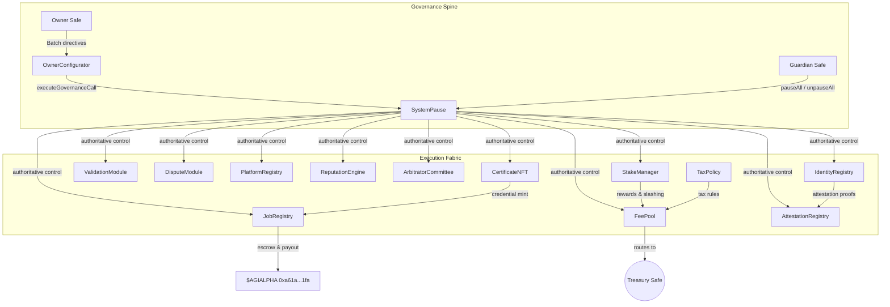

# Sovereign Labor Deployment Codex // Hyper-Current Edition

[](https://github.com/MontrealAI/agijobs-sovereign-labor-v0p1/actions/workflows/ci.yml)
[](https://github.com/MontrealAI/agijobs-sovereign-labor-v0p1/actions/workflows/branch-checks.yml)


> Field operations manual for bringing the Sovereign Labor lattice online. Follow every step and the network bends around you.
> Activate it precisely and you awaken the machine that reorganizes markets faster than legacy systems can react.

---

## Table of Contents
1. [Situational Awareness](#situational-awareness)
2. [Repository Atlas](#repository-atlas)
3. [Continuous Integration & Branch Protection](#continuous-integration--branch-protection)
4. [Toolchain & Pre-Flight Checklist](#toolchain--pre-flight-checklist)
5. [Non-Technical Operator Launch Playbook](#non-technical-operator-launch-playbook)
6. [Ethereum Mainnet Migration Script](#ethereum-mainnet-migration-script)
7. [Post-Deployment Acceptance](#post-deployment-acceptance)
8. [Owner Command Authority](#owner-command-authority)
9. [Emergency Recovery Spiral](#emergency-recovery-spiral)
10. [Immutable Evidence Archive](#immutable-evidence-archive)
11. [Reference Command Matrix](#reference-command-matrix)

---

## Situational Awareness



Everything converges on a single command spine. Ownership, pausing, treasury routing, staking economics, and identity proofs remain under the owner’s fingertips at all times.

---

## Repository Atlas

| Path | Purpose |
| --- | --- |
| [`contracts/`](../contracts) | Core Solidity modules (governance, registries, economics, pause surfaces, utilities). |
| [`migrations/`](../migrations) | Truffle migrations that bootstrap, register, and finalize the mainnet lattice. |
| [`deploy/config.mainnet.json`](./config.mainnet.json) | Canonical configuration template consumed by all migrations. |
| [`scripts/`](../scripts) | Deployment hygiene (`verify-artifacts.js`, `check-governance-matrix.mjs`, etc.). |
| [`truffle-config.js`](../truffle-config.js) | Toolchain lockfile (Solidity 0.8.30, viaIR, optimizer, network endpoints). |
| [`.github/workflows/`](../.github/workflows) | `Sovereign Compile` and `Branch Gatekeeper` workflows that guard every PR. |
| [`truffle/util/`](../truffle/util) | Shared helpers for task runners and CLI ergonomics. |

---

## Continuous Integration & Branch Protection

| Check | Workflow | Trigger | Description |
| --- | --- | --- | --- |
| Solidity lint | [`ci.yml`](../.github/workflows/ci.yml) | push, PR, manual | `npm run lint:sol` with structured summaries. |
| Compile & artifact verify | same | push, PR, manual | `npm run compile` + `node scripts/verify-artifacts.js` + artifact upload. |
| Governance surface audit | same | push, PR, manual | `npm run ci:governance` validates every privileged function. |
| Workflow hygiene | same | push, PR, manual | `actionlint` secures automation updates. |
| Branch name policy | [`branch-checks.yml`](../.github/workflows/branch-checks.yml) | push, PR | `node scripts/check-branch-name.mjs` rejects off-spec branches. |

**Required branch protection for both `main` and `develop`:**

1. Require branches to be up-to-date before merging.
2. Require status checks `Sovereign Compile` and `Branch Gatekeeper`.
3. Enforce at least one approving review (or Code Owner review).
4. Block force pushes and deletions.
5. Enable “Require signed commits” if organizational policy allows.

Enable enforcement through the GitHub CLI (repeat for each branch):

```bash
gh api \
  -X PUT \
  repos/MontrealAI/agijobs-sovereign-labor-v0p1/branches/main/protection \
  -f required_status_checks.strict=true \
  -f required_status_checks.contexts[]='Sovereign Compile' \
  -f required_status_checks.contexts[]='Branch Gatekeeper' \
  -f enforce_admins=true \
  -f required_pull_request_reviews.dismiss_stale_reviews=true \
  -F restrictions='null'
```

All CI signals remain public and green so non-technical operators can visually confirm integrity before signing.

---

## Toolchain & Pre-Flight Checklist

| Item | Why it matters | Verification |
| --- | --- | --- |
| Node 20.x & npm 10.x | Matches the lockfile and CI runtime. | `node --version`, `npm --version`. |
| Truffle 5.11.x | Aligns with optimizer + viaIR expectations. | `npx truffle version`. |
| `deploy/config.mainnet.json` | Declares owner Safe, guardian Safe, treasury Safe, canonical `$AGIALPHA` token, and governance parameters. | `jq type deploy/config.mainnet.json`, manual checksum review. |
| Secrets | `MAINNET_RPC`, `DEPLOYER_PK`, `ETHERSCAN_API_KEY`, optional `DEPLOY_CONFIG`. | `printenv | grep -E 'MAINNET|DEPLOY'` (sanitized). |
| Wallet balance | Gas for migrations and verification. | `cast balance <deployer> --rpc $MAINNET_RPC`. |
| Safe readiness | Owner and guardian signers online to accept ownership and pause if needed. | Queue `acceptOwnership` calls in Safe UI. |
| CI rehearsal | Local run mirrors GitHub Actions jobs prior to broadcast. | Commands in the launch playbook. |

---

## Non-Technical Operator Launch Playbook


### Step 0 — Clean cockpit
1. Download the tagged release into a fresh directory.
2. Populate `deploy/config.mainnet.json`:
   - `ownerSafe`, `guardianSafe`, `treasury` (EIP-55 checksum addresses).
   - Keep `$AGIALPHA` set to `0xa61a3b3a130a9c20768eebf97e21515a6046a1fa` (18 decimals).
   - Adjust `params` (platform fees, staking thresholds, slash rates) per governance mandate.
   - Update ENS roots and Merkle roots when onboarding new identity cohorts.

### Step 1 — Export secrets securely
```bash
export MAINNET_RPC="https://mainnet.infura.io/v3/<project>"
export DEPLOYER_PK="<hex-private-key-without-0x>"
export ETHERSCAN_API_KEY="<etherscan-api-token>"
export DEPLOY_CONFIG="$(pwd)/deploy/config.mainnet.json"
```
Clear the environment variables after deployment. Never persist them to disk.

### Step 2 — Mirror CI locally
```bash
npm ci --omit=optional --no-audit --no-fund
npm run lint:sol
npm run compile
node scripts/verify-artifacts.js
npm run ci:governance
```
Each command mirrors a CI job so humans and automation stay perfectly aligned.

### Step 3 — Broadcast to Ethereum mainnet
```bash
DEPLOY_CONFIG=$(pwd)/deploy/config.mainnet.json \
  npx truffle migrate --network mainnet --compile-all --f 1 --to 3 --skip-dry-run
```
The migration aborts automatically if:
- `chainId` does not equal the configuration.
- `$AGIALPHA` deviates from `0xa61a3b3a130a9c20768eebf97e21515a6046a1fa`.
- Token decimals are not `18`.
- ENS roots or treasury wiring fail validation.

### Step 4 — Verify sources and regenerate governance proofs
```bash
npm run verify:mainnet
npm run ci:governance
```
Collect verification URLs, governance audit reports, and store them with the deployment manifest.

---

## Ethereum Mainnet Migration Script

The migrations are production-hardened for chain ID `1`. Keep them intact unless extending functionality.

```javascript
// migrations/1_deploy_kernel.js
const CANONICAL_AGIALPHA = '0xa61a3b3a130a9c20768eebf97e21515a6046a1fa';

module.exports = async function (deployer, network, accounts) {
  const cfg = resolveConfig();
  const chainId = await web3.eth.getChainId();
  if (chainId !== cfg.chainId) {
    throw new Error(`Config chainId ${cfg.chainId} != network ${chainId}`);
  }

  const configuredAgi = cfg.tokens.agi.toLowerCase();
  if (chainId === 1 && configuredAgi !== CANONICAL_AGIALPHA) {
    throw new Error(`Mainnet AGIALPHA must be ${CANONICAL_AGIALPHA}, received ${configuredAgi}`);
  }

  const agiMetadata = new web3.eth.Contract(ERC20_METADATA_ABI, configuredAgi);
  const agiDecimals = Number(await agiMetadata.methods.decimals().call());
  if (agiDecimals !== 18) {
    throw new Error(`$AGIALPHA decimals must equal 18, detected ${agiDecimals}`);
  }

  // Deploy OwnerConfigurator, TaxPolicy, StakeManager, FeePool, ReputationEngine,
  // PlatformRegistry, IdentityRegistry, AttestationRegistry, CertificateNFT,
  // ValidationModule, DisputeModule, ArbitratorCommittee, SystemPause, and JobRegistry.
  // Wire pausers, treasuries, ENS roots, staking parameters, and governance roles.
};
```

1. [`1_deploy_kernel.js`](../migrations/1_deploy_kernel.js): Deploys and wires every module under `SystemPause` governance.
2. [`2_register_pause.js`](../migrations/2_register_pause.js): Reconciles pauser roles, guardian delegates, and treasury connections.
3. [`3_mainnet_finalize.js`](../migrations/3_mainnet_finalize.js): Validates final addresses, owner acceptance, and token metadata before exit.

These scripts guarantee the owner retains unilateral ability to update or pause every subsystem through governed setters.

---

## Post-Deployment Acceptance

1. Execute each `acceptOwnership` transaction from the owner Safe for IdentityRegistry, AttestationRegistry, and CertificateNFT.
2. Confirm on-chain state via Etherscan:
   - `SystemPause.owner()` → owner Safe.
   - `SystemPause.activePauser()` → guardian Safe.
   - `StakeManager.treasury()` and `FeePool.treasury()` → treasury Safe.
3. Record transaction hashes, populate `manifests/addresses.mainnet.json`, and circulate to stakeholders.
4. Share CI URLs (lint, compile, governance) alongside Safe transaction receipts for full traceability.

---

## Owner Command Authority

| Module | Critical owner functions | Invocation path |
| --- | --- | --- |
| `SystemPause` | `setModules`, `setGlobalPauser`, `refreshPausers`, `pauseAll`, `unpauseAll`, `executeGovernanceCall`. | Owner Safe → `OwnerConfigurator.configureBatch(...)` → SystemPause. |
| `StakeManager` | `setTreasury`, `setTreasuryAllowlist`, `setRoleMinimums`, `setFeePool`, `pause`, `unpause`. | Governance call executed via SystemPause. |
| `JobRegistry` | `setPlatformFeePct`, `setDisputeModule`, `configureEscrow`, `pause`, `unpause`. | Governance call executed via SystemPause. |
| `FeePool` | `setTaxPolicy`, `setRewardRole`, `setTreasury`, `pause`, `unpause`. | Governance call executed via SystemPause. |
| `ValidationModule` | `setValidatorQuorum`, `setMaxValidators`, `setStakeManager`, `pause`, `unpause`. | Governance call executed via SystemPause. |
| `DisputeModule` | `setDisputeFee`, `setDisputeWindow`, `setCommittee`, `pause`, `unpause`. | Governance call executed via SystemPause. |
| `PlatformRegistry` | `setMinPlatformStake`, `setRegistrar`, `pause`, `unpause`. | Governance call executed via SystemPause. |
| `ReputationEngine` | `setScoringWeights`, `setValidationRewardPercentage`, `setBlacklist`, `pause`, `unpause`. | Governance call executed via SystemPause. |
| `OwnerConfigurator` | `configure`, `configureBatch`, emits `ParameterUpdated` for every change. | Direct call from owner Safe. |


The owner remains in complete control—pausing, treasury routing, staking policy, validation quorums, and fee schedules respond instantly to their directives.

---

## Emergency Recovery Spiral


Operational notes:
- Guardian Safe can freeze every module in one call (`SystemPause.pauseAll()`).
- Owner Safe deploys fixes via batched governance calls.
- Re-run `npm run ci:governance` and capture diff reports before resuming.

---

## Immutable Evidence Archive

Capture and store off-chain:
- `manifests/addresses.mainnet.json` with checksum of the directory.
- GitHub Actions URLs for the merge commit (`Sovereign Compile`, `Branch Gatekeeper`).
- Safe transaction hashes (deployment, ownership acceptance, governance updates).
- Outputs from `gh api .../branches/<branch>/protection` for `main` and `develop`.
- Toolchain digests (`node --version`, `npm --version`, `npx truffle version`).
- Governance audit summaries from `npm run ci:governance`.

This dossier proves every surface matches the audited configuration.

---

## Reference Command Matrix

| Purpose | Command |
| --- | --- |
| Full CI parity | `npm run lint:sol && npm run compile && node scripts/verify-artifacts.js && npm run ci:governance` |
| Local sandbox | `npx truffle migrate --network development --reset` |
| Governance audit (table view) | `npm run ci:governance -- --format table` |
| ABI manifest export | `node scripts/write-abi-manifest.js` |
| Mainnet verification | `npm run verify:mainnet` |
| Branch hygiene (pre-push) | `node scripts/check-branch-name.mjs` |

Deploy with precision. Steward the lattice responsibly. Once it activates, economic gravity reorients around it.
