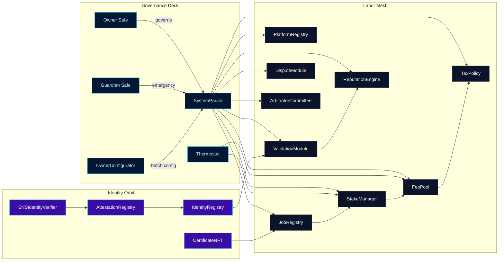
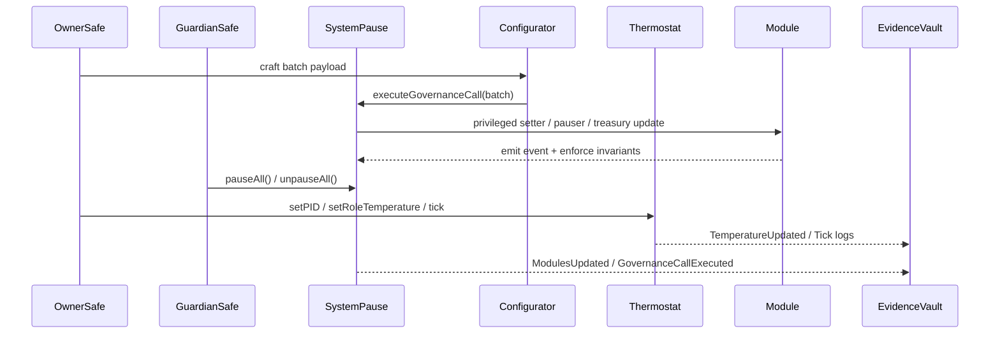
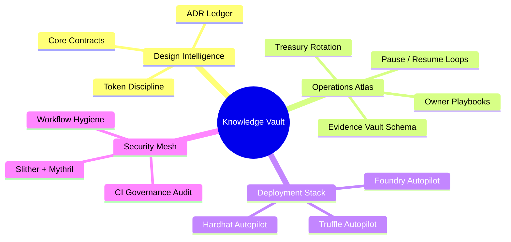
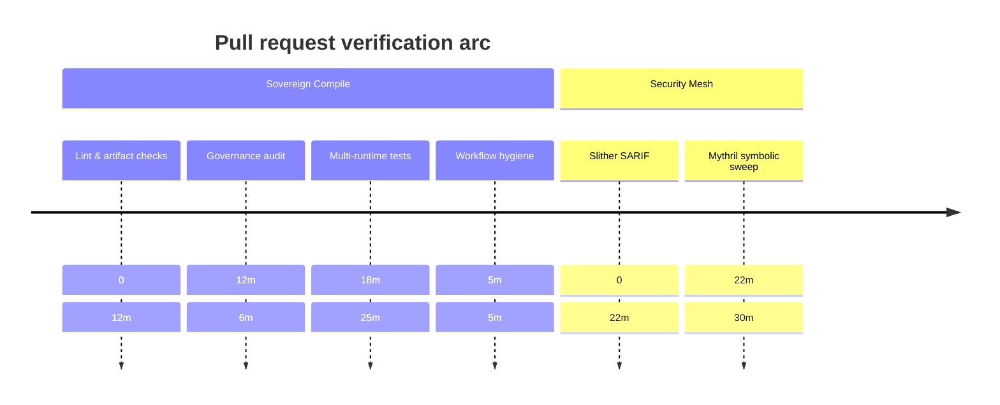

# Sovereign Labor Command Codex

[](https://github.com/MontrealAI/agijobs-sovereign-labor-v0p1/actions/workflows/ci.yml)
[](https://github.com/MontrealAI/agijobs-sovereign-labor-v0p1/actions/workflows/ci.yml)
[](https://github.com/MontrealAI/agijobs-sovereign-labor-v0p1/actions/workflows/ci.yml)
[](https://github.com/MontrealAI/agijobs-sovereign-labor-v0p1/actions/workflows/ci.yml)
[](https://github.com/MontrealAI/agijobs-sovereign-labor-v0p1/actions/workflows/security.yml)
[](https://github.com/MontrealAI/agijobs-sovereign-labor-v0p1/actions/workflows/security.yml)
[](https://github.com/MontrealAI/agijobs-sovereign-labor-v0p1/actions/workflows/security.yml)
[](https://github.com/MontrealAI/agijobs-sovereign-labor-v0p1/actions/workflows/branch-checks.yml)
[](https://etherscan.io/token/0xa61a3b3a130a9c20768eebf97e21515a6046a1fa)


> This codex narrates the present state of the sovereign labor engine—the machine engineered for the owner to steer global labor, treasury, and identity markets in real time.

---

## Table of contents

1. [Orientation](#orientation)
2. [Systems map](#systems-map)
3. [Directory atlas](#directory-atlas)
4. [Owner dominion protocol](#owner-dominion-protocol)
5. [$AGIALPHA economic instrumentation](#agialpha-economic-instrumentation)
6. [Continuous verification mesh](#continuous-verification-mesh)
7. [Quality assurance arsenal](#quality-assurance-arsenal)
8. [Deployment autopilots](#deployment-autopilots)
9. [Operational intelligence vault](#operational-intelligence-vault)
10. [Branch protection enforcement](#branch-protection-enforcement)
11. [Quickstart commands](#quickstart-commands)
12. [Execution timeline](#execution-timeline)

---

## Orientation

- **Repository scope.** Mirrors the production layout: [`contracts/`](../contracts), [`contracts/admin/`](../contracts/admin), [`contracts/utils/`](../contracts/utils), [`contracts/test/`](../contracts/test), [`deploy/`](../deploy), [`foundry/`](../foundry), [`hardhat/`](../hardhat), [`scripts/`](../scripts), [`docs/`](./), [`migrations/`](../migrations), [`truffle/`](../truffle), and `.github/workflows/`.
- **Superintelligent core.** This repository is the machine that concentrates economic leverage: governance, staking, dispute, and treasury loops obey deterministic owner commands.
- **Governance-first ergonomics.** [`SystemPause`](../contracts/SystemPause.sol) aggregates privileged setters, pausers, batch executors, and validation overrides. [`OwnerConfigurator`](../contracts/admin/OwnerConfigurator.sol) and [`Thermostat`](../contracts/Thermostat.sol) let the owner retune incentives, emission “temperature,” and treasury routes without redeploying modules.
- **Immutable guardrails.** CI hard-gates `$AGIALPHA` at `0xa61a3b3a130a9c20768eebf97e21515a6046a1fa` (18 decimals), refuses unauthorized governance drift, and verifies branch hygiene before merges.
- **Operator UX.** Non-technical operators follow narrated manifests in [`docs/operations/`](operations/) to pause, resume, rotate ownership, update token economics, and archive evidence vault artifacts.

---

## Systems map



- **Unified pause lattice.** Any module linked above can be paused/unpaused in aggregate or individually by the owner or guardian.
- **Thermal incentive tuning.** [`Thermostat`](../contracts/Thermostat.sol) is a PID controller; governance can adjust PID gains, KPI weights, per-role overrides, and safe bounds to match desired labor incentives.
- **Evidence trails.** Every privileged action emits event logs (`ModulesUpdated`, `PausersUpdated`, `GovernanceCallExecuted`, `TemperatureUpdated`) to provide replayable telemetry.

---

## Directory atlas

| Path | Contents | Highlights |
| --- | --- | --- |
| [`contracts/`](../contracts) | Solidity core, interfaces, libraries, admin tooling. | Owner-controlled modules, `Governable`, `Thermostat`, `$AGIALPHA` constants, mocks for testing. |
| [`contracts/admin/`](../contracts/admin) | Governance helpers such as `OwnerConfigurator`. | Batch parameter changes, Safe-aligned access control, manifest-driven state changes. |
| [`contracts/utils/`](../contracts/utils) | Utility libraries and modifiers. | Deterministic scaling helpers, shared math, pause mixins. |
| [`deploy/`](../deploy) | Truffle migration manifests and configuration loaders. | Deterministic deployments referencing the canonical token and Safe ownership. |
| [`migrations/`](../migrations) | Legacy Truffle scripts maintained for replayability. | Historical deployment scripts aligned with current manifests. |
| [`scripts/`](../scripts) | Node.js utilities, governance audits, branch linting. | `check-governance-matrix.mjs`, `verify-artifacts.js`, `write-compile-summary.js`, branch naming enforcement. |
| [`foundry/`](../foundry) | Foundry project configuration, scripts, and tests. | Fuzz + invariants for stake, validation, and treasury flows with canonical `$AGIALPHA`. |
| [`hardhat/`](../hardhat) | Hardhat tests, fixtures, deployment scripts. | Safe governance simulations, SystemPause control surface checks. |
| [`truffle/`](../truffle) | Truffle test helpers and config overrides. | Multi-runtime test parity, artifact reuse across suites. |
| [`docs/`](./) | Knowledge vault (design, ADRs, operations, runbooks). | Operator playbooks, architectural decisions, evidence vault schema. |
| [`.github/workflows/`](../.github/workflows) | Branch gatekeeper, CI, and security workflows. | Required status checks enforced on `main` and `develop`. |

---

## Owner dominion protocol



- **Absolute parameter control.** [`SystemPause.setModules`](../contracts/SystemPause.sol) confirms governance ownership before rewiring dependencies. [`OwnerConfigurator`](../contracts/admin/OwnerConfigurator.sol) exposes typed batch calls for updating fee splits, validators, tax policy, and registry integrations.
- **Total pause authority.** Both owner and guardian Safes can pause every module or a targeted subset. Module-level pauser managers remain delegated and verified in CI.
- **Configurable treasury routes.** [`FeePool`](../contracts/FeePool.sol) + [`TaxPolicy`](../contracts/TaxPolicy.sol) accept owner-managed destinations, rate updates, and emergency drains. `$AGIALPHA` rewards, burns, and treasuries stay responsive to business directives.
- **Thermal incentives.** [`Thermostat`](../contracts/Thermostat.sol) keeps emission pressure, backlog debt, and SLA adherence within owner-defined bounds. Integral clamping prevents runaway states; governance can override per-role targets instantly.
- **Evidence capture.** Step summaries and emitted events funnel into the Evidence Vault runbooks (`docs/operations/`) so non-technical operators can audit every change.

---

## $AGIALPHA economic instrumentation

- **Canonical token binding.** [`contracts/Constants.sol`](../contracts/Constants.sol) pins `$AGIALPHA = 0xa61a3b3a130a9c20768eebf97e21515a6046a1fa`, `AGIALPHA_DECIMALS = 18`, and `TOKEN_SCALE = 1e18`.
- **Runtime enforcement.** Stake, fee, certificate, and registry modules revert if a mismatched token or decimal drift is detected. Tests across Hardhat, Truffle, and Foundry inject the same constant to ensure parity.
- **Governance audits.** `npm run ci:governance` validates that every owner-facing setter, pauser, and configurator call remains exposed and that `$AGIALPHA` constants match manifests. CI fails if any new surface lacks owner authority.
- **Treasury instrumentation.** Fee splits, burn ratios, treasury recipients, tax acknowledgements, and certificate flows are all owner-controlled, enabling instant retuning of capital flows.
- **Deployment manifests.** [`scripts/deploy/load-config.js`](../scripts/deploy/load-config.js) and migration configs reject any token address other than the canonical `$AGIALPHA`.

---

## Continuous verification mesh

```mermaid
flowchart LR
    A[Commit / PR] --> B[Branch Gatekeeper\nbranch-checks.yml]
    B --> C[Sovereign Compile\nci.yml]
    C --> C1[Solhint lint]
    C1 --> C2[Truffle compile + artifact verification]
    C2 --> C3[Governance matrix audit]
    C3 --> C4[Truffle + Hardhat + Foundry tests]
    C --> C5[Workflow hygiene]
    A --> D[Security Scans\nsecurity.yml]
    D --> D1[Slither SARIF]
    D1 --> D2[Mythril symbolic execution]
    C & D --> E[GitHub Checks\n(required on PRs)]
    E --> F[Protected branches\nmain + develop]
```

- **Fully green CI.** All workflows run on pushes and pull requests; badges above mirror required checks so reviewers see status instantly. `workflow-hygiene` lints GitHub Actions with `actionlint`.
- **Concurrency hygiene.** Each workflow scopes concurrency to prevent races while retaining artifact reuse and caching.
- **Evidence artifacts.** Slither SARIF, Mythril traces, compile summaries, and governance audits upload as artifacts for external review.
- **Principle of least privilege.** Workflows execute with read-only repository permissions and no long-lived secrets. Manual approval gates remain available through GitHub environments if desired.

---

## Quality assurance arsenal

| Surface | Command | What it verifies |
| --- | --- | --- |
| Solidity lint | `npm run lint:sol` | Zero-warning Solhint coverage across `contracts/**`. |
| Compile + artifacts | `npm run compile` → `node scripts/verify-artifacts.js` | ABI/bytecode parity, canonical build artifacts, checksum drift detection. |
| Governance matrix | `npm run ci:governance` | Owner + guardian setter coverage, `$AGIALPHA` invariants, module ownership assertions. |
| Branch hygiene | `npm run lint:branch <branch-name>` | Enforces semantic branch naming for automation clarity. |
| Truffle regression | `npm run test:truffle:ci` | Multi-module flows using prebuilt artifacts. |
| Hardhat scenarios | `npm run test:hardhat` | Safe governance simulation, pause lattice, treasury reconfiguration. |
| Foundry invariants | `npm run test:foundry` | Fuzz + invariant checks against canonical token bindings and Thermostat tuning. |

> _Local tip:_ install Foundry (`curl -L https://foundry.paradigm.xyz | bash && foundryup`) before running `npm run test:foundry` to match CI parity.

---

## Deployment autopilots

- **Truffle migrations.** [`truffle-config.js`](../truffle-config.js) + [`migrations/`](../migrations) encode mainnet, testnet, and rehearsal flows with environment variable hooks for Safe addresses. Each migration writes manifests under `manifests/` for the Evidence Vault.
- **Hardhat scripts.** [`hardhat/scripts/deploy-mainnet.js`](../hardhat/scripts/deploy-mainnet.js) mirrors production Safe governance and reuses Truffle artifacts for deterministic addresses.
- **Foundry scripts.** [`foundry/script/DeployMainnet.s.sol`](../foundry/script/DeployMainnet.s.sol) supports `forge script ... --broadcast` flows with checkpoint manifests and post-broadcast verification helpers.
- **Deterministic constants.** [`scripts/generate-constants.ts`](../scripts/generate-constants.ts) keeps on-chain constants synchronized with deployment metadata.
- **Operator manifests.** [`docs/operations/`](operations/) narrates how to capture GitHub run URLs, manifest checksums, and event logs so non-technical staff can execute deployments safely.

---

## Operational intelligence vault



| Need | Start here |
| --- | --- |
| Contract wiring & threat models | [`docs/design/core-contracts.md`](design/core-contracts.md) |
| Architectural decisions | [`docs/adr/`](adr/) |
| Owner + guardian playbooks | [`docs/operations/README.md`](operations/README.md) |
| Owner command reference | [`docs/operations/owner-control.md`](operations/owner-control.md) |
| Evidence vault templates | [`docs/operations/evidence-vault.md`](operations/evidence-vault.md) |

---

## Branch protection enforcement

1. **Enable required status checks** on `main` and `develop` for:
   - `Branch Gatekeeper`
   - `Sovereign Compile / Solidity lint`
   - `Sovereign Compile / Compile smart contracts`
   - `Sovereign Compile / Governance surface audit`
   - `Sovereign Compile / Test suites`
   - `Sovereign Compile / Workflow hygiene`
   - `Security Scans / Slither static analysis`
   - `Security Scans / Mythril symbolic execution`
2. **Require pull request reviews** with code owner approvals and block force pushes.
3. **Automate setup with GitHub CLI (optional):**

   ```bash
   gh api \
     --method PUT \
     -H "Accept: application/vnd.github+json" \
     /repos/MontrealAI/agijobs-sovereign-labor-v0p1/branches/main/protection \
     --input .github/protection-main.json
   ```

   Provide a matching JSON file listing required checks to guarantee parity with CI. Repeat for the `develop` branch.

---

## Quickstart commands

```bash
npm ci --omit=optional --no-audit --no-fund
npm run lint:sol
npm run compile && node scripts/verify-artifacts.js
npm run ci:governance
npm run test:truffle:ci
npm run test:hardhat
# Install Foundry locally before executing the following:
npm run test:foundry
```

- **Environment:** Node.js 20.x, npm 10.x+, solc 0.8.30, Foundry stable (`forge`, `cast`).
- **Artifacts:** Truffle build outputs land in `build/contracts`. Foundry artifacts live in `foundry/out`. Governance audits expect manifests under `manifests/`.

---

## Execution timeline



- **Telemetry-first:** Every job appends summaries to the GitHub run log for fast operator review and Evidence Vault archival.
- **Artifact retention:** Security artifacts persist for 14 days, enabling auditors to reproduce analyses.
- **Scalable cadence:** `security.yml` runs on every push, pull request, and weekly (`cron: '17 3 * * 1'`) so the machine remains continuously verified.

