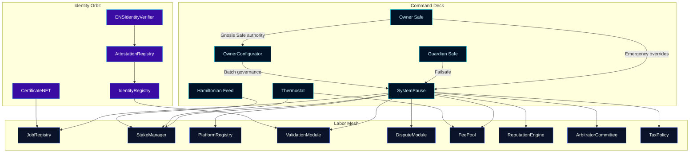
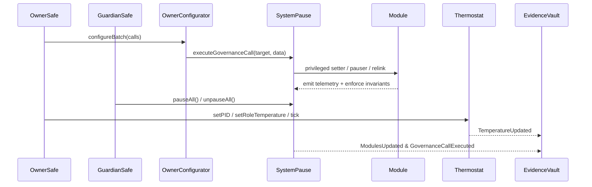

# Sovereign Labor Control Codex

[](https://github.com/MontrealAI/agijobs-sovereign-labor-v0p1/actions/workflows/ci.yml)
[](https://github.com/MontrealAI/agijobs-sovereign-labor-v0p1/actions/workflows/branch-checks.yml)
[](https://github.com/MontrealAI/agijobs-sovereign-labor-v0p1/actions/workflows/security.yml)
[](https://etherscan.io/token/0xa61a3b3a130a9c20768eebf97e21515a6046a1fa)


> This repository is the orchestrated labor engine that concentrates intelligence, capital, and identity into one owner-commanded powerhouse. Every subsystem is observable, configurable, and immediately deployable for non-technical pilots operating in production-critical environments.

---

## Table of contents

1. [Strategic briefing](#strategic-briefing)
2. [Sovereign systems map](#sovereign-systems-map)
3. [Contract constellation](#contract-constellation)
4. [Owner command surfaces](#owner-command-surfaces)
5. [$AGIALPHA canon](#agialpha-canon)
6. [Operational playbooks](#operational-playbooks)
7. [Continuous verification mesh](#continuous-verification-mesh)
8. [Security and branch protection](#security-and-branch-protection)
9. [Launch checklist](#launch-checklist)
10. [Deployment autopilots](#deployment-autopilots)
11. [Telemetry vault protocol](#telemetry-vault-protocol)
12. [Directory atlas](#directory-atlas)
13. [Governance timeline](#governance-timeline)

---

## Strategic briefing

- **Production mirror.** The repository structure mirrors mainnet layout with audited contracts under [`contracts/`](../contracts), deployment manifests in [`deploy/`](../deploy), and multi-tool runners in [`scripts/`](../scripts), [`hardhat/`](../hardhat), [`foundry/`](../foundry), and [`truffle/`](../truffle).
- **Owner-dominant governance.** Every critical contract inherits [`Governable`](../contracts/Governable.sol) or implements Safe-owned guards so the owner can rewire, pause, or retune parameters without redeployment, as detailed in the design dossier [`docs/design/core-contracts.md`](design/core-contracts.md).
- **Non-technical operability.** Narrated playbooks in [`docs/operations/`](operations/) translate Safe transactions into copy/paste manifests, guaranteeing deterministic execution for guardians and treasury operators.
- **Immutable alignment.** Constants such as the `$AGIALPHA` binding and burn routes are pinned in [`contracts/Constants.sol`](../contracts/Constants.sol), ensuring every runtime entrypoint resolves to the canonical token and scaling factors.

---

## Sovereign systems map



- **Unified pause lattice.** [`SystemPause`](../contracts/SystemPause.sol) orchestrates module rewiring, pauser delegation, and global halt/resume primitives so the owner can freeze or resume the entire mesh in one transaction.
- **Thermal incentive tuning.** [`Thermostat`](../contracts/Thermostat.sol) and the Hamiltonian feed consumed by [`StakeManager`](../contracts/StakeManager.sol) align issuance pressure, staking demand, and dispute intensity using PID-style parameters the owner can retune live.
- **Identity-linked validation.** [`IdentityRegistry`](../contracts/IdentityRegistry.sol) anchors ENS and Merkle roots while [`ValidationModule`](../contracts/ValidationModule.sol) consumes those roots to gate validators, dispute flows, and staking decisions.

---

## Contract constellation

| Domain | Contract | Purpose | Owner leverage |
| --- | --- | --- | --- |
| Governance shell | [`SystemPause`](../contracts/SystemPause.sol) | Central pause lattice, module registry, and governance call router. | Assign/refresh pausers, batch-govern modules, forward arbitrary owner-approved calls. |
| Staking engine | [`StakeManager`](../contracts/StakeManager.sol) | Manages staking ledgers, thermals, Hamiltonian thresholds, and reward flows. | Set thermostats, Hamiltonian feeds, stake minima, treasury routes, slashing parameters. |
| Job protocol | [`JobRegistry`](../contracts/JobRegistry.sol) | Coordinates job postings, validator requirements, dispute hooks, and payouts. | Swap module integrations, configure fees, enforce certificate and identity bindings. |
| Validation mesh | [`ValidationModule`](../contracts/ValidationModule.sol) | Runs validator admission, quorum math, penalty regimes, and module hooks. | Adjust quorum, penalties, validator pools, cross-module pointers. |
| Treasury fabric | [`FeePool`](../contracts/FeePool.sol) | Aggregates fees, burns, rewards, and treasury remits. | Assign treasuries, burn percentages, rewarders, pausers, stake manager links. |
| Reputation orbit | [`ReputationEngine`](../contracts/ReputationEngine.sol) | Scores actors and feeds job gating. | Curate callers, weighting, thresholds, blacklist, stake manager linkage. |
| Platform registry | [`PlatformRegistry`](../contracts/PlatformRegistry.sol) | Onboards platforms and enforces stake commitments. | Update stake requirements, registrars, allowlists, blacklists. |
| Dispute tribunal | [`DisputeModule`](../contracts/modules/DisputeModule.sol) | Arbitrates disputes and routes penalties. | Configure committee, tax policy, dispute fees, resolution windows, moderators. |
| Arbitration council | [`ArbitratorCommittee`](../contracts/ArbitratorCommittee.sol) | Governs arbitrator membership and pause permissions. | Set committee composition, pause roles, dispute windows, slashing rules. |
| Tax canon | [`TaxPolicy`](../contracts/TaxPolicy.sol) | Publishes canonical tax policy URIs and acknowledgements. | Update policy URIs, acknowledgement authorizers, metadata. |
| Identity spine | [`IdentityRegistry`](../contracts/IdentityRegistry.sol) | Maintains identity roots, ENS hooks, and attestation bindings. | Refresh Merkle roots, attestation registries, ENS/name wrapper adapters. |
| Attestation anchor | [`AttestationRegistry`](../contracts/AttestationRegistry.sol) | Captures attestations tied to ENS/name wrapper anchors. | Rebind ENS/name wrapper controllers, adjust authorized callers. |
| Credential layer | [`CertificateNFT`](../contracts/CertificateNFT.sol) | Issues certificates backed by job outcomes. | Configure base URIs, minters, pausers, and supply controls. |

---

## Owner command surfaces



- **Absolute parameter control.** `onlyGovernance` modifiers across the lattice (e.g., [`SystemPause.setModules`](../contracts/SystemPause.sol#L134-L213), [`StakeManager.setThermostat`](../contracts/StakeManager.sol#L523-L531), [`StakeManager.setHamiltonianFeed`](../contracts/StakeManager.sol#L533-L540), and [`StakeManager.configureAutoStake`](../contracts/StakeManager.sol#L587-L621)) enforce that the owner Safe remains the single source of truth for parameter changes.
- **Total pause authority.** Guardians and owners share deterministic halt/resume power through [`pauseAll`](../contracts/SystemPause.sol#L292-L304), [`unpauseAll`](../contracts/SystemPause.sol#L304-L314), and [`refreshPausers`](../contracts/SystemPause.sol#L216-L232).
- **Batch configurability.** [`OwnerConfigurator`](../contracts/admin/OwnerConfigurator.sol) streams batched governance actions with auditable events so non-technical operators can enact complex migrations via manifests.
- **Thermal tuning.** [`Thermostat`](../contracts/Thermostat.sol#L55-L121) exposes PID loops, KPI weights, and role temperatures that can be retuned without redeployment, ensuring issuance pressure and dispute load remain in the owner’s control.

---

## $AGIALPHA canon

- **Canonical binding.** `$AGIALPHA` resolves to `0xa61a3b3a130a9c20768eebf97e21515a6046a1fa` with `18` decimals as locked in [`contracts/Constants.sol`](../contracts/Constants.sol).
- **Runtime enforcement.** Modules import `Constants` to guarantee staking, fee, and dispute flows reject mismatched tokens or scaling drift (see [`StakeManager`](../contracts/StakeManager.sol#L218-L249) and [`FeePool`](../contracts/FeePool.sol#L70-L126)).
- **Deployment guards.** The deployment loader [`scripts/deploy/load-config.js`](../scripts/deploy/load-config.js) refuses alternate token addresses, ensuring Truffle, Hardhat, and Foundry pipelines deploy against the canonical asset every time.

---

## Operational playbooks

- **Operations atlas.** [`docs/operations/README.md`](operations/README.md) visualizes end-to-end Safe flows for pausing, treasury rotation, and validator reconfiguration.
- **Owner control primers.** [`docs/operations/owner-control.md`](operations/owner-control.md) delivers copy-ready transaction manifests for guardians, treasurers, and compliance officers.
- **Design insights.** [`docs/design/core-contracts.md`](design/core-contracts.md) explains how each contract collaborates, including threat models and invariant expectations.
- **Architectural decisions.** `docs/adr/` captures the recorded architectural decision process so auditors can trace rationale over time.

---

## Continuous verification mesh

```mermaid
flowchart LR
    Lint[Solidity Lint]\n`npm run lint:sol`
    Compile[Truffle Compile]\n`npm run compile`
    GovAudit[Governance Matrix]\n`npm run ci:governance`
    TruffleTest[Truffle Spec]\n`npm test`
    HardhatTest[Hardhat Spec]\n`npm run test:hardhat`
    FoundryTest[Foundry Spec]\n`npm run test:foundry`
    Slither[Slither Static]\n`slither .`
    Mythril[Mythril Symbolic]
    Lint --> Compile --> GovAudit
    GovAudit --> TruffleTest --> HardhatTest --> FoundryTest
    Compile --> Slither --> Mythril
    classDef primary fill:#14213d,stroke:#fca311,color:#f1faee;
    classDef security fill:#1b4332,stroke:#2d6a4f,color:#f1faee;
    class Lint,Compile,GovAudit,TruffleTest,HardhatTest,FoundryTest primary;
    class Slither,Mythril security;
```

- **`Sovereign Compile`.** [.github/workflows/ci.yml](../.github/workflows/ci.yml) enforces linting, compilation, and governance audits on every push and pull request against `main`, `develop`, and release branches.
- **`Branch Gatekeeper`.** [.github/workflows/branch-checks.yml](../.github/workflows/branch-checks.yml) blocks non-compliant branch names and provides immediate operator feedback.
- **`Security Scans`.** [.github/workflows/security.yml](../.github/workflows/security.yml) orchestrates Foundry builds, Slither static analysis, and Mythril symbolic execution with SARIF uploads for vulnerability management.
- **Local mirroring.** `npm run test:ci` executes the same matrix locally; `npm run ci:governance` validates Safe reachability, pause lattice wiring, and `$AGIALPHA` bindings before any deployment.

---

## Security and branch protection

1. **Enforce required checks.** Protect `main` and `develop` branches in GitHub with required status checks: `Sovereign Compile`, `Branch Gatekeeper`, and `Security Scans`. Require linear history and signed commits for production environments.
2. **Mandatory reviews.** Require at least one code owner review for changes touching `contracts/`, `docs/`, or deployment manifests. Pair with Safe approval policies before on-chain execution.
3. **Artifact retention.** Retain GitHub Action artifacts for a minimum of 30 days so auditors can reconstruct compile outputs and SARIF reports.
4. **Secret hygiene.** Keep private keys and RPC endpoints in GitHub Actions secrets or organization-level environments; never commit `.env` files.

---

## Launch checklist

1. **Install toolchain.**
   ```bash
   npm ci --omit=optional --no-audit --no-fund
   forge install
   ```
2. **Compile + lint.**
   ```bash
   npm run lint:sol
   npm run compile
   ```
3. **Verify governance health.**
   ```bash
   npm run ci:governance
   ```
4. **Execute full spec suite.**
   ```bash
   npm run test:ci
   ```
5. **Review evidence.** Store the generated `build/contracts` artifacts, GitHub Action summaries, and Safe transaction hashes in your compliance vault before mainnet promotion.

Every step is scripted for non-technical operators—copy each command into the preferred terminal or CI runner and record the resulting logs.

---

## Deployment autopilots

| Network mode | Command | Notes |
| --- | --- | --- |
| Truffle mainnet | `npm run deploy:truffle:mainnet` | Uses [`migrations/`](../migrations) and manifest guards from [`scripts/deploy/load-config.js`](../scripts/deploy/load-config.js). |
| Hardhat mainnet | `npm run deploy:hardhat:mainnet` | Executes [`hardhat/scripts/deploy-mainnet.js`](../hardhat/scripts/deploy-mainnet.js) with governance checks before broadcasting. |
| Foundry mainnet | `npm run deploy:foundry:mainnet` | Calls [`foundry/script/DeployMainnet.s.sol`](../foundry/script/DeployMainnet.s.sol) and respects the `$AGIALPHA` bindings enforced by `Constants`. |

All deployment flows expect environment variables (RPC URLs, mnemonics) to be supplied via secure secrets. Each autopilot emits transaction manifests and Safe-ready calldata payloads for review.

---

## Telemetry vault protocol

1. **Manifest archive.** Store governance manifests and action reports under `manifests/` or your compliance repository so every parameter mutation is versioned.
2. **Event capture.** Subscribe to `ModulesUpdated`, `GovernanceCallExecuted`, `TemperatureUpdated`, and module-specific events surfaced in [`StakeManager`](../contracts/StakeManager.sol#L523-L623), [`SystemPause`](../contracts/SystemPause.sol#L253-L314), and [`Thermostat`](../contracts/Thermostat.sol#L86-L121).
3. **CI mirroring.** After executing on-chain governance, rerun `npm run ci:governance`, `npm run test:truffle:ci`, `npm run test:hardhat`, and `npm run test:foundry` to confirm deterministic parity.
4. **Evidence vault.** Consolidate Safe transaction hashes, CLI logs, and workflow URLs (`Sovereign Compile`, `Security Scans`) into an auditor-facing vault for continuous compliance.

---

## Directory atlas

| Path | Role |
| --- | --- |
| [`contracts/`](../contracts) | Solidity contracts, interfaces, utilities, and tests. |
| [`deploy/`](../deploy) | Network manifests and deployment parameters. |
| [`foundry/`](../foundry) | Foundry configuration, scripts, and tests. |
| [`hardhat/`](../hardhat) | Hardhat tasks, configuration, and deployment scripts. |
| [`migrations/`](../migrations) | Truffle migration scripts. |
| [`scripts/`](../scripts) | Shared governance, verification, and deployment utilities. |
| [`docs/`](./) | Design dossiers, operations manuals, and ADRs. |
| [`truffle/`](../truffle) | Truffle-specific configuration helpers. |
| [`.github/workflows/`](../.github/workflows) | CI/CD orchestrations enforcing lint, compile, security, and branch policies. |

---

## Governance timeline

- **Genesis deployment.** Use Truffle migrations with canonical manifests to seed the job mesh, treasury routes, and `$AGIALPHA` bindings.
- **Continuous calibration.** Run OwnerConfigurator manifests (see [`docs/operations/owner-control.md`](operations/owner-control.md)) whenever validator policy, treasury destinations, or dispute windows need tuning.
- **Emergency posture.** Keep guardian Safe keys ready to trigger `pauseAll`/`unpauseAll`; regularly exercise the flow in staging networks using the provided manifests.
- **Audit cadence.** Schedule periodic security runs via the `Security Scans` workflow and archive SARIF findings even when empty to demonstrate continuous monitoring.

This codex is intentionally composed so the owner remains in complete control—able to pause, reconfigure, and redeploy incentives in moments—while every guardian and operator can follow deterministic, tested procedures backed by the continuous verification mesh.
