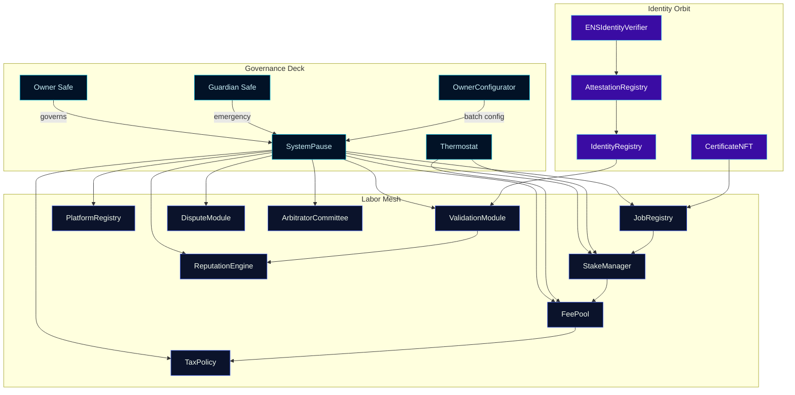
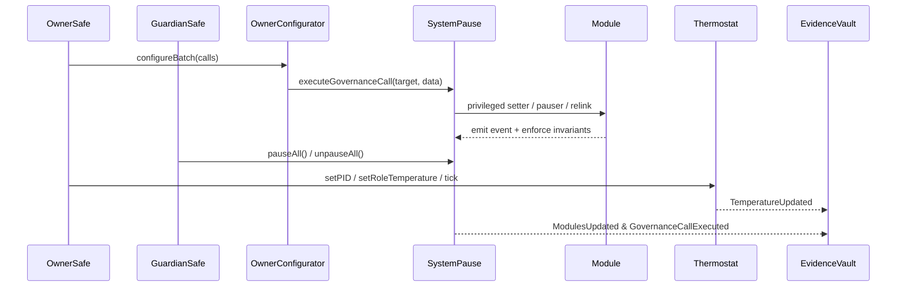
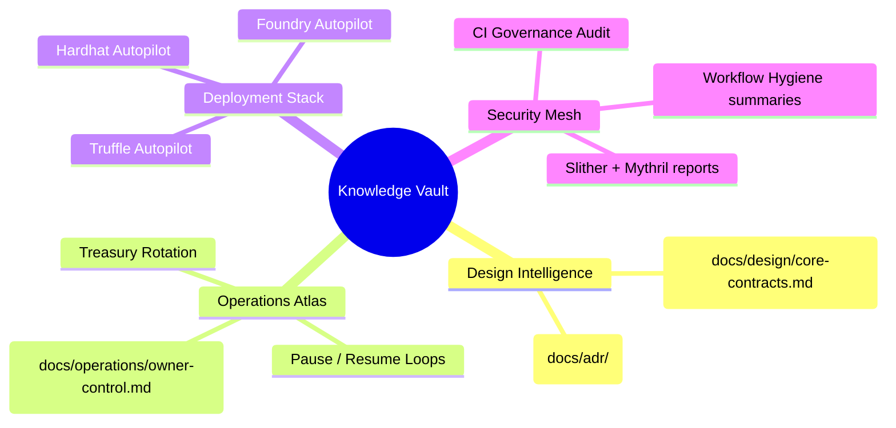

# Sovereign Labor Control Codex

[](https://github.com/MontrealAI/agijobs-sovereign-labor-v0p1/actions/workflows/ci.yml)
[](https://github.com/MontrealAI/agijobs-sovereign-labor-v0p1/actions/workflows/branch-checks.yml)
[](https://github.com/MontrealAI/agijobs-sovereign-labor-v0p1/actions/workflows/security.yml)
[](https://etherscan.io/token/0xa61a3b3a130a9c20768eebf97e21515a6046a1fa)


> This codex describes the living labor engine that concentrates intelligence, capital, and identity into a single owner-steered machine. Every surface is observable, owner-controlled, unstoppable, and production-hardened.

---

## Table of contents

1. [Orientation](#orientation)
2. [Architecture constellation](#architecture-constellation)
3. [Owner mastery protocol](#owner-mastery-protocol)
4. [$AGIALPHA discipline](#agialpha-discipline)
5. [Directory atlas](#directory-atlas)
6. [Owner command surface](#owner-command-surface)
7. [Continuous verification mesh](#continuous-verification-mesh)
8. [Quality assurance arsenal](#quality-assurance-arsenal)
9. [Deployment autopilots](#deployment-autopilots)
10. [Operational intelligence vault](#operational-intelligence-vault)
11. [Branch protection enforcement](#branch-protection-enforcement)
12. [Quickstart commands](#quickstart-commands)
13. [Execution timeline](#execution-timeline)

---

## Orientation

- **Repository scope.** Mirrors production layout: [`contracts/`](../contracts), [`contracts/admin/`](../contracts/admin), [`contracts/utils/`](../contracts/utils), [`contracts/interfaces/`](../contracts/interfaces), [`contracts/libraries/`](../contracts/libraries), [`contracts/modules/`](../contracts/modules), [`deploy/`](../deploy), [`foundry/`](../foundry), [`hardhat/`](../hardhat), [`migrations/`](../migrations), [`scripts/`](../scripts), [`truffle/`](../truffle), [`docs/`](./), and [`.github/workflows/`](../.github/workflows).
- **Owner-first intelligence.** The machine orients around Safe-governed authority: every core module inherits [`Governable`](../contracts/Governable.sol) or `Ownable` scaffolding wired to the owner’s Safe.
- **Emergency readiness.** [`SystemPause`](../contracts/SystemPause.sol) aggregates pausers, privileged setters, and governance calls so the owner can halt, redirect, or relink every module in one motion.
- **Operator UX.** Non-technical pilots follow narrated manifests in [`docs/operations/`](operations/) and [`docs/operations/owner-control.md`](operations/owner-control.md) to pause, resume, rotate treasuries, and publish manifests without handcrafting calldata.

---

## Architecture constellation



- **Unified pause lattice.** Any module in the mesh responds to `pauseAll`, `unpauseAll`, and targeted pauser delegation orchestrated by [`SystemPause`](../contracts/SystemPause.sol).
- **Thermal incentive tuning.** [`Thermostat`](../contracts/Thermostat.sol) runs PID-style control to maintain issuance pressure, backlog debt, and SLA compliance with owner-defined gains.
- **Identity-linked validation.** [`IdentityRegistry`](../contracts/IdentityRegistry.sol) and [`AttestationRegistry`](../contracts/AttestationRegistry.sol) feed [`ValidationModule`](../contracts/ValidationModule.sol), ensuring proofs-of-work stay tied to curated identity roots.

---

## Owner mastery protocol



- **Absolute parameter control.** [`SystemPause.setModules`](../contracts/SystemPause.sol#L134-L205) confirms Safe ownership before rewiring dependencies; [`SystemPause.executeGovernanceCall`](../contracts/SystemPause.sol#L253-L290) relays arbitrary owner-approved calls with revert-on-failure guarantees.
- **Total pause authority.** Owner and guardian Safes operate `pauseAll`, `unpauseAll`, and per-module pauser handoffs to maintain deterministic fail-safes.
- **Configurable treasuries.** [`StakeManager.setTreasury`](../contracts/StakeManager.sol#L1251-L1253) and [`FeePool.setTreasury`](../contracts/FeePool.sol#L442-L447) give the owner full routing control over value streams.
- **Thermal incentives.** [`Thermostat.setPID`](../contracts/Thermostat.sol#L55-L89) and role-specific setters expose real-time issuance tuning without redeployment.
- **Auditable trail.** `ParameterUpdated`, `ModulesUpdated`, `PausersUpdated`, and `TemperatureUpdated` events supply the Evidence Vault captured in operations playbooks.

---

## $AGIALPHA discipline

- **Canonical binding.** [`Constants.sol`](../contracts/Constants.sol#L5-L27) pins `$AGIALPHA` to `0xa61a3b3a130a9c20768eebf97e21515a6046a1fa` with `18` decimals and exposes scaling helpers for every consumer contract.
- **Runtime enforcement.** Stake, fee, dispute, and registry modules import `Constants` to reject any mismatched token address or decimal drift.
- **Governance audit parity.** `npm run ci:governance` asserts that the canonical address threads every module and that owner/guardian setters remain reachable.
- **Deployment manifests.** [`scripts/deploy/load-config.js`](../scripts/deploy/load-config.js) refuses alternate token addresses, ensuring Truffle, Hardhat, and Foundry autopilots stay synchronized.

---

## Directory atlas

| Path | Contents | Highlights |
| --- | --- | --- |
| [`contracts/`](../contracts) | Solidity source for the labor machine. | Core modules (`JobRegistry`, `StakeManager`, `ValidationModule`, `FeePool`, etc.) inherit Safe-governed access control. |
| [`contracts/admin/`](../contracts/admin) | Governance helper contracts. | [`OwnerConfigurator`](../contracts/admin/OwnerConfigurator.sol) batches parameter updates with event-rich telemetry. |
| [`contracts/utils/`](../contracts/utils) | Utility mixins and ownership scaffolding. | [`CoreOwnable2Step`](../contracts/utils/CoreOwnable2Step.sol) for Safe migrations, math helpers, pausability mixins. |
| [`contracts/interfaces/`](../contracts/interfaces) | Canonical ABI surfaces. | Interface definitions for cross-module calls and off-chain automation. |
| [`contracts/libraries/`](../contracts/libraries) | Pure math and struct helpers. | Deterministic scaling, epoch math, and reward distribution helpers. |
| [`contracts/modules/`](../contracts/modules) | Secondary modules. | [`DisputeModule`](../contracts/modules/DisputeModule.sol) for challenge arbitration. |
| [`contracts/test/`](../contracts/test) | Mocks and harnesses. | Deterministic fixtures for invariants and scenario tests. |
| [`deploy/`](../deploy) | Mainnet configuration + operator manual. | `config.mainnet.json` templates and deployment evidence guides. |
| [`foundry/`](../foundry) | Forge config, scripts, and tests. | Invariant suites and `DeployMainnet.s.sol` autopilot writing manifests. |
| [`hardhat/`](../hardhat) | Hardhat tests + scripts. | Safe governance simulations verifying pause + treasury surfaces. |
| [`migrations/`](../migrations) | Truffle migration scripts + documentation. | Idempotent broadcasts that emit manifests for the Evidence Vault. |
| [`scripts/`](../scripts) | Node.js automation. | Branch linting, governance matrix auditing, artifact verification, owner treasury helper. |
| [`truffle/`](../truffle) | Truffle configuration + utilities. | Manifest writers, deterministic compile settings, deployment codex. |
| [`docs/`](./) | Knowledge base. | Design dossiers, ADR ledger, operations atlas. |
| [`.github/workflows/`](../.github/workflows) | GitHub Actions pipelines. | Branch gatekeeper, Sovereign Compile, and security scans enforced on protected branches. |

---

## Owner command surface

- **Pause lattice.** [`SystemPause.pauseAll`](../contracts/SystemPause.sol#L292-L304), `unpauseAll`, and pauser delegation functions allow instant halt/resume cycles across all core modules.
- **Module rewiring.** [`SystemPause.setModules`](../contracts/SystemPause.sol#L134-L205) verifies ownership before relinking registries, fee pools, dispute engines, or tax policies.
- **Batch configuration.** [`OwnerConfigurator.configureBatch`](../contracts/admin/OwnerConfigurator.sol#L101-L112) emits structured `ParameterUpdated` events for every owner-driven change.
- **Treasury orchestration.** [`StakeManager`](../contracts/StakeManager.sol#L1251-L1264) and [`FeePool`](../contracts/FeePool.sol#L442-L451) expose `setTreasury` and allowlist setters so the owner controls reward/burn routing.
- **Validator discipline.** [`ValidationModule`](../contracts/ValidationModule.sol#L300-L363) surfaces quorum, window, and failover setters restricted to governance.
- **Incentive thermostat.** [`Thermostat`](../contracts/Thermostat.sol#L55-L155) offers PID gains, role overrides, and tick operations gated behind governance, enabling live economic tuning.
- **Identity cadence.** [`IdentityRegistry`](../contracts/IdentityRegistry.sol#L317-L392) and [`AttestationRegistry`](../contracts/AttestationRegistry.sol#L77-L110) let the owner refresh Merkle roots, ENS nodes, and certificate issuers.

---

## Continuous verification mesh

```mermaid
flowchart LR
    A[Commit / PR] --> B[Branch Gatekeeper\nbranch-checks.yml]
    B --> C[Sovereign Compile\nci.yml]
    C --> C1[Solidity lint]
    C --> C2[Compile smart contracts\n+ artifact verify]
    C --> C3[Governance surface audit]
    C --> C4[Test suites\nTruffle + Hardhat + Foundry]
    C --> C5[Workflow hygiene]
    A --> D[Security Scans\nsecurity.yml]
    D --> D1[Slither static analysis]
    D --> D2[Mythril symbolic execution]
    B & C & D --> E[GitHub Checks\n(required)]
    E --> F[Protected branches\nmain & develop]
```

- **Fully green CI.** Every workflow runs on push and pull requests; required status checks mirror the badges above so reviewers see live health immediately.
- **Concurrency hygiene.** Pipelines scope concurrency groups (`sovereign-${{ github.workflow }}`, `security-${{ github.workflow }}`) to avoid stale artifacts while retaining cache reuse.
- **Principle of least privilege.** All workflows execute with read-only repository permissions and ephemeral toolchains.
- **Evidence artifacts.** Slither SARIF, Mythril traces, compile summaries, and governance audits upload as artifacts for archival in the Evidence Vault.

---

## Quality assurance arsenal

| Surface | Command | What it verifies |
| --- | --- | --- |
| Solidity lint | `npm run lint:sol` | Zero-warning Solhint coverage across `contracts/**`. |
| Compile + artifact parity | `npm run compile` → `node scripts/verify-artifacts.js` | ABI/bytecode parity, checksum drift detection, manifest-ready build outputs. |
| Governance matrix | `npm run ci:governance` | Ensures owner + guardian setters remain reachable, `$AGIALPHA` constants match manifests, and pause surfaces stay wired. |
| Branch hygiene | `npm run lint:branch <branch>` | Enforces semantic branch naming for automation clarity. |
| Truffle regression | `npm run test:truffle:ci` | Executes multi-module flows using shared artifacts. |
| Hardhat scenarios | `npm run test:hardhat` | Simulates Safe governance, pause lattice control, and treasury reconfiguration. |
| Foundry invariants | `npm run test:foundry` | Fuzz + invariant suites anchored to canonical `$AGIALPHA` bindings. |

> _Field tip:_ Install Foundry (`curl -L https://foundry.paradigm.xyz | bash && foundryup`) before running the Forge suite to mirror CI parity.

---

## Deployment autopilots

- **Truffle migrations.** [`migrations/`](../migrations) with [`truffle-config.js`](../truffle-config.js) execute deterministic broadcasts, transfer ownership to the Safe, and emit manifests under `manifests/` (created during the run) for archival.
- **Hardhat scripts.** [`hardhat/scripts/deploy-mainnet.js`](../hardhat/scripts/deploy-mainnet.js) mirrors production Safe governance while reusing Truffle artifacts for deterministic addresses.
- **Foundry scripts.** [`foundry/script/DeployMainnet.s.sol`](../foundry/script/DeployMainnet.s.sol) supports `forge script ... --broadcast` flows that emit the same manifest schema as the JavaScript pipelines.
- **Deterministic constants.** [`contracts/Constants.sol`](../contracts/Constants.sol#L1-L20) is auto-generated by the release toolchain; [`deploy/config.mainnet.json`](../deploy/config.mainnet.json) and [`scripts/deploy/load-config.js`](../scripts/deploy/load-config.js) keep runtime inputs aligned with the canonical token metadata.
- **Operator manifests.** [`deploy/README.md`](../deploy/README.md) explains how to capture GitHub run URLs, manifest checksums, and Safe transaction hashes so non-technical operators can deploy safely.

---

## Operational intelligence vault



| Need | Start here |
| --- | --- |
| Contract wiring & threat models | [`docs/design/core-contracts.md`](design/core-contracts.md) |
| Architectural decisions | [`docs/adr/`](adr/) |
| Owner + guardian playbooks | [`docs/operations/README.md`](operations/README.md) |
| Safe-ready parameter manifests | [`docs/operations/owner-control.md`](operations/owner-control.md) |

Archive GitHub Action URLs, manifest outputs, Safe transaction hashes, and governance audit logs together—this evidence vault is how the owner proves continuous control.

---

## Branch protection enforcement

1. **Enable required status checks** on `main` and `develop` for:
   - `Branch Gatekeeper`
   - `Sovereign Compile / Solidity lint`
   - `Sovereign Compile / Compile smart contracts`
   - `Sovereign Compile / Governance surface audit`
   - `Sovereign Compile / Test suites`
   - `Sovereign Compile / Workflow hygiene`
   - `Security Scans / Slither static analysis`
   - `Security Scans / Mythril symbolic execution`
2. **Require pull request reviews** with code owner approval and block force pushes.
3. **Automate protection via GitHub CLI (optional):**

   ```bash
   gh api \
     --method PUT \
     -H "Accept: application/vnd.github+json" \
     /repos/MontrealAI/agijobs-sovereign-labor-v0p1/branches/main/protection \
     --input .github/protection-main.json
   ```

   Provide matching JSON for `develop` so protected branches mirror CI expectations.

---

## Quickstart commands

```bash
npm ci --omit=optional --no-audit --no-fund
npm run lint:sol
npm run compile && node scripts/verify-artifacts.js
npm run ci:governance
npm run test:truffle:ci
npm run test:hardhat
# Install Foundry locally before executing the following:
npm run test:foundry
```

- **Environment.** Node.js 20.x, npm 10.x+, solc 0.8.30, Foundry stable (`forge`, `cast`).
- **Artifacts.** Truffle outputs land in `build/contracts`; Forge outputs in `foundry/out`; Mythril and Slither artefacts upload via GitHub Actions for external review.

---

## Execution timeline


- **Telemetry-first.** Every job appends summaries to the GitHub run log for rapid operator review.
- **Artifact retention.** Security artefacts persist for 14 days, enabling auditors to replay analyses.
- **Scalable cadence.** `security.yml` runs on every push, pull request, and weekly cron (`17 3 * * 1`) so the machine is continuously verified.
