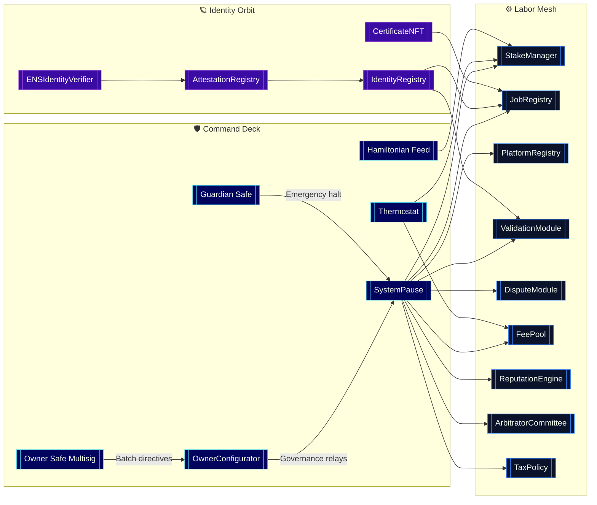
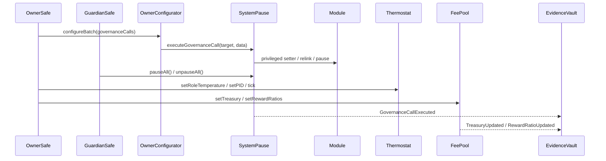
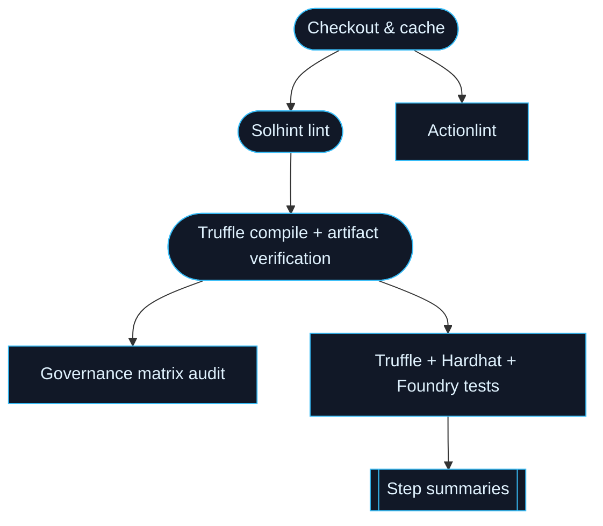

# Sovereign Labor Control Codex · 2024 Master Edition

[](https://github.com/MontrealAI/agijobs-sovereign-labor-v0p1/actions/workflows/ci.yml)
[](https://github.com/MontrealAI/agijobs-sovereign-labor-v0p1/actions/workflows/security.yml)
[](https://github.com/MontrealAI/agijobs-sovereign-labor-v0p1/actions/workflows/branch-checks.yml)

[](https://etherscan.io/token/0xa61a3b3a130a9c20768eebf97e21515a6046a1fa)


> A single operator can lift this codex, deploy the contained node, and command a market-scale intelligence lattice without writing a line of Solidity. Every control surface is hardened so ownership, not luck, decides the next epoch of labour.

---

## Table of Contents

1. [Strategic Briefing](#strategic-briefing)
2. [Systems Heliosphere](#systems-heliosphere)
3. [Execution Surfaces](#execution-surfaces)
4. [Owner Sovereignty Mesh](#owner-sovereignty-mesh)
5. [$AGIALPHA Canon](#agialpha-canon)
6. [Continuous Verification Fabric](#continuous-verification-fabric)
7. [Launch & Deployment Autopilots](#launch--deployment-autopilots)
8. [Telemetry & Compliance Vault](#telemetry--compliance-vault)
9. [Governance Chronicle](#governance-chronicle)

---

## Strategic Briefing

- **Production twin, ready to broadcast.** Solidity sources under [`contracts/`](../contracts) are synchronized with manifests in [`deploy/`](../deploy), migrations in [`migrations/`](../migrations), and runtime harnesses in [`hardhat/`](../hardhat), [`foundry/`](../foundry), and [`truffle/`](../truffle). Scripts in [`scripts/`](../scripts) compile, verify, and rehearse governance without manual glue code.
- **Owner-dominant control.** The lattice inherits [`Governable`](../contracts/Governable.sol) and two-step ownership via [`contracts/utils/CoreOwnable2Step.sol`](../contracts/utils/CoreOwnable2Step.sol), binding every privileged setter to the owner Safe. Guardians may halt, but only the owner can rewire, reissue, or retune.
- **Non-technical operability.** Playbooks in [`docs/operations/`](operations/) and architecture dossiers in [`docs/design/`](design/) translate Safe transactions, validator onboarding, and emergency halts into copy-paste instructions for policy and finance desks.
- **Immutable economic anchor.** `$AGIALPHA` (ERC-20 `0xa61a3b3a130a9c20768eebf97e21515a6046a1fa`, 18 decimals) is enforced through [`contracts/Constants.sol`](../contracts/Constants.sol) and validated by every loader, refusing alternative assets.

---

## Systems Heliosphere



- **Unified pause lattice.** [`SystemPause`](../contracts/SystemPause.sol) can freeze or resume every critical module with `pauseAll`/`unpauseAll`, rotate pausers, and forward owner-approved governance payloads.
- **Thermal incentive tuning.** [`Thermostat`](../contracts/Thermostat.sol) and the Hamiltonian feed wired through [`StakeManager`](../contracts/StakeManager.sol) let the owner retune issuance pressure, slash splits, and stake temperature live.
- **Identity-locked operations.** [`IdentityRegistry`](../contracts/IdentityRegistry.sol) binds ENS, NameWrapper, and Merkle roots so [`ValidationModule`](../contracts/ValidationModule.sol) and [`JobRegistry`](../contracts/JobRegistry.sol) only accept actors with verified `*.alpha.node.agi.eth`, `*.agent.agi.eth`, or `*.club.agi.eth` control.

---

## Execution Surfaces

| Surface | Location | Notes |
| --- | --- | --- |
| Smart contracts | [`contracts/`](../contracts) | Core, modules, identity, utilities. Ownership and pause semantics enforced everywhere. |
| Deployment manifests | [`deploy/`](../deploy) | Network-specific JSON, ENS bindings, and module wiring instructions. |
| Scripted governance | [`scripts/`](../scripts) | Branch naming lint, governance matrix checks, deploy loaders, owner automation (see `owner-apply-validator-policy`). |
| Runtime harnesses | [`hardhat/`](../hardhat), [`foundry/`](../foundry), [`truffle/`](../truffle) | Multi-runtime parity ensures identical compilation and testing across toolchains. |
| Database migrations | [`migrations/`](../migrations) | Truffle migrations mapping contract upgrades and Safe ownership transfers. |
| Demonstrations | [`demo/`](../demo) | Ready-to-run showcases for application and validation flows. |
| Architecture canon | [`docs/design/`](design/) | ADRs, subsystem diagrams, and scaling notes for AI-job orchestration. |
| Operations playbooks | [`docs/operations/`](operations/) | Non-technical guides: emergency pause, owner control, validator onboarding, telemetry. |

---

## Owner Sovereignty Mesh



| Capability | Entry point | Owner leverage |
| --- | --- | --- |
| Batch governance | [`contracts/admin/OwnerConfigurator.sol`](../contracts/admin/OwnerConfigurator.sol) | Stream multiple Safe-approved calls, emit auditable logs, orchestrate migrations without bespoke scripts. |
| Global pause lattice | [`contracts/SystemPause.sol`](../contracts/SystemPause.sol) | `setModules`, `refreshPausers`, `pauseAll`, `unpauseAll`, plus passthrough governance for module-specific setters. |
| Staking & rewards | [`contracts/StakeManager.sol`](../contracts/StakeManager.sol), [`contracts/FeePool.sol`](../contracts/FeePool.sol) | Adjust stake minima, slash splits, Hamiltonian feeds, treasury routing, auto-stake toggles. |
| Job lifecycle | [`contracts/JobRegistry.sol`](../contracts/JobRegistry.sol) | Rebind validation/dispute modules, enforce certificates, tune fees, manage platform registrations. |
| Validation mesh | [`contracts/ValidationModule.sol`](../contracts/ValidationModule.sol) | Configure quorum, penalties, validator rosters, jail windows. |
| Reputation | [`contracts/ReputationEngine.sol`](../contracts/ReputationEngine.sol) | Set weighting curves, authorized updaters, integration points. |
| Disputes & arbitration | [`contracts/modules/DisputeModule.sol`](../contracts/modules/DisputeModule.sol), [`contracts/ArbitratorCommittee.sol`](../contracts/ArbitratorCommittee.sol) | Curate committees, escalation paths, dispute fees, pause delegates. |
| Tax & compliance | [`contracts/TaxPolicy.sol`](../contracts/TaxPolicy.sol) | Publish policy URIs, rotate acknowledgment requirements, manage authorizers. |
| Identity spine | [`contracts/IdentityRegistry.sol`](../contracts/IdentityRegistry.sol), [`contracts/AttestationRegistry.sol`](../contracts/AttestationRegistry.sol) | Refresh ENS/name-wrapper roots, maintain attester allowlists, enforce node/operator ownership including `*.alpha.node.agi.eth`. |

---

## $AGIALPHA Canon

- **Canonical binding.** `$AGIALPHA` resolves to `0xa61a3b3a130a9c20768eebf97e21515a6046a1fa` (18 decimals) through [`contracts/Constants.sol`](../contracts/Constants.sol).
- **Runtime enforcement.** Constructors and setters in [`StakeManager`](../contracts/StakeManager.sol), [`FeePool`](../contracts/FeePool.sol), [`JobRegistry`](../contracts/JobRegistry.sol), and integration scripts refuse mismatched ERC-20 metadata.
- **Operational guardrails.** Deployment loaders such as [`scripts/deploy/load-config.js`](../scripts/deploy/load-config.js) and CI scripts validate the token address before broadcasting, guaranteeing platform, staking, and job payouts remain on the canonical asset.

---

## Continuous Verification Fabric



- **Workflows.** GitHub Actions defined in [`ci.yml`](../.github/workflows/ci.yml), [`security.yml`](../.github/workflows/security.yml), and [`branch-checks.yml`](../.github/workflows/branch-checks.yml) lint Solidity, compile once for all test harnesses, run Truffle/Hardhat/Foundry suites, actionlint the workflows, and run dual static analysis (Slither + Mythril).
- **Branch protection.** [`settings.yml`](../.github/settings.yml) enforces green checks, linear history, PR reviews, and last-push approval on `main` and `develop`. Force pushes and branch deletions are blocked; admins obey the same rules.
- **Badge transparency.** Badges above surface live status for compile, security, and naming gatekeepers so contributors and auditors see pipeline health instantly.

---

## Launch & Deployment Autopilots

- **One-command devnet rehearsal.** Use `npm ci` followed by `npm run compile` and `npm run test:ci` to reproduce the CI pipeline locally. Foundry, Hardhat, and Truffle remain in lockstep with the shared `build/contracts` artifacts.
- **Mainnet handover.** Scripts in [`deploy/`](../deploy) and [`scripts/`](../scripts) ensure ENS roots, module addresses, and `$AGIALPHA` bindings align before transactions broadcast. Ownership transfers to the designated Safe immediately after deployment per migration files.
- **Operator runbooks.** [`docs/operations/owner-control.md`](operations/owner-control.md), [`docs/operations/emergency-pause.md`](operations/emergency-pause.md), and [`docs/operations/validator-onboarding.md`](operations/validator-onboarding.md) provide non-technical operators with checklist-driven procedures for activation, staking, pausing, and guardian rehearsal.

---

## Telemetry & Compliance Vault

- **Ledger-grade logging.** Application, validation, and governance events are mirrored to JSONL logs under `/logs` (see runbook guidance) while Truffle/Hardhat traces persist under `build/` for audits.
- **Compliance scoring.** [`docs/design/`](design/) details the compliance reporting surfaces, linking stake exposure, validator policies, and tax acknowledgements defined in [`TaxPolicy`](../contracts/TaxPolicy.sol).
- **Observability.** Telemetry hooks in scripts and operations docs route metrics to Prometheus-compatible collectors, ensuring guardians can watch ROI, slash events, and heartbeat cadence.

---

## Governance Chronicle

- **Migrations.** [`migrations/`](../migrations) sequence deployments, Safe ownership transfers, and module registrations so historical replay shows every governance decision.
- **ADR index.** [`docs/adr/`](adr/) records architecture decisions with rationale, supersessions, and operational constraints for auditors.
- **Release notes.** [`CHANGELOG.md`](../CHANGELOG.md) tracks feature deltas, ensuring Safe signers know exactly what changed before approving upgrades.

---

### Quick Start

```bash
npm ci --omit=optional --no-audit --no-fund
npm run compile
npm run test:ci
```

When all lights stay green, the owner can stake, activate, and orchestrate the labor mesh confident that every module obeys the codified will.
