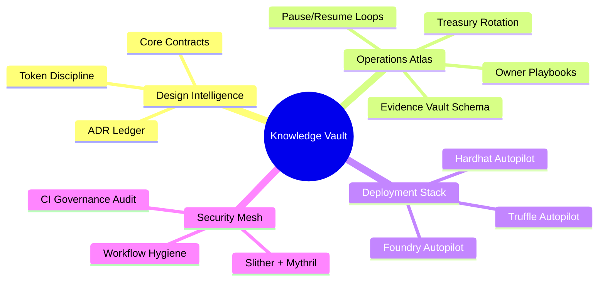
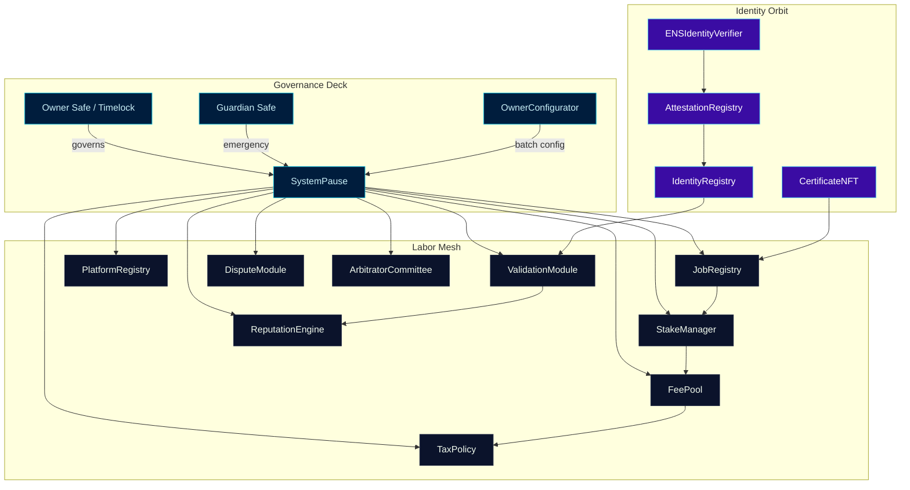
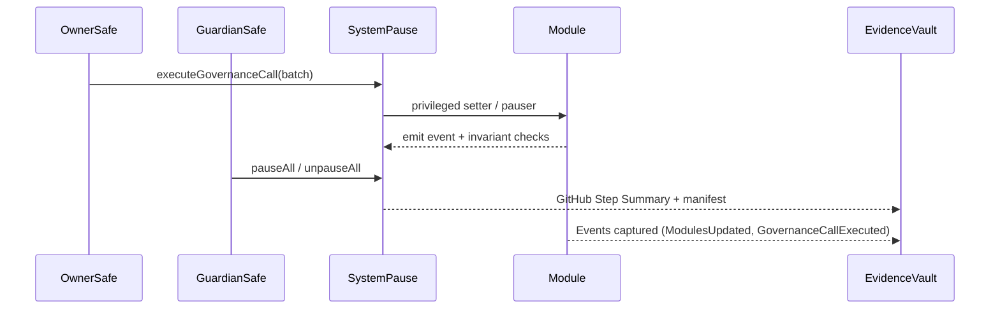

# Sovereign Labor Knowledge Vault

> This vault is the living knowledge surface for the sovereign labor engine—meticulous, orchestrated, and engineered to let the owner Safe reshape economics, identity, and dispute flows at will while the network hums.

---

## Table of contents

1. [Mission control snapshot](#mission-control-snapshot)
2. [Documentation constellation](#documentation-constellation)
3. [Architecture panorama](#architecture-panorama)
4. [Owner command authority](#owner-command-authority)
5. [$AGIALPHA economic spine](#agialpha-economic-spine)
6. [Continuous-integration discipline](#continuous-integration-discipline)
7. [Test flight repertoire](#test-flight-repertoire)
8. [Deployment and evidence loops](#deployment-and-evidence-loops)
9. [Branch protection enforcement](#branch-protection-enforcement)
10. [Quick links for operators](#quick-links-for-operators)

---

## Mission control snapshot

- **Repository scope.** This knowledge base mirrors the latest repository layout (`contracts/`, `deploy/`, `foundry/`, `hardhat/`, `scripts/`, and `docs/`), giving architects, auditors, and operators the exact coordinates needed to navigate the machine.
- **Owner-first governance.** [`SystemPause`](../contracts/SystemPause.sol) concentrates every privileged setter, pauser, and batch executor. Guardian keys and the owner Safe orchestrate real-time adjustments without ever touching raw calldata.
- **Immutable runtime guardrails.** `npm run ci:governance` and the compile pipeline reject diffs unless `$AGIALPHA` remains locked to `0xa61a3b3a130a9c20768eebf97e21515a6046a1fa` (18 decimals) and each module retains its owner-settable surface.
- **Operator UX.** Non-technical pilots follow narrated manifests under [`docs/operations/`](operations/) to pause, resume, rotate treasuries, publish identity roots, or tune taxation with deterministic outputs and auditable telemetry.

---

## Documentation constellation

| Area | Why it matters | Start here |
| --- | --- | --- |
| **Design** | Threat models, invariant notes, and module wiring. | [`docs/design/core-contracts.md`](design/core-contracts.md) |
| **Decisions** | Architectural Record ledger for governance, token, and arbitration commitments. | [`docs/adr/`](adr/) |
| **Operations** | Copy-paste Safe manifests for every privileged control. | [`docs/operations/README.md`](operations/README.md) |
| **Owner control** | Step-by-step guardian & owner flows including event expectations. | [`docs/operations/owner-control.md`](operations/owner-control.md) |

---

## Architecture panorama

- **Telemetry-first design.** Every setter emits events, fueling indexers and compliance tooling. Manifest outputs stored under `manifests/` align on-chain state with governance signatures.
- **Composable modules.** `OwnerConfigurator` snapshots allow the owner Safe to replay deterministic upgrades across staging, rehearsal, and mainnet without manual calldata edits.
- **Identity handshake.** ENS-driven attestations and Merkle roots ensure verifiable agent onboarding while staying under owner oversight.

---

## Owner command authority

- **Complete parameter control.** [`scripts/check-governance-matrix.mjs`](../scripts/check-governance-matrix.mjs) proves in CI that every module retains owner-settable hooks (`setFeePool`, `setTaxPolicy`, `setMinPlatformStake`, `setDisputeWindow`, `setIdentityRegistry`, etc.).
- **Pausable everything.** `SystemPause` fans out to each module, and the guardian can halt or resume the mesh without touching internals. Foundry and Hardhat suites assert that owner + guardian flows continue to succeed.
- **Upgradable economics.** Treasury routes, burn splits, validation weights, and arbitration penalties all thread through Safe-approved setters; the owner can rewire them instantly while telemetry scripts capture the changes.

---

## $AGIALPHA economic spine

- **Canonical token.** [`contracts/Constants.sol`](../contracts/Constants.sol) hard-pins `$AGIALPHA = 0xa61a3b3a130a9c20768eebf97e21515a6046a1fa` with `AGIALPHA_DECIMALS = 18` and scaling factor `1e18`.
- **Runtime verification.** Stake, fee, certificate, and registry modules revert if decimals diverge; governance audits fail if manifests mention a different token.
- **Deployment guardrails.** [`deploy/`](../deploy/) loaders, Truffle migrations, Hardhat, and Foundry scripts halt if RPC metadata disagrees with the canonical token or if the on-chain name hints at a test asset.
- **Operational tooling.** Every owner playbook references this token binding so treasury movements, rewards, and burns remain perfectly reconciled.

---

## Continuous-integration discipline

- **Workflows.**
  - [`ci.yml`](../.github/workflows/ci.yml): Solhint lint → Truffle compile → artifact verification → governance surface audit → multi-runtime tests → workflow hygiene.
  - [`security.yml`](../.github/workflows/security.yml): Foundry-assisted Slither SARIF plus Mythril symbolic execution with deterministic tool versions.
  - [`branch-checks.yml`](../.github/workflows/branch-checks.yml): Enforces branch naming conventions before CI ever runs.
- **Status visibility.** Badges above map one-to-one with required checks so reviewers see gate status at a glance.
- **Permissions hygiene.** Workflows pin `actions/checkout@v4`, `actions/setup-node@v4`, and `foundry-rs/foundry-toolchain@v1` with minimal scopes and concurrency guards to prevent race conditions.
- **Evidence.** Every job pushes a Step Summary linking commands and results; replicate them in governance manifests for audit trails.

```mermaid
gantt
title CI Constellation (pull_request)
dateFormat  HH:mm
axisFormat  %Hh
section Sovereign Compile
Lint Solidity        :a1, 00:00, 0:10
Compile Contracts    :after a1, 0:12
Governance Audit     :after a1, 0:08
Tests (Truffle/Hardhat/Foundry) :after a1, 0:25
Workflow Hygiene     :a5, 00:00, 0:05
section Security Mesh
Slither Static Analysis :b1, 00:00, 0:22
Mythril Symbolic Sweep   :after b1, 0:30
```

---

## Test flight repertoire

| Surface | Command | Highlights |
| --- | --- | --- |
| Solhint lint | `npm run lint:sol` | Enforces Solidity style with zero-warning tolerance. |
| Compile + verify | `npm run compile` then `node scripts/verify-artifacts.js` | Guards against ABI drift and mismatched bytecode. |
| Governance matrix | `npm run ci:governance` | Confirms owner + pauser access for every privileged setter and `$AGIALPHA` invariants. |
| Truffle tests | `npm run test:truffle:ci` | Escrow, staking, and registry scenarios without recompiling. |
| Hardhat tests | `npm run test:hardhat` | Emulates Safe control, ensures pausing + treasury rotation flows execute. |
| Foundry invariants | `npm run test:foundry` | Fuzzes staking, dispute, and reward invariants with `$AGIALPHA` mock at the canonical address. |

---

## Deployment and evidence loops

1. **Configure manifests.** Populate `deploy/config.*.json` with Safe addresses, guardian keys, and treasury destinations. `$AGIALPHA` entries must remain `0xa61a3b3a130a9c20768eebf97e21515a6046a1fa` with decimals 18.
2. **Dry-run autopilots.** Use `npm run deploy:hardhat:mainnet`, `npm run deploy:truffle:mainnet`, or the Foundry script to rehearse. Each stops immediately on token metadata mismatches.
3. **Archive evidence.** Store `manifests/*.json`, Safe transaction hashes, CI URLs, and Step Summaries under your evidence vault. Mirror the schema proposed in [`docs/operations/README.md`](operations/README.md#telemetry-capture).
4. **Post-change validation.** Re-run `npm run ci:governance` and `npm run test:hardhat` after every owner action to prove continuous control.

---

## Branch protection enforcement

Configure branch protection on `main` (and `develop` if you deploy staging environments) to require the following status checks:

- `Solidity lint`
- `Compile smart contracts`
- `Governance surface audit`
- `Test suites`
- `Workflow hygiene`
- `Slither static analysis`
- `Mythril symbolic execution`
- `Validate branch naming conventions`

Enable **Require branches to be up to date** and **Require approvals** so every change ships only after the full CI constellation turns green. Badge URLs above remain green only when these checks pass on `main`.

---

## Quick links for operators

- [Core contract notes](design/core-contracts.md)
- [Owner control playbook](operations/owner-control.md)
- [Operations atlas](operations/README.md)
- [Token discipline ADR](adr/0002-deterministic-token-discipline.md)
- [Hardhat deployment handbook](../hardhat/README.md)
- [Foundry deployment handbook](../foundry/README.md)
- [Deployment autopilot overview](../deploy/README.md)
- [Scripts control center](../scripts/README.md)

Print this page into your operations binder—every link, badge, and diagram points to the precise module that keeps the sovereign labor platform unassailable.
