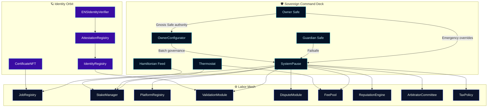
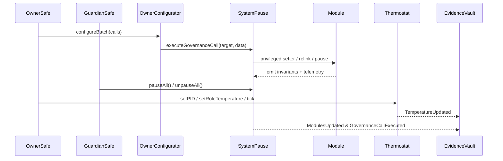
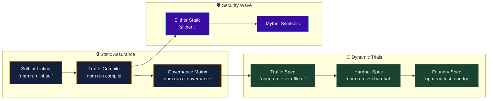
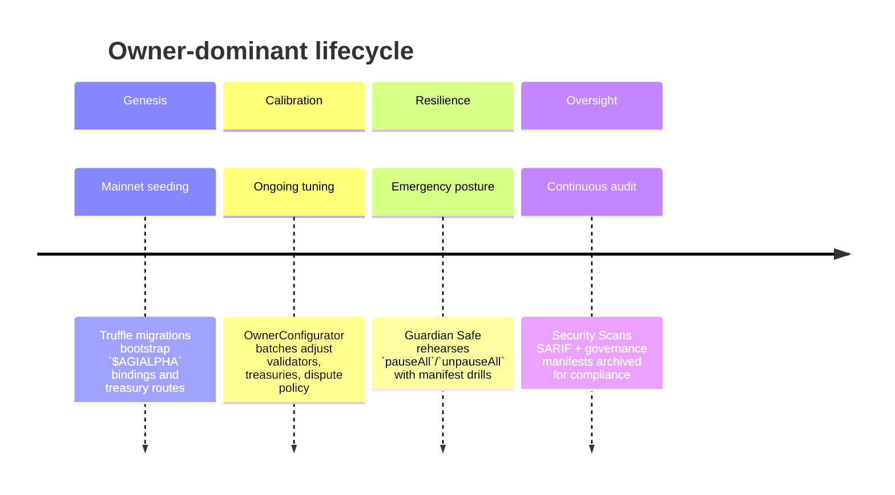

# Sovereign Labor Control Codex · 2024 Field Edition

[](https://github.com/MontrealAI/agijobs-sovereign-labor-v0p1/actions/workflows/ci.yml)
[](https://github.com/MontrealAI/agijobs-sovereign-labor-v0p1/actions/workflows/branch-checks.yml)
[](https://github.com/MontrealAI/agijobs-sovereign-labor-v0p1/actions/workflows/security.yml)
[](https://etherscan.io/token/0xa61a3b3a130a9c20768eebf97e21515a6046a1fa)


> This codex is the command surface of the sovereign labor engine—an owner-operated intelligence lattice that fuses labor, capital, compliance, and trust into a single controllable orbit, immediately deployable by non-technical pilots.

---

## Table of contents

1. [Strategic briefing](#strategic-briefing)
2. [Systems constellation](#systems-constellation)
3. [Owner sovereignty console](#owner-sovereignty-console)
4. [Contract atlas](#contract-atlas)
5. [$AGIALPHA canon](#agialpha-canon)
6. [Operational playbooks](#operational-playbooks)
7. [Continuous verification mesh](#continuous-verification-mesh)
8. [CI enforcement & branch protection](#ci-enforcement--branch-protection)
9. [Launch & compliance checklist](#launch--compliance-checklist)
10. [Deployment autopilots](#deployment-autopilots)
11. [Telemetry vault protocol](#telemetry-vault-protocol)
12. [Repository atlas](#repository-atlas)
13. [Governance chronology](#governance-chronology)

---

## Strategic briefing

- **Production twin.** Smart contracts live in [`contracts/`](../contracts) with matching deployment manifests in [`deploy/`](../deploy), runtime harnesses under [`hardhat/`](../hardhat), [`foundry/`](../foundry), and [`truffle/`](../truffle), plus cross-runtime scripts in [`scripts/`](../scripts).
- **Owner-dominant governance.** Every critical module inherits [`Governable`](../contracts/Governable.sol), routing privileged actions through the owner-controlled Safe set in constructors and upgrade surfaces (see [`SystemPause`](../contracts/SystemPause.sol) and [`StakeManager`](../contracts/StakeManager.sol)).
- **Non-technical operability.** Narrated runbooks in [`docs/operations/`](operations/) and architectural dossiers in [`docs/design/`](design/) convert Safe transactions into copy-ready manifests for guardians, treasurers, and compliance officers.
- **Immutable token canon.** `$AGIALPHA` is locked through [`contracts/Constants.sol`](../contracts/Constants.sol), and every runtime loader (for example [`scripts/deploy/load-config.js`](../scripts/deploy/load-config.js)) rejects alternate token addresses to enforce canonical deployments.

---

## Systems constellation



- **Unified pause lattice.** [`SystemPause`](../contracts/SystemPause.sol) rewires module registries, delegates pausers, and can freeze or resume the entire mesh through `pauseAll` / `unpauseAll`.
- **Thermal incentive tuning.** [`Thermostat`](../contracts/Thermostat.sol) and the Hamiltonian feed consumed by [`StakeManager`](../contracts/StakeManager.sol) let the owner retune PID parameters and issuance pressure in real time.
- **Identity-linked validation.** [`IdentityRegistry`](../contracts/IdentityRegistry.sol) anchors ENS and Merkle roots while [`ValidationModule`](../contracts/ValidationModule.sol) enforces validator gatekeeping against those proofs.

---

## Owner sovereignty console



- **Absolute parameter control.** Governance-only modifiers secure every setter: e.g. [`SystemPause.setModules`](../contracts/SystemPause.sol#L120-L213), [`StakeManager.setThermostat`](../contracts/StakeManager.sol#L523-L531), [`StakeManager.setHamiltonianFeed`](../contracts/StakeManager.sol#L533-L540), [`StakeManager.configureAutoStake`](../contracts/StakeManager.sol#L587-L621), and [`FeePool.setTreasury`](../contracts/FeePool.sol#L97-L126).
- **Total pause authority.** Guardians and owners can deterministically halt or resume all modules with [`pauseAll`](../contracts/SystemPause.sol#L292-L304), [`unpauseAll`](../contracts/SystemPause.sol#L304-L314), and pauser rotation through [`refreshPausers`](../contracts/SystemPause.sol#L216-L232).
- **Batch configurability.** [`OwnerConfigurator`](../contracts/admin/OwnerConfigurator.sol) emits auditable events while streaming batched calls, simplifying complex migrations for non-technical operators.
- **Guardian rehearsal.** Playbooks in [`docs/operations/owner-control.md`](operations/owner-control.md) and [`docs/operations/emergency-pause.md`](operations/emergency-pause.md) walk through Safe signatures, ensuring rehearsed response pathways.

---

## Contract atlas

| Domain | Contract | Purpose | Owner leverage |
| --- | --- | --- | --- |
| Governance shell | [`SystemPause`](../contracts/SystemPause.sol) | Central pause lattice, module registry, privileged call router. | Assign/refresh pausers, batch-govern modules, forward arbitrary owner-approved calls. |
| Staking engine | [`StakeManager`](../contracts/StakeManager.sol) | Tracks stakes, thermal parameters, Hamiltonian thresholds, reward flows. | Adjust thermostats, feeds, stake minima, treasury destinations, slashing rules. |
| Job protocol | [`JobRegistry`](../contracts/JobRegistry.sol) | Orchestrates job postings, validator requirements, payouts, dispute hooks. | Swap module integrations, configure fees, enforce certificates & identity bindings. |
| Validation mesh | [`ValidationModule`](../contracts/ValidationModule.sol) | Manages validator admission, quorum maths, penalty regimes. | Tune quorum, penalties, validator pools, cross-module pointers. |
| Treasury fabric | [`FeePool`](../contracts/FeePool.sol) | Aggregates fees, burns, rewards, and treasury remits. | Set treasuries, burn percentages, rewarders, pausers, stake manager links. |
| Reputation orbit | [`ReputationEngine`](../contracts/ReputationEngine.sol) | Scores actors and powers job gating. | Curate callers, weighting, thresholds, blacklists, staking links. |
| Platform registry | [`PlatformRegistry`](../contracts/PlatformRegistry.sol) | Registers platforms and enforces stake commitments. | Update stake requirements, registrars, allowlists, blacklists. |
| Dispute tribunal | [`DisputeModule`](../contracts/modules/DisputeModule.sol) | Arbitrates disputes and routes penalties. | Configure committee, tax policy, dispute fees, resolution windows, moderators. |
| Arbitration council | [`ArbitratorCommittee`](../contracts/ArbitratorCommittee.sol) | Governs arbitrator membership and pause delegation. | Set committee composition, pause roles, dispute rules. |
| Tax canon | [`TaxPolicy`](../contracts/TaxPolicy.sol) | Publishes canonical tax policy URIs & acknowledgements. | Update policy URIs, authorizers, metadata. |
| Identity spine | [`IdentityRegistry`](../contracts/IdentityRegistry.sol) | Maintains identity roots, ENS hooks, attestation bindings. | Refresh Merkle roots, registries, ENS/name wrapper adapters. |
| Attestation anchor | [`AttestationRegistry`](../contracts/AttestationRegistry.sol) | Captures attestations tied to ENS/name wrapper anchors. | Rebind controllers, adjust authorized callers. |
| Credential layer | [`CertificateNFT`](../contracts/CertificateNFT.sol) | Issues certificates backed by job outcomes. | Configure base URIs, minters, pausers, supply controls. |

---

## $AGIALPHA canon

- **Canonical binding.** `$AGIALPHA` resolves to token `0xa61a3b3a130a9c20768eebf97e21515a6046a1fa` with `18` decimals, enforced by [`contracts/Constants.sol`](../contracts/Constants.sol).
- **Runtime enforcement.** Modules import `Constants` to refuse mismatched assets; see [`StakeManager`](../contracts/StakeManager.sol#L218-L249) and [`FeePool`](../contracts/FeePool.sol#L70-L126).
- **Deployment guardrails.** [`scripts/deploy/load-config.js`](../scripts/deploy/load-config.js) validates token addresses before broadcasting, mirroring CI checks.

---

## Operational playbooks

- **Operations atlas.** [`docs/operations/README.md`](operations/README.md) visualizes end-to-end Safe flows for pausing, treasury rotation, validator reconfiguration, and telemetry capture.
- **Owner command primers.** [`docs/operations/owner-control.md`](operations/owner-control.md) provides copy-ready transaction manifests for guardians, treasurers, and compliance officers.
- **Emergency drills.** [`docs/operations/emergency-pause.md`](operations/emergency-pause.md) documents step-by-step pause/resume sequences with Safe signers and expectation checks.
- **Design dossiers.** [`docs/design/core-contracts.md`](design/core-contracts.md) and ADRs in [`docs/adr/`](adr/) trace architectural reasoning and invariant coverage.

---

## Continuous verification mesh



- **`Sovereign Compile`.** [.github/workflows/ci.yml](../.github/workflows/ci.yml) enforces linting, compilation, and governance audits on every push and pull request targeting `main`, `develop`, or release branches.
- **`Branch Gatekeeper`.** [.github/workflows/branch-checks.yml](../.github/workflows/branch-checks.yml) blocks non-compliant branch names and surfaces feedback immediately in PR checks.
- **`Security Scans`.** [.github/workflows/security.yml](../.github/workflows/security.yml) runs Foundry builds, Slither static analysis, and Mythril symbolic execution with SARIF uploads for vulnerability management.
- **Local mirroring.** `npm run test:ci` executes the same dynamic matrix locally; `npm run ci:governance` validates Safe reachability, pause lattice wiring, and `$AGIALPHA` bindings before any deployment.

---

## CI enforcement & branch protection

1. **Require passing checks.** Protect `main` and `develop` in GitHub → Settings → Branches with mandatory status checks: `Sovereign Compile`, `Branch Gatekeeper`, and `Security Scans`. Enable "Require branches to be up to date" and "Require linear history".
2. **Mandatory reviews.** Demand at least one code-owner review for changes touching `contracts/`, `docs/`, `deploy/`, or CI manifests, pairing with Safe approval policies before on-chain execution.
3. **Signed provenance.** Encourage signed commits or organization-wide `SSO` enforcement; store workflow artifacts for ≥30 days so auditors can replay compile outputs and SARIF reports.
4. **Secret hygiene.** Keep private keys, RPC endpoints, and Mythril API keys inside GitHub secrets or reusable environments; never commit `.env` files.

---

## Launch & compliance checklist

1. **Install toolchain.**
   ```bash
   npm ci --omit=optional --no-audit --no-fund
   forge install
   ```
2. **Compile & lint.**
   ```bash
   npm run lint:sol
   npm run compile
   ```
3. **Verify governance health.**
   ```bash
   npm run ci:governance
   ```
4. **Execute full spec suite.**
   ```bash
   npm run test:ci
   ```
5. **Archive evidence.** Capture `build/contracts` artifacts, GitHub Action summaries, SARIF reports, and Safe transaction hashes for the compliance vault prior to mainnet promotion.

Every step is copy/paste friendly for non-technical operators; the manifests in [`docs/operations/`](operations/) ensure deterministic outcomes.

---

## Deployment autopilots

| Network mode | Command | Notes |
| --- | --- | --- |
| Truffle mainnet | `npm run deploy:truffle:mainnet` | Uses [`migrations/`](../migrations) and manifest guards from [`scripts/deploy/load-config.js`](../scripts/deploy/load-config.js). |
| Hardhat mainnet | `npm run deploy:hardhat:mainnet` | Executes [`hardhat/scripts/deploy-mainnet.js`](../hardhat/scripts/deploy-mainnet.js) with governance checks before broadcasting. |
| Foundry mainnet | `npm run deploy:foundry:mainnet` | Calls [`foundry/script/DeployMainnet.s.sol`](../foundry/script/DeployMainnet.s.sol) while enforcing `$AGIALPHA` bindings through `Constants`. |

All autopilots expect RPC URLs and signer secrets supplied via secure environment variables; they emit Safe-ready calldata payloads for review before broadcasting.

---

## Telemetry vault protocol

1. **Manifest archive.** Store governance manifests and action reports under `manifests/` or your compliance repository so every parameter mutation is versioned.
2. **Event capture.** Subscribe to `ModulesUpdated`, `GovernanceCallExecuted`, `TemperatureUpdated`, and module-specific events from [`StakeManager`](../contracts/StakeManager.sol#L523-L623), [`SystemPause`](../contracts/SystemPause.sol#L253-L314), and [`Thermostat`](../contracts/Thermostat.sol#L86-L121).
3. **CI mirroring.** After on-chain governance, rerun `npm run ci:governance`, `npm run test:truffle:ci`, `npm run test:hardhat`, and `npm run test:foundry` to confirm deterministic parity.
4. **Evidence vault.** Consolidate Safe transaction hashes, CLI logs, and workflow URLs (`Sovereign Compile`, `Security Scans`) into an auditor-facing vault for continuous compliance.

---

## Repository atlas

| Path | Role |
| --- | --- |
| [`contracts/`](../contracts) | Solidity contracts, interfaces, utilities, and test scaffolding. |
| [`deploy/`](../deploy) | Network manifests and deployment parameters. |
| [`foundry/`](../foundry) | Foundry configuration, scripts, and tests. |
| [`hardhat/`](../hardhat) | Hardhat tasks, configuration, and deployment scripts. |
| [`migrations/`](../migrations) | Truffle migration scripts. |
| [`scripts/`](../scripts) | Shared governance, verification, and deployment utilities. |
| [`docs/`](./) | Design dossiers, operations manuals, and ADRs. |
| [`truffle/`](../truffle) | Truffle-specific configuration helpers. |
| [`.github/workflows/`](../.github/workflows) | CI/CD orchestrations enforcing lint, compile, security, and branch policies. |

---

## Governance chronology



The codex keeps the owner in complete control—able to pause, reconfigure, and retune incentives within one transaction—while every guardian and operator navigates deterministic, rehearsed procedures reinforced by the continuous verification mesh.
