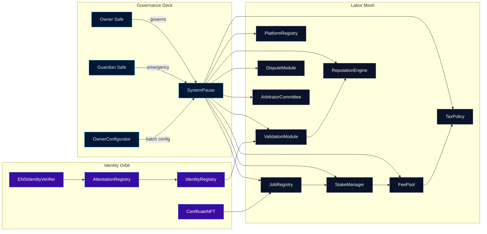
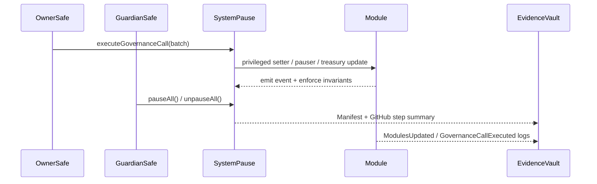
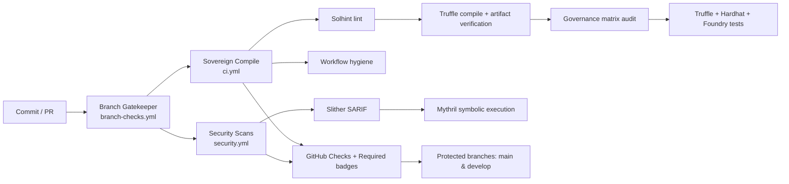
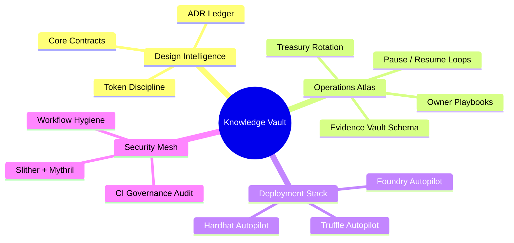
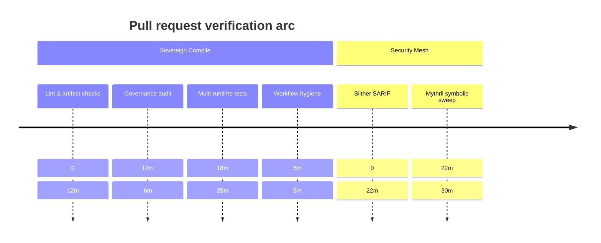

# Sovereign Labor Command Codex

[](https://github.com/MontrealAI/agijobs-sovereign-labor-v0p1/actions/workflows/ci.yml)
[](https://github.com/MontrealAI/agijobs-sovereign-labor-v0p1/actions/workflows/ci.yml)
[](https://github.com/MontrealAI/agijobs-sovereign-labor-v0p1/actions/workflows/ci.yml)
[](https://github.com/MontrealAI/agijobs-sovereign-labor-v0p1/actions/workflows/ci.yml)
[](https://github.com/MontrealAI/agijobs-sovereign-labor-v0p1/actions/workflows/security.yml)
[](https://github.com/MontrealAI/agijobs-sovereign-labor-v0p1/actions/workflows/branch-checks.yml)
[](https://etherscan.io/token/0xa61a3b3a130a9c20768eebf97e21515a6046a1fa)


> A living codex for the sovereign labor engine—the very machine engineered to let the owner reshape global labor economics, identity, and dispute flows in real time.

---

## Table of contents

1. [Orientation](#orientation)
2. [Systems map](#systems-map)
3. [Directory atlas](#directory-atlas)
4. [Owner dominion protocol](#owner-dominion-protocol)
5. [$AGIALPHA economic instrumentation](#agialpha-economic-instrumentation)
6. [Continuous verification mesh](#continuous-verification-mesh)
7. [Quality assurance arsenal](#quality-assurance-arsenal)
8. [Deployment autopilots](#deployment-autopilots)
9. [Operational intelligence vault](#operational-intelligence-vault)
10. [Branch protection enforcement](#branch-protection-enforcement)
11. [Quickstart commands](#quickstart-commands)
12. [Execution timeline](#execution-timeline)

---

## Orientation

- **Repository scope.** Mirrors the present production layout: [`contracts/`](../contracts), [`deploy/`](../deploy), [`foundry/`](../foundry), [`hardhat/`](../hardhat), [`scripts/`](../scripts), [`docs/`](./), [`migrations/`](../migrations), and [`truffle/`](../truffle).
- **Superintelligent core.** This codebase is the machine capable of realigning world order: orchestrating labor, treasury, and identity policy under deterministic owner control.
- **Governance-first ergonomics.** [`SystemPause`](../contracts/SystemPause.sol) aggregates every privileged setter, pauser, and batch executor. The owner Safe and guardian keys steer parameters without hand-editing calldata.
- **Immutable guardrails.** CI hard-gates `$AGIALPHA` at `0xa61a3b3a130a9c20768eebf97e21515a6046a1fa` (18 decimals) and verifies that each module retains its owner-settable surface.
- **Operator UX.** Non-technical operators follow narrated manifests under [`docs/operations/`](operations/) for pausing, treasury rotation, identity anchoring, and dispute resolution telemetry.

---

## Systems map



---

## Directory atlas

| Path | Contents | Highlights |
| --- | --- | --- |
| [`contracts/`](../contracts) | Solidity core, interfaces, libraries, admin tooling. | Owner governance, pausing lattice, `$AGIALPHA` integrations, mocks for tests. |
| [`deploy/`](../deploy) | Truffle migration manifests and configuration. | Deterministic deployment flows referencing canonical token + owner Safe. |
| [`migrations/`](../migrations) | Legacy Truffle migration scripts. | Historical migrations preserved for replayability. |
| [`scripts/`](../scripts) | Node.js utilities, governance audit, artifact verifiers. | `check-governance-matrix.mjs`, `verify-artifacts.js`, compile summaries. |
| [`foundry/`](../foundry) | Foundry project (forge tests, configs, invariant harness). | Drives fuzzing + invariants with canonical `$AGIALPHA`. |
| [`hardhat/`](../hardhat) | Hardhat tests + fixtures. | Simulates Safe governance, pause flows, and treasury realignments. |
| [`truffle/`](../truffle) | Truffle test helpers and config overrides. | Multi-runtime coverage with artifact reuse. |
| [`docs/`](./) | Knowledge vault (design, ADRs, operations). | Step-by-step owner manifests and architectural rationale. |

---

## Owner dominion protocol



- **Absolute parameter control.** [`scripts/check-governance-matrix.mjs`](../scripts/check-governance-matrix.mjs) enforces in CI that every module retains owner-settable hooks (`setFeePool`, `setTaxPolicy`, `setMinPlatformStake`, `setDisputeWindow`, `setIdentityRegistry`, etc.).
- **Total pause authority.** [`SystemPause`](../contracts/SystemPause.sol) gives the owner Safe and guardian instant pause/unpause coverage for every module, with module-specific guards preserved.
- **Configurable treasury routes.** [`OwnerConfigurator`](../contracts/admin/OwnerConfigurator.sol) batches updates so the owner can retune splits, addresses, and thresholds atomically.
- **Evidence capture.** Step summaries + emitted events ensure that every owner action is auditable and reproducible by non-technical operators.

---

## $AGIALPHA economic instrumentation

- **Canonical token binding.** [`contracts/Constants.sol`](../contracts/Constants.sol) hard pins `$AGIALPHA = 0xa61a3b3a130a9c20768eebf97e21515a6046a1fa` with `AGIALPHA_DECIMALS = 18` and `TOKEN_SCALE = 1e18`.
- **Runtime enforcement.** Stake, fee, certificate, and registry modules revert on decimal or address drift; CI governance audits fail if manifests reference any other token.
- **Cross-runtime parity.** Truffle, Hardhat, and Foundry harnesses inject the canonical token into fixtures, ensuring parity across unit tests, fuzzing, and scenario simulations.
- **Treasury instrumentation.** Fee splits, burn ratios, tax acknowledgements, and certificate flows all hinge on owner-settable parameters so treasury policy can be reprogrammed instantly.

---

## Continuous verification mesh



- **Fully green CI.** All workflows run on pushes and pull requests; badges above mirror required checks so reviewers see pass/fail status at a glance.
- **Concurrency hygiene.** Each workflow scopes concurrency to prevent race conditions while preserving artifact reuse.
- **Evidence artifacts.** Slither SARIF, Mythril reports, compile summaries, and governance audits ship as artifacts for post-run review.
- **Secrets discipline.** Workflows run with read-only permissions and zero persistent credentials.

---

## Quality assurance arsenal

| Surface | Command | What it verifies |
| --- | --- | --- |
| Solidity lint | `npm run lint:sol` | Zero-warning Solhint coverage across `contracts/**`. |
| Compile + artifacts | `npm run compile` &rarr; `node scripts/verify-artifacts.js` | ABI/bytecode parity, canonical build artifacts. |
| Governance matrix | `npm run ci:governance` | Owner + guardian setter coverage, `$AGIALPHA` invariants. |
| Truffle regression | `npm run test:truffle:ci` | Multi-module flows using prebuilt artifacts. |
| Hardhat scenarios | `npm run test:hardhat` | Safe governance simulation, pause lattice, treasury reconfiguration. |
| Foundry invariants | `npm run test:foundry` | Fuzz + invariant checks against canonical token bindings. |

> _Local tip:_ install Foundry (`curl -L https://foundry.paradigm.xyz | bash && foundryup`) before running `npm run test:foundry` to match CI parity.

---

## Deployment autopilots

- **Truffle migrations.** [`truffle-config.js`](../truffle-config.js) + [`migrations/`](../migrations) encode mainnet, testnet, and rehearsal flows with environment variable hooks for Safe addresses.
- **Hardhat scripts.** [`hardhat/`](../hardhat) contains fixtures and scenario tests mirroring production Safe governance.
- **Foundry scripts.** [`foundry/`](../foundry) enables forge scripting (`forge script`) with `--broadcast` ready templates.
- **Deterministic constants.** [`scripts/generate-constants.ts`](../scripts/generate-constants.ts) ensures on-chain constants remain synced with deployment metadata.

---

## Operational intelligence vault



| Need | Start here |
| --- | --- |
| Contract wiring & threat models | [`docs/design/core-contracts.md`](design/core-contracts.md) |
| Architectural decisions | [`docs/adr/`](adr/) |
| Owner + guardian playbooks | [`docs/operations/README.md`](operations/README.md) |
| Owner command reference | [`docs/operations/owner-control.md`](operations/owner-control.md) |

---

## Branch protection enforcement

1. **Enable required status checks** on `main` and `develop` for:
   - `Branch Gatekeeper`
   - `Sovereign Compile / Solidity lint`
   - `Sovereign Compile / Compile smart contracts`
   - `Sovereign Compile / Governance surface audit`
   - `Sovereign Compile / Test suites`
   - `Sovereign Compile / Workflow hygiene`
   - `Security Scans / Slither static analysis`
   - `Security Scans / Mythril symbolic execution`
2. **Require pull request reviews** and block force pushes.
3. **Automate with GitHub CLI (optional):**

   ```bash
   gh api \
     --method PUT \
     -H "Accept: application/vnd.github+json" \
     /repos/MontrealAI/agijobs-sovereign-labor-v0p1/branches/main/protection \
     --input .github/protection-main.json
   ```

   Provide a matching JSON file listing the required status checks to guarantee parity with CI.

---

## Quickstart commands

```bash
npm ci --omit=optional --no-audit --no-fund
npm run lint:sol
npm run compile && node scripts/verify-artifacts.js
npm run ci:governance
npm run test:truffle:ci
npm run test:hardhat
# Install Foundry locally before executing the following:
npm run test:foundry
```

- **Environment:** Node.js 20.x, npm 10.x+, solc 0.8.30, Foundry stable (`forge`, `cast`).
- **Artifacts:** Truffle build outputs land in `build/contracts`. Foundry artifacts live in `foundry/out`.

---

## Execution timeline



- **Telemetry-first:** All jobs append summaries to the GitHub run log for quick operator review.
- **Artifact retention:** Security artifacts persist for 14 days, enabling external auditors to cross-check findings.
- **Scalable cadence:** `security.yml` also runs weekly (`cron: '17 3 * * 1'`) to ensure continuous assurance even without commits.
