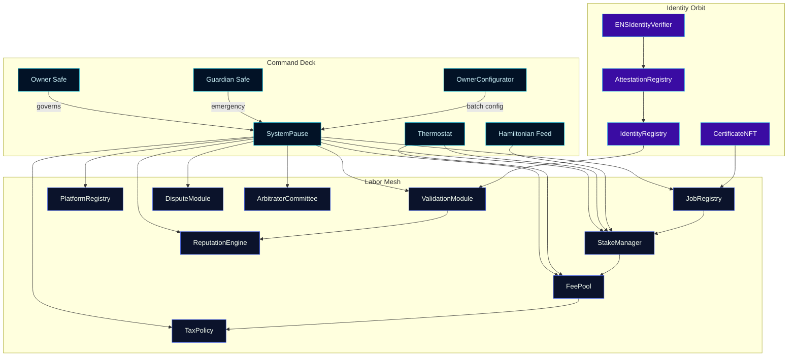
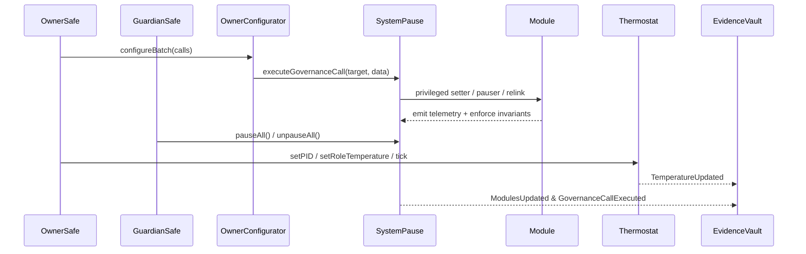
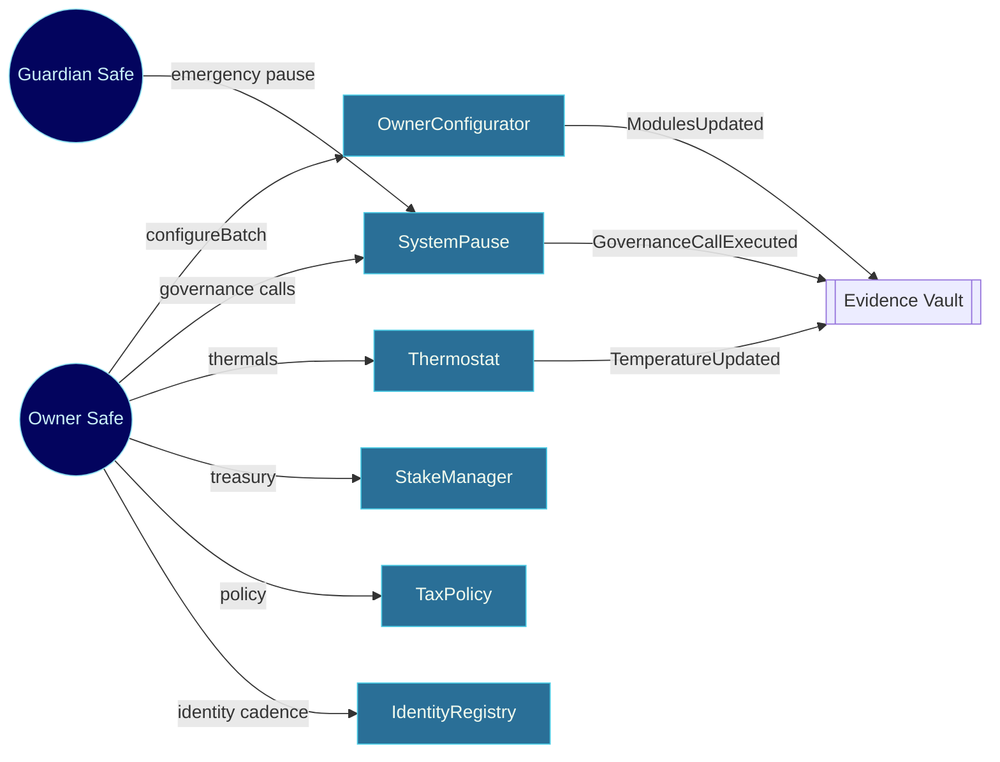
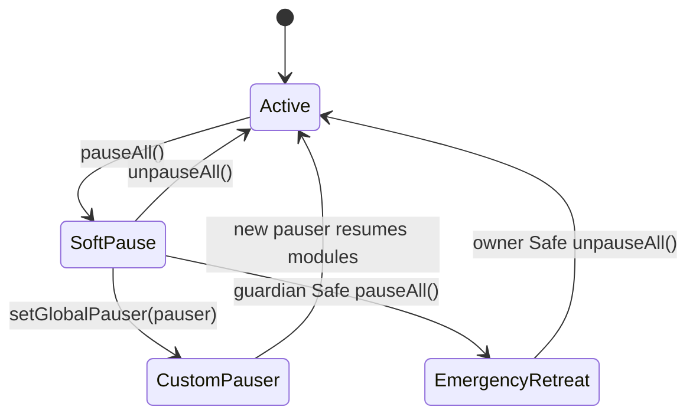
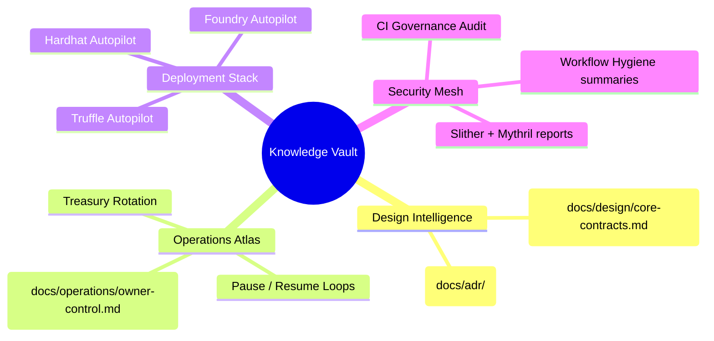

# Sovereign Labor Control Codex

[](https://github.com/MontrealAI/agijobs-sovereign-labor-v0p1/actions/workflows/ci.yml)
[](https://github.com/MontrealAI/agijobs-sovereign-labor-v0p1/actions/workflows/ci.yml)
[](https://github.com/MontrealAI/agijobs-sovereign-labor-v0p1/actions/workflows/ci.yml)
[](https://github.com/MontrealAI/agijobs-sovereign-labor-v0p1/actions/workflows/ci.yml)
[](https://github.com/MontrealAI/agijobs-sovereign-labor-v0p1/actions/workflows/branch-checks.yml)
[](https://github.com/MontrealAI/agijobs-sovereign-labor-v0p1/actions/workflows/security.yml)
[](https://github.com/MontrealAI/agijobs-sovereign-labor-v0p1/actions/workflows/security.yml)
[](https://github.com/MontrealAI/agijobs-sovereign-labor-v0p1/actions/workflows/security.yml)
[](https://etherscan.io/token/0xa61a3b3a130a9c20768eebf97e21515a6046a1fa)


> This codex documents the sovereign labor engine that compresses intelligence, liquidity, and identity into a single owner-steered force multiplier. Every surface is observable, pausable, and rewritable by the owner without compromising production serenity for non-technical pilots.

---

## Table of contents

1. [Mission orientation](#mission-orientation)
2. [Architecture constellation](#architecture-constellation)
3. [Command lattice](#command-lattice)
4. [Owner override catalogue](#owner-override-catalogue)
5. [Parameter control surfaces](#parameter-control-surfaces)
6. [$AGIALPHA discipline](#agialpha-discipline)
7. [Directory atlas](#directory-atlas)
8. [Operator flight deck](#operator-flight-deck)
9. [Pause state choreography](#pause-state-choreography)
10. [Continuous verification mesh](#continuous-verification-mesh)
11. [Quality assurance arsenal](#quality-assurance-arsenal)
12. [Deployment autopilots](#deployment-autopilots)
13. [Operational intelligence vault](#operational-intelligence-vault)
14. [Branch protection enforcement](#branch-protection-enforcement)
15. [Quickstart commands](#quickstart-commands)
16. [Execution timeline](#execution-timeline)

---

## Mission orientation

- **Repository scope.** Mirrors production layout: [`contracts/`](../contracts), [`contracts/admin/`](../contracts/admin), [`contracts/utils/`](../contracts/utils), [`contracts/interfaces/`](../contracts/interfaces), [`contracts/libraries/`](../contracts/libraries), [`contracts/modules/`](../contracts/modules), [`contracts/test/`](../contracts/test), [`deploy/`](../deploy), [`foundry/`](../foundry), [`hardhat/`](../hardhat), [`migrations/`](../migrations), [`scripts/`](../scripts), [`truffle/`](../truffle), [`docs/`](./), and [`.github/workflows/`](../.github/workflows).
- **Owner-first architecture.** Production contracts inherit [`Governable`](../contracts/Governable.sol) or the Safe-ready [`CoreOwnable2Step`](../contracts/utils/CoreOwnable2Step.sol) so the owner Safe approves every setter, pauser, and treasury update.
- **Emergency readiness.** [`SystemPause`](../contracts/SystemPause.sol) concentrates pauser delegation, module rewiring, and arbitrary governance calls so the owner halts or retunes the entire machine in a single transaction.
- **Operator UX.** Narrated manifests in [`docs/operations/`](operations/) and [`docs/operations/owner-control.md`](operations/owner-control.md) let non-technical pilots copy/paste Safe transactions while CI and manifests confirm every state transition.
- **Evidence discipline.** [`scripts/write-compile-summary.js`](../scripts/write-compile-summary.js) and governance audit logs append structured runbooks to each CI summary, feeding the Evidence Vault described below.

---

## Architecture constellation



- **Unified pause lattice.** All core modules obey the pause lattice orchestrated by [`SystemPause`](../contracts/SystemPause.sol#L134-L334), enabling deterministic halts and resumptions.
- **Thermal incentive tuning.** [`Thermostat`](../contracts/Thermostat.sol#L55-L112) and [`IHamiltonian`](../contracts/interfaces/IHamiltonian.sol#L4-L5) inputs regulate issuance pressure, backlog health, and stake expansion.
- **Identity-linked validation.** [`IdentityRegistry`](../contracts/IdentityRegistry.sol#L222-L352) and [`AttestationRegistry`](../contracts/AttestationRegistry.sol#L45-L72) continually refresh roots and ENS bindings feeding the [`ValidationModule`](../contracts/ValidationModule.sol#L258-L520).

---

## Command lattice



- **Absolute parameter control.** [`SystemPause.setModules`](../contracts/SystemPause.sol#L134-L213) verifies ownership before rewiring dependencies, while [`SystemPause.executeGovernanceCall`](../contracts/SystemPause.sol#L253-L290) relays arbitrary owner-approved calls with revert-on-failure guarantees.
- **Total pause authority.** Owner and guardian Safes operate [`pauseAll`](../contracts/SystemPause.sol#L292-L304), [`unpauseAll`](../contracts/SystemPause.sol#L304-L314), [`refreshPausers`](../contracts/SystemPause.sol#L216-L232), and [`setGlobalPauser`](../contracts/SystemPause.sol#L234-L251) to maintain deterministic fail-safes.
- **Batch configuration.** [`OwnerConfigurator.configureBatch`](../contracts/admin/OwnerConfigurator.sol#L101-L112) emits structured telemetry for every parameter mutation.
- **Thermal incentives.** [`Thermostat.setPID`](../contracts/Thermostat.sol#L55-L64), [`setKPIWeights`](../contracts/Thermostat.sol#L66-L76), and [`setRoleTemperature`](../contracts/Thermostat.sol#L112-L121) expose real-time issuance tuning without redeployment.

---

## Owner override catalogue



- **Absolute parameter sovereignty.** [`SystemPause.executeGovernanceCall`](../contracts/SystemPause.sol#L253-L314) relays any Safe-approved call, reverting on failure and emitting audit trails.
- **Guardian containment.** The guardian Safe can only trigger [`pauseAll`](../contracts/SystemPause.sol#L292-L304); it cannot reconfigure parameters, preserving the owner's economic command while still guaranteeing emergency brakes.
- **Telemetry-first governance.** Every configuration pathway emits structured events (`ModulesUpdated`, `GovernanceCallExecuted`, `TemperatureUpdated`) that CI aggregates into run summaries, providing triple-source verification: on-chain logs, manifests, and GitHub evidence.

---

## Parameter control surfaces

| Module | Owner leverage | Reference |
| --- | --- | --- |
| SystemPause | Rewire modules, refresh pausers, delegate pause authority, forward arbitrary governance calls. | [`SystemPause.sol`](../contracts/SystemPause.sol#L134-L314) |
| StakeManager | Set thermostats, Hamiltonian feeds, role minimums, staking minima, treasury routes, and slashing splits. | [`StakeManager.sol`](../contracts/StakeManager.sol#L529-L1270) |
| JobRegistry | Swap validation, dispute, audit, fee, certificate, identity, and stake integrations in one call. | [`JobRegistry.sol`](../contracts/JobRegistry.sol#L1110-L1188) |
| ValidationModule | Govern reveal quorums, penalties, validator pool, and cross-module pointers. | [`ValidationModule.sol`](../contracts/ValidationModule.sol#L258-L520) |
| FeePool | Assign pausers, rewarders, stake manager, burn percentages, treasuries, and tax policies. | [`FeePool.sol`](../contracts/FeePool.sol#L160-L455) |
| ReputationEngine | Curate callers, scoring weights, thresholds, blacklist, and stake manager linkage. | [`ReputationEngine.sol`](../contracts/ReputationEngine.sol#L86-L185) |
| PlatformRegistry | Gate platform onboarding via stake requirements, blacklist, and registrar allowlists. | [`PlatformRegistry.sol`](../contracts/PlatformRegistry.sol#L91-L392) |
| DisputeModule | Switch job registry, stake manager, committee, tax policy, dispute fees, windows, and moderators. | [`DisputeModule.sol`](../contracts/modules/DisputeModule.sol#L171-L288) |
| ArbitratorCommittee | Tune dispute windows, slash parameters, and pauser delegation. | [`ArbitratorCommittee.sol`](../contracts/ArbitratorCommittee.sol#L71-L135) |
| TaxPolicy | Publish canonical policy URIs, acknowledgements, and authorized acknowledgers. | [`TaxPolicy.sol`](../contracts/TaxPolicy.sol#L86-L170) |
| IdentityRegistry | Update ENS/name wrapper hooks, Merkle roots, reputation engine, and attestation registry. | [`IdentityRegistry.sol`](../contracts/IdentityRegistry.sol#L222-L352) |
| AttestationRegistry | Maintain ENS + name wrapper anchors backing attestations. | [`AttestationRegistry.sol`](../contracts/AttestationRegistry.sol#L45-L72) |

Every setter is wired through `onlyGovernance` or Safe-owned `onlyOwner` modifiers, keeping the owner in supreme command while making emergency course corrections instantaneous.

---

## $AGIALPHA discipline

- **Canonical binding.** [`Constants.sol`](../contracts/Constants.sol#L5-L27) pins `$AGIALPHA` to `0xa61a3b3a130a9c20768eebf97e21515a6046a1fa` with `18` decimals and exposes scaling helpers for every consumer contract.
- **Runtime enforcement.** Stake, fee, dispute, identity, and registry modules import `Constants` to reject mismatched token addresses or decimal drift before any state mutation executes.
- **Governance audit parity.** `npm run ci:governance` validates token constants, owner/guardian reachability, and pause lattice wiring.
- **Deployment manifests.** [`scripts/deploy/load-config.js`](../scripts/deploy/load-config.js) refuses alternate token addresses, keeping Truffle, Hardhat, and Foundry autopilots synchronized.

---

## Directory atlas

| Path | Contents | Highlights |
| --- | --- | --- |
| [`contracts/`](../contracts) | Solidity source for the labor machine. | Core modules (`JobRegistry`, `StakeManager`, `ValidationModule`, `FeePool`, etc.) inherit Safe-governed access control. |
| [`contracts/admin/`](../contracts/admin) | Governance helpers. | [`OwnerConfigurator`](../contracts/admin/OwnerConfigurator.sol) batches parameter updates with telemetry. |
| [`contracts/utils/`](../contracts/utils) | Utility mixins & scaffolding. | [`CoreOwnable2Step`](../contracts/utils/CoreOwnable2Step.sol) for Safe migrations, math helpers, pausability mixins. |
| [`contracts/interfaces/`](../contracts/interfaces) | Canonical ABI surfaces. | Interface definitions for cross-module calls and automation. |
| [`contracts/libraries/`](../contracts/libraries) | Math & struct helpers. | Deterministic scaling, epoch math, reward distribution helpers. |
| [`contracts/modules/`](../contracts/modules) | Secondary modules. | [`DisputeModule`](../contracts/modules/DisputeModule.sol) orchestrates arbitration and escalation. |
| [`deploy/`](../deploy) | Mainnet configuration & operator manual. | `config.mainnet.json` templates and deployment evidence guides. |
| [`foundry/`](../foundry) | Forge config, scripts, and tests. | Invariant suites and `DeployMainnet.s.sol` autopilot. |
| [`hardhat/`](../hardhat) | Hardhat tests + scripts. | Safe governance simulations verifying pause + treasury surfaces. |
| [`migrations/`](../migrations) | Truffle migration scripts. | Idempotent broadcasts that emit manifests for the Evidence Vault. |
| [`scripts/`](../scripts) | Node.js automation. | Branch linting, governance matrix auditing, artifact verification (`verify-artifacts`, `write-compile-summary`), owner treasury helpers. |
| [`truffle/`](../truffle) | Truffle configuration & utilities. | Manifest writers, deterministic compile settings, deployment codex. |
| [`docs/`](./) | Knowledge base. | Design dossiers, ADR ledger, operations atlas. |
| [`.github/workflows/`](../.github/workflows) | GitHub Actions pipelines. | Branch Gatekeeper, Sovereign Compile, and Security Scans enforced on protected branches. |

---

## Operator flight deck

- **Pause lattice.** [`SystemPause.pauseAll`](../contracts/SystemPause.sol#L292-L304) and [`unpauseAll`](../contracts/SystemPause.sol#L304-L314) extend across every core module.
- **Module rewiring.** [`SystemPause.setModules`](../contracts/SystemPause.sol#L134-L213) and [`refreshPausers`](../contracts/SystemPause.sol#L216-L232) verify ownership before relinking registries, fee pools, dispute engines, or tax policies.
- **Treasury orchestration.** [`StakeManager.setTreasury`](../contracts/StakeManager.sol#L1251-L1253) and [`FeePool.setTreasury`](../contracts/FeePool.sol#L442-L447) deliver deterministic reward routing with allowlisted safety.
- **Validator discipline.** [`ValidationModule.setRevealQuorum`](../contracts/ValidationModule.sol#L287-L299) and [`setValidatorPool`](../contracts/ValidationModule.sol#L444-L458) keep quorum dynamics owner-driven.
- **Incentive thermostat.** [`StakeManager.setThermostat`](../contracts/StakeManager.sol#L529-L536) and [`StakeManager.setHamiltonianFeed`](../contracts/StakeManager.sol#L533-L539) wire thermal and Hamiltonian feedback loops back to the owner’s console.
- **Identity cadence.** [`IdentityRegistry.setAgentMerkleRoot`](../contracts/IdentityRegistry.sol#L317-L335) and [`AttestationRegistry.setENS`](../contracts/AttestationRegistry.sol#L45-L50) provide fresh identity anchors.

---

## Pause state choreography



- **Global choreography.** Pauser delegation flows from [`setGlobalPauser`](../contracts/SystemPause.sol#L234-L251) with audit trails in `PausersUpdated` events.
- **Guardian override.** Guardian Safe holds emergency-only access, ensuring graceful degradation without compromising owner primacy.

---

## Continuous verification mesh

```mermaid
flowchart LR
    A[Commit / PR] --> B[Branch Gatekeeper\nbranch-checks.yml]
    B --> C[Sovereign Compile\nci.yml]
    C --> C1[Solidity lint]
    C --> C2[Compile smart contracts\n+ artifact verify]
    C --> C3[Governance surface audit]
    C --> C4[Test suites\nTruffle + Hardhat + Foundry]
    C --> C5[Workflow hygiene]
    A --> D[Security Scans\nsecurity.yml]
    D --> D1[Slither static analysis]
    D --> D2[Mythril symbolic execution]
    B & C & D --> E[GitHub Checks\n(required)]
    E --> F[Protected branches\nmain & develop]
```

- **Fully green CI.** All workflows run on push and pull requests; required status checks mirror the badges above so reviewers see live health immediately.
- **Concurrency hygiene.** Pipelines scope concurrency groups (`sovereign-${{ github.workflow }}`, `security-${{ github.workflow }}`) to avoid stale artifacts while reusing caches.
- **Principle of least privilege.** Every job executes with read-only repository permissions and ephemeral toolchains.
- **Evidence artifacts.** Slither SARIF, Mythril traces, compile summaries, and governance audits upload for archival in the Evidence Vault.

---

## Quality assurance arsenal

| Surface | Command | What it verifies |
| --- | --- | --- |
| Solidity lint | `npm run lint:sol` | Zero-warning Solhint coverage across `contracts/**`. |
| Compile + artifact parity | `npm run compile` → `node scripts/verify-artifacts.js` | ABI/bytecode parity, checksum drift detection, manifest-ready build outputs. |
| Governance matrix | `npm run ci:governance` | Confirms owner + guardian setters remain reachable, `$AGIALPHA` constants stay canonical, pause lattice stays wired. |
| Branch hygiene | `npm run lint:branch <branch>` | Enforces semantic branch naming for automation clarity. |
| Truffle regression | `npm run test:truffle:ci` | Executes multi-module flows using shared artifacts. |
| Hardhat scenarios | `npm run test:hardhat` | Simulates Safe governance, pause lattice control, and treasury reconfiguration. |
| Foundry invariants | `npm run test:foundry` | Fuzz + invariant suites anchored to canonical `$AGIALPHA` bindings. |

> _Field tip:_ Install Foundry (`curl -L https://foundry.paradigm.xyz | bash && foundryup`) before running the Forge suite to mirror CI parity.

---

## Deployment autopilots

- **Truffle migrations.** [`migrations/`](../migrations) with [`truffle-config.js`](../truffle-config.js) execute deterministic broadcasts, transfer ownership to the Safe, and emit manifests under `manifests/` (created during the run) for archival.
- **Hardhat scripts.** [`hardhat/scripts/deploy-mainnet.js`](../hardhat/scripts/deploy-mainnet.js) mirrors production governance while reusing Truffle artifacts for deterministic addresses.
- **Foundry scripts.** [`foundry/script/DeployMainnet.s.sol`](../foundry/script/DeployMainnet.s.sol) supports `forge script ... --broadcast` flows that emit the same manifest schema as the JavaScript pipelines.
- **Deterministic constants.** [`contracts/Constants.sol`](../contracts/Constants.sol#L5-L27) is auto-generated by the release toolchain; [`deploy/config.mainnet.json`](../deploy/config.mainnet.json) and [`scripts/deploy/load-config.js`](../scripts/deploy/load-config.js) keep runtime inputs aligned with the canonical token metadata.
- **Operator manifests.** [`deploy/README.md`](../deploy/README.md) describes how to capture GitHub run URLs, manifest checksums, and Safe transaction hashes so non-technical operators can deploy safely.

---

## Operational intelligence vault



| Need | Start here |
| --- | --- |
| Contract wiring & threat models | [`docs/design/core-contracts.md`](design/core-contracts.md) |
| Architectural decisions | [`docs/adr/`](adr/) |
| Owner + guardian playbooks | [`docs/operations/README.md`](operations/README.md) |
| Safe-ready parameter manifests | [`docs/operations/owner-control.md`](operations/owner-control.md) |

Archive GitHub Action URLs, manifest outputs, Safe transaction hashes, and governance audit logs together—this evidence vault is how the owner proves continuous control over the machine.

---

## Branch protection enforcement

1. **Enable required status checks** on `main` and `develop` for:
   - `Branch Gatekeeper`
   - `Sovereign Compile / Solidity lint`
   - `Sovereign Compile / Compile smart contracts`
   - `Sovereign Compile / Governance surface audit`
   - `Sovereign Compile / Test suites`
   - `Sovereign Compile / Workflow hygiene`
   - `Security Scans / Slither static analysis`
   - `Security Scans / Mythril symbolic execution`
2. **Require pull request reviews** with code owner approval and block force pushes.
3. **Automate protection via GitHub CLI (optional):**

   ```bash
   gh api \
     --method PUT \
     -H "Accept: application/vnd.github+json" \
     /repos/MontrealAI/agijobs-sovereign-labor-v0p1/branches/main/protection \
     --input .github/protection-main.json
   ```

   Provide matching JSON for `develop` so protected branches mirror CI expectations.

---

## Quickstart commands

```bash
npm ci --omit=optional --no-audit --no-fund
npm run lint:sol
npm run compile && node scripts/verify-artifacts.js
npm run ci:governance
npm run test:truffle:ci
npm run test:hardhat
# Install Foundry locally before executing the following:
npm run test:foundry
```

- **Environment.** Node.js 20.x, npm 10.x+, solc 0.8.30, Foundry stable (`forge`, `cast`).
- **Artifacts.** Truffle outputs land in `build/contracts`; Forge outputs in `foundry/out`; Mythril and Slither artifacts upload via GitHub Actions for external review.

---

## Execution timeline


- **Telemetry-first.** Every job appends summaries to the GitHub run log for rapid operator review.
- **Artifact retention.** Security artifacts persist for 14 days, enabling auditors to replay analyses.
- **Scalable cadence.** `security.yml` runs on every push, pull request, and weekly cron (`17 3 * * 1`) so the machine remains continuously verified.
