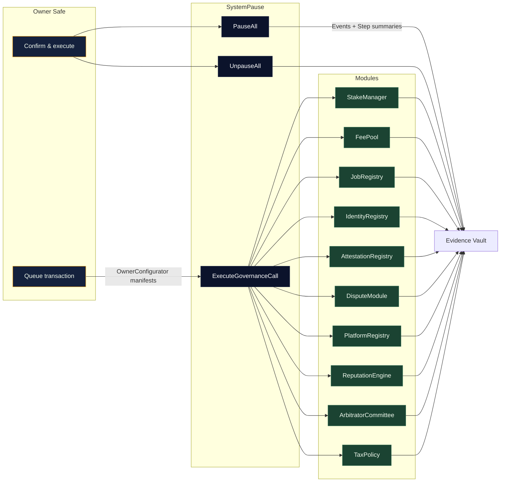

# Sovereign Operations Atlas

[](https://github.com/agijobs/agijobs-sovereign-labor-v0p1/actions/workflows/ci.yml)
[](https://github.com/agijobs/agijobs-sovereign-labor-v0p1/actions/workflows/branch-checks.yml)
[](https://github.com/agijobs/agijobs-sovereign-labor-v0p1/actions/workflows/security.yml)
[](https://etherscan.io/token/0xa61a3b3a130a9c20768eebf97e21515a6046a1fa)

> The operations atlas is the friendly pilot manual for the unstoppable labor engine. Every operator action—from pausing the mesh to rotating treasuries—routes through the owner Safe with deterministic, observable outcomes.

---

## Table of contents

1. [Operator command map](#operator-command-map)
2. [Non-technical control loops](#non-technical-control-loops)
3. [Owner playbooks](#owner-playbooks)
4. [Telemetry capture](#telemetry-capture)
5. [Evidence archive schema](#evidence-archive-schema)

---

## Operator command map



---

## Non-technical control loops

The [`docs/operations/owner-control.md`](owner-control.md) playbook provides narrated, copy-paste ready sequences for guardians and owners:

- **Emergency pause / resume.** One-click OwnerConfigurator bundles that pause or resume the entire lattice.
- **Treasury rotation.** Update staking treasuries, burn splits, and reward allowlists without touching raw calldata.
- **Parameter tuning.** Adjust validator quorum, slash basis points, dispute windows, and identity roots using pre-built JSON manifests.
- **Identity onboarding.** Publish new ENS nodes and Merkle roots with transparent event logs.

Hardhat proof-of-control: running `npm run test:hardhat` executes the SystemPause governance lattice spec so operators confirm treasuries, TaxPolicy text, and guardian pausers remain under Safe control before executing production flows.

Every sequence mirrors CI governance checks and reuses the same `$AGIALPHA` manifest validation.

---

## Owner playbooks

| Scenario | Artifact | Summary |
| --- | --- | --- |
| Pause / resume mesh | [`owner-control.md`](owner-control.md#global-pause-and-resume) | Guardian and owner Safe instructions with safety checks and telemetry expectations. |
| Rotate treasuries | [`owner-control.md`](owner-control.md#treasury-rotation) | Update StakeManager and FeePool treasuries while preserving burn splits. |
| Update validator policy | [`owner-control.md`](owner-control.md#validator-policy-tuning) | Increase quorum, adjust job stakes, and refresh validator allowlists with step-by-step validation. |
| Refresh identity | [`owner-control.md`](owner-control.md#identity-refresh) | Publish new ENS hashes and Merkle roots with Safe transaction templates. |

---

## Telemetry capture

1. **Manifest logs.** Every OwnerConfigurator run produces a Markdown summary; commit those under `manifests/governance/` or attach to the Safe transaction comments.
2. **Event trail.** Subscribe to `ModulesUpdated`, `PausersUpdated`, `GovernanceCallExecuted`, and module-specific events; the playbook lists expected emissions for each flow.
3. **CI mirror.** After executing a control action, rerun `npm run ci:governance` and `npm run test:truffle:ci` to prove the governance matrix and invariants remain intact.
4. **Evidence vault.** Store Safe transaction hashes, CLI logs, and GitHub Action URLs in your evidence vault for auditors.

---

## Evidence archive schema

```json
{
  "timestamp": "2024-05-01T12:34:56Z",
  "operator": "owner-safe",
  "action": "stakeManager.setTreasury",
  "transactionHash": "0x...",
  "safeUrl": "https://app.safe.global/transactions/...",
  "commands": [
    "npm run test:truffle:ci",
    "npm run test:hardhat",
    "npm run test:foundry",
    "npm run ci:governance"
  ],
  "manifests": [
    "manifests/addresses.mainnet.json",
    "manifests/governance/2024-05-01-treasury-rotation.md"
  ],
  "notes": "Treasury rotated to 0x1234… after council approval."
}
```

Keep this schema under version control or your preferred compliance vault so every configuration change is auditable and reproducible.
