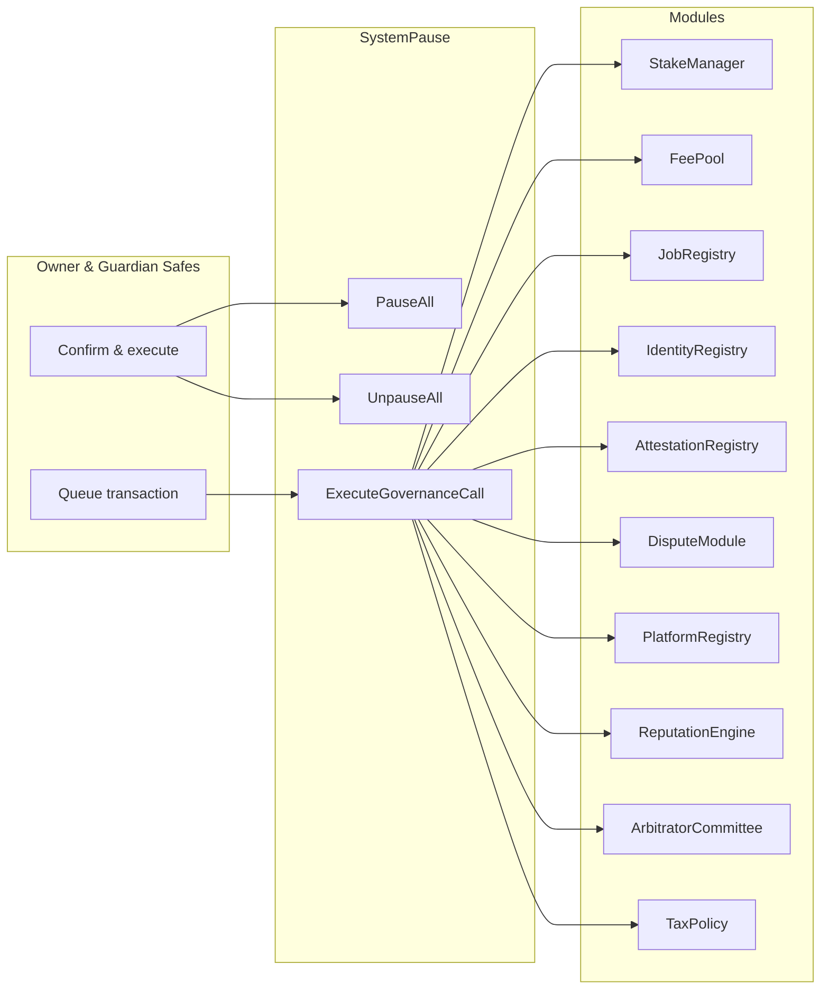
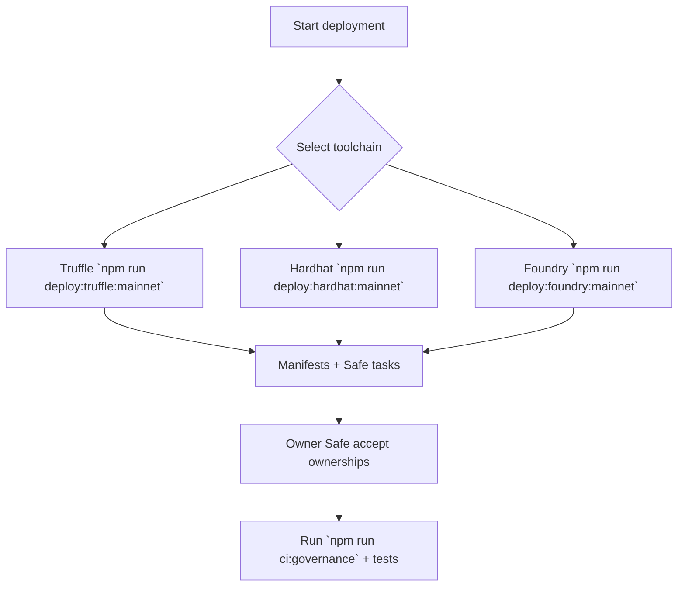

# Sovereign Operations Atlas

[](https://github.com/agijobs/agijobs-sovereign-labor-v0p1/actions/workflows/ci.yml)
[](https://github.com/agijobs/agijobs-sovereign-labor-v0p1/actions/workflows/security.yml)
[](https://github.com/agijobs/agijobs-sovereign-labor-v0p1/actions/workflows/branch-checks.yml)


> This atlas is the operator's cockpit. Every control loop, autopilot path, and telemetry feed is mapped so non-technical guardians can command the machine with confidence.

---

## Table of Contents
1. [Operator Command Map](#operator-command-map)
2. [Non-Technical Control Loops](#non-technical-control-loops)
3. [Autopilot Reference](#autopilot-reference)
4. [Owner Playbooks](#owner-playbooks)
5. [Telemetry Capture](#telemetry-capture)
6. [Evidence Archive Schema](#evidence-archive-schema)

---

## Operator Command Map


Every privileged function flows through SystemPause. All owner updates emit events plus Markdown summaries generated by the scripts to keep guardians and auditors synchronized.

---

## Non-Technical Control Loops
- **Emergency pause / resume.** Guardian Safe runs `pauseAll()`; owner Safe runs `unpauseAll()` after diagnostics.
- **Treasury rotation.** Use [`scripts/owner-set-treasury.js`](../../scripts/owner-set-treasury.js). The script prints the Safe calldata and Markdown summary; SystemPause executes it via `executeGovernanceCall`.
- **Validator or policy refresh.** Follow the `owner-set-treasury.js` pattern with OwnerConfigurator manifests to encode `IdentityRegistry` or `TaxPolicy` setters, then forward through the Safe for execution.
- **Identity onboarding.** Hardhat tests (`npm run test:hardhat`) and Foundry invariants confirm identity/attestation flows before production operations.

All loops mirror CI jobs so every change is pre-validated.

---

## Autopilot Reference


Each autopilot uses the same manifest loader. After execution, accept pending Safe tasks for identity modules, rerun governance audits, and archive manifests.

---

## Owner Playbooks
| Scenario | Artifact | Summary |
| --- | --- | --- |
| Global pause / resume | [`owner-control.md`](owner-control.md#global-pause-and-resume) | Guardian triggers pause; owner resumes after diagnostics. |
| Treasury rotation | [`owner-control.md`](owner-control.md#treasury-rotation) | OwnerConfigurator bundle rotates StakeManager and FeePool treasuries with telemetry. |
| Validator policy tuning | [`owner-control.md`](owner-control.md#validator-policy-tuning) | Adjust quorum, stake minimums, and Merkle roots with scripted calldata. |
| Identity refresh | [`owner-control.md`](owner-control.md#identity-refresh) | Publish new ENS nodes and Merkle roots with event expectations. |

---

## Telemetry Capture
1. **CI Mirror.** Save links to `Sovereign Compile`, `Security Scans`, and `Branch Gatekeeper` runs for every production change.
2. **Script summaries.** Each governance script appends Markdown to `$GITHUB_STEP_SUMMARY`; copy these into your evidence vault.
3. **Event trail.** Monitor `ModulesUpdated`, `PausersUpdated`, `GovernanceCallExecuted`, and module-specific events. Verify they match Safe transactions.
4. **Safe metadata.** Record Safe transaction hashes, signers, and notes for all configuration changes.
5. **Post-change audit.** Rerun `npm run ci:governance` and the multi-runtime test suite locally after each change; archive the outputs.

---

## Evidence Archive Schema
```json
{
  "timestamp": "2024-06-01T12:34:56Z",
  "operator": "owner-safe",
  "action": "StakeManager.setTreasury",
  "transactionHash": "0x...",
  "safeUrl": "https://app.safe.global/transactions/...",
  "commands": [
    "npm run test:truffle:ci",
    "npm run test:hardhat",
    "npm run test:foundry",
    "npm run ci:governance"
  ],
  "manifests": [
    "manifests/addresses.mainnet.json",
    "manifests/governance/2024-06-01-treasury-rotation.md"
  ],
  "notes": "Treasury rotated to 0x1234… after council approval."
}
```

Keep this schema versioned; it becomes the living history that proves the operator maintained control over the machine at every step.
