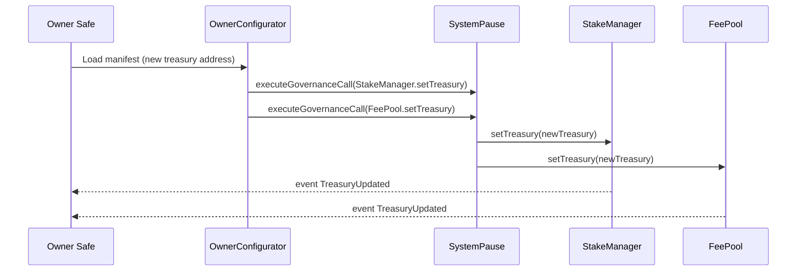
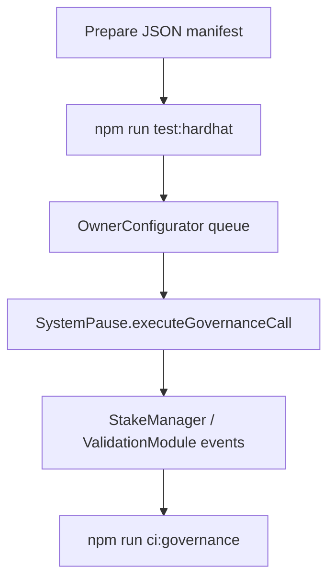
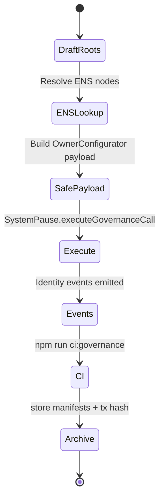

# Owner Control Playbook

[](https://app.safe.global/)
[](https://etherscan.io/token/0xa61a3b3a130a9c20768eebf97e21515a6046a1fa)
[](../../.github/workflows)

> This playbook converts governance authority into simple, copy-paste rituals. Each workflow assumes the operator is using the owner Safe with the [`OwnerConfigurator`](../../contracts/admin/OwnerConfigurator.sol) helper to batch calls safely.

---

## Quick reference matrix

| Scenario | Summary | Primary contracts | CLI guardrails |
| --- | --- | --- | --- |
| [Global pause and resume](#global-pause-and-resume) | Halt or resume the entire labor mesh in two clicks. | `SystemPause`, downstream modules | `npm run ci:governance`, `npm run test:truffle:ci` |
| [Treasury rotation](#treasury-rotation) | Point staking flows to a new treasury Safe while locking burn splits. | `StakeManager`, `FeePool` | `node scripts/owner-set-treasury.js`, `npm run test:foundry` |
| [Validator policy tuning](#validator-policy-tuning) | Adjust quorum, stakes, and slash parameters with parameter manifests. | `ValidationModule`, `StakeManager`, `JobRegistry` | `npm run test:hardhat`, `npm run ci:governance` |
| [Identity refresh](#identity-refresh) | Publish new ENS hashes and Merkle roots for agents and validators. | `IdentityRegistry`, `AttestationRegistry`, `SystemPause` | `cast resolve-name`, `npm run test:truffle:ci` |

Each scenario below includes: prerequisites, Safe transaction template, expected events, telemetry checklist, and rollback guidance.

---

## Global pause and resume

```mermaid
document
  title Global Pause Play
  section Safe Preparation
    Operator notes: Record reason, ticket ID, signer quorum
    Verify guardians: Guardian Safe reachable?
  section OwnerConfigurator Payload
    Step1[Set global pauser to guardian]
    Step2[Pause all modules]
  section Post Execution
    EventsCaptured[ModulesUpdated, PausersUpdated, Paused]
    Evidence[Archive Safe tx hash + CI reruns]
end
```

**Prerequisites**

1. Guardian Safe signers online and able to approve emergency transactions.
2. Current pauser set recorded (check `SystemPause.activePauser`).
3. CI green: `npm run test:truffle:ci`, `npm run test:hardhat`, `npm run test:foundry`, `npm run ci:governance`.

**Safe transaction template**

1. Open the owner Safe.
2. Create a new multisend transaction with two calls:
   - `SystemPause.setGlobalPauser(guardianSafe)` using the guardian Safe address.
   - `SystemPause.pauseAll()`.
3. Review gas estimate, ensure nonce is sequential, and request guardian confirmations.

**Operator checklist**

- Confirm emitted events: `PausersUpdated(guardianSafe)`, followed by `Paused(address)` for each module.
- Broadcast notice to support channels that the mesh is paused.
- Capture CLI output:
  ```bash
  npm run ci:governance
  npm run test:truffle:ci
  npm run test:hardhat   # includes the SystemPause governance lattice spec
  npm run test:foundry
  ```
- Store Safe transaction hash, CLI logs, and Step Summaries in the evidence archive.

**Resume flow**

Mirror the above transaction with `SystemPause.unpauseAll()` and, if desired, `SystemPause.setGlobalPauser(ownerSafe)` to return pauser authority to the owner. Re-run the CLI guardrails and monitor emitted `Unpaused` events.

**Rollback**

If any module remains paused unexpectedly, use `SystemPause.refreshPausers()` with the intended pauser and reissue `unpauseAll()`.

---

## Treasury rotation



**Prerequisites**

1. New treasury Safe funded and under governance control.
2. `NEW_TREASURY` environment variable exported locally.
3. Latest manifest updated: `deploy/config.mainnet.json` treasury field set to the new Safe.

**CLI validation**

```bash
export NEW_TREASURY=0xYourNewSafe
node scripts/owner-set-treasury.js > manifests/governance/$(date +%Y%m%d)-treasury-rotation.md
npm run test:truffle:ci
npm run test:hardhat   # confirms SystemPause can retune treasuries & TaxPolicy via Safe control
npm run test:foundry
npm run ci:governance
```

Review the generated Markdown summary and attach it to the Safe transaction.

**Safe transaction template**

Use the OwnerConfigurator JSON produced by the script (instructions printed in the Markdown). Upload it through the Safe transaction builder, request confirmations, and execute.

**Post-execution checks**

- Expect `TreasuryUpdated(newTreasury)` events on both `StakeManager` and `FeePool`.
- Verify burn splits via `FeePool.getDistributionConfig()`.
- Re-run Foundry invariants to confirm stake accounting remains correct.

**Rollback**

Re-run the same flow with the previous treasury address if required. The script persists the prior address in the Markdown summary for quick reference.

---

## Validator policy tuning

**Purpose:** adjust validator quorum, stake requirements, and slash parameters while maintaining deterministic proofs.



**Prerequisites**

1. Updated manifest capturing new parameters:
   ```json
   {
     "params": {
       "validatorQuorum": 5,
       "minStakeWei": "500000000000000000000",
       "slashBps": 600,
       "burnBpsOfFee": 100,
       "platformFeeBps": 1000
     }
   }
   ```
2. Owner Safe signers aware of planned change and risk controls.
3. Hardhat tests green locally.

**Automation**

```bash
export VALIDATOR_POLICY_MANIFEST=manifests/policies/validator-policy.json
export GOVERNANCE_SUMMARY_PATH=manifests/governance/$(date +%Y%m%d)-validator-policy.md
truffle exec scripts/owner-apply-validator-policy.js --network <network>
# or `npm run owner:validator-policy -- --network <network>` once env vars are set
```

The script diff-checks the manifest against on-chain state, relays a single `OwnerConfigurator.configureBatch` call through
`SystemPause`, prints decoded telemetry (`ParameterUpdated`, `GovernanceCallExecuted`, `JobParametersUpdated`, `ValidatorBoundsUpdated`, etc.), and writes a Markdown audit summary to `GOVERNANCE_SUMMARY_PATH` when set.

**CLI validation**

```bash
npm run test:hardhat
npm run test:truffle:ci
npm run ci:governance
```

**Safe execution**

The OwnerConfigurator batch routes every setter through `SystemPause.executeGovernanceCall`, so the queued transaction is Safe-ready out of the box. Review the Markdown summary and attach it to the Safe payload for signer context.

**Expected events**

- `ParameterUpdated` and `GovernanceCallExecuted` for each module touched.
- `RoleMinimumUpdated`, `MinStakeUpdated`, and `SlashingPercentagesUpdated` on `StakeManager`.
- `FeePctUpdated`, `JobParametersUpdated` on `JobRegistry`.
- `ValidatorBoundsUpdated`, `ValidatorsPerJobUpdated`, `RequiredValidatorApprovalsUpdated` on `ValidationModule`.
- `BurnPctUpdated` on `FeePool` when burn splits change.

**Post-checks**

- Inspect `StakeManager.validatorConfig()` via `cast call` to confirm values.
- Run Foundry invariants to ensure staking math still balances.
- Archive CLI outputs and Safe transaction hash.

**Rollback**

Replay the previous configuration manifest (kept under version control) and run the same validation loop.

---

## Identity refresh



**Prerequisites**

1. New ENS node strings (for example `agents.agijobs.eth`) resolved via `cast resolve-name`.
2. Updated Merkle roots computed and saved to disk.
3. Guardian Safe prepared to acknowledge the change.

**CLI validation**

```bash
cast resolve-name agents.agijobs.eth --rpc $MAINNET_RPC
cast resolve-name club.agijobs.eth --rpc $MAINNET_RPC
npm run test:truffle:ci
npm run ci:governance
```

**Safe payload**

Batch the following calls through OwnerConfigurator:

1. `IdentityRegistry.setAgentMerkleRoot(newAgentRoot)`.
2. `IdentityRegistry.setValidatorMerkleRoot(newValidatorRoot)`.
3. `IdentityRegistry.setClubMerkleRoot(newClubRoot)` (optional).
4. `AttestationRegistry.setENSRegistry(newEnsRegistry)` or `setNameWrapper` if required.

**Telemetry expectations**

- `AgentMerkleRootUpdated`, `ValidatorMerkleRootUpdated`, `ClubMerkleRootUpdated` events.
- `ENSRegistryUpdated` or `NameWrapperUpdated` when applicable.
- CI re-run of `npm run ci:governance` should report unchanged governance surfaces and the new identity hashes.

**Rollback**

Replay the previous roots stored in your configuration manifest and re-run the same verification pipeline.

---

## Evidence bundle template

After each owner action, capture an evidence bundle with the following Markdown skeleton (copy into `manifests/governance/`):

```markdown
# <Action Title>

- **Timestamp:** 2024-05-01T12:34:56Z
- **Safe transaction:** https://app.safe.global/transactions/...
- **Operator:** <name / role>
- **Commands executed:**
  - `npm run test:truffle:ci`
  - `npm run test:hardhat`
  - `npm run test:foundry`
  - `npm run ci:governance`
- **Contracts touched:** SystemPause, StakeManager, FeePool
- **Events observed:** TreasuryUpdated(0x...), PausersUpdated(0x...)
- **Notes:** Council resolution #42, gas price 24 gwei, guardian confirmation received within SLA.
```

Store the Markdown file alongside manifest JSON and Safe exports to maintain an auditable trail for every configuration change.
