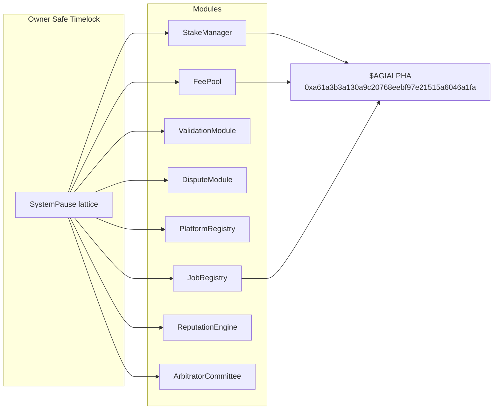
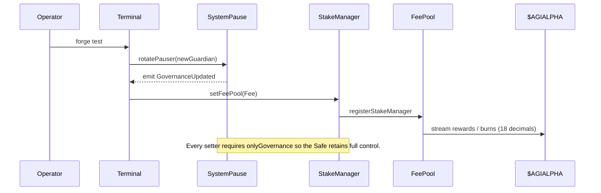
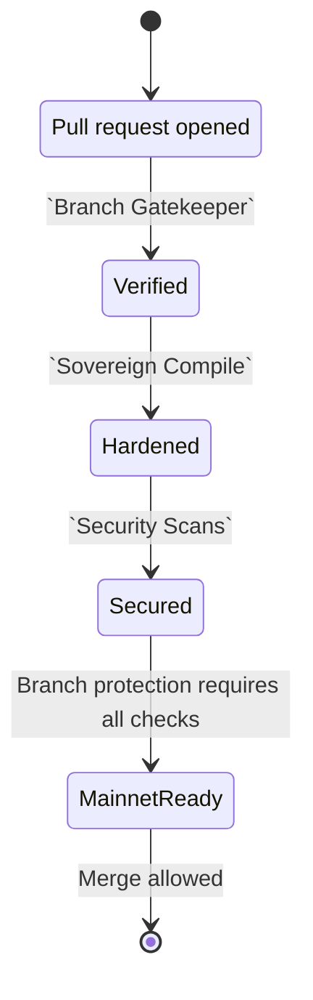

# Sovereign Labor Foundry Command Deck

[](https://github.com/MontrealAI/agijobs-sovereign-labor-v0p1/actions/workflows/ci.yml)
[](https://github.com/MontrealAI/agijobs-sovereign-labor-v0p1/actions/workflows/security.yml)
[](https://github.com/MontrealAI/agijobs-sovereign-labor-v0p1/actions/workflows/branch-checks.yml)
[](../LICENSE)
[](https://etherscan.io/token/0xa61a3b3a130a9c20768eebf97e21515a6046a1fa)

> The Foundry lattice mirrors the production machine—every invariant, privilege, and `$AGIALPHA` flow is reproduced locally so the owner Safe retains total command to pause, retune, and redeploy at light speed.

## Navigation
- [Mission Control Overview](#mission-control-overview)
- [CI & Branch Protection](#ci--branch-protection)
- [Command Palette](#command-palette)
- [Non-Technical Mainnet Launch](#non-technical-mainnet-launch)
- [Architecture Atlases](#architecture-atlases)
- [Appendix](#appendix)

## Mission Control Overview
The Foundry workspace exercises the same upgrade and pause surface that guards mainnet:

- **Governance-perfect rehearsals.** Solidity integration tests drive the `SystemPause` lattice exactly as the owner Safe would—rotating pausers, rewiring modules, and verifying every setter remains under governance control.
- **Canonical `$AGIALPHA` economics.** The mock token is deployed at `0xa61a3b3a130a9c20768eebf97e21515a6046a1fa` with 18 decimals, matching [`contracts/Constants.sol`](../contracts/Constants.sol) and the Truffle migrations.
- **Evidence artefacts.** Each run emits JSON traces inside `out/` and `broadcast/` so auditors can replay execution without live chain access.



## CI & Branch Protection
The badges above track the three required GitHub Actions checks. Protect `main` and `develop` by requiring:

1. **`Sovereign Compile`** – runs linting, multi-runtime tests (Truffle, Hardhat, Foundry), governance surface audits, and artifact verification.
2. **`Security Scans`** – executes Slither + Mythril against the compiled Foundry build.
3. **`Branch Gatekeeper`** – enforces naming policy so automation can reason about release intent.

> **Enforcement recipe:** Settings → Branches → “Add branch protection rule” → `main` (repeat for `develop`). Enable “Require a pull request before merging”, check “Require status checks to pass”, and select the three jobs above. Enable “Do not allow bypassing the above settings”.

Foundry jobs reuse the same manifests as CI; local runs stay in lockstep with the protected pipeline.

## Command Palette
All commands assume `npm ci` has been executed at the repository root.

| Goal | Command | Output |
| --- | --- | --- |
| Compile Solidity with Foundry | `forge build --build-info --force` | Writes `foundry/out` artifacts with ABI, metadata, and build info for audits. |
| Run Foundry test suites | `npm run test:foundry` | Executes invariants and scenario tests that manipulate governance setters and pause controls. |
| Snapshot gas metrics | `forge test --gas-report` | Produces a gas usage report that must stay within mainnet budgets. |
| Re-run governance matrix | `npm run ci:governance` | Confirms every privileged setter remains exposed to the owner Safe. |
| Publish docs-ready traces | `forge script foundry/script/DeployMainnet.s.sol --sig 'dryRun()'` | Generates human-readable `broadcast/` manifests without sending transactions. |

## Non-Technical Mainnet Launch
The most operator-friendly autopilot is the Truffle migration triad. It matches CI exactly and performs deterministic safety checks before broadcasting any transaction.

1. **Install prerequisites.**
   - Node.js ≥ 20, npm ≥ 10.
   - Foundry (`curl -L https://foundry.paradigm.xyz | bash`, then `foundryup`).
   - An Ethereum mainnet RPC endpoint and a hardware wallet or Safe loader for signing.
2. **Configure secrets.** Duplicate `deploy/config.example.json` as `deploy/config.mainnet.json`, then set:
   - `ownerSafe` (multisig executing governance), `guardianSafe` (pauser), `treasury` (optional).
   - `tokens.agi = "0xa61a3b3a130a9c20768eebf97e21515a6046a1fa"` and leave decimals at `18`.
   - ENS identity roots and Merkle proofs if onboarding pre-authorised agents.
3. **Prime environment.**
   ```bash
   npm ci --omit=optional --no-audit --no-fund
   export MNEMONIC="<twelve words>"
   export MAINNET_RPC="https://mainnet.infura.io/v3/<key>"
   export ETHERSCAN_API_KEY="<api key>"
   ```
4. **Launch the migration autopilot.**
   ```bash
   npx truffle migrate --network mainnet --f 1 --to 3 --compile-all
   ```
   - Step 1 (`migrations/1_deploy_kernel.js`, excerpt below) deploys every module, validates `$AGIALPHA`, and hands control to `SystemPause` before transferring ownership to the Safe.
   - Step 2 (`migrations/2_register_pause.js`) snapshots wiring so operators can verify the lattice.
   - Step 3 (`migrations/3_mainnet_finalize.js`) refuses to finish unless the Safe truly owns every contract and the fee pool still points to `$AGIALPHA`.
5. **Finalize.** Collect the manifest under `manifests/mainnet/` and distribute it to finance, compliance, and treasury teams for their audit trail.

```javascript
// migrations/1_deploy_kernel.js (mainnet excerpt)
const CANONICAL_AGIALPHA = '0xa61a3b3a130a9c20768eebf97e21515a6046a1fa';
...
if (!ownerSafe || ownerSafe === ZERO_ADDRESS) {
  throw new Error('deploy config must include a non-zero ownerSafe');
}
if (!web3.utils.isAddress(ownerSafe)) {
  throw new Error(`ownerSafe must be a valid address, received ${ownerSafe}`);
}
...
const agiMetadata = new web3.eth.Contract(ERC20_METADATA_ABI, configuredAgi);
const agiDecimals = Number(await agiMetadata.methods.decimals().call());
if (agiDecimals !== 18) {
  throw new Error(`$AGIALPHA decimals must equal 18, detected ${agiDecimals}`);
}
```

Foundry’s `DeployMainnet.s.sol` script performs identical checks in Solidity for teams that prefer broadcasting through `forge script`. Hardhat (`npm run deploy:hardhat:mainnet`) mirrors the same manifest too.

## Architecture Atlases
Two high-resolution blueprints spotlight how the machine keeps owner supremacy intact.





## Appendix
- [`foundry.toml`](../foundry.toml) – Compiler settings shared by CI and local runs.
- [`foundry/script/DeployMainnet.s.sol`](script/DeployMainnet.s.sol) – Solidity autopilot replicating the Truffle deployment in a single forge command.
- [`foundry/test`](test) – Invariants, fuzzing suites, and governance control proofs.
- [`docs/operations/owner-control.md`](../docs/operations/owner-control.md) – Exhaustive matrix of setter authority for the owner Safe.

> Maintain the discipline: every environment must keep `$AGIALPHA = 0xa61a3b3a130a9c20768eebf97e21515a6046a1fa` with 18 decimals and route all privileged calls through the owner Safe. The repository already enforces these invariants—follow the scripts and the machine remains unstoppable.
