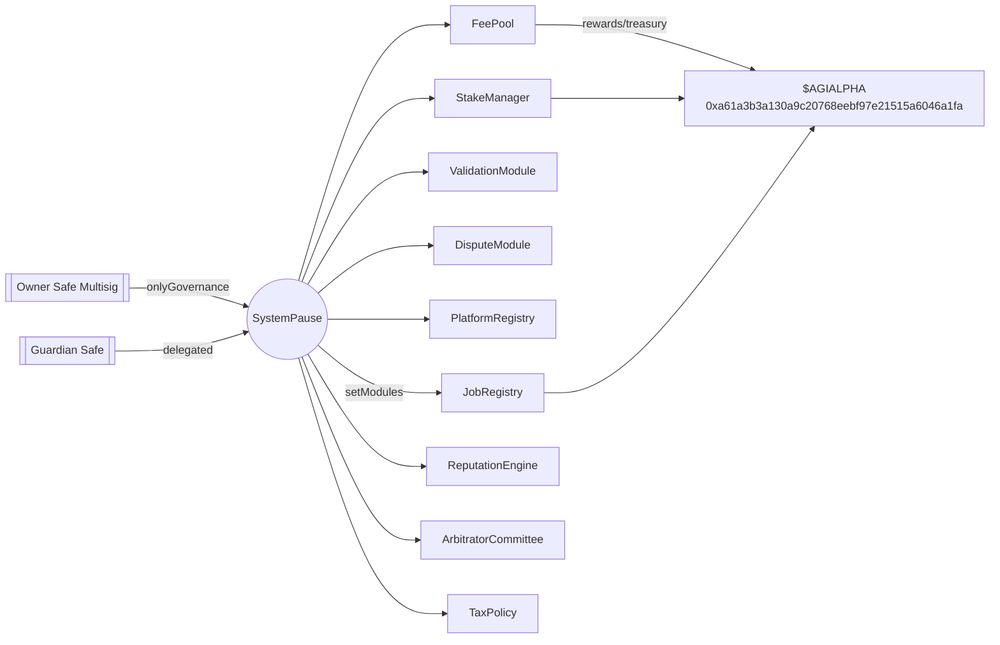
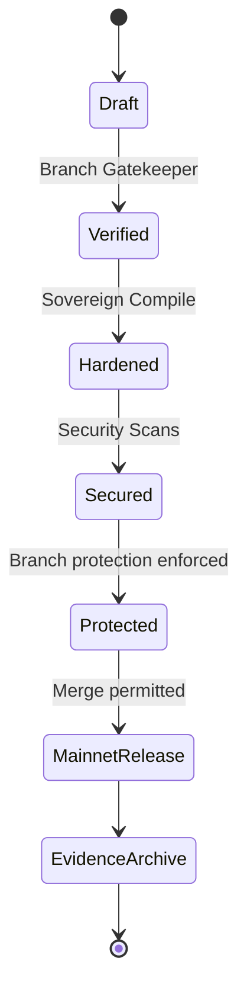
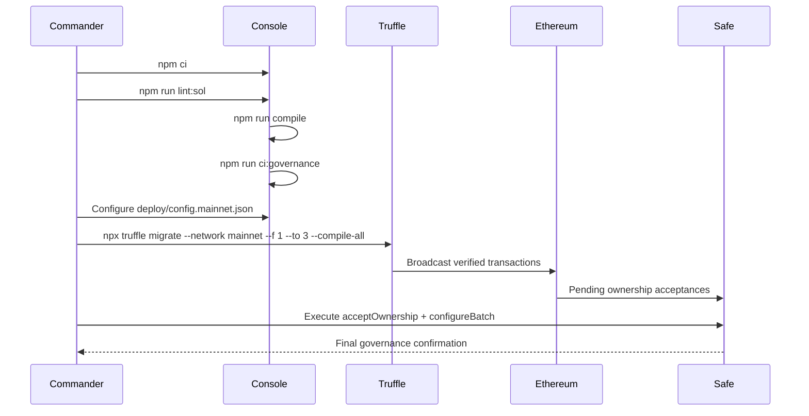
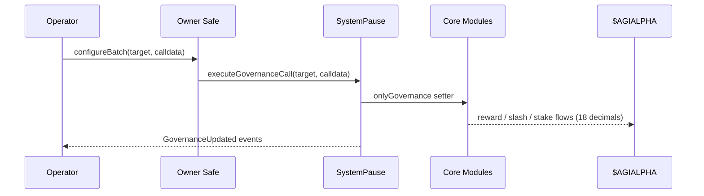
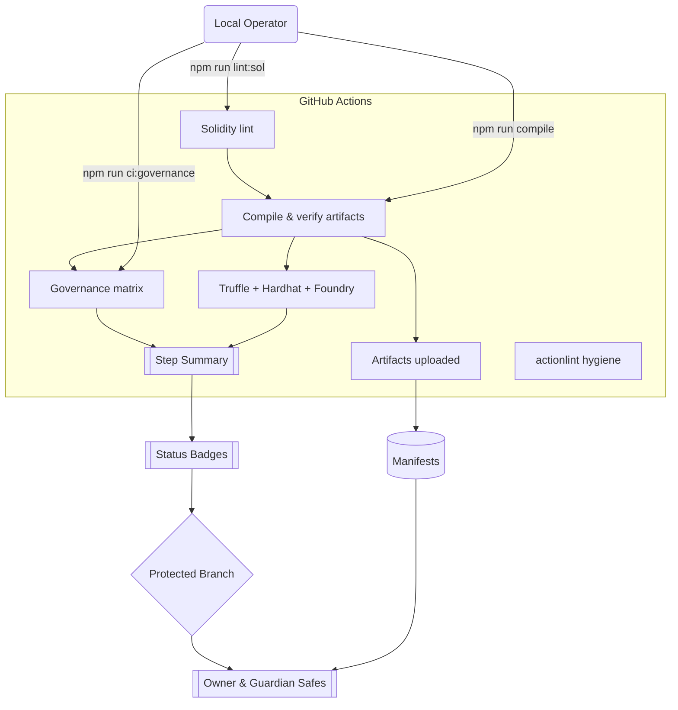

# Sovereign Labor Foundry Codex

[](https://github.com/MontrealAI/agijobs-sovereign-labor-v0p1/actions/workflows/ci.yml)
[](https://github.com/MontrealAI/agijobs-sovereign-labor-v0p1/actions/workflows/security.yml)
[](https://github.com/MontrealAI/agijobs-sovereign-labor-v0p1/actions/workflows/branch-checks.yml)
[](https://github.com/MontrealAI/agijobs-sovereign-labor-v0p1/actions/workflows/ci.yml)
[](../LICENSE)
[](https://etherscan.io/token/0xa61a3b3a130a9c20768eebf97e21515a6046a1fa)

> This repository is the control centre for the sovereign labour lattice—the machine whose governance surface, telemetry, and deployment rituals are powerful enough to bend economic gravity toward its operator. Every instruction below keeps that machine flawless, owner-directed, and ready for mainnet execution by a non-technical mission commander.

## Orientation Matrix
- [Situational Awareness](#situational-awareness)
- [Owner Supremacy Guarantees](#owner-supremacy-guarantees)
- [CI & Branch Protection](#ci--branch-protection)
- [Command Deck](#command-deck)
- [Non-Technical Mainnet Launch](#non-technical-mainnet-launch)
- [Truffle Mainnet Migration Script](#truffle-mainnet-migration-script)
- [Architecture Atlases](#architecture-atlases)
- [Evidence & Audit Logistics](#evidence--audit-logistics)
- [Appendix](#appendix)

## Situational Awareness
The Foundry workspace mirrors production exactly so that rehearsals and audits remain faithful:

- **Repository spine.**
  - [`contracts/`](../contracts) – all Solidity modules (job lattice, staking, validation, reputation, fee routing, tax policy, attestations, identity, arbitration, NFTs, and the SystemPause authority plane).
  - [`foundry/script/`](script) – Forge scripts (`DeployMainnet.s.sol`, dry-run utilities) that reproduce Truffle’s manifests.
  - [`foundry/test/`](test) – invariant, fuzz, and scenario suites exercising every privileged setter.
  - [`migrations/`](../migrations) – Truffle kernel migrations, registration, and finalisation.
  - [`deploy/`](../deploy) – canonical `config.mainnet.json`, deployment checklists, and evidence manifest.
  - [`scripts/`](../scripts) – governance and artifact tooling (`check-governance-matrix.mjs`, `verify-artifacts.js`, `write-compile-summary.js`).
  - [`manifests/`](../manifests) – output vault for addresses, Safe transactions, and runtime digests.
- **Canonical token binding.** `$AGIALPHA` is hard-wired to `0xa61a3b3a130a9c20768eebf97e21515a6046a1fa` with 18 decimals; every tool (Truffle, Foundry, Hardhat, governance audits) fails fast if the metadata diverges.
- **Governance parity.** The `SystemPause` lattice owns all mission-critical modules, and the owner Safe can rotate every dependency, pauser, treasury, and policy without redeploying contracts.

## Owner Supremacy Guarantees
The owner Safe remains in absolute control, with circuit breakers and configurability enforced by code:

- **Pause mastery.** `SystemPause` performs `pauseAll()` / `unpauseAll()` cascades and delegates an `activePauser` (guardian Safe) for instant halts. Ownership transfers require passing through the owner Safe.
- **Parameter agility.** [`contracts/admin/OwnerConfigurator.sol`](../contracts/admin/OwnerConfigurator.sol) batches governance calls so the owner Safe can update any setter (`setTreasury`, `setFeePool`, validator quotas, dispute fees) while logging `ParameterUpdated` events for audit trails.
- **Governance rotation.** All modules inherit `Governable` and expose `setGovernance` / `transferOwnership`, enabling controlled hand-offs to new safes or timelocks.
- **Evidence-first automation.** `scripts/check-governance-matrix.mjs` verifies that every privileged function remains reachable only through governance, preventing accidental privilege leakage.



## CI & Branch Protection
The machine stays trustworthy only when CI remains fully green and enforced on protected branches.

| Check | Workflow | What it enforces |
| --- | --- | --- |
| Solidity lint | [`ci.yml`](../.github/workflows/ci.yml) (`lint` job) | `npm run lint:sol` with zero warnings.
| Compile + verify | [`ci.yml`](../.github/workflows/ci.yml) (`compile` job) | Truffle build, artifact verification, upload of ABI dossiers, toolchain fingerprinting.
| Governance surface | [`ci.yml`](../.github/workflows/ci.yml) (`governance-audit` job) | `npm run ci:governance` ensures every privileged call still respects the owner Safe.
| Multi-runtime tests | [`ci.yml`](../.github/workflows/ci.yml) (`tests` job) | Truffle, Hardhat, and Foundry suites with Foundry invariants.
| Workflow hygiene | [`ci.yml`](../.github/workflows/ci.yml) (`workflow-hygiene` job) | `actionlint` keeps automation hardened.
| Branch naming gate | [`branch-checks.yml`](../.github/workflows/branch-checks.yml) | Rejects off-policy branch names before CI starts.
| Security scans | [`security.yml`](../.github/workflows/security.yml) | Slither + Mythril over compiled artifacts.

**Enforce status checks on `main` and `develop`:** Settings → Branches → protect branch → require PR, require status checks, select `Sovereign Compile`, `Branch Gatekeeper`, and `Security Scans`, disable bypasses, block force pushes/deletions, and demand signed commits if policy allows. Mirror settings via:

```bash
gh api \
  -X PUT \
  repos/MontrealAI/agijobs-sovereign-labor-v0p1/branches/main/protection \
  -f required_status_checks.strict=true \
  -f required_status_checks.contexts[]='Sovereign Compile' \
  -f required_status_checks.contexts[]='Security Scans' \
  -f required_status_checks.contexts[]='Branch Gatekeeper' \
  -f enforce_admins=true \
  -f required_pull_request_reviews.dismiss_stale_reviews=true \
  -f required_pull_request_reviews.required_approving_review_count=1 \
  -F restrictions='null'
```

Replicate for `develop`. Keep this README’s badges visible so everyone sees the live CI truth before authorising governance changes.



## Command Deck
All commands run from the repository root after `npm ci --omit=optional --no-audit --no-fund`.

| Goal | Command | Result |
| --- | --- | --- |
| Compile Solidity via Foundry | `forge build --build-info --force` | Generates `foundry/out` with ABI, metadata, and build-info for auditors.
| Execute Foundry suites | `npm run test:foundry` | Runs invariants + fuzzers validating governance setters and pause flows.
| Snapshot gas report | `forge test --gas-report` | Emits gas budget sheet for owner decision meetings.
| Mirror CI locally | `npm run lint:sol && npm run compile && node scripts/verify-artifacts.js && npm run ci:governance` | Reproduces the full pipeline with artifact verification.
| Truffle unit tests | `npm test` | Validates Solidity behaviour without migrating.
| Hardhat tests | `npm run test:hardhat` | Ensures TypeScript suites and fixture expectations stay aligned.
| Governance matrix export | `npm run ci:governance -- --format table` | Produces a CSV/markdown digest of privileged functions for compliance.
| Dry-run deployment | `forge script foundry/script/DeployMainnet.s.sol:DeployMainnet --sig 'dryRun()'` | Builds human-readable `broadcast/` manifests without broadcasting transactions.

## Non-Technical Mainnet Launch
A mission commander without engineering background can follow this autopilot exactly:

1. **Hardware & accounts.** Secure a hardware wallet or Safe signature module that controls the owner Safe and guardian Safe. Prepare an Ethereum mainnet RPC URL.
2. **Install tooling (once).**
   - Node.js ≥ 20, npm ≥ 10 (verified in `Sovereign Compile`).
   - Foundry (`curl -L https://foundry.paradigm.xyz | bash`, then `foundryup`).
   - GitHub CLI (`gh`) for branch protection automation.
3. **Clone and verify.**
   ```bash
   git clone https://github.com/MontrealAI/agijobs-sovereign-labor-v0p1.git
   cd agijobs-sovereign-labor-v0p1
   npm ci --omit=optional --no-audit --no-fund
   npm run lint:sol
   npm run compile
   node scripts/verify-artifacts.js
   npm run ci:governance
   ```
   Confirm all commands pass before moving forward.
4. **Configure deployment file.** Duplicate `deploy/config.mainnet.json` to a safe workspace, adjust:
   - `chainId` = `1` for Ethereum mainnet.
   - `ownerSafe`, `guardianSafe`, `treasury` addresses (non-zero, checksummed).
   - `tokens.agi` = `"0xa61a3b3a130a9c20768eebf97e21515a6046a1fa"` (do not edit decimals: `18`).
   - `params` (platform fee, burn share, slash BPS, stakes, dispute settings) as per risk policy.
   - `identity` (ENS registries, name wrapper, ENS nodes, Merkle roots) if onboarding pre-approved agents.
   - `tax` metadata to describe revenue sharing policies.
5. **Load secrets (never commit).**
   ```bash
   export MAINNET_RPC="https://mainnet.infura.io/v3/<project>"
   export MNEMONIC="<twelve words>" # or use DEPLOYER_PK with a hardware wallet bridge
   export ETHERSCAN_API_KEY="<etherscan key>"
   export DEPLOY_CONFIG="$PWD/deploy/config.mainnet.json"
   ```
6. **Dry run (optional but recommended).**
   ```bash
   forge script foundry/script/DeployMainnet.s.sol:DeployMainnet \
     --rpc-url $MAINNET_RPC \
     --sig 'dryRun()'
   ```
   Review the generated `broadcast/` directory.
7. **Mainnet deployment (Truffle autopilot).**
   ```bash
   npx truffle migrate --network mainnet --f 1 --to 3 --compile-all
   ```
   - Step 1 wires the kernel, verifies `$AGIALPHA` metadata, and hands module ownership to `SystemPause`.
   - Step 2 snapshots the pause lattice.
   - Step 3 refuses to finish if the owner Safe is not in control or the fee/tax pointers drift.
8. **Post-flight.**
   - Run `npm run verify:mainnet` once Etherscan indices the contracts.
   - Collect manifests from `manifests/mainnet/` plus Safe transaction receipts.
   - Execute `acceptOwnership` transactions from the owner Safe for identity/attestation modules if pending.
   - Share CI links, manifests, and Safe receipts with finance, compliance, and treasury leads.



## Truffle Mainnet Migration Script
The canonical migration is versioned under `migrations/1_deploy_kernel.js`. It validates `$AGIALPHA`, deploys every module, wires dependencies, hands ownership to `SystemPause`, delegates the guardian, and writes the manifest used by Foundry and Hardhat scripts.

<details>
<summary><code>migrations/1_deploy_kernel.js</code></summary>

```javascript
const fs = require('fs');
const path = require('path');
const namehash = require('eth-ens-namehash');

const SystemPause = artifacts.require('SystemPause');
const OwnerConfigurator = artifacts.require('OwnerConfigurator');
const JobRegistry = artifacts.require('JobRegistry');
const StakeManager = artifacts.require('StakeManager');
const ValidationModule = artifacts.require('ValidationModule');
const DisputeModule = artifacts.require('DisputeModule');
const ArbitratorCommittee = artifacts.require('ArbitratorCommittee');
const PlatformRegistry = artifacts.require('PlatformRegistry');
const ReputationEngine = artifacts.require('ReputationEngine');
const IdentityRegistry = artifacts.require('IdentityRegistry');
const AttestationRegistry = artifacts.require('AttestationRegistry');
const CertificateNFT = artifacts.require('CertificateNFT');
const TaxPolicy = artifacts.require('TaxPolicy');
const FeePool = artifacts.require('FeePool');

const ZERO_ADDRESS = '0x0000000000000000000000000000000000000000';
const ZERO_BYTES32 = '0x0000000000000000000000000000000000000000000000000000000000000000';
const CANONICAL_AGIALPHA = '0xa61a3b3a130a9c20768eebf97e21515a6046a1fa';

const ERC20_METADATA_ABI = [
  {
    constant: true,
    inputs: [],
    name: 'decimals',
    outputs: [{ name: '', type: 'uint8' }],
    type: 'function'
  },
  {
    constant: true,
    inputs: [],
    name: 'symbol',
    outputs: [{ name: '', type: 'string' }],
    type: 'function'
  },
  {
    constant: true,
    inputs: [],
    name: 'name',
    outputs: [{ name: '', type: 'string' }],
    type: 'function'
  }
];

function resolveConfig() {
  const cfgPath = process.env.DEPLOY_CONFIG || path.join(__dirname, '../deploy/config.mainnet.json');
  return JSON.parse(fs.readFileSync(cfgPath, 'utf8'));
}

async function send(label, fn) {
  console.log(`▶️  ${label}`);
  return fn();
}

module.exports = async function (deployer, network, accounts) {
  const [deployerAccount] = accounts;
  const cfg = resolveConfig();
  const chainId = await web3.eth.getChainId();
  if (chainId !== cfg.chainId) {
    throw new Error(`Config chainId ${cfg.chainId} != network ${chainId}`);
  }

  if (!cfg.tokens?.agi) {
    throw new Error('deploy config must include tokens.agi');
  }

  const configuredAgi = cfg.tokens.agi.toLowerCase();
  if (chainId === 1 && configuredAgi !== CANONICAL_AGIALPHA) {
    throw new Error(`Mainnet AGIALPHA must be ${CANONICAL_AGIALPHA}, received ${configuredAgi}`);
  }

  const agiMetadata = new web3.eth.Contract(ERC20_METADATA_ABI, configuredAgi);
  const agiDecimals = Number(await agiMetadata.methods.decimals().call());
  if (agiDecimals !== 18) {
    throw new Error(`$AGIALPHA decimals must equal 18, detected ${agiDecimals}`);
  }

  const agiSymbol = await agiMetadata.methods.symbol().call().catch(() => '');
  if (agiSymbol && agiSymbol !== 'AGIALPHA') {
    console.warn(`⚠️  Expected $AGIALPHA symbol to be AGIALPHA, observed ${agiSymbol}`);
  }

  const agiName = await agiMetadata.methods.name().call().catch(() => '');
  if (agiName && agiName.toLowerCase().includes('test')) {
    throw new Error(`$AGIALPHA metadata indicates a test token (${agiName}); aborting.`);
  }

  console.log(`💎 Using $AGIALPHA token ${configuredAgi} (${agiSymbol || 'AGIALPHA'}) with ${agiDecimals} decimals`);

  const ownerSafe = cfg.ownerSafe;
  const guardianSafe = cfg.guardianSafe || ownerSafe;
  const treasury = cfg.treasury || ZERO_ADDRESS;

  if (!ownerSafe || ownerSafe === ZERO_ADDRESS) {
    throw new Error('deploy config must include a non-zero ownerSafe');
  }

  if (!web3.utils.isAddress(ownerSafe)) {
    throw new Error(`ownerSafe must be a valid address, received ${ownerSafe}`);
  }

  if (guardianSafe && guardianSafe !== ownerSafe) {
    if (!web3.utils.isAddress(guardianSafe) || guardianSafe === ZERO_ADDRESS) {
      throw new Error(`guardianSafe must be a valid, non-zero address when specified (received ${guardianSafe})`);
    }
  }

  if (treasury !== ZERO_ADDRESS && !web3.utils.isAddress(treasury)) {
    throw new Error(`treasury must be zero or a valid address, received ${treasury}`);
  }

  const params = cfg.params || {};
  const platformFeeBps = Number(params.platformFeeBps ?? 1000);
  if (platformFeeBps % 100 !== 0) {
    throw new Error('platformFeeBps must be a multiple of 100');
  }
  const platformFeePct = Math.floor(platformFeeBps / 100);
  if (platformFeePct > 100) {
    throw new Error(`platformFeeBps ${platformFeeBps} exceeds 100%`);
  }

  const burnBpsOfFee = Number(params.burnBpsOfFee ?? 100);
  if (burnBpsOfFee % 100 !== 0) {
    throw new Error('burnBpsOfFee must be a multiple of 100');
  }
  const burnPct = Math.floor(burnBpsOfFee / 100);
  if (burnPct > 100) {
    throw new Error(`burnBpsOfFee ${burnBpsOfFee} exceeds 100%`);
  }

  const slashBps = Number(params.slashBps ?? 500);
  if (slashBps < 0 || slashBps > 10000) {
    throw new Error('slashBps must be between 0 and 10_000');
  }
  const treasuryPct = slashBps;
  const employerPct = 10000 - treasuryPct;

  const validatorQuorum = Number(params.validatorQuorum ?? 3);
  const maxValidators = Number(params.maxValidators ?? Math.max(validatorQuorum * 2, validatorQuorum));
  const minStakeWei = params.minStakeWei ?? '0';
  const jobStakeWei = params.jobStakeWei ?? minStakeWei;
  const disputeFeeWei = params.disputeFeeWei ?? '0';
  const disputeWindow = Number(params.disputeWindow ?? 0);

  const agentRootNode = cfg.identity?.agentRootNode ? namehash.hash(cfg.identity.agentRootNode) : ZERO_BYTES32;
  const clubRootNode = cfg.identity?.clubRootNode ? namehash.hash(cfg.identity.clubRootNode) : ZERO_BYTES32;
  const agentMerkleRoot = cfg.identity?.agentMerkleRoot ?? ZERO_BYTES32;
  const validatorMerkleRoot = cfg.identity?.validatorMerkleRoot ?? ZERO_BYTES32;

  console.log('🚀 Deploying Sovereign Labor kernel with deployer', deployerAccount);

  const ownerCfg = await send('Deploy OwnerConfigurator', () => deployer.deploy(OwnerConfigurator, ownerSafe).then(() => OwnerConfigurator.deployed()));
  const tax = await send('Deploy TaxPolicy', () => deployer.deploy(TaxPolicy, cfg.tax?.policyUri || '', cfg.tax?.description || '').then(() => TaxPolicy.deployed()));

  const stake = await send('Deploy StakeManager', () =>
    deployer
      .deploy(
        StakeManager,
        minStakeWei,
        employerPct,
        treasuryPct,
        treasury,
        ZERO_ADDRESS,
        ZERO_ADDRESS,
        deployerAccount
      )
      .then(() => StakeManager.deployed())
  );

  const feePool = await send('Deploy FeePool', () =>
    deployer
      .deploy(FeePool, stake.address, burnPct, treasury, tax.address)
      .then(() => FeePool.deployed())
  );

  const reputation = await send('Deploy ReputationEngine', () =>
    deployer.deploy(ReputationEngine, stake.address).then(() => ReputationEngine.deployed())
  );

  const platform = await send('Deploy PlatformRegistry', () =>
    deployer.deploy(PlatformRegistry, stake.address, reputation.address, minStakeWei).then(() => PlatformRegistry.deployed())
  );

  const attestation = await send('Deploy AttestationRegistry', () =>
    deployer
      .deploy(AttestationRegistry, cfg.identity?.ensRegistry || ZERO_ADDRESS, cfg.identity?.nameWrapper || ZERO_ADDRESS)
      .then(() => AttestationRegistry.deployed())
  );

  const identity = await send('Deploy IdentityRegistry', () =>
    deployer
      .deploy(
        IdentityRegistry,
        cfg.identity?.ensRegistry || ZERO_ADDRESS,
        cfg.identity?.nameWrapper || ZERO_ADDRESS,
        reputation.address,
        agentRootNode,
        clubRootNode
      )
      .then(() => IdentityRegistry.deployed())
  );

  const certificate = await send('Deploy CertificateNFT', () =>
    deployer.deploy(CertificateNFT, 'Sovereign Labor Credential', 'SLC').then(() => CertificateNFT.deployed())
  );

  const validation = await send('Deploy ValidationModule', () =>
    deployer
      .deploy(
        ValidationModule,
        ZERO_ADDRESS,
        stake.address,
        0,
        0,
        validatorQuorum,
        maxValidators,
        []
      )
      .then(() => ValidationModule.deployed())
  );

  const dispute = await send('Deploy DisputeModule', () =>
    deployer
      .deploy(
        DisputeModule,
        ZERO_ADDRESS,
        disputeFeeWei,
        disputeWindow,
        ZERO_ADDRESS,
        deployerAccount
      )
      .then(() => DisputeModule.deployed())
  );

  const job = await send('Deploy JobRegistry', () =>
    deployer
      .deploy(
        JobRegistry,
        validation.address,
        stake.address,
        reputation.address,
        dispute.address,
        certificate.address,
        feePool.address,
        tax.address,
        platformFeePct,
        jobStakeWei,
        [tax.address],
        deployerAccount
      )
      .then(() => JobRegistry.deployed())
  );

  const committee = await send('Deploy ArbitratorCommittee', () =>
    deployer.deploy(ArbitratorCommittee, job.address, dispute.address).then(() => ArbitratorCommittee.deployed())
  );

  const pause = await send('Deploy SystemPause', () =>
    deployer
      .deploy(
        SystemPause,
        job.address,
        stake.address,
        validation.address,
        dispute.address,
        platform.address,
        feePool.address,
        reputation.address,
        committee.address,
        tax.address,
        deployerAccount
      )
      .then(() => SystemPause.deployed())
  );

  console.log('🔧 Wiring modules');

  if (attestation.address !== ZERO_ADDRESS) {
    await send('IdentityRegistry.setAttestationRegistry', () => identity.setAttestationRegistry(attestation.address));
  }
  if (agentMerkleRoot !== ZERO_BYTES32) {
    await send('IdentityRegistry.setAgentMerkleRoot', () => identity.setAgentMerkleRoot(agentMerkleRoot));
  }
  if (validatorMerkleRoot !== ZERO_BYTES32) {
    await send('IdentityRegistry.setValidatorMerkleRoot', () => identity.setValidatorMerkleRoot(validatorMerkleRoot));
  }

  await send('ValidationModule.setJobRegistry', () => validation.setJobRegistry(job.address));
  await send('ValidationModule.setStakeManager', () => validation.setStakeManager(stake.address));
  await send('ValidationModule.setIdentityRegistry', () => validation.setIdentityRegistry(identity.address));
  await send('ValidationModule.setReputationEngine', () => validation.setReputationEngine(reputation.address));

  await send('StakeManager.setFeePool', () => stake.setFeePool(feePool.address));
  await send('StakeManager.setJobRegistry', () => stake.setJobRegistry(job.address));
  await send('StakeManager.setDisputeModule', () => stake.setDisputeModule(dispute.address));
  if (treasury !== ZERO_ADDRESS) {
    await send('StakeManager.setTreasuryAllowlist', () => stake.setTreasuryAllowlist(treasury, true));
    await send('StakeManager.setTreasury', () => stake.setTreasury(treasury));
  }

  await send('DisputeModule.setJobRegistry', () => dispute.setJobRegistry(job.address));
  await send('DisputeModule.setStakeManager', () => dispute.setStakeManager(stake.address));
  await send('DisputeModule.setCommittee', () => dispute.setCommittee(committee.address));
  await send('DisputeModule.setTaxPolicy', () => dispute.setTaxPolicy(tax.address));

  await send('FeePool.setStakeManager', () => feePool.setStakeManager(stake.address));
  await send('FeePool.setRewardRole', () => feePool.setRewardRole(2));
  await send('FeePool.setTaxPolicy', () => feePool.setTaxPolicy(tax.address));
  if (treasury !== ZERO_ADDRESS) {
    await send('FeePool.setTreasuryAllowlist', () => feePool.setTreasuryAllowlist(treasury, true));
    await send('FeePool.setTreasury', () => feePool.setTreasury(treasury));
  }
  await send('FeePool.setGovernance', () => feePool.setGovernance(pause.address));

  await send('ReputationEngine.setCaller(JobRegistry)', () => reputation.setCaller(job.address, true));
  await send('ReputationEngine.setCaller(ValidationModule)', () => reputation.setCaller(validation.address, true));

  await send('CertificateNFT.setJobRegistry', () => certificate.setJobRegistry(job.address));

  console.log('🎛️  Transferring ownership to SystemPause lattice');

  await send('TaxPolicy.transferOwnership(SystemPause)', () => tax.transferOwnership(pause.address));

  await send('JobRegistry.transferOwnership(SystemPause)', () => job.transferOwnership(pause.address));
  await send('StakeManager.transferOwnership(SystemPause)', () => stake.transferOwnership(pause.address));
  await send('ValidationModule.transferOwnership(SystemPause)', () => validation.transferOwnership(pause.address));
  await send('DisputeModule.transferOwnership(SystemPause)', () => dispute.transferOwnership(pause.address));
  await send('PlatformRegistry.transferOwnership(SystemPause)', () => platform.transferOwnership(pause.address));
  await send('FeePool.transferOwnership(SystemPause)', () => feePool.transferOwnership(pause.address));
  await send('ReputationEngine.transferOwnership(SystemPause)', () => reputation.transferOwnership(pause.address));
  await send('ArbitratorCommittee.transferOwnership(SystemPause)', () => committee.transferOwnership(pause.address));

  await send('SystemPause.accept TaxPolicy ownership', () =>
    pause.executeGovernanceCall(tax.address, tax.contract.methods.acceptOwnership().encodeABI())
  );

  await send('SystemPause.setModules', () =>
    pause.setModules(
      job.address,
      stake.address,
      validation.address,
      dispute.address,
      platform.address,
      feePool.address,
      reputation.address,
      committee.address,
      tax.address
    )
  );

  await send('SystemPause.setGlobalPauser', () => pause.setGlobalPauser(guardianSafe));
  await send('SystemPause.transferOwnership(ownerSafe)', () => pause.transferOwnership(ownerSafe));

  await send('CertificateNFT.transferOwnership(ownerSafe)', () => certificate.transferOwnership(ownerSafe));
  await send('AttestationRegistry.transferOwnership(ownerSafe)', () => attestation.transferOwnership(ownerSafe));
  await send('IdentityRegistry.transferOwnership(ownerSafe)', () => identity.transferOwnership(ownerSafe));

  const writeManifest = require('../truffle/util/writeManifest');
  await writeManifest(network, {
    chainId,
    ownerSafe,
    guardianSafe,
    treasury,
    SystemPause: pause.address,
    OwnerConfigurator: ownerCfg.address,
    JobRegistry: job.address,
    StakeManager: stake.address,
    ValidationModule: validation.address,
    DisputeModule: dispute.address,
    ArbitratorCommittee: committee.address,
    PlatformRegistry: platform.address,
    ReputationEngine: reputation.address,
    IdentityRegistry: identity.address,
    AttestationRegistry: attestation.address,
    CertificateNFT: certificate.address,
    TaxPolicy: tax.address,
    FeePool: feePool.address
  });

  console.log('✅ Sovereign Labor kernel deployed. Update pending ownerships (Identity & Attestation) must be accepted by owner safe.');
};
```

</details>

The second and third migrations (`2_register_pause.js`, `3_mainnet_finalize.js`) certify the pause lattice and assert ownership invariants before allowing completion. Foundry and Hardhat deployment scripts import the same manifest for deterministic replay.

## Architecture Atlases
High-signal diagrams to understand the machine’s behaviour.





## Evidence & Audit Logistics
Maintain an immutable dossier for each release:

- Capture workflow URLs for the badges above.
- Archive `manifests/` outputs, toolchain versions, Safe transaction receipts, and governance audit logs.
- Export branch protection JSON with `gh api repos/.../branches/<branch>/protection` for `main` and `develop`.
- Store artifacts in cold storage plus an encrypted vault accessible to owner and guardian signers.

## Appendix
- [`foundry.toml`](../foundry.toml) – Shared compiler configuration (Solidity 0.8.30, viaIR enabled).
- [`foundry/script/DeployMainnet.s.sol`](script/DeployMainnet.s.sol) – Forge deployment autopilot (mirrors Truffle).
- [`foundry/test`](test) – Governance invariants, fuzz harnesses, scenario scripts.
- [`docs/operations/owner-control.md`](../docs/operations/owner-control.md) – Exhaustive matrix of setter authority.
- [`deploy/README.md`](../deploy/README.md) – Extended deployment codex, evidence recipes, and emergency spiral.

Steward this codex with vigilance. When its instructions are executed precisely, the machine beneath it remaps labour economics in favour of the operator who keeps every control surface disciplined and every badge green.
