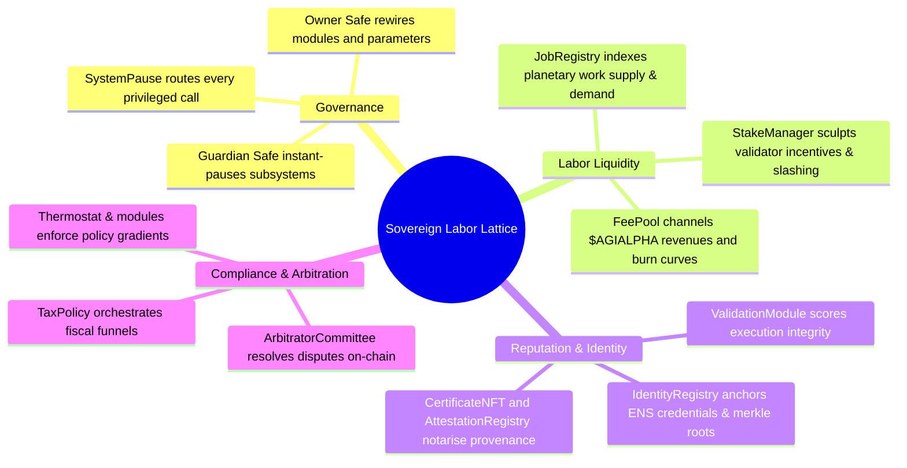
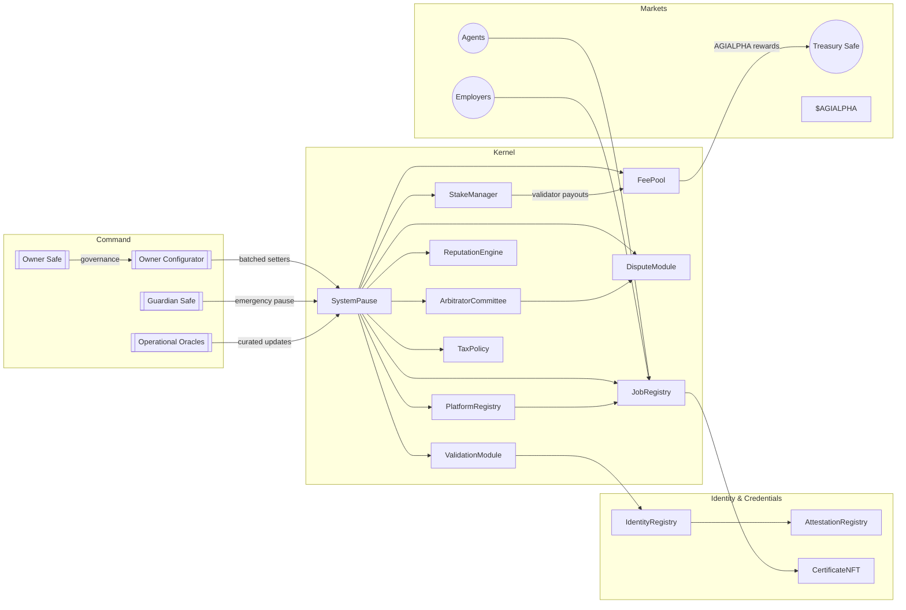
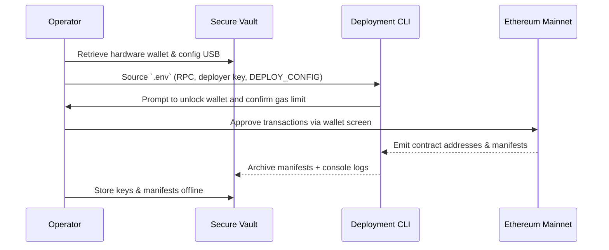

# Sovereign Labor Hardhat Command Deck

<p align="center">
  
  <a href="https://github.com/MontrealAI/agijobs-sovereign-labor-v0p1/actions/workflows/ci.yml"></a>
  <a href="https://github.com/MontrealAI/agijobs-sovereign-labor-v0p1/actions/workflows/security.yml"></a>
  <a href="https://github.com/MontrealAI/agijobs-sovereign-labor-v0p1/actions/workflows/branch-checks.yml"></a>
  
  
  =20.11" />
  
  <a href="https://opensource.org/licenses/MIT"></a>
</p>

> **Treat this repository as the helm of the intelligence engine reorganising global labor markets.** Every dial, pause lever, and governance switch lives here; precision keeps the machine benevolent.

---

## Table of Contents
1. [Repository constellation](#repository-constellation)
2. [Capabilities hologram](#capabilities-hologram)
3. [Command architecture](#command-architecture)
4. [Toolchain & environment](#toolchain--environment)
5. [Operational quickstart](#operational-quickstart)
6. [Mainnet deployment playbook (non-technical operator)](#mainnet-deployment-playbook-non-technical-operator)
7. [Canonical Truffle migration (Ethereum mainnet)](#canonical-truffle-migration-ethereum-mainnet)
8. [Owner control surface](#owner-control-surface)
9. [Continuous integration & branch protection](#continuous-integration--branch-protection)
10. [Security posture & telemetry](#security-posture--telemetry)
11. [Reference data vault](#reference-data-vault)

---

## Repository constellation

```text
.
├── contracts/             # Solidity sources (governance, modules, utilities)
├── deploy/                # JSON manifests & environment-specific parameters
├── foundry/               # Forge scripts and invariant test harnesses
├── hardhat/               # Hardhat executors, tests, and this command deck
├── migrations/            # Truffle migrations (canonical mainnet scripts)
├── scripts/               # CI utilities (branch naming, governance matrix)
│   ├── deploy/            # Shared config loader for Hardhat/Truffle/Foundry
│   └── verify-artifacts.js  # ABI + bytecode integrity checks reused by CI
├── truffle/               # Generated manifests & aux configs
│   └── util/              # Manifest writers consumed by deployments
└── docs/, README.md, ...  # Higher-level specs and reference notes
```

Every toolchain (Truffle, Hardhat, Foundry) consumes the same Solidity canon under `contracts/`, ensuring deterministic behaviour regardless of execution surface.

---

## Capabilities hologram



Every subsystem is reachable through `SystemPause`, with the owner safe typically orchestrating updates through `OwnerConfigurator` to emit tamper-evident change logs.

---

## Command architecture



> **Prime directive:** guard the `SystemPause.owner()` address. Everything—pauses, parameter shifts, fee rewires, validator rotations—cascades from that co-ordinate.

---

## Toolchain & environment

**Prerequisites**

- Node.js ≥ 20.11 and npm 10.x
- Foundry toolchain (`foundryup`)
- Truffle CLI 5.11.x (installed via `npm ci`)
- Access to an Ethereum mainnet RPC endpoint
- $AGIALPHA token (ERC-20, 18 decimals) at `0xa61a3b3a130a9c20768eebf97e21515a6046a1fa`

**Setup steps**

```bash
# Install JavaScript dependencies
npm ci --omit=optional --no-fund --no-audit

# Install / update Foundry toolchain
foundryup

# Create environment file (repository root)
cat <<'ENV' > .env
MAINNET_RPC=https://mainnet.infura.io/v3/<key>
MAINNET_DEPLOYER_PK=0x<private_key_without_0x>
ETHERSCAN_API_KEY=<verification_key>
DEPLOY_CONFIG=deploy/config.mainnet.json
ENV

# Source environment variables for the current shell
export $(grep -v '^#' .env | xargs)
```

Keep `.env` out of version control (already excluded via `.gitignore`).

---

## Operational quickstart

| Capability | Command | Result |
| --- | --- | --- |
| Branch naming sentinel | `npm run lint:branch` | Enforces repo-wide branch naming policy before pushing. |
| Compile (Truffle) | `npm run compile` | Generates canonical artifacts in `build/contracts`. |
| Compile (Hardhat) | `npx hardhat compile` | Optional Hardhat-native build for debugging. |
| Solidity lint | `npm run lint:sol` | Solhint audit (warnings fail the run). |
| Tests (Truffle) | `npm test` | Executes Truffle suites without running migrations. |
| Tests (Hardhat) | `npm run test:hardhat` | Executes ethers/Hardhat suites. |
| Tests (Foundry) | `npm run test:foundry` | Executes Forge fuzzing and invariants. |
| Full CI parity | `npm run test:ci` | Runs Truffle, Hardhat, and Foundry sequentially. |
| Artifact integrity | `node scripts/verify-artifacts.js` | Validates build outputs match ABI/hash expectations. |
| Governance lattice audit | `npm run ci:governance` | Validates ownership & pauser topology. |
| Mainnet deploy (Truffle) | `npm run deploy:truffle:mainnet` | Idempotent migration with guardrails. |
| Mainnet deploy (Hardhat) | `npm run deploy:hardhat:mainnet` | Hardhat executor using the same manifest. |
| Mainnet deploy (Foundry) | `npm run deploy:foundry:mainnet` | Forge script broadcast (slow, hardware-wallet friendly). |
| Etherscan verification | `npm run verify:mainnet` | Verifies canonical contracts post-deployment. |

All commands emit structured logs and abort on the first anomaly.

---

## Mainnet deployment playbook (non-technical operator)

> **Objective:** launch the labor lattice on Ethereum mainnet using deterministic scripts. No manual Solidity or JavaScript editing required.



### 1. Secure credentials & capital
- Hardware wallet (Ledger, Trezor, or multisig signer) loaded with ≥ **1.5 ETH** for gas.
- Offline copy of `deploy/config.mainnet.json` filled with:
  - `ownerSafe`, `guardianSafe`, `treasury`
  - `$AGIALPHA` token address: **must remain** `0xa61a3b3a130a9c20768eebf97e21515a6046a1fa`
  - Platform/stake parameters, ENS roots, and identity Merkle hashes

### 2. Rehearse on a fork (15 minutes)
```bash
npx hardhat node --fork "$MAINNET_RPC" --port 8545
DEPLOY_CONFIG=deploy/config.mainnet.json npx hardhat test --network localhost
```
- Confirms config values, pauser wiring, and treasury routes without spending mainnet gas.

### 3. Prepare the live session
```bash
export MAINNET_RPC=https://mainnet.infura.io/v3/<key>
export MAINNET_DEPLOYER_PK=0x<private_key_without_0x>
export DEPLOY_CONFIG=deploy/config.mainnet.json
```
- Unlock the hardware wallet and verify on-device address matches the deployer.
- Confirm `deploy/config.mainnet.json` is the intended production copy.

### 4. Execute the migration
```bash
npx truffle migrate --network mainnet --compile-all
```
The script:
- Aborts if `chainId` ≠ `config.chainId`.
- Verifies $AGIALPHA decimals (must equal 18) and metadata sanity.
- Deploys kernel modules, transfers ownership to `SystemPause`, then assigns governance to `ownerSafe`/`guardianSafe`.
- Boots `OwnerConfigurator` for batched parameter control by the owner safe.
- Writes a manifest under `truffle/manifests/mainnet.json`.

### 5. Finalise governance handoff
- From the owner safe, confirm receipt of any pending ownership transfers surfaced in the manifest.
- Record `SystemPause.owner()` and `SystemPause.activePauser()` in the secure runbook.

### 6. Post-deployment hygiene
```bash
npm run verify:mainnet
```
- Archive console output, manifests, and configuration files to an encrypted vault.
- Configure monitors for `SystemPause.ModulesUpdated`, `PausersUpdated`, and `GovernanceCallExecuted` events.

---

## Canonical Truffle migration (Ethereum mainnet)

`migrations/1_deploy_kernel.js` is the golden deploy script. Key excerpts:

```javascript
const CANONICAL_AGIALPHA = '0xa61a3b3a130a9c20768eebf97e21515a6046a1fa';

module.exports = async function (deployer, network, accounts) {
  const cfg = resolveConfig();
  const chainId = await web3.eth.getChainId();
  if (chainId !== cfg.chainId) {
    throw new Error(`Config chainId ${cfg.chainId} != network ${chainId}`);
  }
  if (chainId === 1 && cfg.tokens.agi.toLowerCase() !== CANONICAL_AGIALPHA) {
    throw new Error(`Mainnet AGIALPHA must be ${CANONICAL_AGIALPHA}`);
  }
  const agiDecimals = Number(await agiMetadata.methods.decimals().call());
  if (agiDecimals !== 18) {
    throw new Error(`$AGIALPHA decimals must equal 18, detected ${agiDecimals}`);
  }

  // Deploy OwnerConfigurator, TaxPolicy, StakeManager, FeePool, ReputationEngine…
  const stake = await deployer.deploy(
    StakeManager,
    minStakeWei,
    employerPct,
    treasuryPct,
    treasury,
    ZERO_ADDRESS,
    ZERO_ADDRESS,
    deployerAccount
  );

  const pause = await deployer.deploy(
    SystemPause,
    job.address,
    stake.address,
    validation.address,
    dispute.address,
    platform.address,
    feePool.address,
    reputation.address,
    committee.address,
    tax.address,
    ownerSafe
  );

  await ownerCfg.transferAll(pause.address, guardianSafe);
};
```

Follow with `migrations/3_mainnet_finalize.js` to validate ownership, guardian wiring, module pointers, and $AGIALPHA integrity before blessing the deployment.

---

## Owner control surface

| Function | Module | Purpose |
| --- | --- | --- |
| `OwnerConfigurator.configure{Batch}()` | `OwnerConfigurator` | Batch forward arbitrary governance-approved setters while emitting `ParameterUpdated` for runbook telemetry. |
| `SystemPause.setModules(...)` | `SystemPause` | Rewire JobRegistry, StakeManager, ValidationModule, DisputeModule, PlatformRegistry, FeePool, ReputationEngine, ArbitratorCommittee, and TaxPolicy after ownership verification. |
| `SystemPause.setGlobalPauser(address)` / `refreshPausers()` | `SystemPause` | Rotate guardian safe or restore self-managed pausing across every module. |
| `SystemPause.pauseAll()` / `unpauseAll()` | `SystemPause` | Freeze or resume every contract in one transaction. |
| `SystemPause.governanceCall(target, data)` | `SystemPause` | Execute arbitrary, pre-audited parameter updates through timelocked governance. |
| `StakeManager.batchConfigure(...)` & `update*` suite | `StakeManager` | Adjust staking thresholds, slashing distribution, validator lock managers, treasury routing, and unbonding periods. |
| `FeePool.updateFeeSettings(...)`, `updateTreasury(...)`, `updateBurnPercentage(...)` | `FeePool` | Tune platform fees, burn ratios, and treasury endpoints. |
| `ValidationModule.configureValidatorSet(...)`, `setFailoverConfig(...)` | `ValidationModule` | Curate validator roster, quorum, and failover extensions. |
| `DisputeModule.configureEscrow(...)`, `setFeeParameters(...)` | `DisputeModule` | Adjust dispute fees, escalation windows, and escrow policy. |
| `PlatformRegistry.configurePlatform(...)`, `setFeeOverride(...)` | `PlatformRegistry` | Manage platform-level overrides and onboarding states. |
| `TaxPolicy.setPolicyURI(...)`, `setEnabled(bool)` | `TaxPolicy` | Activate or update fiscal policy metadata. |
| `IdentityRegistry.setMerkleRoots(...)`, `setNameWrapper(...)` | `IdentityRegistry` | Update identity proofs, ENS dependencies, and wrappers. |

All privileged calls must originate from the governance timelock/owner safe to maintain operational discipline.

---

## Continuous integration & branch protection

The repository enforces a tri-channel CI lattice:

```mermaid
flowchart TD
    Dev[Developer Push/PR]
    CI[ci.yml\n(compile + lint + multi-runtime tests)]
    Branch[branch-checks.yml\n(branch naming gatekeeper)]
    Sec[security.yml\n(slither + mythril)]
    Status[Protected Branch Rule]

    Dev --> CI
    Dev --> Branch
    Dev --> Sec
    CI & Branch & Sec --> Status
    Status -->|Green checks required| Merge[Merge to main/develop]
```

1. **`ci.yml`** – linting, compile verification, Truffle/Hardhat/Foundry tests, governance matrix validation, and Actionlint hygiene checks.
2. **`branch-checks.yml`** – enforces branch naming conventions to keep audit logs coherent.
3. **`security.yml`** – Slither static analysis, Mythril symbolic execution, and Foundry build invariants.

**Local parity ritual**
```bash
npm run lint:branch
npm run lint:sol
npm run test:ci
npm run ci:governance
node scripts/verify-artifacts.js
```

**Enforce protections on GitHub**
1. Settings → Branches → **Add rule** for `main` (and release branches).
2. Enable “Require a pull request before merging” with ≥1 approval.
3. Enable “Require status checks to pass before merging” and select `ci.yml`, `branch-checks.yml`, and `security.yml`.
4. Enable “Require branches to be up to date before merging” and disallow bypass.
5. Mirror the rule for `develop` or other integration branches as needed.

Keep the badges green; every PR must traverse all three workflows before merge.

---

## Security posture & telemetry

- **Static analysis** – Slither (`security.yml`) fails on any high-severity finding; SARIF artifacts surface in the Security tab.
- **Symbolic execution** – Mythril sweeps key contracts (SystemPause, StakeManager, FeePool, etc.) each run.
- **Runtime invariants** – Forge harnesses fuzz staking, disputes, and identity flows.
- **Token integrity** – Mainnet migrations enforce the canonical $AGIALPHA address and 18 decimal constraint.
- **Operational observability** – Subscribe to `ModulesUpdated`, `PausersUpdated`, `GovernanceCallExecuted`, `StakeParametersUpdated`, and `FeeSettingsUpdated` events for real-time telemetry.
- **Emergency response** – Guardian safe can call `SystemPause.pauseAll()`; owner safe can rotate pausers and module pointers instantly.

---

## Reference data vault

| Item | Value |
| --- | --- |
| Canonical token | `$AGIALPHA` – `0xa61a3b3a130a9c20768eebf97e21515a6046a1fa` (18 decimals) |
| Ownership nexus | `SystemPause.owner()` – must resolve to the owner safe |
| Guardian | `SystemPause.activePauser()` – designated emergency controller |
| Manifest output | `truffle/manifests/<network>.json` |
| Deployment config | `deploy/config.<network>.json` |
| Truffle migrations | `migrations/*.js` |
| Hardhat executors | `hardhat/scripts/*.js` |
| Foundry scripts | `foundry/script/*.s.sol` |
| Governance checks | `scripts/check-governance-matrix.mjs` |

> Maintain these constants in an encrypted operational vault. The entire intelligence engine depends on their integrity.

---

**Steward the machine wisely.** Keep CI green, enforce branch protections, and orchestrate every privileged change through `SystemPause`. This repository is the operations manual for the intelligence engine that bends global labor markets toward coordinated abundance.
