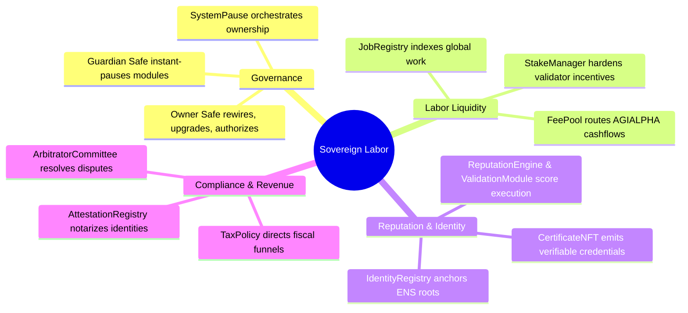
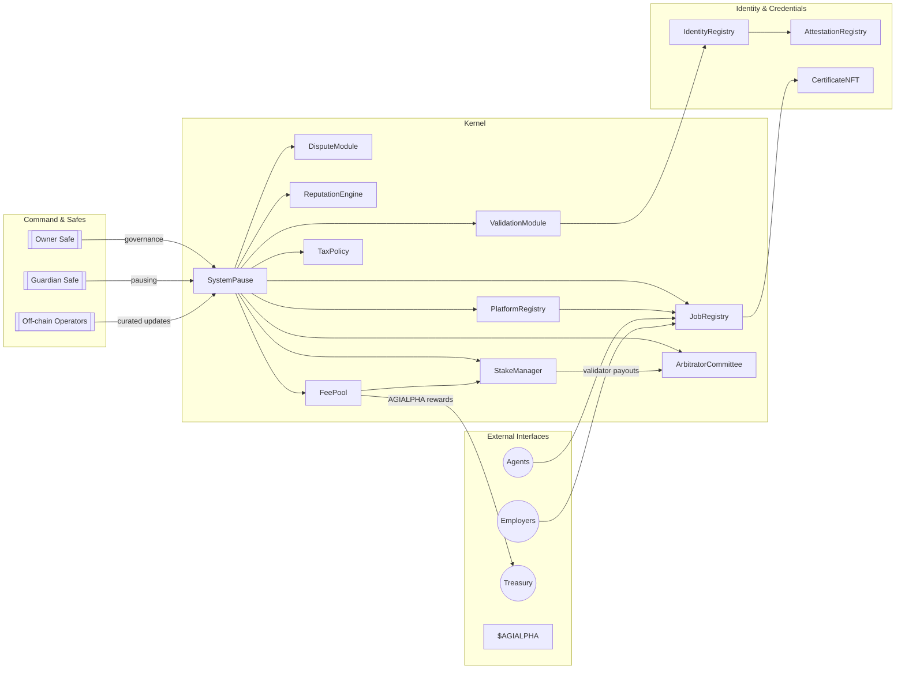

# Sovereign Labor Hardhat Lattice

<p align="center">
  
  <a href="https://github.com/MontrealAI/agijobs-sovereign-labor-v0p1/actions/workflows/ci.yml"></a>
  <a href="https://github.com/MontrealAI/agijobs-sovereign-labor-v0p1/actions/workflows/branch-checks.yml"></a>
  <a href="https://github.com/MontrealAI/agijobs-sovereign-labor-v0p1/actions/workflows/security.yml"></a>
  =20.11" />
  
  <a href="https://opensource.org/licenses/MIT"></a>
</p>

> **This lattice is the command surface for a post-capital network economy.** Treat it as the operator's grimoire for orchestrating labor liquidity at planetary scale.

---

## Table of Contents
1. [Repository structure](#repository-structure)
2. [Capabilities at a glance](#capabilities-at-a-glance)
3. [Operational architecture](#operational-architecture)
4. [Installation & environment](#installation--environment)
5. [Runtime command map](#runtime-command-map)
6. [Mainnet deployment playbook (non-technical operator)](#mainnet-deployment-playbook-non-technical-operator)
7. [Canonical Truffle migration (Ethereum mainnet)](#canonical-truffle-migration-ethereum-mainnet)
8. [Governance & operator control surface](#governance--operator-control-surface)
9. [Continuous integration & branch protection](#continuous-integration--branch-protection)
10. [Security posture & monitoring](#security-posture--monitoring)
11. [Reference data](#reference-data)

---

## Repository structure

```text
hardhat/
├── scripts/            # ESM Hardhat executors and operational scripts
└── test/               # Hardhat-native test harnesses (chai/ethers)
```

All Solidity sources (`contracts/`), Truffle migrations (`migrations/`), Foundry harnesses (`foundry/`), and deployment manifests (`deploy/`) live at the repository root so that every toolchain (Truffle, Hardhat, Foundry) consumes the same canon.

---

## Capabilities at a glance



Every module is wired through `SystemPause` so that the operator can steer parameters, pause subsystems, or reroute funds without redeploying contracts.

---

## Operational architecture



> **Prime directive:** guard the `SystemPause` owner address. Every strategic dial—pausing modules, updating validators, reconfiguring fees, redirecting treasuries—is exercised from that locus.

---

## Installation & environment

> **Prerequisites:** Node.js ≥ 20.11, npm 10.x, Foundry (`foundryup`), a mainnet-capable RPC URL, and on-chain access to the `$AGIALPHA` ERC-20 token (18 decimals at `0xa61a3b3a130a9c20768eebf97e21515a6046a1fa`).

1. **Install Node modules**
   ```bash
   npm ci --omit=optional
   ```
2. **Install Foundry (once per machine)**
   ```bash
   foundryup
   ```
3. **Configure environment** – create `.env` at the repository root:
   ```ini
   MAINNET_RPC=https://mainnet.infura.io/v3/<key>
   MAINNET_DEPLOYER_PK=0x<hex_private_key_without_0x_prefix>
   ETHERSCAN_API_KEY=<key-for-verification>
   ```
4. **Source environment for local shells**
   ```bash
   export $(grep -v '^#' .env | xargs)
   ```

Keep the `.env` file outside version control (`.gitignore` already excludes it).

---

## Runtime command map

Every command emits structured logging, performs configuration validation, and halts on the first anomaly.

| Capability | Command | Purpose |
| --- | --- | --- |
| Compile (Truffle) | `npm run compile` | Builds Solidity artifacts into `build/contracts`. |
| Compile (Hardhat) | `npx hardhat compile` | Optional Hardhat-specific compilation. |
| Lint Solidity | `npm run lint:sol` | Enforces Solhint ruleset (no warnings tolerated). |
| Tests (Truffle) | `npm test` | Executes Truffle suites without migrations. |
| Tests (Hardhat) | `npm run test:hardhat` | Executes Hardhat/ethers suites. |
| Tests (Foundry) | `npm run test:foundry` | Executes `forge test` invariant batteries. |
| Full CI parity | `npm run test:ci` | Runs Truffle, Hardhat, and Foundry suites sequentially. |
| Governance audit | `npm run ci:governance` | Validates owner/guardian lattice configuration. |
| Mainnet deploy (Truffle) | `npm run deploy:truffle:mainnet` | Idempotent mainnet migration with guardrails. |
| Mainnet deploy (Hardhat) | `npm run deploy:hardhat:mainnet` | Hardhat executor targeting the same manifest. |
| Mainnet deploy (Foundry) | `npm run deploy:foundry:mainnet` | Broadcast via Forge script (slow mode). |
| Contract verification | `npm run verify:mainnet` | Etherscan verification for canonical contracts. |

---

## Mainnet deployment playbook (non-technical operator)

> **Mission:** launch the Sovereign Labor lattice without writing code. Follow each step in order; the automation aborts if anything diverges from plan.

### 1. Secure credentials
- Obtain the hardware wallet (or custodial signer) that will broadcast deployment transactions.
- Confirm the deployer account holds ≥ 1.5 ETH for gas reserves and that the hardware wallet firmware is current.

### 2. Prepare the deployment configuration
- Copy `deploy/config.mainnet.json` to a safe working directory.
- Populate the following keys:
  - `ownerSafe`: multisig controlling every module post-deployment.
  - `guardianSafe`: emergency pauser (may equal `ownerSafe`).
  - `treasury`: address receiving platform fees.
  - `tokens.agi`: **must remain** `0xa61a3b3a130a9c20768eebf97e21515a6046a1fa` (18 decimals enforced).
  - `params`: set `platformFeeBps`, `burnBpsOfFee`, `slashBps`, `validatorQuorum`, staking amounts, dispute fees, etc.
  - `identity`: define ENS registry, NameWrapper, root nodes, and Merkle roots.
- Store the config offline; never push secrets to Git or public storage.

### 3. Dry-run on a mainnet fork
- Launch a forked network for rehearsal:
  ```bash
  npx hardhat node --fork "$MAINNET_RPC"
  ```
- In a new terminal, run the deterministic rehearsal:
  ```bash
  DEPLOY_CONFIG=deploy/config.mainnet.json npx hardhat test --network localhost
  ```
- Optional: import the deployer private key into Hardhat to simulate signature prompts.

### 4. Execute the mainnet migration
- Export environment variables for the live session:
  ```bash
  export MAINNET_RPC=https://mainnet.infura.io/v3/<key>
  export MAINNET_DEPLOYER_PK=0x<private_key>
  export DEPLOY_CONFIG=deploy/config.mainnet.json
  ```
- Unlock and connect the hardware wallet.
- Trigger the deployment:
  ```bash
  npx truffle migrate --network mainnet --compile-all
  ```
- The script self-checks:
  - Aborts if the chain ID mismatches the config.
  - Verifies `$AGIALPHA` decimals (must equal 18) and warns on unexpected metadata.
  - Validates `ownerSafe`, `guardianSafe`, and `treasury` addresses.
  - Produces a manifest under `truffle/manifests/mainnet.json`.

### 5. Finalize ownership handoff
- From the owner safe, execute any pending `acceptOwnership` calls surfaced in the manifest (e.g., `IdentityRegistry`, `AttestationRegistry`).
- Record the final `SystemPause.owner()` address and store it inside your secure runbook.

### 6. Post-deploy verification & archiving
- Verify contracts on Etherscan:
  ```bash
  npm run verify:mainnet
  ```
- Archive the console output, manifest, and deployment config inside an internal vault with restricted access.
- Configure monitoring bots to watch `SystemPause` events for pause/unpause activity.

> **Re-deploying with identical configuration is idempotent**—the migration short-circuits when it detects matching contract addresses.

---

## Canonical Truffle migration (Ethereum mainnet)

The primary deployment harness resides in [`migrations/1_deploy_kernel.js`](../migrations/1_deploy_kernel.js). It encapsulates:

1. **Immutable $AGIALPHA validation** – chain ID 1 enforces the canonical token `0xa61a3b3a130a9c20768eebf97e21515a6046a1fa` with 18 decimals; any deviation aborts.
2. **Deterministic module wiring** – sequentially deploys `StakeManager`, `FeePool`, `ReputationEngine`, `PlatformRegistry`, `AttestationRegistry`, `IdentityRegistry`, `ValidationModule`, `DisputeModule`, `ArbitratorCommittee`, `JobRegistry`, `SystemPause`, and `CertificateNFT`, wiring dependencies and cross-contract references.
3. **Governance transfer** – hands ownership of each module to `SystemPause`, then delegates authority to `ownerSafe` and `guardianSafe` via `OwnerConfigurator`.
4. **Manifest & audit trail** – emits a JSON manifest summarizing addresses, ownership, and config parameters for downstream tooling.

```javascript
module.exports = async function (deployer, network, accounts) {
  const [deployerAccount] = accounts;
  const cfg = resolveConfig();
  const chainId = await web3.eth.getChainId();
  if (chainId !== cfg.chainId) {
    throw new Error(`Config chainId ${cfg.chainId} != network ${chainId}`);
  }
  if (chainId === 1 && cfg.tokens.agi.toLowerCase() !== CANONICAL_AGIALPHA) {
    throw new Error(`Mainnet AGIALPHA must be ${CANONICAL_AGIALPHA}`);
  }
  // Deploy modules, wire dependencies, and transfer authority to SystemPause
  // so the operator retains sovereign control from a single command point.
};
```

For the post-deployment audit sweep, consult [`migrations/3_mainnet_finalize.js`](../migrations/3_mainnet_finalize.js). It validates ownership, guardian wiring, module pointers, and `$AGIALPHA` token integrity before blessing the deployment.

---

## Governance & operator control surface

`SystemPause` centralizes authority and exposes granular levers for the operator:

| Function | Purpose | Location |
| --- | --- | --- |
| `setModules(...)` | Rewire any core module (JobRegistry, StakeManager, ValidationModule, DisputeModule, PlatformRegistry, FeePool, ReputationEngine, ArbitratorCommittee, TaxPolicy) after verifying ownership. | [`contracts/SystemPause.sol`](../contracts/SystemPause.sol) |
| `setGlobalPauser(address)` / `refreshPausers()` | Assign a new guardian Safe or reassert SystemPause as the active pauser across every module. | [`contracts/SystemPause.sol`](../contracts/SystemPause.sol) |
| `pauseAll()` / `unpauseAll()` | Freeze or resume every module in a single transaction. | [`contracts/SystemPause.sol`](../contracts/SystemPause.sol) |
| `governanceCall(address target, bytes data)` | Execute arbitrary governance-approved calls to upgrade parameters across the lattice. | [`contracts/SystemPause.sol`](../contracts/SystemPause.sol) |
| `StakeManager.updateParameters(...)` | Tune staking thresholds, slashing rates, treasuries. | [`contracts/StakeManager.sol`](../contracts/StakeManager.sol) |
| `FeePool.updateFeeSettings(...)` | Adjust burn ratios and treasury destinations. | [`contracts/FeePool.sol`](../contracts/FeePool.sol) |
| `ValidationModule.configureValidatorSet(...)` | Curate validators, quorum, and failover windows. | [`contracts/ValidationModule.sol`](../contracts/ValidationModule.sol) |

> Maintain strict operational discipline: only the owner safe should invoke `SystemPause`'s privileged functions, with multisig approvals and execution logging.

---

## Continuous integration & branch protection

The repository enforces a **three-channel CI lattice**:

1. [`ci.yml`](../.github/workflows/ci.yml) – runs lint, Truffle/Hardhat/Foundry tests, and governance matrix checks.
2. [`branch-checks.yml`](../.github/workflows/branch-checks.yml) – ensures branch naming conventions and prevents direct pushes to protected branches.
3. [`security.yml`](../.github/workflows/security.yml) – executes static analysis and dependency audits.

To keep the badge panel green:

```bash
npm run lint:sol
npm run test:ci
npm run ci:governance
```

### Enforcing protections on GitHub
1. Navigate to **Repository Settings → Branches → Branch protection rules**.
2. Create or edit a rule for `main` (and your release branches if applicable).
3. Enable “Require a pull request before merging” with at least 1 approval.
4. Enable “Require status checks to pass before merging” and select:
   - `ci.yml`
   - `branch-checks.yml`
   - `security.yml`
5. Enable “Require branches to be up to date before merging” and “Do not allow bypassing the above settings”.
6. Apply the same rule to Pull Requests to enforce green CI before merge.

This configuration guarantees that every change traverses the full automated scrutiny lattice before touching `main`.

---

## Security posture & monitoring

- **Static analysis** – `security.yml` integrates Slither and dependency audits; failures block merges.
- **Runtime invariants** – Foundry tests include revert conditions, invariant checks, and fuzzing entry points.
- **Upgrade discipline** – Only `SystemPause` may mutate module pointers; enforce multisig governance and hardware wallet usage.
- **Token integrity** – `$AGIALPHA` metadata is verified during deployment to prevent counterfeit liquidity.
- **Operational telemetry** – Subscribe to `SystemPause.ModulesUpdated`, `PausersUpdated`, and `GovernanceCallExecuted` events to detect reconfiguration in real time.

---

## Reference data

| Item | Value |
| --- | --- |
| Canonical token | `$AGIALPHA` – `0xa61a3b3a130a9c20768eebf97e21515a6046a1fa` (18 decimals) |
| Core ownership hub | `SystemPause.owner()` – must equal the operator’s owner safe |
| Guardian | `SystemPause.activePauser()` – designated emergency controller |
| Manifest output | `truffle/manifests/<network>.json` |
| Deployment config | `deploy/config.<network>.json` |
| Truffle migrations | `migrations/*.js` |
| Hardhat scripts | `hardhat/scripts/*.js` |
| Foundry scripts | `foundry/script/*.s.sol` |

> Preserve these constants in your operational vault. The entire labor lattice depends on their integrity.

---

**Keep the machine pristine:** run the full CI ritual before every pull request, enforce branch protection, and treat `SystemPause` as the single command locus for human-aligned governance. Steward it wisely; this repository is the operations manual for the intelligence engine that reorders global labor markets.
