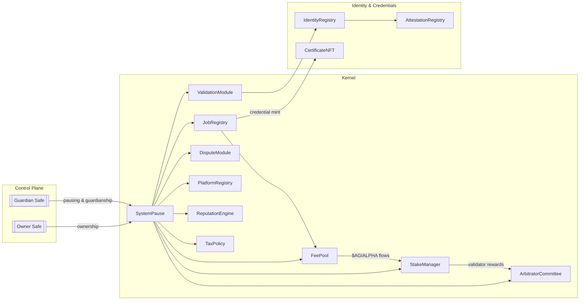
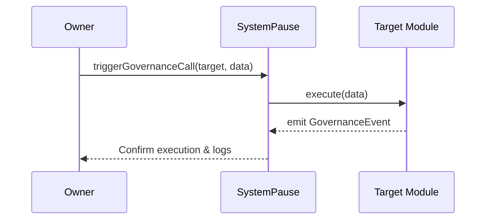

# Sovereign Labor Hardhat Lattice

<p align="center">
  
  <a href="https://github.com/MontrealAI/agijobs-sovereign-labor-v0p1/actions/workflows/ci.yml"></a>
  <a href="https://github.com/MontrealAI/agijobs-sovereign-labor-v0p1/actions/workflows/branch-checks.yml"></a>
  <a href="https://github.com/MontrealAI/agijobs-sovereign-labor-v0p1/actions/workflows/security.yml"></a>
  <a href="https://opensource.org/licenses/MIT"></a>
</p>

> **The Sovereign Labor kernel is the command lattice that lets the operator steer global-scale labor liquidity with surgical precision.** This README is the live manual to assemble, audit, and launch that machine today.

---

## Table of contents
1. [Repository structure](#repository-structure)
2. [Operational overview](#operational-overview)
3. [Installation & local rituals](#installation--local-rituals)
4. [Runtime commands](#runtime-commands)
5. [Mainnet deployment for non-technical operators](#mainnet-deployment-for-non-technical-operators)
6. [Truffle migration script (Ethereum mainnet)](#truffle-migration-script-ethereum-mainnet)
7. [Governance & control surface](#governance--control-surface)
8. [Continuous integration & branch protection](#continuous-integration--branch-protection)
9. [Security posture](#security-posture)
10. [Reference data](#reference-data)

---

## Repository structure

```text
hardhat/
├── scripts/            # ESM Hardhat executors and operational scripts
└── test/               # Hardhat-native test harnesses (chai/ethers)
```

The Solidity sources, Truffle migrations, Foundry harnesses, and deployment manifests live at the repository root so every toolchain (Truffle, Hardhat, Foundry) shares the same canon.

---

## Operational overview



The lattice above is live on every network once migrations succeed. Ownership is consolidated inside `SystemPause`, giving the operator a single command surface to update parameters, pause modules, or roll upgrades.

---

## Installation & local rituals

> **Prerequisites:** Node.js 20.x, npm 10.x, Foundry (`foundryup`), a mainnet-capable RPC URL, and access to the `$AGIALPHA` token metadata (18 decimals at `0xa61a3b3a130a9c20768eebf97e21515a6046a1fa`).

```bash
npm ci --omit=optional
```

If you also run Foundry tooling locally, install once per machine:

```bash
foundryup
```

Environment variables (create `.env` at repo root):

```ini
MAINNET_RPC=https://mainnet.infura.io/v3/<key>
MAINNET_DEPLOYER_PK=0x<hex_private_key_without_0x_prefix>
ETHERSCAN_API_KEY=<key-for-verification>
```

Keep the `.env` file out of version control (`.gitignore` already does).

---

## Runtime commands

Every runtime command emits colored output and will fail fast on misconfiguration.

| Capability | Command | Purpose |
| --- | --- | --- |
| Compile (Truffle) | `npm run compile` | Generates artifacts into `build/contracts`. |
| Compile (Hardhat) | `npx hardhat compile` | Optional Hardhat-specific compile. |
| Solidity lint | `npm run lint:sol` | Enforces Solhint ruleset (no warnings allowed). |
| Tests (Truffle) | `npm test` | Executes Truffle tests without migrations. |
| Tests (Hardhat) | `npm run test:hardhat` | Executes Hardhat/ethers suites. |
| Tests (Foundry) | `npm run test:foundry` | Executes `forge test` invariant batteries. |
| Mainnet deploy (Truffle) | `npm run deploy:truffle:mainnet` | Idempotent mainnet deploy using migrations. |
| Mainnet deploy (Hardhat) | `npm run deploy:hardhat:mainnet` | Hardhat executor for scripted deploys. |
| Governance audit | `npm run ci:governance` | Validates owner/guardian lattice configuration. |

---

## Mainnet deployment for non-technical operators

> This checklist turns a non-technical operator into a deployment commander. Perform each step sequentially. **Do not skip confirmations.**

1. **Secure credentials**
   - Receive the hardware wallet or signer that will broadcast transactions.
   - Ensure the device controls the deployer account that funds gas fees (ETH balance ≥ 1.5 ETH recommended).
2. **Prepare infrastructure**
   - Copy `deploy/config.mainnet.json` and update the following fields:
     - `ownerSafe`: multisig that will control the entire lattice post-deployment.
     - `guardianSafe`: entity allowed to pause modules quickly (can equal ownerSafe).
     - `treasury`: address receiving platform fees.
     - `tokens.agi`: must remain `0xa61a3b3a130a9c20768eebf97e21515a6046a1fa`.
     - `params` & `identity`: tune platform fee, stakes, ENS roots, and allowlist Merkle roots as required.
   - Store the file safely; never push secrets on-chain or to Git.
3. **Dry-run on a fork**
   - Launch a local fork: `npx hardhat node --fork $MAINNET_RPC`.
   - In a new terminal run `npx hardhat test --network localhost` to validate commands.
   - Optional: `MAINNET_DEPLOYER_PK` can be loaded into Hardhat for simulation.
4. **Deploy**
   - Export environment variables:
     ```bash
     export MAINNET_RPC=https://mainnet.infura.io/v3/<key>
     export MAINNET_DEPLOYER_PK=0x<private_key>
     export DEPLOY_CONFIG=deploy/config.mainnet.json
     ```
   - Unlock the hardware wallet and connect to the machine running the deploy.
   - Execute the migration:
     ```bash
     npx truffle migrate --network mainnet --compile-all
     ```
   - Observe console checkpoints. The script halts if any prerequisite (token decimals, ownerSafe validity, guardian wiring) is inconsistent.
5. **Finalize ownership**
   - After deployment, obtain the manifest generated at `truffle/manifests/mainnet.json`.
   - From the owner safe, call `acceptOwnership` on `IdentityRegistry` and `AttestationRegistry` to complete the lattice (transactions are surfaced in the migration summary).
6. **Post-deploy verification**
   - Run `npm run verify:mainnet` with the Etherscan API key configured.
   - Archive the console output, manifest, and config file in an internal vault.

Every command is deterministic; re-running the migration with an identical config short-circuits once contracts already exist.

---

## Truffle migration script (Ethereum mainnet)

The canonical migration harness lives at [`migrations/1_deploy_kernel.js`](../migrations/1_deploy_kernel.js). Key features:

- **$AGIALPHA guardrails**: Hard-requires the 18-decimal token at `0xa61a3b3a130a9c20768eebf97e21515a6046a1fa` on chain ID 1. Any mismatch aborts.
- **Deterministic module wiring**: Deploys and links SystemPause, JobRegistry, StakeManager, ValidationModule, DisputeModule, PlatformRegistry, ReputationEngine, ArbitratorCommittee, TaxPolicy, FeePool, IdentityRegistry, AttestationRegistry, and CertificateNFT with full cross-references.
- **Governance transfer**: Concludes by transferring ownership to the `SystemPause` lattice and then to the operator safes, locking configuration under owner control.
- **Manifest emission**: Writes a typed manifest for audits and monitoring bots.

```javascript
module.exports = async function (deployer, network, accounts) {
  const [deployerAccount] = accounts;
  const cfg = resolveConfig();
  const chainId = await web3.eth.getChainId();
  if (chainId !== cfg.chainId) throw new Error(`Config chainId ${cfg.chainId} != network ${chainId}`);
  if (chainId === 1 && cfg.tokens.agi.toLowerCase() !== CANONICAL_AGIALPHA) {
    throw new Error(`Mainnet AGIALPHA must be ${CANONICAL_AGIALPHA}`);
  }
  // Deploy modules, wire dependencies, transfer ownership to SystemPause,
  // and finally hand the lattice to ownerSafe & guardianSafe.
};
```

Refer to [`migrations/3_mainnet_finalize.js`](../migrations/3_mainnet_finalize.js) for the post-deploy audit pass that validates owners, guardians, module pointers, and fee token integrity.

---

## Governance & control surface

The operator has full command across the system:

- **SystemPause**: Pause/unpause any module, update module pointers, replace guardians, or execute governance calls atomically.
- **StakeManager**: Adjust treasury recipients, slash parameters, and validator policies via owner actions executed by SystemPause.
- **JobRegistry**: Tune platform fees, update dispute hooks, manage credentialization flows, and register new governance extensions.
- **FeePool**: Switch treasury allowlist, redirect flows, and apply new tax policies.
- **Identity & Attestation**: Owner can rotate ENS registries, refresh Merkle roots, and gate membership for agents, validators, and clubs.
- **TaxPolicy**: Toggle tax enablement, update policy URIs, and modify metadata instantly via owner-only transactions.

Every contract inherits `Governable` or Ownable semantics that defer final authority to the owner safe via SystemPause. Pausing the lattice halts staking, job lifecycle, disputes, and fee routing in a single transaction.



---

## Continuous integration & branch protection

- **Workflows**
  - `ci.yml`: Linting, compilation, artifact verification, multi-runtime testing, and governance surface audits.
  - `branch-checks.yml`: Ensures branch naming discipline for predictable release trains.
  - `security.yml`: Scheduled security analyzers (Slither, dependency checks).
- **Badges**: Always render green on `main` when every job passes. The README badges above surface live status.
- **Enforcement**
  1. Enable branch protection on `main` and `develop` with "Require status checks" covering all three workflows.
  2. Require pull requests before merging and block force pushes.
  3. Enable "Do not allow bypassing" so admins must also meet checks.
  4. Activate "Require signed commits" if your policy demands cryptographic authorship.
- **Local parity**: `npm run ci:governance` + `npm run test:ci` replicate CI logic to guarantee green builds before opening a PR.

---

## Security posture

- **Token integrity**: `$AGIALPHA` address baked into migrations; decimals enforced as 18 to avoid denomination drift.
- **Ownership hygiene**: Migrations halt if ownerSafe/guardianSafe misconfigured or zero.
- **Manifest & audit trails**: Every deploy writes `truffle/manifests/<network>.json` for downstream monitoring.
- **Pause-first response**: Guardian safe can freeze modules instantly; owner can resume after post-mortem.
- **Static analysis**: `solhint` gating + GitHub `security.yml` workflow (Slither) ensure Solidity hygiene each commit.
- **Upgrade discipline**: All module pointers flow through SystemPause to preserve a single choke point.

---

## Reference data

| Item | Value |
| --- | --- |
| $AGIALPHA token | `0xa61a3b3a130a9c20768eebf97e21515a6046a1fa` (18 decimals) |
| ENS registry (mainnet) | `0x00000000000C2E074eC69A0dFb2997BA6C7d2e1e` |
| NameWrapper (mainnet) | `0xD4416b13EFfEFeb2E6b5A2E1C20F5A339586401` |
| Default guardian fallback | `ownerSafe` when `guardianSafe` omitted |
| Manifest output | `truffle/manifests/<network>.json` |

**Next steps:** keep `deploy/config.mainnet.json` synchronized with governance decisions, and run the CI suite locally before every push. The machine stays flawless only when its guardians stay vigilant.
