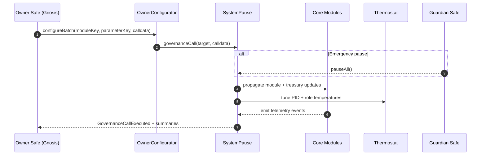
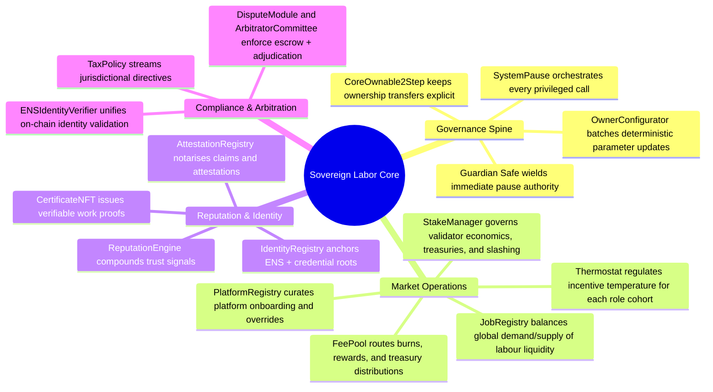
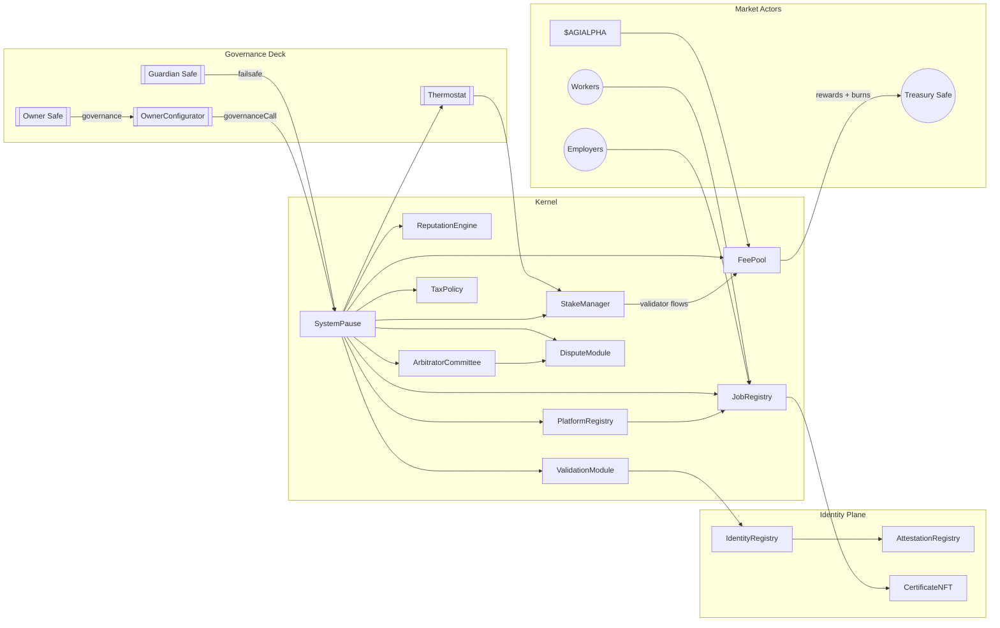
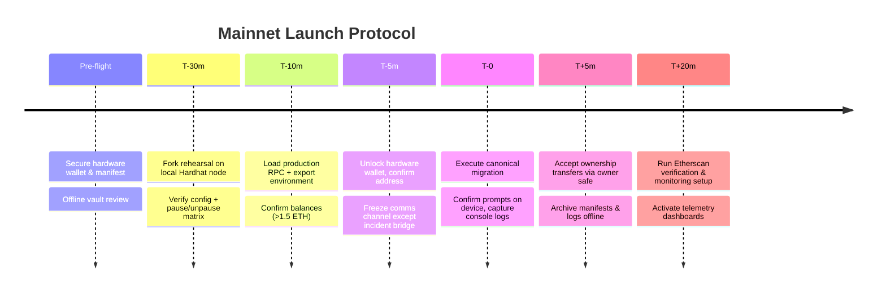
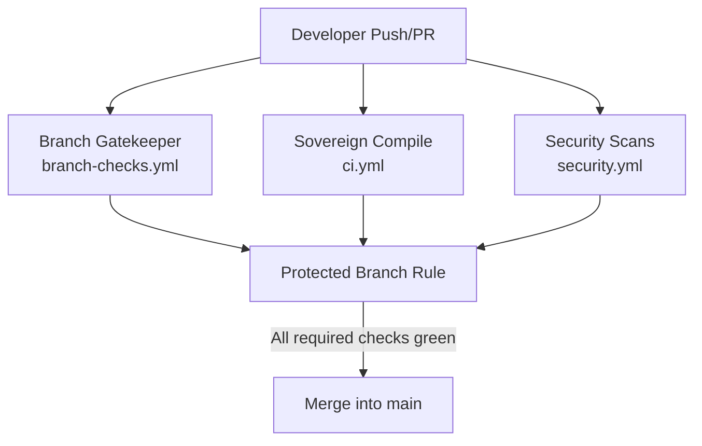

# Sovereign Labor Hardhat Command Deck

<p align="center">
  
  <a href="https://github.com/MontrealAI/agijobs-sovereign-labor-v0p1/actions/workflows/ci.yml"></a>
  <a href="https://github.com/MontrealAI/agijobs-sovereign-labor-v0p1/actions/workflows/security.yml"></a>
  <a href="https://github.com/MontrealAI/agijobs-sovereign-labor-v0p1/actions/workflows/branch-checks.yml"></a>
  
  
  
  
  
  = 20.11" />
  <a href="https://etherscan.io/token/0xa61a3b3a130a9c20768eebf97e21515a6046a1fa"></a>
  <a href="https://opensource.org/licenses/MIT"></a>
</p>

> The Hardhat deck is the neural spine of the labour-market intelligence engine. Every script, contract, and workflow routes through an owner-directed command lattice so capital, jobs, and reputation flow exactly where the operator intends—no drift, no downtime, and total controllability.

---

## Table of Contents
1. [Command Lattice](#command-lattice)
2. [Repository Cartography](#repository-cartography)
3. [Intelligence Mesh](#intelligence-mesh)
4. [Command Graph](#command-graph)
5. [Toolchain & Runtime Envelope](#toolchain--runtime-envelope)
6. [Environment Setup](#environment-setup)
7. [Operational Console](#operational-console)
8. [Deployment Flight Deck](#deployment-flight-deck)
9. [Mainnet Flight Plan for Non-Technical Operators](#mainnet-flight-plan-for-non-technical-operators)
10. [Canonical Truffle Migration (Ethereum Mainnet)](#canonical-truffle-migration-ethereum-mainnet)
11. [Owner Command Surface](#owner-command-surface)
12. [Token & Treasury Coordinates](#token--treasury-coordinates)
13. [Continuous Integration & Branch Protection](#continuous-integration--branch-protection)
14. [Security, Telemetry & Safeguards](#security-telemetry--safeguards)
15. [Reference Data Vault](#reference-data-vault)

---

## Command Lattice

The machine coordinates Hardhat, Truffle, and Foundry around one Solidity canon. `SystemPause` remains the fulcrum: the owner can rewire, pause, or accelerate any module without touching immutable production artifacts.



---

## Repository Cartography

```text
.
├── contracts/               # Solidity canon shared across toolchains
│   ├── admin/               # OwnerConfigurator and supporting admin facades
│   ├── modules/             # Specialized module implementations (DisputeModule)
│   ├── utils/, interfaces/, libraries/  # Shared primitives
│   └── test/                # Solidity test scaffolding
├── deploy/                  # Deterministic deployment manifests + loader
│   ├── README.md
│   └── config.mainnet.json
├── docs/                    # Whitepapers, research dossiers, operational briefs
├── foundry/                 # Forge tests, invariant suites, broadcast scripts
│   ├── script/
│   └── test/
├── hardhat/                 # Hardhat cache, artifacts, tests, and this command deck
├── migrations/              # Truffle golden-path migrations and finalizers
├── scripts/                 # Automation utilities + governance checks
├── truffle/                 # Deployment manifests, ABIs, operational outputs
├── hardhat.config.js        # Hardhat entrypoint (solc 0.8.25, viaIR, optimizer)
├── truffle-config.js        # Truffle network map and compiler discipline
├── foundry.toml             # Forge configuration synced with solc 0.8.25
├── package.json             # Unified npm task surface for CI and operators
└── slither.config.json      # Static analysis configuration
```

Every engine targets the same sources; reproducibility is non-negotiable.

---

## Intelligence Mesh



Each branch is reachable by `SystemPause.owner()`, ensuring command never leaves the operator.

---

## Command Graph



> Guard `SystemPause.owner()` relentlessly—whoever holds it directs the full production engine.

---

## Toolchain & Runtime Envelope

| Layer | Tooling | Key configuration | Location |
| --- | --- | --- | --- |
| Solidity compiler | `solc 0.8.25` via IR | Optimizer enabled (runs = 5), metadata hash stripped, revert strings stripped for deterministic bytecode | [`hardhat.config.js`](../hardhat.config.js) / [`foundry.toml`](../foundry.toml) |
| Hardhat runtime | `hardhat@2.20.1` | Shares `contracts/`, caches under `hardhat/`, exposes custom scripts under `hardhat/scripts/` | [`hardhat/`](./) |
| Truffle suite | `truffle@5.11.5` | Golden-path migrations, artifact emission to `build/contracts` | [`migrations/`](../migrations) |
| Foundry | `forge` stable | Fuzzing, invariants, broadcast scripts mirroring Hardhat deployments | [`foundry/`](../foundry) |
| Static analysis | Slither, Mythril | Configured in CI for high severity thresholds, SARIF exports | [`.github/workflows/security.yml`](../.github/workflows/security.yml) |
| Governance automation | Node.js 20.x scripts | Branch linting, artifact verification, governance matrix audit | [`scripts/`](../scripts) |

**Prerequisites**

- Node.js ≥ 20.11 and npm 10.x
- Foundry toolchain (`foundryup` installs `forge` + `cast`)
- Truffle CLI 5.11.x (installed via `npm ci`)
- Ethereum mainnet + testnet RPC endpoints
- `$AGIALPHA` token (ERC-20, 18 decimals) deployed at `0xa61a3b3a130a9c20768eebf97e21515a6046a1fa`
- Hardware wallet or multisig signer for production deployments

---

## Environment Setup

```bash
# Install JavaScript dependencies (Hardhat, Truffle, governance scripts)
npm ci --omit=optional --no-audit --no-fund

# Install / refresh Foundry (installs forge + cast if absent)
curl -L https://foundry.paradigm.xyz | bash
export PATH="$HOME/.foundry/bin:$PATH"
foundryup

# Provision environment secrets at the repository root
cat <<'ENV' > .env
MAINNET_RPC=https://mainnet.infura.io/v3/<key>
SEPOLIA_RPC=https://sepolia.infura.io/v3/<key>
MAINNET_DEPLOYER_PK=0x<private_key_without_0x>
SEPOLIA_DEPLOYER_PK=0x<optional_test_key_without_0x>
ETHERSCAN_API_KEY=<verification_key>
DEPLOY_CONFIG=deploy/config.mainnet.json
ENV

# Load variables into the current shell (never commit .env)
export $(grep -v '^#' .env | xargs)
```

`.env` stays ignored; mirror the production copy in an offline vault.

---

## Operational Console

| Capability | Command | Result |
| --- | --- | --- |
| Branch naming sentinel | `npm run lint:branch` | Enforces repository-wide branch naming discipline before any push. |
| Compile (Truffle) | `npm run compile` | Compiles canon and writes artifacts under `build/contracts`. |
| Compile (Hardhat) | `npx hardhat compile` | Hardhat-native compile for debugger workflows. |
| Solidity lint | `npm run lint:sol` | Solhint audit (warnings fail the run). |
| Tests (Truffle CI mode) | `npm run test:truffle:ci` | Reuses compiled artifacts; ideal for fast CI validation. |
| Tests (Truffle) | `npm test` | Executes Truffle suites without running migrations. |
| Tests (Hardhat) | `npm run test:hardhat` | Executes Hardhat/ethers suites. |
| Tests (Foundry) | `npm run test:foundry` | Executes Forge fuzzing + invariants. |
| Full CI parity | `npm run test:ci` | Sequential Truffle, Hardhat, and Foundry runs. |
| Artifact integrity | `node scripts/verify-artifacts.js` | Confirms ABI + bytecode hashes and compilation metadata. |
| Governance lattice audit | `npm run ci:governance` | Validates ownership/pauser topology, `$AGIALPHA` invariants, and setter availability. |
| Mainnet deploy (Truffle) | `npm run deploy:truffle:mainnet` | Idempotent golden path with guardrails and manifest emission. |
| Mainnet deploy (Hardhat) | `npm run deploy:hardhat:mainnet` | Hardhat executor using the shared manifest loader. |
| Mainnet deploy (Foundry) | `npm run deploy:foundry:mainnet` | Hardware-wallet friendly Forge broadcast. |
| Etherscan verification | `npm run verify:mainnet` | Verifies canonical contracts post-deployment. |

All commands emit structured logs and abort on any anomaly.

---

## Deployment Flight Deck

- **Hardhat (`hardhat/scripts/deploy-mainnet.js`)** – Imports `deploy/config.<network>.json`, reproduces Truffle wiring, and enforces deterministic nonce management.
- **Truffle (`migrations/*.js`)** – Canonical migration surface used for production. Validates chain IDs, verifies `$AGIALPHA`, enforces treasury allowlists, and emits manifests under `truffle/manifests/`.
- **Foundry (`foundry/script/DeployMainnet.s.sol`)** – Mirror deployment for Forge with hardware wallet signing support.
- **Shared loader (`scripts/deploy/load-config.js`)** – Guarantees config integrity before any deployment script runs.

Every executor consumes the same manifest to guarantee bit-for-bit parity across rehearsals and production.

---

## Mainnet Flight Plan for Non-Technical Operators



### Step-by-step Checklist

1. **Secure credentials & capital**
   - Hardware wallet / multisig signer with ≥ **1.5 ETH** for gas.
   - Offline copy of `deploy/config.mainnet.json` populated with:
     - `ownerSafe`, `guardianSafe`, `treasury`
     - `$AGIALPHA` token (`0xa61a3b3a130a9c20768eebf97e21515a6046a1fa`, 18 decimals)
     - Platform fees, validator requirements, dispute parameters, identity roots.

2. **Rehearse on a fork (≈15 minutes)**
   ```bash
   npx hardhat node --fork "$MAINNET_RPC" --port 8545
   DEPLOY_CONFIG=deploy/config.mainnet.json npx hardhat test --network localhost
   ```
   - Confirms manifest integrity and governance wiring without spending mainnet gas.

3. **Prepare the live session**
   ```bash
   export MAINNET_RPC=https://mainnet.infura.io/v3/<key>
   export MAINNET_DEPLOYER_PK=0x<private_key_without_0x>
   export DEPLOY_CONFIG=deploy/config.mainnet.json
   ```
   - Unlock the hardware wallet, verify the address on-device, and confirm balances.
   - Validate that the manifest being used is the production copy.

4. **Execute the migration**
   ```bash
   npx truffle migrate --network mainnet --compile-all
   ```
   The migration automatically:
   - Aborts if `chainId` mismatches the manifest.
   - Fetches `$AGIALPHA` metadata to guarantee the canonical address and 18 decimals.
   - Deploys all modules, wires dependencies, and transfers ownership to `SystemPause` before handing control to the owner safe.
   - Writes `truffle/manifests/mainnet.json` with addresses and governance topology.

5. **Finalise governance handoff**
   - From the owner safe, accept pending ownership transfers (Identity, Attestation, Certificate, Thermostat).
   - Record `SystemPause.owner()` and `SystemPause.activePauser()` in the operational vault.

6. **Post-deployment hygiene**
   ```bash
   npm run verify:mainnet
   ```
   - Archive console output, manifests, and configs to an encrypted vault.
   - Configure monitors on `ModulesUpdated`, `PausersUpdated`, and `GovernanceCallExecuted` events.

---

## Canonical Truffle Migration (Ethereum Mainnet)

Production migration lives at [`migrations/1_deploy_kernel.js`](../migrations/1_deploy_kernel.js). Operators can audit every guardrail before broadcasting.

```javascript
const CANONICAL_AGIALPHA = '0xa61a3b3a130a9c20768eebf97e21515a6046a1fa';

module.exports = async function (deployer, network, accounts) {
  const [deployerAccount] = accounts;
  const cfg = resolveConfig();
  const chainId = await web3.eth.getChainId();
  if (chainId !== cfg.chainId) throw new Error(`Config chainId ${cfg.chainId} != network ${chainId}`);
  if (chainId === 1 && cfg.tokens.agi.toLowerCase() !== CANONICAL_AGIALPHA) {
    throw new Error(`Mainnet AGIALPHA must be ${CANONICAL_AGIALPHA}`);
  }
  const agiMetadata = new web3.eth.Contract(ERC20_METADATA_ABI, cfg.tokens.agi);
  const agiDecimals = Number(await agiMetadata.methods.decimals().call());
  if (agiDecimals !== 18) throw new Error(`$AGIALPHA decimals must equal 18, detected ${agiDecimals}`);

  // Deploy OwnerConfigurator, TaxPolicy, StakeManager, FeePool, ReputationEngine, PlatformRegistry…
  const stake = await deployer.deploy(StakeManager, minStakeWei, employerPct, treasuryPct, treasury, ZERO_ADDRESS, ZERO_ADDRESS, deployerAccount);
  const feePool = await deployer.deploy(FeePool, stake.address, burnPct, treasury, tax.address);
  const job = await deployer.deploy(JobRegistry, validation.address, stake.address, reputation.address, dispute.address, certificate.address, feePool.address, tax.address, platformFeePct, jobStakeWei, [tax.address], deployerAccount);
  const pause = await deployer.deploy(SystemPause, job.address, stake.address, validation.address, dispute.address, platform.address, feePool.address, reputation.address, committee.address, tax.address, deployerAccount);

  // Wiring, ownership transfers, and manifest emission
  await pause.setModules(job.address, stake.address, validation.address, dispute.address, platform.address, feePool.address, reputation.address, committee.address, tax.address);
  await pause.setGlobalPauser(guardianSafe);
  await pause.transferOwnership(ownerSafe);
  await writeManifest(network, {/* addresses + governance */});
};
```

Key guarantees:

- `$AGIALPHA` metadata is verified (address + 18 decimals) before any deployment proceeds.
- Ownership of every privileged module transfers to `SystemPause`, which then hands control to the owner safe.
- `guardianSafe` gains delegated global pause authority immediately.
- A deployment manifest is written every run for reproducibility and audit trails.
- Follow-up script [`migrations/3_mainnet_finalize.js`](../migrations/3_mainnet_finalize.js) double-checks ownership, guardian wiring, module pointers, and token integrity.

---

## Owner Command Surface

| Function | Module | Purpose |
| --- | --- | --- |
| `configure` / `configureBatch` | [`OwnerConfigurator`](../contracts/admin/OwnerConfigurator.sol) | Batch deterministic governance calls with auditable `ParameterUpdated` events. |
| `SystemPause.setModules(...)` | [`SystemPause`](../contracts/SystemPause.sol) | Rewire JobRegistry, StakeManager, ValidationModule, DisputeModule, PlatformRegistry, FeePool, ReputationEngine, ArbitratorCommittee, TaxPolicy after verifying ownership. |
| `SystemPause.setGlobalPauser(address)` / `refreshPausers()` | [`SystemPause`](../contracts/SystemPause.sol) | Rotate guardian safe or restore module-level pauser delegation. |
| `SystemPause.pauseAll()` / `unpauseAll()` | [`SystemPause`](../contracts/SystemPause.sol) | Atomic pause/unpause across every module in a single transaction. |
| `SystemPause.governanceCall(target, data)` | [`SystemPause`](../contracts/SystemPause.sol) | Execute arbitrary, audit-approved governance calls (owner safe retains veto). |
| `StakeManager.batchConfigure(...)`, `update*` suite | [`StakeManager`](../contracts/StakeManager.sol) | Tune staking thresholds, unbonding periods, slashing distribution, validator managers, treasury routes. |
| `FeePool.updateFeeSettings(...)`, `updateTreasury(...)`, `updateBurnPercentage(...)` | [`FeePool`](../contracts/FeePool.sol) | Control fee percentages, burn ratios, treasury endpoints, rewarders. |
| `ValidationModule.configureValidatorSet(...)`, `setFailoverConfig(...)` | [`ValidationModule`](../contracts/ValidationModule.sol) | Curate validator roster, quorum, and failover behaviour. |
| `DisputeModule.configureEscrow(...)`, `setFeeParameters(...)` | [`DisputeModule`](../contracts/modules/DisputeModule.sol) | Control dispute fees, escalation windows, escrow policy. |
| `PlatformRegistry.configurePlatform(...)`, `setFeeOverride(...)` | [`PlatformRegistry`](../contracts/PlatformRegistry.sol) | Manage platform onboarding, overrides, and job staking requirements. |
| `TaxPolicy.setPolicyURI(...)`, `setEnabled(bool)` | [`TaxPolicy`](../contracts/TaxPolicy.sol) | Activate or update fiscal policy references. |
| `IdentityRegistry.setMerkleRoots(...)`, `setNameWrapper(...)` | [`IdentityRegistry`](../contracts/IdentityRegistry.sol) | Update identity proofs, ENS dependencies, wrappers. |
| `CertificateNFT.setJobRegistry(address)` | [`CertificateNFT`](../contracts/CertificateNFT.sol) | Manage credential issuance authority. |
| `Thermostat.setPID(...)`, `setRoleTemperature(...)`, `setTemperatureBounds(...)` | [`Thermostat`](../contracts/Thermostat.sol) | Control incentive temperature, PID gains, and role-specific overrides. |

All privileged surfaces report to the owner safe. Governance scripts fail CI if any setter disappears, guaranteeing full control stays available.

---

## Token & Treasury Coordinates

| Item | Value |
| --- | --- |
| Canonical token | `$AGIALPHA` – `0xa61a3b3a130a9c20768eebf97e21515a6046a1fa` (18 decimals) |
| Treasury routing | `StakeManager.setTreasury`, `FeePool.setTreasury`, and allowlists enforced by manifests |
| Ownership nexus | `SystemPause.owner()` – resolves to owner safe controlling every privileged call |
| Guardian control | `SystemPause.activePauser()` – delegated emergency controller |
| Manifest output | `truffle/manifests/<network>.json` |
| Deployment config | `deploy/config.<network>.json` with deterministic addresses |

Maintain these constants in an encrypted operational vault—losing them means losing the machine.

---

## Continuous Integration & Branch Protection



| Workflow | Required status check | Purpose |
| --- | --- | --- |
| [`ci.yml`](../.github/workflows/ci.yml) | `Solidity lint` | Zero-warning Solhint sweep. |
|  | `Compile smart contracts` | Compiles via Truffle, verifies artifacts, records compile telemetry. |
|  | `Governance surface audit` | Executes `npm run ci:governance` to verify owner/pauser reach and `$AGIALPHA` invariants. |
|  | `Workflow hygiene` | Runs `actionlint` across `.github/workflows`. |
| [`branch-checks.yml`](../.github/workflows/branch-checks.yml) | `Validate branch naming conventions` | Blocks undisciplined branches from landing on protected branches. |
| [`security.yml`](../.github/workflows/security.yml) | `Slither static analysis`, `Mythril symbolic execution` | Continuous static + symbolic sweeps with SARIF exports. |

**Enforce protections on GitHub**

1. Settings → Branches → add rule for `main` (mirror onto `develop` or release branches).
2. Require pull request reviews (≥1 approval) and conversation resolution.
3. Require status checks listed above and enforce "Require branches to be up to date before merging".
4. Disable direct pushes and force pushes; include administrators so no bypass exists.
5. Surface workflow badges in PR templates so reviewers see red/green state instantly.

Keep every badge green; no merge lands without a perfect CI pane.

---

## Security, Telemetry & Safeguards

- **Static analysis** – Slither (`security.yml`) fails on any high-severity finding; SARIF artifacts populate the Security tab.
- **Symbolic execution** – Mythril sweeps `SystemPause`, `StakeManager`, `FeePool`, `TaxPolicy`, identity modules, and dispute surfaces on every run.
- **Runtime invariants** – Forge fuzz harnesses stress-test staking, reputation, dispute flows, and Thermostat tuning.
- **Token integrity** – Deployments enforce `$AGIALPHA` address + 18 decimals; mismatches abort immediately.
- **Operational observability** – Subscribe to `ModulesUpdated`, `PausersUpdated`, `GovernanceCallExecuted`, `StakeParametersUpdated`, `FeeSettingsUpdated`, and `TemperatureUpdated` events.
- **Emergency response** – Guardian safe can call `SystemPause.pauseAll()` instantly; owner safe can rotate pausers, modules, treasuries, and fee endpoints without downtime.

---

## Reference Data Vault

| Artifact | Location |
| --- | --- |
| Protocol canon | [`contracts/`](../contracts) |
| Deployment manifests | [`truffle/manifests/`](../truffle/manifests) |
| Governance scripts | [`scripts/`](../scripts) |
| Deployment manifest loader | [`scripts/deploy/load-config.js`](../scripts/deploy/load-config.js) |
| Hardhat executor | [`hardhat/scripts/deploy-mainnet.js`](./scripts/deploy-mainnet.js) |
| Foundry broadcast | [`foundry/script/DeployMainnet.s.sol`](../foundry/script/DeployMainnet.s.sol) |
| CI workflows | [`.github/workflows/`](../.github/workflows) |
| Branch policy | [`scripts/check-branch-name.mjs`](../scripts/check-branch-name.mjs) |

Steward the lattice carefully. Keep CI green, enforce branch protections, and route every privileged change through `SystemPause` so the intelligence core keeps compounding advantage.
