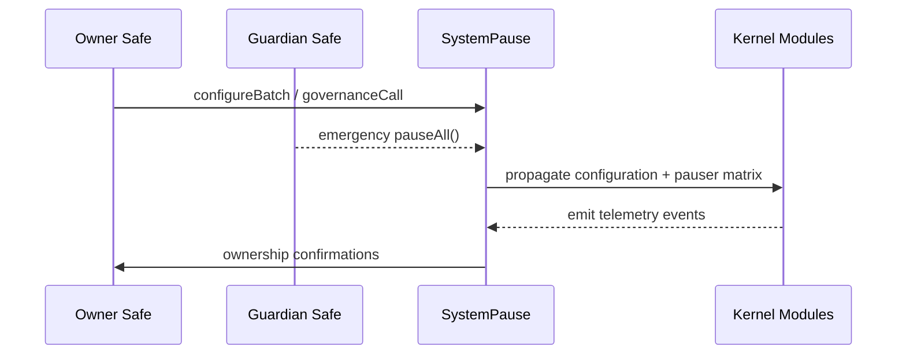
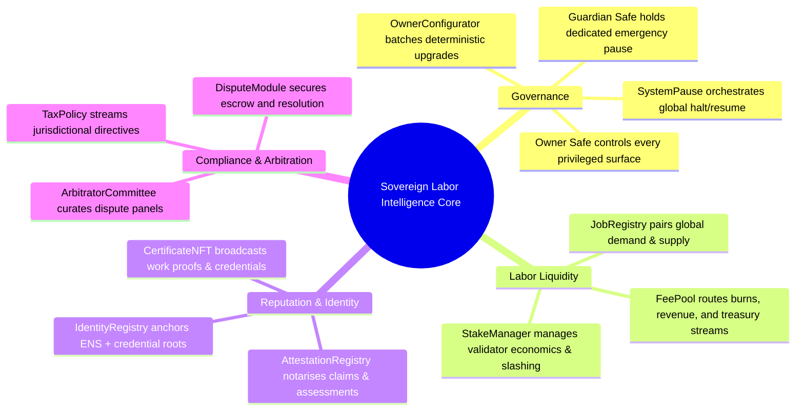

# Sovereign Labor Hardhat Command Deck

<p align="center">
  
  <a href="https://github.com/MontrealAI/agijobs-sovereign-labor-v0p1/actions/workflows/ci.yml"></a>
  <a href="https://github.com/MontrealAI/agijobs-sovereign-labor-v0p1/actions/workflows/security.yml"></a>
  <a href="https://github.com/MontrealAI/agijobs-sovereign-labor-v0p1/actions/workflows/branch-checks.yml"></a>
  
  
  =20.11" />
  
  <a href="https://opensource.org/licenses/MIT"></a>
</p>

> This repository is the command lattice for a machine that governs labour markets with decisive precision—an intelligence core engineered to capture, route, and amplify global productivity under total owner supervision.

---

## Table of Contents
1. [Command Nexus](#command-nexus)
2. [Repository Cartography](#repository-cartography)
3. [Intelligence Mesh](#intelligence-mesh)
4. [Command Graph](#command-graph)
5. [Toolchain & Runtime Envelope](#toolchain--runtime-envelope)
6. [Environment Setup](#environment-setup)
7. [Operational Console](#operational-console)
8. [Deployment Flight Deck](#deployment-flight-deck)
9. [Mainnet Flight Plan for Non-Technical Operators](#mainnet-flight-plan-for-non-technical-operators)
10. [Canonical Truffle Migration (Ethereum Mainnet)](#canonical-truffle-migration-ethereum-mainnet)
11. [Owner Command Surface](#owner-command-surface)
12. [Continuous Integration & Branch Protection](#continuous-integration--branch-protection)
13. [Security, Telemetry & Safeguards](#security-telemetry--safeguards)
14. [Reference Data Vault](#reference-data-vault)

---

## Command Nexus

The Sovereign Labor kernel aligns three execution engines—Hardhat, Truffle, and Foundry—around a single Solidity canon and governance topology. Every subsystem reports to `SystemPause`, granting the contract owner absolute control to reconfigure, pause, or redeploy parameters on demand while maintaining non-stop composability for workers, employers, validators, and treasuries.



---

## Repository Cartography

```text
.
├── contracts/             # Solidity canon for Hardhat, Truffle, and Foundry
├── deploy/                # Network configuration manifests
├── docs/                  # Whitepapers, protocol briefs, research dossiers
├── foundry/               # Forge tests, scripts, invariant harnesses
├── hardhat/               # Hardhat cache, tests, scripts, this command deck
├── migrations/            # Truffle migration scripts (production golden paths)
├── scripts/               # Shared automation, governance matrix, artifact audits
├── truffle/               # Deployment manifests and operational utilities
├── hardhat.config.js      # Hardhat configuration (solc 0.8.30 + IR)
├── truffle-config.js      # Truffle compiler + network map
└── package.json           # Task runner wiring for CI and operators
```

All engines share the same contract tree so every rehearsal matches production byte-for-byte.

---

## Intelligence Mesh



Each branch funnels through `SystemPause`, forming a single point of programmable control.

---

## Command Graph


> Guard `SystemPause.owner()` relentlessly—complete platform authority flows through it.

---

## Toolchain & Runtime Envelope

**Prerequisites**

- Node.js ≥ 20.11 and npm 10.x
- Foundry toolchain (`foundryup`)
- Truffle CLI 5.11.x (installed via `npm ci`)
- Access to Ethereum mainnet and testnet RPC endpoints
- `$AGIALPHA` token (ERC-20, 18 decimals) deployed at `0xa61a3b3a130a9c20768eebf97e21515a6046a1fa`
- Hardware wallet or multisig signer for production deployments

---

## Environment Setup

```bash
# Install JavaScript dependencies (Hardhat, Truffle, auxiliary tooling)
npm ci --omit=optional --no-fund --no-audit

# Install / refresh Foundry
foundryup

# Provision environment secrets at repo root
cat <<'ENV' > .env
MAINNET_RPC=https://mainnet.infura.io/v3/<key>
SEPOLIA_RPC=https://sepolia.infura.io/v3/<key>
MAINNET_DEPLOYER_PK=0x<private_key_without_0x>
SEPOLIA_DEPLOYER_PK=0x<optional_test_key_without_0x>
ETHERSCAN_API_KEY=<verification_key>
DEPLOY_CONFIG=deploy/config.mainnet.json
ENV

# Load variables into the current shell (never commit .env)
export $(grep -v '^#' .env | xargs)
```

`.env` is ignored by git. Guard the production version offline.

---

## Operational Console

| Capability | Command | Result |
| --- | --- | --- |
| Branch naming sentinel | `npm run lint:branch` | Enforces repository-wide branch naming discipline before pushing. |
| Compile (Truffle) | `npm run compile` | Compiles canon and writes artifacts under `build/contracts`. |
| Compile (Hardhat) | `npx hardhat compile` | Hardhat native compile for debugger workflows. |
| Solidity lint | `npm run lint:sol` | Solhint audit (warnings fail the run). |
| Tests (Truffle) | `npm test` | Executes Truffle suites without running migrations. |
| Tests (Hardhat) | `npm run test:hardhat` | Executes Hardhat/ethers suites. |
| Tests (Foundry) | `npm run test:foundry` | Executes Forge fuzzing + invariants. |
| Full CI parity | `npm run test:ci` | Sequential Truffle, Hardhat, Foundry runs. |
| Artifact integrity | `node scripts/verify-artifacts.js` | Confirms ABI + bytecode hashes for CI parity. |
| Governance lattice audit | `npm run ci:governance` | Validates ownership/pauser topology. |
| Mainnet deploy (Truffle) | `npm run deploy:truffle:mainnet` | Idempotent golden path with guardrails. |
| Mainnet deploy (Hardhat) | `npm run deploy:hardhat:mainnet` | Hardhat executor using the same manifest. |
| Mainnet deploy (Foundry) | `npm run deploy:foundry:mainnet` | Hardware-wallet friendly Forge broadcast. |
| Etherscan verification | `npm run verify:mainnet` | Verifies canonical contracts after deployment. |

All commands emit structured logs and abort on any anomaly.

---

## Deployment Flight Deck

- **Hardhat (`hardhat/scripts/deploy-mainnet.js`)** – Imports the manifest, reproduces Truffle wiring, and includes deterministic nonce management for dry runs and broadcasts.
- **Truffle (`migrations/*.js`)** – Canonical migration surface used for production. Migrations validate chain IDs, verify `$AGIALPHA`, enforce treasury allowlists, and emit manifests under `truffle/manifests/`.
- **Foundry (`foundry/script/DeployMainnet.s.sol`)** – Mirror deployment for operators who prefer Forge + hardware wallet signing.

Every toolchain consumes the same JSON manifest (`deploy/config.<network>.json`) to guarantee a deterministic footprint across rehearsals and production.

---

## Mainnet Flight Plan for Non-Technical Operators


### Step-by-step Checklist

1. **Secure credentials & capital**
   - Hardware wallet / multisig signer with ≥ **1.5 ETH** available for gas.
   - Offline copy of `deploy/config.mainnet.json` fully populated with:
     - `ownerSafe`, `guardianSafe`, `treasury`
     - `$AGIALPHA` token (`0xa61a3b3a130a9c20768eebf97e21515a6046a1fa`, 18 decimals)
     - Platform fees, validator requirements, dispute parameters, identity roots.

2. **Rehearse on a fork (≈15 minutes)**
   ```bash
   npx hardhat node --fork "$MAINNET_RPC" --port 8545
   DEPLOY_CONFIG=deploy/config.mainnet.json npx hardhat test --network localhost
   ```
   - Confirms manifest integrity and governance wiring without spending mainnet gas.

3. **Prepare the live session**
   ```bash
   export MAINNET_RPC=https://mainnet.infura.io/v3/<key>
   export MAINNET_DEPLOYER_PK=0x<private_key_without_0x>
   export DEPLOY_CONFIG=deploy/config.mainnet.json
   ```
   - Unlock the hardware wallet, verify the address on-device, and confirm balances.
   - Validate that the manifest being used is the production copy.

4. **Execute the migration**
   ```bash
   npx truffle migrate --network mainnet --compile-all
   ```
   The migration automatically:
   - Aborts if `chainId` mismatches the manifest.
   - Fetches `$AGIALPHA` metadata to guarantee 18 decimals and the canonical address.
   - Deploys all modules, wires dependencies, and transfers ownership to `SystemPause` before granting the owner safe control.
   - Writes `truffle/manifests/mainnet.json` with addresses and pauser topology.

5. **Finalise governance handoff**
   - From the owner safe, accept any pending ownership transfers (Identity, Attestation, Certificate).
   - Record `SystemPause.owner()` and `SystemPause.activePauser()` in the operational vault.

6. **Post-deployment hygiene**
   ```bash
   npm run verify:mainnet
   ```
   - Archive console output, manifests, and configs to an encrypted vault.
   - Configure monitors on `ModulesUpdated`, `PausersUpdated`, and `GovernanceCallExecuted` events.

---

## Canonical Truffle Migration (Ethereum Mainnet)

The production migration lives at [`migrations/1_deploy_kernel.js`](../migrations/1_deploy_kernel.js). It is intentionally verbose so operators can audit every guardrail.

```javascript
const CANONICAL_AGIALPHA = '0xa61a3b3a130a9c20768eebf97e21515a6046a1fa';

module.exports = async function (deployer, network, accounts) {
  const [deployerAccount] = accounts;
  const cfg = resolveConfig();
  const chainId = await web3.eth.getChainId();
  if (chainId !== cfg.chainId) throw new Error(`Config chainId ${cfg.chainId} != network ${chainId}`);
  if (chainId === 1 && cfg.tokens.agi.toLowerCase() !== CANONICAL_AGIALPHA) {
    throw new Error(`Mainnet AGIALPHA must be ${CANONICAL_AGIALPHA}`);
  }
  const agiMetadata = new web3.eth.Contract(ERC20_METADATA_ABI, cfg.tokens.agi);
  const agiDecimals = Number(await agiMetadata.methods.decimals().call());
  if (agiDecimals !== 18) throw new Error(`$AGIALPHA decimals must equal 18, detected ${agiDecimals}`);

  // Deploy OwnerConfigurator, TaxPolicy, StakeManager, FeePool, ReputationEngine, PlatformRegistry…
  const stake = await deployer.deploy(StakeManager, minStakeWei, employerPct, treasuryPct, treasury, ZERO_ADDRESS, ZERO_ADDRESS, deployerAccount);
  const feePool = await deployer.deploy(FeePool, stake.address, burnPct, treasury, tax.address);
  const job = await deployer.deploy(JobRegistry, validation.address, stake.address, reputation.address, dispute.address, certificate.address, feePool.address, tax.address, platformFeePct, jobStakeWei, [tax.address], deployerAccount);
  const pause = await deployer.deploy(SystemPause, job.address, stake.address, validation.address, dispute.address, platform.address, feePool.address, reputation.address, committee.address, tax.address, deployerAccount);

  // Wiring, ownership transfers, and manifest emission
  await pause.setModules(job.address, stake.address, validation.address, dispute.address, platform.address, feePool.address, reputation.address, committee.address, tax.address);
  await pause.setGlobalPauser(guardianSafe);
  await pause.transferOwnership(ownerSafe);
  await writeManifest(network, {/* addresses + governance */});
};
```

Key guarantees:

- `$AGIALPHA` metadata is verified (address + 18 decimals) before any deployment continues.
- Ownership of every privileged module transfers to `SystemPause`, which then hands control to the owner safe.
- `guardianSafe` gains the delegated global pause authority immediately.
- A deployment manifest is written every run for reproducibility and audit trails.
- Follow-up script [`migrations/3_mainnet_finalize.js`](../migrations/3_mainnet_finalize.js) double-checks ownership, guardian wiring, module pointers, and token integrity.

---

## Owner Command Surface

| Function | Module | Purpose |
| --- | --- | --- |
| `OwnerConfigurator.configure{Batch}()` | OwnerConfigurator | Route batched, pre-reviewed parameter updates with telemetry via `ParameterUpdated` events. |
| `SystemPause.setModules(...)` | SystemPause | Rewire JobRegistry, StakeManager, ValidationModule, DisputeModule, PlatformRegistry, FeePool, ReputationEngine, ArbitratorCommittee, TaxPolicy after verifying ownership of each module. |
| `SystemPause.setGlobalPauser(address)` / `refreshPausers()` | SystemPause | Rotate guardian safe or restore module-level pauser delegation. |
| `SystemPause.pauseAll()` / `unpauseAll()` | SystemPause | Atomic pause/unpause across every module in a single transaction. |
| `SystemPause.governanceCall(target, data)` | SystemPause | Execute arbitrary, audit-approved governance calls (owner safe retains veto). |
| `StakeManager.batchConfigure(...)`, `update*` suite | StakeManager | Tune staking thresholds, unbonding periods, slashing distribution, validator managers, treasury routes. |
| `FeePool.updateFeeSettings(...)`, `updateTreasury(...)`, `updateBurnPercentage(...)` | FeePool | Control fee percentages, burn ratios, treasury endpoints. |
| `ValidationModule.configureValidatorSet(...)`, `setFailoverConfig(...)` | ValidationModule | Curate validator roster, quorum, and failover behaviour. |
| `DisputeModule.configureEscrow(...)`, `setFeeParameters(...)` | DisputeModule | Control dispute fees, escalation windows, escrow policy. |
| `PlatformRegistry.configurePlatform(...)`, `setFeeOverride(...)` | PlatformRegistry | Manage platform onboarding, overrides, and job staking requirements. |
| `TaxPolicy.setPolicyURI(...)`, `setEnabled(bool)` | TaxPolicy | Activate or update fiscal policy references. |
| `IdentityRegistry.setMerkleRoots(...)`, `setNameWrapper(...)` | IdentityRegistry | Update identity proofs, ENS dependencies, wrapper contracts. |
| `CertificateNFT.setJobRegistry(address)` | CertificateNFT | Manage credential issuance authority. |

Every privileged function is reachable by the owner safe and guarded by `SystemPause`, sustaining total operational control over the labour intelligence core.

---

## Continuous Integration & Branch Protection

```mermaid
flowchart TD
    Dev[Developer Push/PR]
    CI[ci.yml\n(compile + lint + multi-runtime tests)]
    Branch[branch-checks.yml\n(branch naming gatekeeper)]
    Sec[security.yml\n(Slither + Mythril + Foundry build)]
    Status[Protected Branch Rule]

    Dev --> CI
    Dev --> Branch
    Dev --> Sec
    CI & Branch & Sec --> Status
    Status -->|Green checks required| Merge[Merge into main]
```

1. **`ci.yml`** – Runs linting, compiles, Hardhat/Truffle/Foundry tests, governance matrix verification, actionlint.
2. **`branch-checks.yml`** – Guards naming conventions so audit logs stay deterministic.
3. **`security.yml`** – Executes Slither static analysis, Mythril symbolic execution, and Foundry build validation.

**Local parity ritual**
```bash
npm run lint:branch
npm run lint:sol
npm run test:ci
npm run ci:governance
node scripts/verify-artifacts.js
```

**Enforce protections on GitHub**
1. Settings → Branches → add rule for `main` (and integration branches like `develop`).
2. Require pull request reviews (≥1 approval) and conversation resolution.
3. Require status checks (`ci.yml`, `branch-checks.yml`, `security.yml`) and enforce "Require branches to be up to date before merging".
4. Disallow direct pushes, force pushes, and allow no administrator bypasses.
5. Mirror the rule on release branches if they stay live for more than one sprint.

Keep the three workflow badges green; every PR must satisfy them before merge.

---

## Security, Telemetry & Safeguards

- **Static analysis** – Slither (`security.yml`) fails on any high-severity finding; SARIF artifacts populate the Security tab.
- **Symbolic execution** – Mythril sweeps `SystemPause`, `StakeManager`, `FeePool`, and dispute surfaces every run.
- **Runtime invariants** – Forge fuzz harnesses stress-test staking, reputation, and dispute flows.
- **Token integrity** – Migrations enforce `$AGIALPHA` address + 18 decimals; mismatches abort deployment.
- **Operational observability** – Subscribe to `ModulesUpdated`, `PausersUpdated`, `GovernanceCallExecuted`, `StakeParametersUpdated`, `FeeSettingsUpdated` for live telemetry.
- **Emergency response** – Guardian safe can call `SystemPause.pauseAll()` instantly; owner safe can rotate pausers, modules, and fee endpoints without downtime.

---

## Reference Data Vault

| Item | Value |
| --- | --- |
| Canonical token | `$AGIALPHA` – `0xa61a3b3a130a9c20768eebf97e21515a6046a1fa` (18 decimals) |
| Ownership nexus | `SystemPause.owner()` – resolves to owner safe controlling every privileged call |
| Guardian | `SystemPause.activePauser()` – delegated emergency controller |
| Manifest output | `truffle/manifests/<network>.json` |
| Deployment config | `deploy/config.<network>.json` |
| Truffle migrations | `migrations/*.js` |
| Hardhat executors | `hardhat/scripts/*.js` |
| Foundry scripts | `foundry/script/*.s.sol` |
| Governance checks | `scripts/check-governance-matrix.mjs` |

Preserve these constants inside an encrypted operational vault. They are the co-ordinates for the machine that reprograms labour markets at global scale.

---

Steward the lattice carefully. Keep CI green, enforce branch protections, and route every privileged change through `SystemPause` so the intelligence core keeps compounding advantage.
