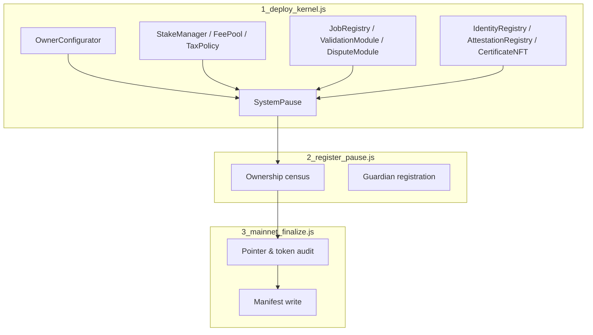

# Sovereign Labor Migration Codex

[](https://github.com/agijobs/agijobs-sovereign-labor-v0p1/actions/workflows/ci.yml)
[](https://github.com/agijobs/agijobs-sovereign-labor-v0p1/actions/workflows/security.yml)
[](https://github.com/agijobs/agijobs-sovereign-labor-v0p1/actions/workflows/branch-checks.yml)


> The migration suite materialises the sovereign labor lattice on any network. It encodes the same invariants enforced by the Hardhat and Foundry autopilots, so whichever toolchain you select, the owner retains complete command.

---

## Table of Contents
1. [Mission Signal](#mission-signal)
2. [Constellation Snapshot](#constellation-snapshot)
3. [Workflow Guard Rails](#workflow-guard-rails)
4. [Preflight Integrity](#preflight-integrity)
5. [Step 1 – `1_deploy_kernel.js`](#step-1--1_deploy_kerneljs)
6. [Step 2 – `2_register_pause.js`](#step-2--2_register_pausejs)
7. [Step 3 – `3_mainnet_finalize.js`](#step-3--3_mainnet_finalizejs)
8. [Autopilot Parity](#autopilot-parity)
9. [Diagnostics & Recovery](#diagnostics--recovery)
10. [Reference Commands](#reference-commands)

---

## Mission Signal
- **Canonical economics.** Deployments halt if `$AGIALPHA` deviates from `0xa61a3b3a130a9c20768eebf97e21515a6046a1fa` or lacks 18 decimals.
- **SystemPause supremacy.** All modules are transferred to `SystemPause`, which then hands control to the owner Safe. Guardian Safe becomes the delegated pauser.
- **Manifest fidelity.** Percentages, quorums, ENS nodes, and Merkle roots are validated from `deploy/config.mainnet.json` before any contract is deployed.
- **Evidence output.** Each migration writes manifests with chain ID, Safes, and contract addresses for audit trails.

---

## Constellation Snapshot


---

## Workflow Guard Rails
| Check | Workflow | Purpose |
| --- | --- | --- |
| `ci.yml / Solidity lint` | `npm run lint:sol` | Zero-warning policy for Solidity sources. |
| `ci.yml / Compile smart contracts` | `npm run compile`, `node scripts/verify-artifacts.js` | Deterministic artifacts for migrations. |
| `ci.yml / Governance surface audit` | `npm run ci:governance` | Confirms every privileged setter remains available. |
| `ci.yml / Test suites` | `npm run test:truffle:ci`, `npm run test:hardhat`, `npm run test:foundry` | Confirms runtime behaviour matches expectations. |
| `security.yml` jobs | Slither + Mythril | Static and symbolic analysis of privileged contracts. |
| `branch-checks.yml` | `node scripts/check-branch-name.mjs` | Enforces branch taxonomy before merging migration changes. |

---

## Preflight Integrity
1. Install dependencies (`npm ci --omit=optional --no-audit --no-fund`).
2. Export environment variables: `MAINNET_RPC`, `SEPOLIA_RPC`, `DEPLOYER_PK`, `ETHERSCAN_API_KEY`, optional `DEPLOY_CONFIG`.
3. Update `deploy/config.mainnet.json` with production addresses and parameters.
4. Mirror CI locally (lint, compile, verify artifacts, governance audit, all tests).
5. `cast chain --rpc $MAINNET_RPC` and `cast balance $(cast wallet address $DEPLOYER_PK)` to verify connectivity and funding.
6. Stage evidence directories for manifests and Safe transaction receipts.

---

## Step 1 – `1_deploy_kernel.js`
- Deploys `OwnerConfigurator`, `TaxPolicy`, `StakeManager`, `FeePool`, `ReputationEngine`, `PlatformRegistry`, `IdentityRegistry`, `AttestationRegistry`, `CertificateNFT`, `ValidationModule`, `DisputeModule`, `JobRegistry`, `ArbitratorCommittee`, and `SystemPause`.
- Validates chain ID, `$AGIALPHA` metadata (symbol, decimals), percentage multiples, identity roots, and treasury addresses.
- Wires every module together via `set*` calls.
- Transfers module ownership to `SystemPause`, sets the guardian as global pauser, and transfers SystemPause + identity modules to the owner Safe.
- Writes interim manifest entries.

Command:
```bash
npx truffle migrate --network mainnet --f 1 --to 1 --skip-dry-run
```

---

## Step 2 – `2_register_pause.js`
- Confirms `SystemPause.owner()` equals the owner Safe.
- Confirms `SystemPause.activePauser()` equals the guardian Safe (or fallback to owner if omitted).
- Pulls each module pointer from SystemPause and validates ownership.
- Emits ownership census to stdout for the evidence archive.

Command:
```bash
npx truffle migrate --network mainnet --f 2 --to 2 --skip-dry-run
```

---

## Step 3 – `3_mainnet_finalize.js`
- Verifies `$AGIALPHA` constants against [`Constants.sol`](../contracts/Constants.sol) and the manifest.
- Asserts treasury, owner Safe, guardian Safe, and module pointers align with the manifest.
- Halts with descriptive errors if any pointer or invariant drifts.
- Writes `manifests/addresses.<network>.json`.

Command:
```bash
npx truffle migrate --network mainnet --f 3 --to 3 --skip-dry-run
```

---

## Autopilot Parity
| Toolchain | Command | Notes |
| --- | --- | --- |
| Truffle | `npm run deploy:truffle:mainnet` | Executes all three migrations sequentially (the scripts described above). |
| Hardhat | `npm run deploy:hardhat:mainnet` | [`hardhat/scripts/deploy-mainnet.js`](../hardhat/scripts/deploy-mainnet.js) mirrors every migration step with `ethers`. |
| Foundry | `npm run deploy:foundry:mainnet` | [`foundry/script/DeployMainnet.s.sol`](../foundry/script/DeployMainnet.s.sol) reimplements the sequence in Solidity with `forge script`. |

All flows rely on the same manifest loader (`scripts/deploy/load-config.js` or its Solidity equivalent) so the invariants remain synchronized.

---

## Diagnostics & Recovery
- **Guardian pause:** Guardian Safe calls `SystemPause.pauseAll()` if any step fails post-launch.
- **Reconfiguration:** Owner Safe uses `OwnerConfigurator.configure` to update module pointers or parameters, then executes through `SystemPause.executeGovernanceCall`.
- **Validation:** Re-run `npm run ci:governance` and the test suites locally. Archive the outputs with Safe transaction hashes.
- **Resume:** Owner Safe calls `SystemPause.unpauseAll()` once diagnostics confirm stability.

---

## Reference Commands
| Purpose | Command |
| --- | --- |
| Preflight check | `npm run lint:sol && npm run compile && node scripts/verify-artifacts.js && npm run ci:governance` |
| Dry-run on Sepolia | `TRUFFLE_CONFIG=deploy/config.sepolia.json npx truffle migrate --network sepolia --reset` |
| Mainnet full deployment | `npm run deploy:truffle:mainnet` |
| Governance audit | `npm run ci:governance -- --format table` |
| Ownership census | `npx truffle migrate --network mainnet --f 2 --to 2 --skip-dry-run` |
| Manifest verification | `node scripts/verify-artifacts.js` |
| Safe-ready treasury rotation | `NEW_TREASURY=0x... npx truffle exec scripts/owner-set-treasury.js --network mainnet` |

Keep these scripts on standby; they are the same levers CI enforces and the owner Safe controls in production.
