# Sovereign Labor Migration Codex // Kernel Orchestration

[](https://github.com/MontrealAI/agijobs-sovereign-labor-v0p1/actions/workflows/ci.yml)
[](https://github.com/MontrealAI/agijobs-sovereign-labor-v0p1/actions/workflows/branch-checks.yml)
[](#continuous-integration--branch-enforcement)
[](#continuous-integration--branch-enforcement)
[](https://etherscan.io/token/0xa61a3b3a130a9c20768eebf97e21515a6046a1fa)


> This codex is the owner’s flight deck for the Sovereign Labor lattice—the operational choreography that lets one Safe govern staking, disputes, attestations, and treasury with the calm certainty of an unstoppable machine.

---

## Table of Contents
1. [Mission Signal](#mission-signal)
2. [Constellation Snapshot (Mermaid)](#constellation-snapshot-mermaid)
3. [Continuous Integration & Branch Enforcement](#continuous-integration--branch-enforcement)
4. [Toolchain & Environment Prerequisites](#toolchain--environment-prerequisites)
5. [Migration Pipeline Overview](#migration-pipeline-overview)
6. [Step 0 – Preflight Integrity](#step-0--preflight-integrity)
7. [Step 1 – `1_deploy_kernel.js`](#step-1--1_deploy_kerneljs)
8. [Step 2 – `2_register_pause.js`](#step-2--2_register_pausejs)
9. [Step 3 – `3_mainnet_finalize.js`](#step-3--3_mainnet_finalizejs)
10. [Owner Command Authority](#owner-command-authority)
11. [Validation Telemetry (Mermaid)](#validation-telemetry-mermaid)
12. [Troubleshooting & Recovery Spiral](#troubleshooting--recovery-spiral)
13. [Reference Command Matrix](#reference-command-matrix)

---

## Mission Signal

The migration suite crystallises the Sovereign Labor kernel on any EVM chain while keeping `$AGIALPHA = 0xa61a3b3a130a9c20768eebf97e21515a6046a1fa` (18 decimals) wired through every module. Each script is deterministic, idempotent, and emits manifests that keep CI, governance, and audits in a single trust loop. The owner Safe retains unilateral authority to tune economics, pause flows, rotate modules, and evolve policy at line speed.

---

## Constellation Snapshot (Mermaid)

```mermaid
flowchart LR
    subgraph Stage0[Preflight & Evidence]
        Config[deploy/config.mainnet.json]
        Env[Secrets
        MAINNET_RPC · SEPOLIA_RPC
        DEPLOYER_PK · ETHERSCAN_API_KEY]
        CI[GitHub Actions
        Sovereign Compile ▸ Branch Gatekeeper]
    end

    subgraph Stage1[1_deploy_kernel]
        OwnerCfg[OwnerConfigurator]
        Pause[SystemPause]
        Kernel[StakeManager · JobRegistry · ValidationModule · DisputeModule · PlatformRegistry · ReputationEngine]
        IdentityMesh[IdentityRegistry · AttestationRegistry · CertificateNFT]
        Treasury[FeePool · TaxPolicy]
    end

    subgraph Stage2[2_register_pause]
        Snapshot[Ownership Snapshot]
        Guardian[Active Pauser]
    end

    subgraph Stage3[3_mainnet_finalize]
        Checks[Ownership & Pointer Checks]
        TokenAudit[$AGIALPHA Token Audit]
        FinalReport[Final Validation Log]
    end

    Config --> Stage1
    Env --> Stage1
    CI --> Stage1
    Stage1 --> Manifest[Deployment Manifest]
    Stage1 --> Stage2
    Stage2 --> Stage3
    Stage3 --> FinalReport
    Manifest --> Evidence[(Evidence Archive)]
    FinalReport --> Evidence
    Evidence --> OwnerSafe[[Owner Safe]]
    OwnerSafe --> Pause
    Pause --> Kernel
    Pause --> IdentityMesh
    Pause --> Treasury
```



Everything flows through the owner’s Safe: migrations only complete when every subsystem reports to `SystemPause`, the guardian Safe holds the live pause key, and `$AGIALPHA` remains the immutable economic spine.

---

## Continuous Integration & Branch Enforcement

| Check | Workflow | Trigger | Command Surface |
| --- | --- | --- | --- |
| Solidity lint | [`ci.yml`](../.github/workflows/ci.yml) | push, PR, manual | `npm run lint:sol` |
| Compile + artifact verify | [`ci.yml`](../.github/workflows/ci.yml) | push, PR, manual | `npm run compile`, `node scripts/verify-artifacts.js`, `node scripts/write-compile-summary.js` |
| Governance surface audit | [`ci.yml`](../.github/workflows/ci.yml) | push, PR, manual | `npm run ci:governance` |
| Workflow hygiene | [`ci.yml`](../.github/workflows/ci.yml) | push, PR, manual | `actionlint -color` |
| Branch naming gate | [`branch-checks.yml`](../.github/workflows/branch-checks.yml) | push, PR, manual | `node scripts/check-branch-name.mjs` |

**Branch protection (mirror on `main` and `develop`):** require status checks `Sovereign Compile` & `Branch Gatekeeper`, enforce up-to-date branches, forbid force-pushes/deletions, demand ≥1 approving review, and prefer signed commits. Use the [`gh api` recipe](../deploy/README.md#continuous-integration--branch-enforcement) to automate enforcement so the badges above always reflect live protections.

---

## Toolchain & Environment Prerequisites

| Requirement | Why | Verification |
| --- | --- | --- |
| Node 20.x & npm 10.x | Matches GitHub Actions and `package-lock.json`. | `node --version`, `npm --version` |
| Truffle 5.11.x | Aligns with `truffle-config.js` (`solc 0.8.30`, viaIR, optimizer runs = 5). | `npx truffle version` |
| Network access | `MAINNET_RPC` & `SEPOLIA_RPC` endpoints for deployments and dry-runs. | `cast chain --rpc $MAINNET_RPC` |
| Deployer key | `DEPLOYER_PK` exported with gas budget to execute all migrations. | `cast balance $DEPLOYER --rpc $MAINNET_RPC` |
| Etherscan API | Optional but required for `npm run verify:mainnet`. | `echo $ETHERSCAN_API_KEY | wc -c` |
| Config manifest | `deploy/config.mainnet.json` or alternate path via `DEPLOY_CONFIG`. | `jq '.' deploy/config.mainnet.json` |
| Evidence vault | Repository write access to commit `manifests/<network>.json` outputs from migrations. | `git status` |

Non-technical operators can run everything through `npx truffle` plus the commands listed; the scripts are deterministic and halt on any misconfiguration before gas is spent.

---

## Migration Pipeline Overview


The durations are indicative—gas costs are minimised by batching safe confirmations while the scripts enforce every invariant before proceeding.

---

## Step 0 – Preflight Integrity

1. **Clone & install:** `npm ci --omit=optional --no-audit --no-fund`.
2. **Mirror CI locally:**
   ```bash
   npm run lint:sol
   npm run compile
   node scripts/verify-artifacts.js
   npm run ci:governance
   npm run test:truffle:ci
   npm run test:hardhat
   npm run test:foundry
   ```
3. **Sanity-check config:**
   ```bash
   jq '.' deploy/config.mainnet.json
   cast resolve-name agent.agi.eth --rpc $MAINNET_RPC
   cast resolve-name club.agi.eth --rpc $MAINNET_RPC
   ```
4. **Load secrets:** export `MAINNET_RPC`, `DEPLOYER_PK`, `ETHERSCAN_API_KEY`, and optionally `DEPLOY_CONFIG` if using a bespoke JSON manifest.
5. **Stage manifest directory:** migrations append to `manifests/` via `truffle/util/writeManifest.js`.
6. **Cue Safe signers:** queue `acceptOwnership` for IdentityRegistry and AttestationRegistry; the owner Safe completes these off-chain right after Step 1.

If any command diverges from CI output, stop and reconcile before touching mainnet.

---

## Step 1 – `1_deploy_kernel.js`

`npx truffle migrate --network <net> --f 1 --to 1 --skip-dry-run`

| Guarantee | Implementation |
| --- | --- |
| **Chain identity lock** | Halts when `cfg.chainId` mismatches `web3.eth.getChainId()`. |
| **Immutable `$AGIALPHA`** | Requires `cfg.tokens.agi === 0xa61a3b3a130a9c20768eebf97e21515a6046a1fa` on mainnet and checks ERC-20 `decimals == 18`, `symbol == AGIALPHA`, rejects “test” names. |
| **Parameter hygiene** | Validates `platformFeeBps`, `burnBpsOfFee`, `slashBps`, quorum, and ENS/merkle roots before any deployment. |
| **Module deployment** | Spins up `OwnerConfigurator`, `TaxPolicy`, `StakeManager`, `FeePool`, `ReputationEngine`, `PlatformRegistry`, `AttestationRegistry`, `IdentityRegistry`, `CertificateNFT`, `ValidationModule`, `DisputeModule`, `JobRegistry`, and `ArbitratorCommittee`. |
| **Wiring discipline** | Invokes all `set*` governance setters to link staking, disputes, validation, reputation, certificates, tax policy, fee routing, and identity proofs. |
| **Treasury control** | Grants allowlist, assigns treasury Safe, and sets burn percentages. |
| **Governance lattice** | Transfers ownership of every module to `SystemPause`, delegates TaxPolicy acceptance, assigns guardian Safe as global pauser, then hands `SystemPause`, Identity, Attestation, and Certificate control to the owner Safe. |
| **Manifest logging** | Calls `truffle/util/writeManifest` with deployed addresses, Safes, and chain metadata. |

🧭 **Operator checklist:** after execution, the owner Safe must execute the pending `acceptOwnership` transactions surfaced in the Safe queue for IdentityRegistry and AttestationRegistry.

---

## Step 2 – `2_register_pause.js`

`npx truffle migrate --network <net> --f 2 --to 2 --skip-dry-run`

| Guarantee | Implementation |
| --- | --- |
| **Owner alignment** | Confirms `SystemPause.owner()` equals `ownerSafe` and `activePauser()` equals `guardianSafe` (or owner fallback). |
| **Module census** | Pulls pointers for JobRegistry, StakeManager, ValidationModule, DisputeModule, PlatformRegistry, FeePool, ReputationEngine, ArbitratorCommittee, and TaxPolicy; verifies each contract’s `owner()` reports `SystemPause`. |
| **Audit telemetry** | Prints an ownership table to stdout for archival evidence. |

If any module isn’t under pause control the script reverts before gas is consumed on subsequent steps.

---

## Step 3 – `3_mainnet_finalize.js`

`npx truffle migrate --network <net> --f 3 --to 3 --skip-dry-run`

| Guarantee | Implementation |
| --- | --- |
| **Chain revalidation** | Skips execution when `web3.eth.getChainId()` differs from `cfg.chainId`, preventing cross-chain mistakes. |
| **Ownership finality** | Re-checks ownership for all core modules (`SystemPause`, JobRegistry, StakeManager, ValidationModule, DisputeModule, PlatformRegistry, FeePool, ReputationEngine, ArbitratorCommittee, TaxPolicy). |
| **Guardian authority** | Verifies the live `activePauser()` matches guardian (or owner fallback). |
| **Pointer integrity** | Asserts `SystemPause` pointers match deployed addresses for validation, staking, dispute, platform, fee pool, reputation, committee. |
| **Token audit** | Requires `FeePool.token()` to equal configured `$AGIALPHA`, blocking any drift away from `0xa61a3b3a130a9c20768eebf97e21515a6046a1fa`. |
| **Treasury heads-up** | Warns (does not revert) if `StakeManager.treasury()` diverges from config so the owner can reconcile manually. |
| **Final signal** | Emits a success log confirming the governance lattice is ready for production traffic. |

Once this step passes, CI artefacts plus the manifest give incontrovertible evidence that the deployment matches repository code.

---

## Owner Command Authority

`SystemPause` is the command bus—`onlyGovernance` functions execute through the owner Safe (Timelock/Multisig). The table below surfaces the highest-leverage controls for the operator:

| Module | Core Controls (all `onlyGovernance`) | Purpose |
| --- | --- | --- |
| `SystemPause` | `setModules`, `setGlobalPauser`, `pauseAll`, `unpauseAll`, `executeGovernanceCall` | Rotate modules, delegate pausing, freeze/unfreeze the entire lattice, and forward arbitrary governed calls. |
| `StakeManager` | `setFeePool`, `setDisputeModule`, `setValidationModule`, `setJobRegistry`, `setTreasury`, `setTreasuryAllowlist`, `setRoleMinimums`, `applyConfiguration`, `pause`, `unpause` | Adjust staking economics, treasury routing, dispute hooks, and pause staking flows instantly. |
| `JobRegistry` | `setStakeManager`, `setValidationModule`, `setDisputeModule`, `setCertificate`, `setFeePool`, `setTaxPolicy`, `setPlatformRegistry`, `setPlatformFee`, `pause`, `unpause` | Tune job escrow parameters, routing, taxation, and pause job lifecycle. |
| `FeePool` | `setStakeManager`, `setTreasury`, `setTreasuryAllowlist`, `setTaxPolicy`, `setRewardRole`, `setBurn`, `pause`, `unpause` | Direct payouts, treasury, burn rate, and halt settlement. |
| `ValidationModule` | `setJobRegistry`, `setStakeManager`, `setIdentityRegistry`, `setReputationEngine`, `setFailover`, `pause`, `unpause` | Steer validation topology, failover windows, and gating. |
| `DisputeModule` | `setJobRegistry`, `setStakeManager`, `setCommittee`, `setTaxPolicy`, `setValidationModule`, `setEscrow`, `pause`, `unpause` | Govern dispute resolution flow and supporting modules. |
| `PlatformRegistry` | `setStakeManager`, `setReputationEngine`, `setTaxPolicy`, `pause`, `unpause` | Control operator onboarding thresholds. |
| `ReputationEngine` | `setCaller`, `setWeights`, `pause`, `unpause` | Manage who can mutate reputation and weighting algorithms. |
| `TaxPolicy` | `setPolicy`, `setDescription`, `transferOwnership` | Publish new tax documents and messaging. |

Every setter is routed through governance, guaranteeing that the owner Safe can mutate policy, economics, or pause states on demand without redeploying contracts.

---

## Validation Telemetry (Mermaid)

```mermaid
sequenceDiagram
    participant Operator
    participant CLI as Operator Terminal
    participant Pause as SystemPause
    participant Safe as Owner Safe
    participant CI as GitHub Actions
    participant Ledger as Manifest Vault

    Operator->>CLI: Export secrets + npm ci
    Operator->>CLI: npm run lint:sol ▸ npm run compile ▸ npm run ci:governance
    CLI->>CI: Push branch → Sovereign Compile + Branch Gatekeeper badges
    Operator->>CLI: truffle migrate --network mainnet --f 1 --to 1
    CLI->>Pause: Deploy lattice, transfer ownership, set guardian
    Pause->>Safe: Pending acceptOwnership (Identity/Attestation)
    Safe-->>Pause: Execute queued acceptOwnership transactions
    Operator->>CLI: truffle migrate --f 2 --to 2
    CLI->>Pause: Ownership census & guardian verification
    Operator->>CLI: truffle migrate --f 3 --to 3
    CLI->>Pause: Pointer & token audit, final ✅
    CLI->>Ledger: Commit manifests + CI artefacts
    Ledger->>Operator: Signed evidence packet ready for auditors
```



The same choreography runs identically on Sepolia dry-runs—swap RPC endpoints and chain IDs in the config manifest.

---

## Troubleshooting & Recovery Spiral

| Symptom | Detection | Remedy |
| --- | --- | --- |
| `Mainnet AGIALPHA must be …` error | `$AGIALPHA` address mismatch or non-18 decimal token. | Update `tokens.agi` to `0xa61a3b3a130a9c20768eebf97e21515a6046a1fa`; confirm ERC-20 metadata via `cast call`. |
| `platformFeeBps` / `burnBpsOfFee` validation failures | Config values not multiples of 100 or >100%. | Adjust basis points to compliant values (e.g. 1000 = 10%). |
| Guardian mismatch in Step 2/3 | `activePauser()` not set to guardian Safe. | Re-run Step 1 after ensuring `cfg.guardianSafe` is correct, or call `SystemPause.setGlobalPauser` via owner Safe. |
| Ownership mismatch in Step 3 | Module did not transfer or Safe missed acceptance. | Execute `acceptOwnership` via Safe, then re-run Step 2 and Step 3. |
| FeePool token drift | Configured token differs from deployed constant. | Abort deployment, correct config, redeploy Step 1. |
| Treasury warning | StakeManager treasury differs from config (info-level). | Update config for future runs and, if necessary, invoke `StakeManager.setTreasury` via owner Safe. |
| CI badge red | Workflow failure or branch policy breach. | Inspect run logs under GitHub Actions, fix root cause, rerun before merging. |

All scripts are safe to re-run; they halt before state changes when invariants are already satisfied.

---

## Reference Command Matrix

| Task | Command |
| --- | --- |
| Install | `npm ci --omit=optional --no-audit --no-fund` |
| Compile | `npm run compile` |
| Lint | `npm run lint:sol` |
| Governance audit | `npm run ci:governance` |
| Mainnet deploy step 1 | `npx truffle migrate --network mainnet --f 1 --to 1 --skip-dry-run` |
| Mainnet deploy step 2 | `npx truffle migrate --network mainnet --f 2 --to 2 --skip-dry-run` |
| Mainnet deploy step 3 | `npx truffle migrate --network mainnet --f 3 --to 3 --skip-dry-run` |
| Verify on Etherscan | `npm run verify:mainnet` |
| Regenerate manifest | `node truffle/util/writeManifest.js` (usually invoked by migrations) |
| Update branch protection | `gh api repos/MontrealAI/agijobs-sovereign-labor-v0p1/branches/main/protection --method PUT ...` |

Lock this codex to every release tag so auditors, operators, and Safe signers always have a single source of truth for orchestrating the Sovereign Labor machine.
