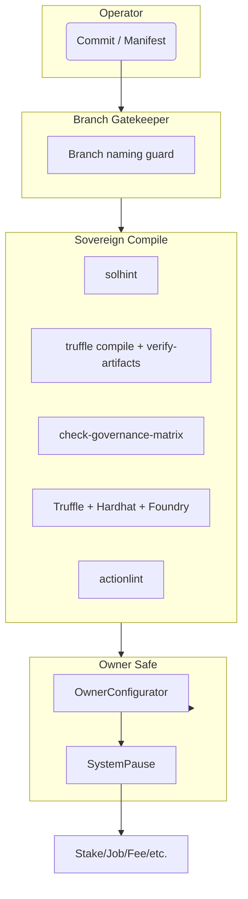
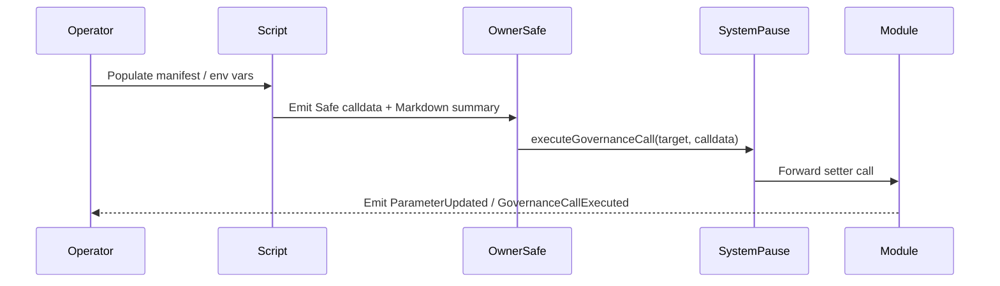

# Sovereign Labor Automation Conductor

[](https://github.com/agijobs/agijobs-sovereign-labor-v0p1/actions/workflows/ci.yml)
[](https://github.com/agijobs/agijobs-sovereign-labor-v0p1/actions/workflows/security.yml)
[](https://github.com/agijobs/agijobs-sovereign-labor-v0p1/actions/workflows/branch-checks.yml)


> Every script in this directory is a precision instrument. They automate governance audits, artifact verification, manifest loading, and Safe-ready configuration updates so the operator commands the labor lattice with absolute confidence.

---

## Table of Contents
1. [Systems Atlas](#systems-atlas)
2. [Launch Checklist](#launch-checklist)
3. [Script Playbook](#script-playbook)
4. [Control Surface Choreography](#control-surface-choreography)
5. [Continuous Integration Covenant](#continuous-integration-covenant)
6. [Owner Prerogatives](#owner-prerogatives)
7. [Telemetry](#telemetry)
8. [Diagnostics Matrix](#diagnostics-matrix)

---

## Systems Atlas


Scripts keep these stages deterministic: branch naming stays disciplined, CI telemetry is captured, and the owner Safe receives Safe-ready calldata.

---

## Launch Checklist
```bash
npm ci --omit=optional --no-audit --no-fund
npm run lint:sol
npm run compile
node scripts/verify-artifacts.js
npm run ci:governance
npm run test:truffle:ci
npm run test:hardhat
npm run test:foundry
```

Run this checklist before opening a PR or launching to mainnet. It mirrors the CI pipeline step-for-step.

---

## Script Playbook
| Script | Purpose | Command |
| --- | --- | --- |
| [`check-branch-name.mjs`](check-branch-name.mjs) | Validates branch names against the release taxonomy (`main`, `develop`, `<type>/<descriptor>`). Mirrors the Branch Gatekeeper workflow. | `node scripts/check-branch-name.mjs feature/treasury-upgrade` |
| [`verify-artifacts.js`](verify-artifacts.js) | Ensures Truffle artifacts exist, contain bytecode, were built with `solc 0.8.30`, and are fresher than sources. Emits Markdown tables for size/gas auditing. | `node scripts/verify-artifacts.js` |
| [`write-compile-summary.js`](write-compile-summary.js) | Records Node.js, npm, Truffle, solc versions, runner OS, and branch metadata to the GitHub Step Summary. | `node scripts/write-compile-summary.js` |
| [`check-governance-matrix.mjs`](check-governance-matrix.mjs) | Parses `build/contracts` to verify that every owner/pauser setter remains reachable and `$AGIALPHA` constants match [`contracts/Constants.sol`](../contracts/Constants.sol). | `npm run ci:governance` |
| [`deploy/load-config.js`](deploy/load-config.js) | Loads `deploy/config.mainnet.json`, validates addresses, percentages, ENS nodes, Merkle roots, and `$AGIALPHA` metadata. Used by Truffle and Hardhat autopilots. | Reused automatically by deployment scripts |
| [`owner-set-treasury.js`](owner-set-treasury.js) | Generates Safe-ready calldata to rotate the StakeManager and FeePool treasuries through SystemPause. Emits Markdown summary with previous and new values. | `NEW_TREASURY=0xYourSafe npx truffle exec scripts/owner-set-treasury.js --network mainnet` |
| OwnerConfigurator manifest (example) | Use JSON manifest + Safe transaction to update validator roots, tax policy text, or other owner-only parameters following the `owner-set-treasury.js` pattern. | `node` script or Safe UI with calldata emitted by `OwnerConfigurator` |

---

## Control Surface Choreography


Every script ends with a Markdown digest that mirrors what the CI workflows publish, ensuring the Safe signers and reviewers share the same context.

---

## Continuous Integration Covenant
| Workflow / Job | Script Support | Result |
| --- | --- | --- |
| `Sovereign Compile / Solidity lint` | `npm run lint:sol` | Zero-warning enforcement. |
| `Sovereign Compile / Compile smart contracts` | `npm run compile`, `node scripts/verify-artifacts.js`, `node scripts/write-compile-summary.js` | Deterministic artifacts + toolchain telemetry. |
| `Sovereign Compile / Governance surface audit` | `npm run ci:governance` | Confirms owner control surfaces. |
| `Sovereign Compile / Test suites` | Scripts populate harnesses for Truffle/Hardhat/Foundry tests. | All runtimes exercised. |
| `Sovereign Compile / Workflow hygiene` | `actionlint` (no script required, but summary references this README). | Workflow drift prevented. |
| `Security Scans / Slither static analysis` | Scripts ensure Foundry artifacts exist for Slither to analyse. |
| `Security Scans / Mythril symbolic execution` | Artifact verification ensures Mythril analyses the latest bytecode. |

---

## Owner Prerogatives
| Objective | Script / Command | Outcome |
| --- | --- | --- |
| Pause lattice | `SystemPause.pauseAll()` via Safe UI or OwnerConfigurator macro | Immediate freeze of every module (guardian Safe). |
| Resume | `SystemPause.unpauseAll()` | Owner Safe resumes operations. |
| Treasury rotation | `owner-set-treasury.js` | Updates StakeManager + FeePool treasury with Safe-ready calldata and summary logs. |
| Validator refresh | OwnerConfigurator manifest + Safe transaction | Publishes new Merkle roots with event and Markdown telemetry. |
| Tax policy update | OwnerConfigurator manifest + Safe transaction routed through SystemPause | Atomically updates policy URI and acknowledgement text. |
| Module rewire | `OwnerConfigurator.configureBatch` + manifest JSON | Batch updates across modules, emitted as Markdown for audit. |

---

## Telemetry
- **Markdown summaries:** Each script appends tables to `$GITHUB_STEP_SUMMARY` when run in CI, and prints human-readable digests locally.
- **Console tables:** Scripts print before/after values for parameters, making Safe review trivial.
- **Artifact outputs:** `verify-artifacts.js` produces JSON/Markdown tables with bytecode size deltas, ensuring reproducibility across deployments.

---

## Diagnostics Matrix
| Symptom | Likely Cause | Resolution |
| --- | --- | --- |
| `Missing artifact for StakeManager` | `npm run compile` not executed prior to verification. | Rerun `npm run compile`, then `node scripts/verify-artifacts.js`. |
| `AGIALPHA mismatch` | Manifest or constants changed away from canonical address. | Restore `0xa61a3b3a130a9c20768eebf97e21515a6046a1fa` and rerun governance audit. |
| `Branch type 'foo' not allowed` | Branch naming policy violated. | Rename to `feature/foo`, `release/foo`, etc. |
| `NEW_TREASURY environment variable is required` | Treasury rotation script invoked without target address. | Export `NEW_TREASURY=0x...` before running. |
| `Governance matrix failure` | ABI changed, removing a privileged setter or event. | Restore function/event, update contracts, or revise the manifest and scripts accordingly. |

Automation is only valuable if it reports everything—these scripts guarantee the owner knows exactly what the machine is doing at all times.
