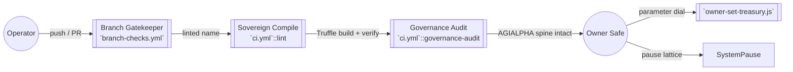

# Sovereign Labor Automation Scripts

[](https://github.com/MontrealAI/agijobs-sovereign-labor-v0p1/actions/workflows/ci.yml)
[](https://github.com/MontrealAI/agijobs-sovereign-labor-v0p1/actions/workflows/branch-checks.yml)
[](https://etherscan.io/token/0xa61a3b3a130a9c20768eebf97e21515a6046a1fa)

The `scripts/` suite keeps the Sovereign Labor lattice on rails. Each utility snapshots a different control surface so the platform owner can command staking treasuries, governance manifolds, and $AGIALPHA (0xa61a3b3a130a9c20768eebf97e21515a6046a1fa, 18 decimals) without friction. The workflows above must stay **green** and required on `main` and every protected branch—any drift is blocked before it hits production.

## Table of contents

1. [Operational graph](#operational-graph)
2. [Quick start](#quick-start)
3. [Script catalogue](#script-catalogue)
   - [Branch hygiene](#branch-hygiene)
   - [Governance surface audit](#governance-surface-audit)
   - [Compile surface hardening](#compile-surface-hardening)
   - [Treasury reconfiguration](#treasury-reconfiguration)
4. [Continuous Integration contract](#continuous-integration-contract)
5. [Owner command surface](#owner-command-surface)
6. [Troubleshooting matrix](#troubleshooting-matrix)
7. [Extending the toolchain](#extending-the-toolchain)

## Operational graph



The automation graph illustrates how every push is stress-tested before the owner turns the dials. Branch naming, artifact verification, and governance surface audits all feed the same unstoppable machine.

## Quick start

```bash
npm ci --omit=optional --no-audit --no-fund
npm run lint:sol
npm run compile
node scripts/check-governance-matrix.mjs
```

> **Tip:** Run these commands locally before opening a pull request to guarantee the CI badges stay luminous.

## Script catalogue

### Branch hygiene

- **File:** [`scripts/check-branch-name.mjs`](check-branch-name.mjs)
- **Purpose:** Enforces `<type>/<descriptor>` naming with types such as `feature`, `release`, `docs`, or curated roots (`main`, `develop`). Summaries land in GitHub’s job UI, giving reviewers immediate pass/fail context.
- **Usage:**
  ```bash
  node scripts/check-branch-name.mjs "feature/treasury-upgrade"
  ```
- **Owner value:** Keeps governance history searchable and blocks untracked hotfixes from reaching production.

### Governance surface audit

- **File:** [`scripts/check-governance-matrix.mjs`](check-governance-matrix.mjs)
- **Purpose:** Parses the compiled ABIs in `build/contracts` and confirms every owner and pauser control remains exposed across `SystemPause`, `StakeManager`, `JobRegistry`, `ValidationModule`, `DisputeModule`, `FeePool`, `ReputationEngine`, `PlatformRegistry`, and `ArbitratorCommittee`.
- **AGIALPHA verification:** Refuses to pass unless:
  - `contracts/Constants.sol` pins `AGIALPHA = 0xa61a3b3a130a9c20768eebf97e21515a6046a1fa`.
  - `deploy/config.mainnet.json` mirrors that address and uses `decimals = 18`.
- **Usage:**
  ```bash
  npm run compile
  node scripts/check-governance-matrix.mjs
  ```
- **Output:** Renders a console table plus CI step summaries so auditors see the contract owner still wields every setter, pauser, and ownership function.

### Compile surface hardening

- **File:** [`scripts/verify-artifacts.js`](verify-artifacts.js)
- **Purpose:** Guarantees Truffle artifacts exist for every production contract, have non-empty bytecode, were compiled with `solc 0.8.30`, and are fresher than their Solidity sources.
- **Usage:**
  ```bash
  node scripts/verify-artifacts.js
  ```
- **CI integration:** Runs inside `ci.yml` after `npm run compile`. Emits a Markdown table summarising contract sizes, helping gas analysts spot regressions.

- **File:** [`scripts/write-compile-summary.js`](write-compile-summary.js)
- **Purpose:** Writes a GitHub step summary detailing Node.js, npm, Truffle, and Solidity compiler versions along with the branch being evaluated.
- **Usage:**
  ```bash
  node scripts/write-compile-summary.js
  ```
  (Automatically executed during CI.)

### Treasury reconfiguration

- **File:** [`scripts/owner-set-treasury.js`](owner-set-treasury.js)
- **Purpose:** Gives the owner Safe a single button to rotate the `StakeManager` treasury through `OwnerConfigurator.configure`. Historical treasury addresses are captured alongside the new value for forensics.
- **Prerequisites:**
  - Deployments must include `OwnerConfigurator`, `StakeManager`, and `SystemPause`.
  - The caller must be the owner Safe.
- **Usage:**
  ```bash
  NEW_TREASURY=0xYourTreasury node scripts/owner-set-treasury.js
  ```
- **Result:** Emits the transaction hash and `ParameterUpdated` events as confirmation that capital routing is still under explicit owner command.

## Continuous Integration contract

The CI graph has four mandatory jobs, each required on `main`, `develop`, and every long-lived branch via GitHub branch protection:

| Workflow | Job | Purpose | Status check name |
| --- | --- | --- | --- |
| [`ci.yml`](../.github/workflows/ci.yml) | `lint` | Solidity linting (`solhint --max-warnings=0`) | `Solidity lint` |
|  | `compile` | `npm run compile` + artifact verification | `Compile smart contracts` |
|  | `governance-audit` | ABI surface and $AGIALPHA alignment checks | `Governance surface audit` |
| [`branch-checks.yml`](../.github/workflows/branch-checks.yml) | `branch-naming` | Branch naming policy enforcement | `Validate branch naming conventions` |
| [`ci.yml`](../.github/workflows/ci.yml) | `workflow-hygiene` | Actionlint on workflow files | `Workflow hygiene` |

> **Enforcement checklist:**
> 1. Enable *Require status checks to pass before merging* with all jobs above selected.
> 2. Enable *Require branches to be up to date before merging* so the unstoppable machine never digests stale bytecode.
> 3. Enforce admins to keep parity between human owners and automated guardians.

## Owner command surface

The Sovereign Labor core gives the owner Safe complete control across every economic and governance parameter:

- `StakeManager`: `setTreasury`, `setTreasuryAllowlist`, `setFeePool`, `pause`, `unpause`, `applyConfiguration`, `transferOwnership`.
- `FeePool`: `setTreasury`, `setRewarder`, `setTaxPolicy`, `setStakeManager`, `pause`, `unpause`, `transferOwnership`.
- `JobRegistry`: `setStakeManager`, `setValidationModule`, `setDisputeModule`, `setFeePool`, `setTaxPolicy`, `setPauser`, `pause`, `unpause`, `transferOwnership`.
- `SystemPause`: `pauseAll`, `unpauseAll`, `setModules`, `setGlobalPauser`, `executeGovernanceCall`, `transferOwnership`.
- `ValidationModule`, `DisputeModule`, `PlatformRegistry`, `ReputationEngine`, `ArbitratorCommittee`: each exposes owner/pauser setters with on-chain events for auditability.

Every setter routes through `SystemPause` governance calls when executed via automation, preserving total owner sovereignty while still enabling instant emergency halts.

## Troubleshooting matrix

| Symptom | Likely cause | Resolution |
| --- | --- | --- |
| `Missing artifact for StakeManager` | `npm run compile` not executed | Run `npm run compile` locally or pull CI artifacts, then re-run the script. |
| `AGIALPHA address mismatch` | `deploy/config.mainnet.json` not aligned | Update `tokens.agi` to `0xa61a3b3a130a9c20768eebf97e21515a6046a1fa` and re-run. |
| `Branch type \`foo\` is not allowed` | Feature branch not following policy | Rename branch to `feature/foo` (or another allowed prefix). |
| `Artifact older than its source` | Contract edited without recompiling | Re-run `npm run compile` to refresh build artifacts. |
| `NEW_TREASURY environment variable is required` | Missing input for treasury rotation | Export `NEW_TREASURY` with the checksum address of the new Safe. |

## Extending the toolchain

1. Duplicate the precision: any new script should export clear CLI usage, environment requirements, and CI summary output.
2. Embed $AGIALPHA invariants in every new module; the unstoppable machine demands canonical token discipline.
3. When adding workflows, wire badges in this README and register the job as a required status check before merging.

By following these rituals, the repository’s automation matrix remains production-ready, owner-guided, and perpetually luminous.
